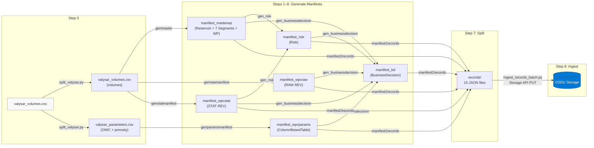

# Drogon — OSDU Data Model & Pipeline

## Overview

The Drogon use case demonstrates a complete **FMU-to-OSDU** pipeline for
static in-place reservoir volumes. Starting from a single FMU export CSV
(`valysar_volumes.csv`), the pipeline generates OSDU-compliant records
covering master data, work products, volume tables, input parameters, risk
assessment, and a decision gate — all linked through typed references and
ancestry.

The result is **15 records** in OSDU Storage that form a self-contained,
navigable data graph.

---

## Conceptual Data Model

```mermaid
graph TD
    subgraph "Master Data"
        RES["Reservoir<br/><i>Drogon</i>"]
        SEG1["ReservoirSegment<br/><i>West Lowland</i>"]
        SEG2["ReservoirSegment<br/><i>Central South</i>"]
        SEG3["ReservoirSegment<br/><i>Central North</i>"]
        SEG4["ReservoirSegment<br/><i>North Horst</i>"]
        SEG5["ReservoirSegment<br/><i>Central Ramp</i>"]
        SEG6["ReservoirSegment<br/><i>Central Horst</i>"]
        SEG7["ReservoirSegment<br/><i>East Lowland</i>"]
    end

    subgraph "Work Product Bundle"
        WP["WorkProduct<br/><i>Drogon Reservoir Study</i>"]
        RAW["REV — RAW<br/><i>per realisation</i>"]
        STAT["REV — Statistics<br/><i>P10 / P50 / P90</i>"]
        PARAMS["ColumnBasedTable<br/><i>Input Parameters</i>"]
    end

    subgraph "Decision Support"
        RISK["Risk<br/><i>Porosity &amp; Cementation</i>"]
        BD["BusinessDecision<br/><i>DG1 Identify &amp; Assess</i>"]
    end

    subgraph "Reference Data"
        REFTYPE["PropertyType<br/><i>AssociatedLiquid</i>"]
    end

    %% Ancestry: Reservoir → Segments
    RES -->|ancestry.child| SEG1
    RES -->|ancestry.child| SEG2
    RES -->|ancestry.child| SEG3
    RES -->|ancestry.child| SEG4
    RES -->|ancestry.child| SEG5
    RES -->|ancestry.child| SEG6
    RES -->|ancestry.child| SEG7

    %% WPC → WorkProduct
    RAW -->|ParentWorkProductID| WP
    STAT -->|ParentWorkProductID| WP
    PARAMS -->|ParentWorkProductID| WP

    %% WPC → Reservoir (ParentObjectID)
    RAW -->|ParentObjectID| RES
    STAT -->|ParentObjectID| RES
    PARAMS -->|ParentObjectID| RES

    %% BusinessDecision → volumes, params, risk, reservoir
    BD -->|PriorActivityID| RAW
    BD -->|PriorActivityID| STAT
    BD -->|PriorActivityID| PARAMS
    BD -->|Parameter| RES
    BD -->|RiskID| RISK

    %% REV uses RefType
    RAW -.->|PropertyType| REFTYPE
    STAT -.->|PropertyType| REFTYPE

    %% Styling
    classDef master fill:#cfe2ff,stroke:#084298,color:#222
    classDef wpc fill:#d4edda,stroke:#155724,color:#222
    classDef wp fill:#fff3cd,stroke:#d39e00,color:#222
    classDef risk fill:#f5c6cb,stroke:#721c24,color:#222
    classDef bd fill:#e2d9f3,stroke:#5a3e85,color:#222
    classDef ref fill:#e9ecef,stroke:#6c757d,color:#222

    class RES,SEG1,SEG2,SEG3,SEG4,SEG5,SEG6,SEG7 master
    class RAW,STAT,PARAMS wpc
    class WP wp
    class RISK risk
    class BD bd
    class REFTYPE ref
```



### Record Inventory (15 records)

| # | Kind | Name | OSDU ID suffix |
|---|------|------|----------------|
| 0 | `reference-data--ReservoirEstimatedVolumePropertyType` | AssociatedLiquid | `AssociatedLiquid_` |
| 1 | `master-data--Reservoir` | Drogon | `5b8dc759…` |
| 2–8 | `master-data--ReservoirSegment` | West Lowland, Central South, Central North, North Horst, Central Ramp, Central Horst, East Lowland | 7 UUIDs |
| 9 | `work-product` | Drogon Reservoir Study | `37dcb76b…` |
| 10 | `work-product-component--ReservoirEstimatedVolumes` | RAW (per realisation) | `68f57fdc…` |
| 11 | `work-product-component--ReservoirEstimatedVolumes` | Statistics (P10/P50/P90) | `0ed7364d…` |
| 12 | `work-product-component--ColumnBasedTable` | Input Parameters | `d8e4e9ba…` |
| 13 | `master-data--Risk` | Porosity & Cementation | `Drogon-PorosityAndCementation` |
| 14 | `master-data--BusinessDecision` | DG1 Identify & Assess | `Drogon-DG1-Identify` |

### BusinessDecision enrichment (ext.equinor)

The Drogon BD manifest (`manifest_bd_drogon.json`) carries the following `ext.equinor` sections for rich UI rendering:

- **Authors / ReviewTeam** — names and roles
- **Alternatives** — 3 development concepts with rank, action (Pursue/Monitor/Reject)
- **DevelopmentConcept** — Subsea tieback, 4 production wells, 2 injectors, FPSO host
- **ReservoirProperties** — depth, temperature, pressure, porosity, permeability
- **KeyUncertainties** — reservoir connectivity, OWC depth, aquifer support (with impact ratings)
- **UncertaintySummary** — P10/P50/P90 STOIIP range, Monte Carlo method
- **DG2Recommendations** — next-gate action items
- **KeyEconomics** — placeholder (DG1 economics not yet finalised)

> **Note:** OSDU only persists 7 registered ext.equinor keys (see `demo/md/BusinessDecision.md` Appendix A). The remaining keys are restored at runtime by the local enrichment overlay in `app/main.py`.

---

## Relationship Patterns

### Ancestry (parent ↔ child)

Ancestry is stored in `data.ancestry` and expresses containment:

- **Reservoir** → 7 **ReservoirSegments** (`ancestry.children`)
- Each Segment → Reservoir (`ancestry.parents`)

The OSDU indexer mirrors `data.ancestry.*` into the top-level `ancestry.*`
search index automatically. Both paths appearing in search results is
expected behaviour.

### WorkProduct → WorkProductComponent

The three WPCs (RAW volumes, STAT volumes, parameters) share a common
**WorkProduct** container. Each WPC references:

- `ParentWorkProductID` → WorkProduct
- `ParentObjectID` → Reservoir (the master-data context)

### BusinessDecision → everything

The BD record is the decision-support hub. It references:

- `PriorActivityIDs` → all 3 WPCs (raw REV, stat REV, ColumnBasedTable)
- `Parameters[].DataObjectParameter` → each WPC + the Reservoir
- `RiskIDs` → Risk record(s)

### Volume Table Structure

Both REV records and the ColumnBasedTable use the OSDU **ColumnBasedTable**
pattern (`data.Volumes` or `data.Table`):

```
KeyColumns:    [{ ColumnName, ColumnRole:"key", ValueType }]
Columns:       [{ ColumnName, ColumnRole:"value", ValueType, UnitOfMeasure }]
ColumnValues:  { "<ColumnName>": [v0, v1, …], … }
```

| WPC | Key Columns | Value Columns | Rows |
|-----|-------------|---------------|------|
| RAW REV | Realisation, Zone, SegmentID, Facies | BulkVolume, NetVolume, PoreVolume, HydrocarbonPoreVolume, … | 588 |
| STAT REV | Statistic, Zone, SegmentID, Facies | BulkVolume, NetVolume, PoreVolume, HydrocarbonPoreVolume, … | 588 |
| Parameters | Realisation, Zone, SegmentID, Facies | OWC_Depth (7 cols, m), Porosity (3 cols, Euc) | 84 |

---

## Pipeline Workflow



### Pipeline Steps

| Step | Script | Input | Output |
|------|--------|-------|--------|
| 0 | `split_valysar.py` | `valysar_volumes.csv` (raw FMU export) | `valysar_volumes.csv` + `valysar_parameters.csv` |
| 1 | `genmaster_drogon.py` | volumes CSV | `manifest_masterwp_drogon.json` (1 Reservoir, 7 Segments, 1 WorkProduct) |
| 2 | `genrawmanifest_drogon.py` | volumes CSV + master manifest | `manifest_wpcraw_drogon.json` (raw REV WPC) |
| 3 | `genstatmanifest_drogon.py` | volumes CSV + master manifest | `manifest_wpcstat_drogon.json` (statistical REV WPC) |
| 4 | `genparamsmanifest_drogon.py` | parameters CSV + master manifest | `manifest_wpcparams_drogon.json` (ColumnBasedTable WPC) |
| 5 | `gen_risk_drogon.py` | master + stat manifests | `manifest_risk_drogon.json` (Risk) |
| 6 | `gen_businessdecision_drogon.py` | all prior manifests | `manifest_bd_drogon.json` (BusinessDecision) |
| 7 | `manifest2records_drogon.py` | 6 manifests + 1 reftype | `records/` — 15 individual JSON files |
| 8 | `ingest_records_batch.py` | `records/*.json` + `.env` | PUT to OSDU Storage API (sequential, with retry) |

### Running the Pipeline

```powershell
# Full pipeline (default)
.\demo\drogon\run_pipeline.ps1

# Generate only, no ingestion
.\demo\drogon\run_pipeline.ps1 -SkipIngest

# Re-ingest single record (e.g. after editing BD)
py demo/drogon/ingest_records_batch.py --start 14 --delay 0
```

---

## RESQML Activity Chain (3 sequential activities)

The RESQML generator (`demo/drogon/gen_resqml.py`) now produces a consistent
three-step activity sequence in `resqml/drogon_activity.epc` using one
`ActivityTemplate` and three `obj_Activity` instances.

| Order | Activity title | Input | Output | Notes |
|------:|----------------|-------|--------|-------|
| 1 | Drogon Valysar — Generate Input Parameter Table | Workflow metadata + scenario definitions | Input parameter table (`Grid2dRepresentation`) | Integrates the previous `obj_Activity_MISSING` fields (`NumberOfRealizations`, `Workflow`, `ReportTable`, `Method`, `Variables`, `DesignMatrix`). |
| 2 | Drogon Valysar — RMS Reservoir Model Run | Input parameter table | RAW volumes table (`Grid2dRepresentation`) | Main volumetrics execution step. |
| 3 | Drogon Valysar — Aggregate Statistical Volumes | RAW volumes table | Statistical/report table (`Grid2dRepresentation`) | Produces the aggregated statistics table used downstream. |

This sequence aligns the RESQML activities with the existing OSDU evidence
chain (`Parameters` → `RAW REV` → `STAT REV`) that is referenced by
`BusinessDecision.PriorActivityIDs`.

---

## OSDU Design Decisions

| Decision | Rationale |
|----------|-----------|
| **Ancestry in `data.ancestry`** | Top-level `ancestry` requires numeric timestamp versions (unavailable at generation time). The indexer mirrors `data.ancestry` → `ancestry.*` automatically. |
| **Sequential record-by-record PUT** | Ensures parents exist before children that reference them via ancestry. A 3-second delay between PUTs gives the search index time to catch up. |
| **Two REV WPCs** (raw + stats) | Separates per-realisation detail from P10/P50/P90 summary. Both share the same WorkProduct container and Reservoir context. |
| **ColumnBasedTable for parameters** | OWC depths and porosity values are per-segment, per-facies, per-realisation — fits the ColumnBasedTable schema (key/value columns with UoM). |
| **BusinessDecision as hub** | The BD record is the decision-support integration point — it links to all evidence (volumes, parameters), risk, and master data context through `PriorActivityIDs`, `Parameters`, and `RiskIDs`. |
| **Human-readable IDs for singletons** | Risk (`Drogon-PorosityAndCementation`) and BD (`Drogon-DG1-Identify`) use descriptive IDs instead of UUIDs since there's one of each. |

---

## Explorer UI

The Record Explorer (`/strat`) provides:

- **Type dropdown** — prepopulated with all Drogon record types
- **Mermaid relationship graph** — ancestry + data references, colored by type, using Names
- **Metadata cards** — grouped into Identity, Details, References, Extensions
- **Table viewer** — renders both `Volumes` and `Table` ColumnBasedTable data with key highlighting and UoM
- **Clickable links** — OSDU ID references navigate to the linked record
