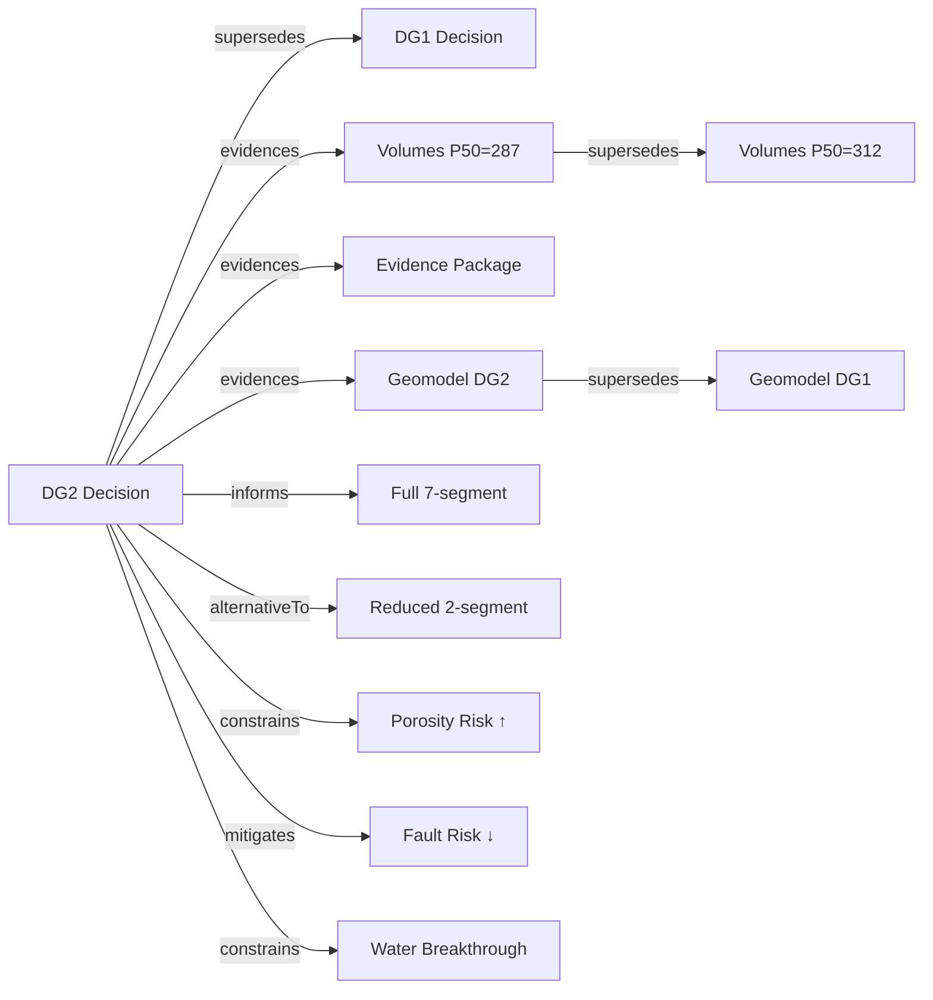

# Ontology Demo Examples

Enriched versions of Drogon DG1→DG2 records demonstrating ontology patterns
using **existing M27 OSDU schema fields** — no new kinds required.

## Files

| File | Pattern | M27 Field Used |
|------|---------|----------------|
| `dg1_business_decision.json` | DG1 baseline with relationship keys + typed remarks | Parameters[].Keys[], Remarks[] |
| `dg2_business_decision.json` | DG2 showing evolution: supersedes, alternativeTo, new risks | Parameters[].Keys[], Remarks[] |
| `cp_full_dg1_to_dg2.json` | Full CP: audit trail + gate checklist + relationship links | LifecycleEvents[], ActivityStates[], Parameters[].Keys[] |
| `cp_lifecycle_events.json` | Focused: 10 LifecycleEvents showing project history | LifecycleEvents[] |
| `cp_gate_checklist.json` | Focused: ActivityStates[] as 9-item gate checklist | ActivityStates[] |
| `activity_collaboration_action.json` | Actions as verbs: volume update with audit | Activity + ActivityTemplate |
| `bd_relationship_keys.json` | Focused: relationship key conventions on BD | Parameters[].Keys[] |
| `bd_remarks_typed.json` | Focused: categorised remarks across gate lifecycle | Remarks[] |

## Cross-Gate Tracking (DG1 → DG2)

The paired `dg1_business_decision.json` + `dg2_business_decision.json` demonstrate:

1. **Volume evolution**: DG1 P50=312 → DG2 P50=287 MSm³ (tracked via `supersedes` key)
2. **Risk evolution**: 2 risks at DG1 → 4 at DG2 (1 escalated, 1 mitigated, 2 new)
3. **Recommendation tracking**: DG1 Remarks carry forward to DG2 with STATUS annotations
4. **Economics progression**: NPV 1.8B → 2.1B, CAPEX 3.8B → 4.2B
5. **Alternatives**: DG2 shows selected vs rejected concepts with `alternativeTo` key
6. **Geomodel supersession**: DG1 dataspace → DG2 dataspace (tracked via `supersedes` key)

## Suggested GUI Rendering Additions for ORES

### 1. Activity Feed Panel (on search.html BD detail view)

**Where**: New collapsible section below "Schedule" on BD detail card
**Data source**: `CollaborationProject.LifecycleEvents[]` (fetched via CP link from BD)
**Rendering**: Vertical timeline (CSS-only, no chart library needed)

```
┌─────────────────────────────────────────────────────────┐
│ 📋 Collaboration Timeline                               │
├─────────────────────────────────────────────────────────┤
│ ● 2026-05-15  DG2 approved                    [Approval]│
│ │             Full 7-segment. NPV 2.1B.                 │
│ ● 2026-05-01  Evidence package frozen     [Transition]  │
│ │             99 artifacts locked for review.           │
│ ● 2026-04-15  Fault risk mitigated           [Risk ↓]  │
│ │             4D seismic: High→Low                      │
│ ● 2026-03-10  Reduced-scope alternative    [Alternative]│
│ │             Alt B: 2-segment only                     │
│ ● 2026-02-12  Volumes revised              [Volume Δ]  │
│ │             P50 312→287 MSm³ (-8%)                    │
│ ● 2026-02-05  Porosity risk escalated        [Risk ↑]  │
│ │             Core data: 0.18→0.14. Medium→High         │
│ ● 2025-12-15  Project created              [Creation]   │
│              Post-DG1 namespace                         │
└─────────────────────────────────────────────────────────┘
```

**Implementation**: ~1 day. CSS timeline + Jinja2 loop over events. Color-code EventID badges.

---

### 2. Gate Checklist Progress (on search.html BD detail view)

**Where**: Replace or augment existing "Schedule" section
**Data source**: `CollaborationProject.ActivityStates[]` (when MilestoneID contains gate prefix like `DG2-`)
**Rendering**: Progress bar + checklist table

```
┌─────────────────────────────────────────────────────────┐
│ ✓ DG2 Gate Readiness                         9/9 ██████│
├─────────────────────────────────────────────────────────┤
│ ✅ Volumes          2026-02-12  P50=287 MSm³            │
│ ✅ Dev Concept       2026-04-20  7-seg subsea tieback   │
│ ✅ Production        2026-03-01  20yr, peak 45 kbbl/d   │
│ ✅ Economics         2026-04-25  NPV 2.1B, IRR 28%      │
│ ✅ Risk Assessment   2026-04-15  4 risks evaluated      │
│ ✅ GeoModel          2026-03-15  11 grid + 56 map WPCs  │
│ ✅ Well Plan         2026-04-10  7P + 3I, 850 MNOK      │
│ ✅ Facility Design   2026-04-18  Subsea 12km, 2 manifold│
│ ✅ Approval          2026-05-15  Approved + conditions   │
└─────────────────────────────────────────────────────────┘
```

**Implementation**: ~0.5 day. Filter ActivityStates where MilestoneID starts with current gate prefix. Count completed vs total.

---

### 3. Relationship Graph (on search.html BD detail view)

**Where**: New tab or collapsible section "Data Relationships"
**Data source**: `Parameters[].Keys[]` where ParameterKey=`relationship`
**Rendering**: Mermaid flowchart (already loaded in search.html)



**Implementation**: ~1 day. Build Mermaid string from Parameters[] where Keys contain `relationship`. Group by relationship type. Already have Mermaid in search.html.

---

### 4. Recommendation Tracker (on analyse.html cross-gate view)

**Where**: New section in gate comparison below risk evolution
**Data source**: `Remarks[]` grouped by RemarkSource
**Rendering**: Table with status badges (similar to risk evolution)

```
┌─────────────────────────────────────────────────────────┐
│ DG1 Recommendations → DG2 Status                       │
├─────────────────────────────────────────────────────────┤
│ Upgrade FMU to Level 3            [✅ Done]             │
│ Acquire core data (floodplain)    [✅ Done]             │
│ Reprocess 4D seismic              [✅ Done]             │
│ Review OWC SouthWing              [⚠️ Partial]          │
│ Run OPM production forecast       [✅ Done]             │
│ Evaluate infill potential          [⏭ Deferred to DG3]  │
└─────────────────────────────────────────────────────────┘
```

**Implementation**: ~1 day. In DG2 Remarks with source `DG1-Recommendation`, parse STATUS suffix. Compare with DG1's original recommendations.

---

### 5. Supersession Diff Highlights (on analyse.html)

**Where**: Augment existing volume/economics delta tables
**Data source**: Parameters[] with `relationship=supersedes` — identify what changed between gates
**Rendering**: Highlight rows where supersession occurred + link to both versions

```
┌─────────────────────────────────────────────────────────┐
│ Superseded Artifacts (DG1 → DG2)                        │
├─────────────────────────────────────────────────────────┤
│ REV Statistics  │ P50: 312 → 287 MSm³  │ -8%  │ ⚠️     │
│ Geomodel        │ maap/drogon_dg → _dg2│ new  │ 🔄     │
│ Input Params    │ porosity 0.18 → 0.14 │ -22% │ ⚠️     │
├─────────────────────────────────────────────────────────┤
│ New at DG2 (no DG1 equivalent)                          │
├─────────────────────────────────────────────────────────┤
│ Production Forecast  │ 20yr OPM Flow    │ new  │ ✨     │
│ Development Concept  │ 7-seg tieback    │ new  │ ✨     │
│ Alternative Concept  │ 2-seg reduced    │ new  │ ✨     │
└─────────────────────────────────────────────────────────┘
```

**Implementation**: ~2 days. Match Parameters[] across gates by artifact key. Identify supersedes links. Compute deltas from enrichment data.

---

### Summary: Recommended Rendering Priority

| # | Addition | Template | Effort | Value |
|---|----------|----------|--------|-------|
| 1 | Gate Checklist Progress | search.html | 0.5 day | Shows completeness at a glance |
| 2 | Relationship Graph (Mermaid) | search.html | 1 day | Makes link semantics visual |
| 3 | Activity Feed / Timeline | search.html | 1 day | Shows project history |
| 4 | Recommendation Tracker | analyse.html | 1 day | Tracks DG1→DG2 follow-up |
| 5 | Supersession Diff | analyse.html | 2 days | Highlights what changed + why |

All use Chart.js (existing) or Mermaid (existing) or pure CSS. No new libraries needed.

