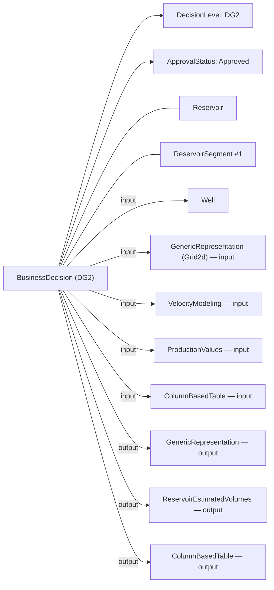
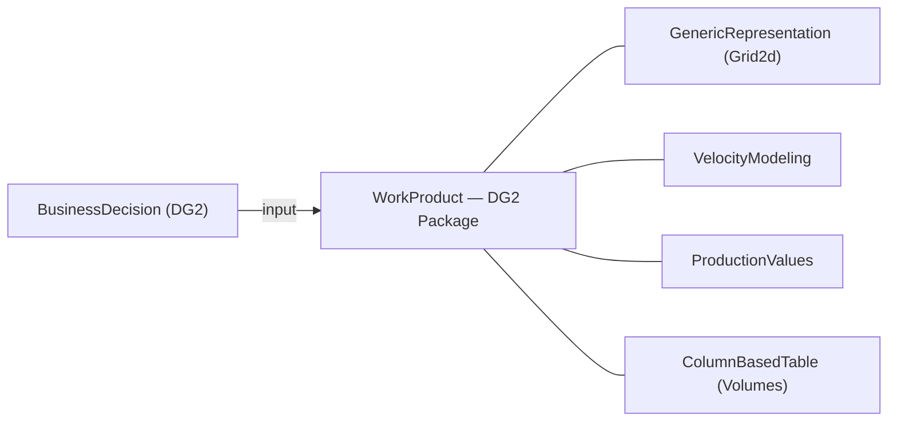

# OSDU Decision Gates with `BusinessDecision` — Implementation Guide

> **Scope:** Model DG1…DG4 decisions as `osdu:wks:master-data--BusinessDecision:1.0.0` records, linking inputs (e.g., Wells, Grid maps, Velocity models, Production tables) and outputs (e.g., GenericRepresentation, ReservoirEstimatedVolumes, ColumnBasedTable) using **activity parameters** and/or **persisted collections** (WorkProduct / CollaborationProjectCollection). This guide summarizes options, pros/cons, and gives example payloads and diagrams.

---

## 1. What `BusinessDecision` is designed for

`BusinessDecision` records a technical/business decision and **inherits** `AbstractProjectActivity`, which provides the `Parameters[]` mechanism to express **inputs/outputs/context** relationships for a workflow step (your decision gate). It also defines typed properties for **DecisionLevel**, **ApprovalStatus**, **Risks**, and **Risk documents**.

- Schema authoring and description: [BusinessDecision.1.0.0.json (Authoring)](https://github.com/jonslo/osdu-data-data-definitions/blob/master/Authoring/master-data/BusinessDecision.1.0.0.json) and [Community repo](https://community.opengroup.org/osdu/data/data-definitions/-/blob/master/Authoring/master-data/BusinessDecision.1.0.0.json).
- Activity semantics: [AbstractProjectActivity](https://community.opengroup.org/osdu/data/data-definitions/-/blob/master/E-R/abstract/AbstractProjectActivity.1.2.0.md) and its migration notes / parameter roles: [Migration (M18)](https://github.com/jonslo/osdu/osdu-data-data-definitions/blob/master/Guides/MigrationGuides/M18/AbstractProjectActivity.1.1.0.md).
- Decision level & approval catalogs: [DecisionLevel.1.0.0](https://github.com/jonslo/osdu-data-data-definitions/blob/master/E-R/reference-data/DecisionLevel.1.0.0.md) / [Example](https://community.opengroup.org/osdu/data/data-definitions/-/blob/master/Examples/reference-data/DecisionLevel.1.0.0.json), and [DecisionApprovalStatus.1.0.0](https://github.com/jonslo/osdu/osdu-data-data-definitions/blob/master/Examples/reference-data/DecisionApprovalStatus.1.0.0.json).

> **Why this matters:** Using `Parameters[]` keeps your decision gate aligned with OSDU’s workflow semantics, while the typed fields enable simple filters like “Approved DG2 decisions”.

---

## 2. Ways to link master-data and WPCs to a decision gateSRA/CRA

You have **four** complementary patterns. Mix them as needed.

### A) `Parameters[]` (from `AbstractProjectActivity`)
Use `Parameters[]` to declare **inputs**, **outputs**, and **context** objects with rich metadata (role, selection note, index, keys, time index).

**Pros**
- Semantically precise (input/output/context) and template-friendly.
- Supports multiple values, arrays, and keys (`ParameterKey`, `ObjectParameterKey`, etc.).

**Cons**
- Nested arrays make queries heavier; requires consistent conventions (`ParameterRole`, keys).

**References:** [AbstractProjectActivity](https://community.opengroup.org/osdu/data/data-definitions/-/blob/master/E-R/abstract/AbstractProjectActivity.1.2.0.md), [Migration notes](https://github.com/jonslo/osdu/osdu-data-data-definitions/blob/master/Guides/MigrationGuides/M18/AbstractProjectActivity.1.1.0.md).

---

### B) Explicit `BusinessDecision` relationships
Use built-in properties for decision metadata and key relationships:
- `DecisionLevelID` (DG1…DG4) → `reference-data--DecisionLevel`.
- `ApprovalStatusID` (Approved, etc.) → `reference-data--DecisionApprovalStatus`.
- `RiskIDs` → `master-data--Risk` and `RiskAssessmentDocument` → `work-product-component--Document`.
- `PriorActivityIDs` → id of the preceding primary artifact or activity.

**Pros**
- Strong validation with kind patterns; **easy filtering** (e.g., Approved DG2).

**Cons**
- Scope-limited: not meant to enumerate full input/output sets (that’s `Parameters[]`).

**References:** [BusinessDecision.1.0.0](https://github.com/jonslo/osdu/osdu-data-data-definitions/blob/master/Authoring/master-data/BusinessDecision.1.0.0.json), [Document WPC](https://community.opengroup.org/osdu/data/data-definitions/-/blob/master/Examples/work-product-component/Document.1.2.0.json).

---

### C) Persisted collections: `WorkProduct` and `CollaborationProjectCollection`
Bundle a set of WPCs into a **versioned container** and link that single id as an input/context parameter.

- `work-product--WorkProduct` (deliverable bundle) — [ER doc](https://github.com/jonslo/osdu/osdu-data-data-definitions/blob/master/E-R/work-product/WorkProduct.1.0.0.md).
- `work-product-component--CollaborationProjectCollection` (collaboration set) — [ER doc](https://github.com/jonslo/osdu/osdu-data-data-definitions/blob/master/E-R/work-product-component/CollaborationProjectCollection.1.0.0.md).

**Pros**
- One id represents **“the DG package”**; simpler governance and versioning.

**Cons**
- Extra objects to author/maintain; still use `Parameters[]` for role semantics.

---

### D) Rely on WPC→master-data links
Many WPCs natively reference reservoir entities (e.g., `ReservoirEstimatedVolumes` link to `Reservoir` / `ReservoirSegment`). Navigate via WPC to master-data without duplicating relationships.

**Reference:** Reservoir Management worked examples (links between WPC and Reservoir/Segments) — [README](https://github.com/jonslo/osdu/osdu-data-data-definitions/blob/master/Examples/WorkedExamples/ReservoirManagement/README.md);
`ColumnBasedTable` usage — [README](https://github.com/jonslo/osdu/osdu-data-data-definitions/blob/master/Examples/WorkedExamples/Reservoir%20Data/ColumnBasedTable/README.md).

---

## 3. Recommended pattern for DG1…DG4

1. **One `BusinessDecision` per gate**: set `DecisionLevelID`, `ApprovalStatusID`, dates, owners, summary.
2. **Anchor the primary artifact** via `PriorActivityIDs` (e.g., consolidated volumes WPC).
3. **List all key inputs and outputs** in `Parameters[]` with `ParameterRole` = `input`/`output`.
4. **Optionally** package many artifacts into a **WorkProduct** or **CollaborationProjectCollection** and reference the container as a single parameter (keep 1–2 critical objects individually for drill‑down).
5. **Risks & docs**: link via `RiskIDs` and `RiskAssessmentDocument`.

**DG content mapping** (typical kinds):
- Inputs: `work-product-component--Well`, `GenericRepresentation` (e.g., Grid2d), `VelocityModeling`, `ProductionValues`, `ColumnBasedTable` (volumes), `IjkGridRepresentation` (DG3/4), `WellboreTrajectory` (DG3/4 planned wells).
- Outputs: `GenericRepresentation`, `ReservoirEstimatedVolumes`, `ColumnBasedTable`.

**References:** WPC catalogs and docs — [VelocityModeling](https://github.com/jonslo/osdu/osdu-data-data-definitions/blob/master/E-R/work-product-component/VelocityModeling.1.3.0.md), [ProductionValues](https://github.com/jonslo/osdu/osdu-data-data-definitions/blob/master/E-R/work-product-component/ProductionValues.1.0.0.md), [GenericRepresentation](https://community.opengroup.org/osdu/data/data-definitions/-/blob/master/Examples/work-product-component/GenericRepresentation.1.0.0.json).

---

## 4. Learnings from the GRAND DG2 manifest (example)

Your `manifest_dgv2.json` demonstrates good practice:
- `DecisionLevelID = DG2`, `ApprovalStatusID = Approved`, dates, summary.
- `RiskIDs` + `RiskAssessmentDocument` capture governance.
- `PriorActivityIDs` anchors the main volumes input.
- `Parameters[]` link both **WPC inputs** (ReservoirEstimatedVolumes) and **context** (Reservoir, ReservoirSegments) via `ObjectParameterKey` and a simple `role` key.

**Optional improvements:**
- Add explicit `ParameterRole` (`input`, `output`, `context`) to each parameter for clearer analytics (supported per migration notes). 
- Group many inputs into a `WorkProduct` when a gate has a broad artifact set; reference it as one parameter while retaining 1–2 critical inputs individually.

**References:** [BusinessDecision authoring file](https://github.com/jonslo/osdu/osdu-data-data-definitions/blob/master/Authoring/master-data/BusinessDecision.1.0.0.json), [AbstractProjectActivity parameters](https://community.opengroup.org/osdu/data/data-definitions/-/blob/master/E-R/abstract/AbstractProjectActivity.1.2.0.md).

---

## 5. Mermaid diagrams

### 5.1 DG2 modeled with `Parameters[]`


### 5.2 DG2 with a persisted collection


---

## 6. Example payloads

### 6.1 `BusinessDecision` with `Parameters[]` (inputs, outputs, context)
```json
{
  "kind": "osdu:wks:master-data--BusinessDecision:1.0.0",
  "id": "dev:master-data--BusinessDecision:PROJECTX-DG2:1",
  "acl": { "owners": ["data.default.owners@dev.dataservices.energy"], "viewers": ["data.office.global.viewers@dev.dataservices.energy"] },
  "legal": { "legaltags": ["dev-equinor-private-default"], "otherRelevantDataCountries": ["NO"] },
  "data": {
    "Name": "PROJECT X — Decision Gate 2",
    "DecisionLevelID": "osdu:reference-data--DecisionLevel:DG2:1.0.0",
    "ApprovalStatusID": "osdu:reference-data--DecisionApprovalStatus:Approved:1.0.0",
    "DecisionDate": "2025-12-10",
    "DecisionSummary": "Approve concept select based on aggregated segment volumes and velocity model v3.",
    "RiskAssessmentDocument": "dev:work-product-component--Document:RiskAssessment_DG2.pdf:1",
    "RiskIDs": [ "dev:master-data--Risk:DepthConversionTopReservoir:1" ],
    "PriorActivityIDs": [ "dev:work-product-component--ReservoirEstimatedVolumes:5033c9e2-b1cf-424a-86c9-76b846942cf8:1" ],
    "Parameters": [
      {
        "Title": "Volumes WPC",
        "Selection": "DG2 inputs: aggregated estimated volumes by segment & zone",
        "ParameterRole": "input",
        "Keys": [{ "ParameterKey": "role", "StringParameterKey": "input" }],
        "ObjectParameterKey": "dev:work-product-component--ReservoirEstimatedVolumes:5033c9e2-b1cf-424a-86c9-76b846942cf8:1"
      },
      {
        "Title": "Velocity model",
        "ParameterRole": "input",
        "ObjectParameterKey": "dev:work-product-component--VelocityModeling:abcd-1234:1"
      },
      {
        "Title": "Grid2d map",
        "ParameterRole": "output",
        "ObjectParameterKey": "dev:work-product-component--GenericRepresentation:gr-5678:1"
      },
      {
        "Title": "Reservoir volumes table",
        "ParameterRole": "output",
        "ObjectParameterKey": "dev:work-product-component--ColumnBasedTable:cbt-9999:1"
      },
      {
        "Title": "Context Reservoir",
        "ParameterRole": "context",
        "ObjectParameterKey": "dev:master-data--Reservoir:f9585655-83d8-4549-ae3e-2dffc2cd5937:1"
      },
      {
        "Title": "Context ReservoirSegment",
        "Index": 1,
        "ParameterRole": "context",
        "ObjectParameterKey": "dev:master-data--ReservoirSegment:32fb46f2-fe6f-45a0-9f9d-43af174d8de9:1"
      }
    ]
  }
}
```

**Notes:**
- `ParameterRole` aligns with activity semantics (input/output/context); `Keys[].ParameterKey` can carry additional internal keys.
- The WPC kinds used here are documented under the WPC ER and examples (VelocityModeling, GenericRepresentation, ColumnBasedTable, ProductionValues). See references in sections 3–4.

### 6.2 Using a `WorkProduct` to bundle DG artifacts
```json
{
  "kind": "osdu:wks:work-product--WorkProduct:1.0.0",
  "id": "dev:work-product--WorkProduct:PROJECTX-DG2-PACKAGE:1",
  "data": {
    "Name": "PROJECT X DG2 Package",
    "Components": [
      "dev:work-product-component--GenericRepresentation:gr-5678:1",
      "dev:work-product-component--VelocityModeling:abcd-1234:1",
      "dev:work-product-component--ProductionValues:pv-7777:1",
      "dev:work-product-component--ColumnBasedTable:cbt-9999:1"
    ]
  }
}
```
Then reference this WorkProduct from `BusinessDecision.Parameters[]` as a **single** `input` or `context`.

### 6.3 `CollaborationProjectCollection` (alternative persisted collection)
```json
{
  "kind": "osdu:wks:work-product-component--CollaborationProjectCollection:1.0.0",
  "id": "dev:work-product-component--CollabCollection:PROJECTX-DG2:1",
  "data": {
    "Name": "PROJECT X DG2 Collaboration Set",
    "DataReferences": [
      "dev:work-product-component--GenericRepresentation:gr-5678:1",
      "dev:work-product-component--VelocityModeling:abcd-1234:1",
      "dev:work-product-component--ProductionValues:pv-7777:1",
      "dev:work-product-component--ColumnBasedTable:cbt-9999:1"
    ]
  }
}
```

---

## 7. Choosing between `Parameters[]` vs. persisted collections

| Option | Best for | Pros | Cons |
|---|---|---|---|
| `Parameters[]` (input/output/context) | Precise workflow/provenance at object level | Rich semantics; supports multi‑values, time index, keys | Heavier nested queries; requires conventions |
| `WorkProduct` | Stable, versioned **DG package** | One id; easier ACL/legal; re‑use | Extra object to manage; still need parameters for roles |
| `CollaborationProjectCollection` | Curated engagement set | Similar to WorkProduct, tuned for collaboration | Same management overhead |
| Explicit fields (`DecisionLevelID`, `ApprovalStatusID`, `Risk…`, `PriorActivityIDs`) | Gate filters & governance | Simple queries; clear domain | Not a substitute for full input/output lists |

**Practical recommendation:** Use **both**: typed decision fields for gate metadata **and** `Parameters[]` for all gate inputs/outputs/context. If the artifact set is large, **also create** a WorkProduct (or CollaborationProjectCollection) and reference it; still list 1–2 critical artifacts individually.

---

## 8. Additional references
- `BusinessDecision` schema (authoring & examples): [GitHub authoring](https://github.com/jonslo/osdu/osdu-data-data-definitions/blob/master/Authoring/master-data/BusinessDecision.1.0.0.json), [Community examples](https://community.opengroup.org/osdu/data/data-definitions/-/blob/master/Examples/master-data/BusinessDecision.1.0.0.json).
- `AbstractProjectActivity` (parameters and roles): [ER doc](https://community.opengroup.org/osdu/data/data-definitions/-/blob/master/E-R/abstract/AbstractProjectActivity.1.2.0.md), [Migration notes](https://github.com/jonslo/osdu/osdu-data-data-definitions/blob/master/Guides/MigrationGuides/M18/AbstractProjectActivity.1.1.0.md).
- Decision catalogs: [DecisionLevel](https://github.com/jonslo/osdu/osdu-data-data-definitions/blob/master/E-R/reference-data/DecisionLevel.1.0.0.md), [DecisionApprovalStatus example](https://github.com/jonslo/osdu/osdu-data-data-definitions/blob/master/Examples/reference-data/DecisionApprovalStatus.1.0.0.json).
- WPCs used at gates: [VelocityModeling](https://github.com/jonslo/osdu/osdu-data-data-definitions/blob/master/E-R/work-product-component/VelocityModeling.1.3.0.md), [ProductionValues](https://github.com/jonslo/osdu/osdu-data-data-definitions/blob/master/E-R/work-product-component/ProductionValues.1.0.0.md), [GenericRepresentation example](https://community.opengroup.org/osdu/data/data-definitions/-/blob/master/Examples/work-product-component/GenericRepresentation.1.0.0.json), [ColumnBasedTable usage](https://github.com/jonslo/osdu/osdu-data-data-definitions/blob/master/Examples/WorkedExamples/Reservoir%20Data/ColumnBasedTable/README.md).
- WorkProduct / CollaborationProjectCollection: [WorkProduct ER](https://github.com/jonslo/osdu/osdu-data-data-definitions/blob/master/E-R/work-product/WorkProduct.1.0.0.md), [CollaborationProjectCollection ER](https://github.com/jonslo/osdu/osdu-data-data-definitions/blob/master/E-R/work-product-component/CollaborationProjectCollection.1.0.0.md).

---

## Appendix A: OSDU `ext.equinor` schema limitation

The OSDU `BusinessDecision` schema registers only **7** `ext.equinor` keys. During workflow ingestion, any unregistered key under `data.ext.equinor` is **silently dropped** — the API returns `201 Created` and the workflow completes with `status: finished`, but the data is gone.

### Registered keys (survive ingestion)

| Key | Purpose |
|-----|---------|
| `Alternatives` | Decision alternatives with rank/action |
| `Assurance` | Assurance metadata |
| `CRA` | Cost Risk Assessment |
| `Ensemble` | Ensemble metadata |
| `InterpretationLineage` | Interpretation provenance |
| `SRA` | Schedule Risk Assessment |
| `UncertaintySummary` | P10/P50/P90 volume summary |

### Dropped keys (do not survive ingestion)

These are custom keys we added to enrich the BD manifest but which OSDU silently removes:

- `Authors`, `ReviewTeam`
- `DevelopmentConcept` (concept, wells count, facilities, IOR method, etc.)
- `ReservoirProperties` (depth, temperature, pressure, porosity, permeability, etc.)
- `VolumesSummary_STOIIP_MSm3` (P10/P50/P90 in-place volumes as simple numbers)
- `KeyUncertainties` (descriptions with impact ratings)
- `KeyEconomics` (NPV, IRR, CAPEX, breakeven, payback)
- `ScheduleMilestones` (milestone, target date, status)
- `ProductionProfile` (yearly oil/gas/water forecast + peak/EUR/RF)
- `Recommendations` (formerly `DG2Recommendations` / `DG3Recommendations`)

### Implications

You cannot rely on OSDU Storage to persist arbitrary extension fields. Options:
1. **Register the keys** — request schema extension from the OSDU operator to add the keys to the `equinor` extension namespace.
2. **Local enrichment overlay** — load the fields from manifest files at runtime and merge them into fetched records (implemented in this project, see Appendix B).
3. **Separate records** — store custom data in a separate WPC (e.g., `ColumnBasedTable`) and link from the BD via `Parameters[]`.

---

## Appendix B: Local BD enrichment overlay (implementation)

Because registering schema extensions is slow, we implemented a **local overlay** in `app/main.py` that restores the dropped `ext.equinor` fields at read time.

### How it works

```
Startup                          Search / View
───────                          ─────────────
_load_bd_enrichments()           _apply_bd_local_enrichment(data, rid)
  ├ scan manifest files            ├ lookup rid in cache
  ├ extract ext.equinor per ID     ├ for each cached key:
  └ store in _BD_LOCAL_ENRICHMENTS │   if key NOT in live ext.equinor:
                                   │     inject it
                                   └ result: full ext.equinor in data
```

**Manifest files scanned:**
- `demo/json/manifest_dg_businessdecision.json` (GRAND DG2)
- `demo/drogon/manifest_bd_drogon.json` (Drogon DG1)

**Merge rule:** Only fills keys that are **absent** in the OSDU-returned record. Live data always wins, so if OSDU eventually preserves a key, the local value is ignored.

**Wired into:**
- Search results loop (after fetching BD records from OSDU Search)
- Single-record view route (after fetching from OSDU Storage)

---

## Appendix C: Enriched BD manifest structure

Both GRAND (DG2) and Drogon (DG1) manifests carry the following `ext.equinor` sections:

### ProductionProfile (GRAND DG2 only)

Yearly forecast with oil, gas, water, and derived summary:

```json
{
  "ext": {
    "equinor": {
      "ProductionProfile": {
        "Years": [2023, 2024, ..., 2045],
        "OilRate_kSm3d": [0.0, 5.2, ..., 0.6],
        "GasRate_MSm3d": [0.0, 1.1, ..., 0.12],
        "WaterRate_kSm3d": [0.0, 0.3, ..., 1.8],
        "PeakOilRate_kSm3d": 13.8,
        "EUR_Oil_MSm3": 43.4,
        "RecoveryFactor_pct": 36.6
      }
    }
  }
}
```

Rendered in the UI as a Chart.js stacked bar chart (oil + gas + water) with a line overlay for oil rate, plus a collapsible data table.

### KeyEconomics

```json
"KeyEconomics": {
  "NPV_MUSD": 820,
  "IRR_pct": 22,
  "CAPEX_MNOK": 22400,
  "Breakeven_USDpbbl": 35,
  "Payback_years": 4.5
}
```

### ScheduleMilestones

```json
"ScheduleMilestones": [
  { "Milestone": "DG2 Concept Select",    "TargetDate": "2023-06-15", "Status": "Completed" },
  { "Milestone": "FEED Award",            "TargetDate": "2023-12-01", "Status": "Completed" },
  { "Milestone": "DG3 Plan for Execution","TargetDate": "2024-09-01", "Status": "On Track" },
  ...
]
```

### Other ext.equinor sections

- **Authors / ReviewTeam** — names and roles for governance display.
- **DevelopmentConcept** — concept name, well counts, facilities, IOR method, design life, water depth.
- **ReservoirProperties** — depth range, temperature, pressure, porosity, permeability, fluid contacts.
- **VolumesSummary_STOIIP_MSm3** — simple P10/P50/P90 in-place volumes (fallback when stat WPC ColumnValues unavailable).
- **KeyUncertainties** — list of uncertainties with description, impact rating (High/Medium/Low), and mitigation text.
- **Alternatives** — decision alternatives with rank, action (Pursue/Monitor/Reject), and description.
- **UncertaintySummary** — volume range P10/P50/P90, method, confidence level, date (registered — survives ingestion).

---

## Appendix D: UI rendering — BD card sections

The search template (`app/templates/search.html`) detects `BusinessDecision` records by kind and renders a rich `.bd-card` with the following sections:

| Section | Data source | CSS class | Notes |
|---------|-------------|-----------|-------|
| Header | `data.Name`, `DecisionLevelID`, `ApprovalStatusID` | `.bd-card header` | Gradient background, decision chips |
| Meta grid | `DecisionDate`, `DecisionSummary`, `ApprovalStatusID` | `.bd-meta-grid` | — |
| Headline volumes | stat REV ColumnValues → ext UncertaintySummary → ext VolumesSummary | `.bd-kpi` | Three-tier fallback |
| Development concept | `ext.equinor.DevelopmentConcept` | `.bd-devcon-grid` | Blue-tinted grid items |
| Reservoir properties | `ext.equinor.ReservoirProperties` | `.bd-resprop-grid` | Yellow-tinted grid items |
| Key economics | `ext.equinor.KeyEconomics` | `.bd-econ-row` | Responsive grid with labels |
| Schedule milestones | `ext.equinor.ScheduleMilestones` | `.bd-schedule` | 3-column grid with status pills |
| Production forecast | `ext.equinor.ProductionProfile` | Chart.js canvas | Stacked bar + line chart + collapsible table |
| Alternatives | `ext.equinor.Alternatives` | — | Cards with rank/action badges |
| Risk chips | `data.RiskIDs` | `.risk-chip` | Linked risk badges |
| Key uncertainties | `ext.equinor.KeyUncertainties` | — | Impact-coloured list |
| Input parameters | `data.Parameters` | — | Tagged parameter list |
| Authors & governance | `ext.equinor.Authors`, `ReviewTeam` | — | Name/role grid |
| Recommendations | `ext.equinor.Recommendations` | — | Bullet list |
| Uncertainty methodology | `ext.equinor.UncertaintySummary` | — | Method, confidence, date |

### Three-tier volume fallback

The headline KPIs try three sources in order:
1. **Stat WPC ColumnValues** — fetched via `_enrich_bd_volumes()` from the REV-stats WPC referenced in `Parameters[]`.
2. **ext.equinor.UncertaintySummary** — P10/P50/P90 from the registered extension.
3. **ext.equinor.VolumesSummary_STOIIP_MSm3** — simple fallback numbers (requires local enrichment since this key is dropped by OSDU).

---
