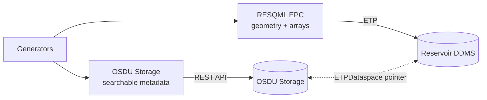

# BusinessDecision - Drogon Demo Guide

> **Scope:** Drogon DG1 and DG2 demo inventory, ORES rendering, and web-based BD creation. For generic BD concepts and linking patterns, see [BusinessDecision](/howto/business-decision). For CollaborationProject lifecycle, see [P&WS](/howto/pws).
>
> **Demo data**: [`demo/drogon_dg2/`](https://github.com/equinor/ores/tree/main/demo/drogon_dg2)

---

## 1. Using ORES with BusinessDecision Data

### Searching

Open the **Search** tab (`/search`) and query for kind `osdu:wks:master-data--BusinessDecision:*.*.*`.  
OSDU Search returns card-rendered results showing each decision gate record with its name, project, decision level, and approval status. Click a result card to inspect the full JSON, including the `Parameters[]` array that links every piece of evidence.

### Analysing Decision Gates

Open the **Analyse** tab (`/analyse`). ORES lists all `Reservoir` master-data records.  
Select a reservoir (e.g. *Drogon*) and ORES automatically finds every `BusinessDecision` linked to it, orders them by gate (DG1 → DG2 → …), and presents a side-by-side comparison:

- **Volume deltas** - STOIIP, Recoverable, Recovery Factor at P10/P50/P90
- **Risk evolution** - risks added, reduced, closed, or escalated between gates
- **Property diffs** - DevelopmentConcept fields, economics parameters
- **Charts** - overlay visualisations of how metrics change across gates

---

## 2. Drogon Demo Inventory

A DG1 package spans **~15 records**; the full DG2 package spans **~100+ records** across master-data, reference-data, work-product-components, and datasets.

### 2.1 Record Kinds (DG1 + DG2)

| # | Category | OSDU Kind | Purpose |
|---|----------|-----------|---------|
| 1 | Master-data | `osdu:wks:master-data--BusinessDecision:1.0.0` | Decision record - central hub |
| 2 | Master-data | `osdu:wks:master-data--Reservoir:2.0.0` | Reservoir entity (shared across gates) |
| 3 | Master-data | `osdu:wks:master-data--ReservoirSegment:2.0.0` | Fault-bounded segments |
| 4 | Master-data | `osdu:wks:master-data--Risk:1.2.0` | Risk records with severity/probability |
| 5 | WPC | `osdu:wks:work-product-component--ReservoirEstimatedVolumes:1.1.0` | Raw per-realisation volumes |
| 6 | WPC | `osdu:wks:work-product-component--ReservoirEstimatedVolumes:1.1.0` | Aggregated statistics (P10/P50/P90) |
| 7 | WPC | `osdu:wks:work-product-component--ColumnBasedTable:1.3.0` | Input parameters (design matrix) |
| 8 | WPC | `osdu:wks:work-product-component--Activity:1.0.0` | Workflow run record |
| 9 | WPC | `osdu:wks:work-product-component--ActivityTemplate:1.0.0` | Workflow template |
| 10 | WPC | `osdu:wks:work-product-component--Document:1.2.0` | Governance documents (SRA, CRA, PDO; DG2 adds PTR) |
| 11 | WPC | `osdu:wks:work-product-component--GeoLabelSet:1.0.0` | Headline P10/P50/P90 for dashboards |
| 12 | Dataset | `osdu:wks:dataset--ETPDataspace:1.0.0` | RDDMS dataspace pointer |
| -- | Master-data | `osdu:wks:master-data--CollaborationProject:1.0.0` | Cross-DG collaboration namespace |
| -- | WPC | `osdu:wks:work-product-component--CollaborationProjectCollection:1.0.0` | Trusted SoR accumulator |

#### DG2 Additions

| # | Category | OSDU Kind | Count |
|---|----------|-----------|------:|
| 13 | WPC | `ColumnBasedTable` | 1 - Production forecast (20-year) |
| 14 | WPC | `IjkGridRepresentation` | 11 - Static grid + property grids |
| 15 | WPC | `StructureMap` | 12 - Depth surfaces, amplitude, facies maps |
| 16 | WPC | `GenericRepresentation` | 44 - Property averages, APS cubes, polygons |
| 17 | WPC | `ColumnBasedTable` | 5 - Simulator tables (relperm, PVT, summary, completions, gruptree) |
| 18 | WPC | `PersistedCollection` | 1 - Evidence package (99 DataReferences) |
| 19-25 | Reference-data | DecisionLevel, ApprovalStatus, RiskCategory, etc. | Decision catalogs & volume metadata |

### 2.2 Custom Schema - DevelopmentConcept

- **Kind:** `dev:wks:work-product-component--DevelopmentConcept:1.0.0`
- **Purpose:** Structured development concept fields (no canonical OSDU schema exists)
- Registered as LOCAL schema - validated, searchable, evolvable

### 2.3 Entity Relationship Diagram

```mermaid
graph TD
    subgraph "Master Data"
        RES["Reservoir"]
        SEG["ReservoirSegment ×N"]
        RISK["Risk ×N"]
        BD["BusinessDecision DG2"]
        BD_DG1["BusinessDecision DG1"]
        CP["CollaborationProject<br/><i>cross-DG namespace</i>"]
    end

    subgraph "Work Product Components"
        REV_RAW["REV - RAW<br/><i>per-realisation</i>"]
        REV_STAT["REV - Statistics<br/><i>P10/P50/P90</i>"]
        PARAMS["ColumnBasedTable<br/><i>Input Parameters</i>"]
        PP["ColumnBasedTable<br/><i>Production Forecast</i>"]
        GLS["GeoLabelSet<br/><i>Headline volumes</i>"]
        DEV["DevelopmentConcept<br/><i>custom schema</i>"]
        ACT["Activity<br/><i>Workflow Run</i>"]
        TMPL["ActivityTemplate"]
        DOCS["Documents<br/><i>SRA, CRA, PDO, PTR</i>"]
        GRID["IjkGridRepresentation<br/><i>static grid model</i>"]
        MAPS["StructureMap + GenericRep<br/><i>surfaces, polygons</i>"]
        SIM["ColumnBasedTable<br/><i>simulator tables ×5</i>"]
        PC["PersistedCollection<br/><i>evidence package</i>"]
        CPC["CollabProjectCollection<br/><i>SoR accumulator</i>"]
    end

    subgraph "Datasets"
        ETP["ETPDataspace<br/><i>RDDMS geomodel</i>"]
    end

    subgraph "Reference Data"
        DL["DecisionLevel"]
        AS["ApprovalStatus"]
        RC["RiskCategory"]
    end

    BD -->|DecisionLevelID| DL
    BD -->|ApprovalStatusID| AS
    BD -->|RiskIDs| RISK
    BD -->|RiskAssessmentDocument| DOCS
    BD -->|PriorActivityIDs| ACT
    BD -->|Parameters - Input| REV_RAW
    BD -->|Parameters - Input| REV_STAT
    BD -->|Parameters - Input| DEV
    BD -->|Parameters - InputRef| RES
    BD -->|Parameters - InputRef| BD_DG1
    BD -->|Parameters - Input| GRID
    BD -->|Parameters - Input| MAPS
    BD -->|Parameters - Input| SIM
    BD -->|Parameters - InputRef| PC

    BD -->|ParentProjectID| CP
    BD_DG1 -->|ParentProjectID| CP
    CP -->|TrustedCollectionID| CPC
    CPC -.->|ResourceIDs| REV_RAW
    CPC -.->|ResourceIDs| GRID
    CPC -.->|ResourceIDs| RES
    CPC -.->|ResourceIDs| ETP

    PC -.->|DataReferences| REV_RAW
    PC -.->|DataReferences| GRID
    PC -.->|DataReferences| MAPS
    PC -.->|DataReferences| RISK
    PC -.->|DataReferences| DOCS
    PC -.->|DataReferences| ETP

    ACT -->|ActivityTemplateID| TMPL
    ACT -->|Input| PARAMS
    ACT -->|Output| REV_RAW
    ACT -->|Output| REV_STAT
    ACT -->|InputRef| ETP

    RES -->|ancestry.child| SEG
    REV_RAW -->|ParentObjectID| RES
    RISK -->|CategoryID| RC

    classDef master fill:#cfe2ff,stroke:#084298,color:#222
    classDef wpc fill:#d4edda,stroke:#155724,color:#222
    classDef dataset fill:#fff3cd,stroke:#d39e00,color:#222
    classDef ref fill:#e9ecef,stroke:#6c757d,color:#222
    classDef bd fill:#e2d9f3,stroke:#5a3e85,color:#222

    class RES,SEG master
    class BD,BD_DG1 bd
    class CP bd
    class RISK risk
    class REV_RAW,REV_STAT,PARAMS,PP,GLS,ACT,TMPL,DOCS,DEV,GRID,MAPS,SIM,PC,CPC wpc
    class ETP dataset
    class DL,AS,RC ref
```

---

## 3. Geomodel Data Residency

Gridded reservoir model data lives in **RDDMS** (ETP dataspace), not in OSDU Storage records:

The BD references the dataspace via `Parameters[]` with role `InputReference`.

> **DatasetIDs gap:** The RDDMS manifest builder does **not** populate `DatasetIDs` on WPCs. After ingesting RDDMS-sourced WPCs, a post-ingest patch is needed to set `DatasetIDs: ["<ETPDataspace-record-id>"]` on each WPC.

---

## 4. DG2 Evidence Package (PersistedCollection)

The Drogon DG2 `PersistedCollection` bundles **99 DataReferences**:

| Group | Count | Example Kinds |
|-------|------:|---------------|
| IjkGridRepresentation | 11 | Parent grid + 10 property grids |
| StructureMap | 12 | 6 horizon depth surfaces + derived maps |
| GenericRepresentation (maps) | 37 | Amplitude, facies fractions, property averages, APS probability cubes |
| GenericRepresentation (polygons) | 7 | Fault lines (4 horizons), field outline, fluid-contact outlines |
| ColumnBasedTable (sim-tables) | 5 | Relperm, PVT, summary, completions, gruptree |
| REV, CBT, DevelopmentConcept | 4 | Core evidence |
| Activity + ActivityTemplate | 2 | Provenance chain |
| ETPDataspace | 1 | RDDMS dataspace pointer |
| Risk | 6 | DG2 risk records |
| Documents | 4 | SRA, CRA, PDO, PTR |
| Reservoir + 7 Segments | 8 | Master-data scope |
| GeoLabelSet | 1 | Headline volumes |
| Well/Wellbore/Strat | ~30 | Shared well + stratigraphy records |

---

## 5. Creating Demo Records via the Web UI

The ORES [/add-dg](/add-dg) page supports **full self-service creation** of BusinessDecision records - including all linked metadata typically provided by scripts.

### 5.1 Decision Gate Tab

| Panel | What it fills |
|-------|--------------|
| **0. Project Preset** | One-click scaffold (Field Dev DG1, DG2, Exploration, WPC Wells, CCS, Blank) |
| **1. Identity** | Name, DecisionLevel, ProjectName, DecisionSummary |
| **2. Reservoir & Links** | ReservoirID, CollaborationProjectID, EvidencePackageID |
| **3. Schedule / Milestones** | Pick template → auto-populate rows |
| **4. Linked Records** | DataObject parameters with role semantics |
| **5. Risks** | RiskIDs array |
| **6. Alternatives** | Ranked development alternatives with rationale |
| **7. Economics** | KPI name/value/unit (NPV, IRR, CAPEX, OPEX) |
| **8. Preview** | Full JSON payload review before submission |

### 5.2 Preset-Based Workflow

1. **Select preset** (e.g. "Field Dev - DG2") → auto-fills milestones, alternatives, economics
2. **Customise** - fill in real names, dates, record IDs for linked evidence
3. **Preview & submit** - validates and PUTs to OSDU Storage API

### 5.3 Schedule Templates

| Template | Milestones |
|----------|-----------|
| Field Development | SSVP → DG0 → DG1 → DG2 → DG3 → DG4 → Install → First Oil → Plateau |
| Field Dev Wells | Well Concept → DG2 → DG3 → Rig → Spud → TD → Complete → Handover |
| Exploration Well | Prospect ID → Play Mature → Drill Decision → Design → Spud → TD → Evaluate → Report |
| CCS | Site Screen → Permit → DG3 → Appraisal → FID → Inject → Steady State → Monitor |
| IOR | Screen → Feasibility → Concept → DG3 → Execute → First Response → Evaluate |
| Decommissioning | COP → Decom Plan → Well P&A → Topsides → Subsea → Site Verify |

### 5.4 Scripts vs Web UI

| Use case | Recommended |
|----------|-------------|
| One-off demo BD (workshop, talk, test) | **Web UI** |
| Bulk ingestion (100+ records, RDDMS manifests) | **Scripts** (`demo/ingest_*.py`) |
| Reproducible CI/CD pipeline | **Scripts** (git-tracked) |
| Exploring schema structure | **Web UI** (payload preview) |

### 5.5 Activity Tab

The Activity tab supports `ActivityTemplate` and `Activity` records with presets: Custom, Reservoir Simulation, Ensemble Run, Drilling & Completion, Production Test, Interpretation, QC. See [Activity guide](/howto/activity) for details.
