# BusinessDecision  Data Model, Logic & ORES Guide

> **Scope:** In-depth guide to the BusinessDecision data model in OSDU  business cases, temporal lifecycle, relationship semantics, collaboration patterns, and ORES tooling. Field-agnostic.
> For the BD schema reference, see [Business Decision](/howto/business-decision).
> For the Drogon demo record inventory & pipeline, see [Drogon Data Model](/howto/drogon-data-model).
> For volumes, risks, uncertainty, see the sibling articles under Business Decision.

---

## 1. What BusinessDecision Models

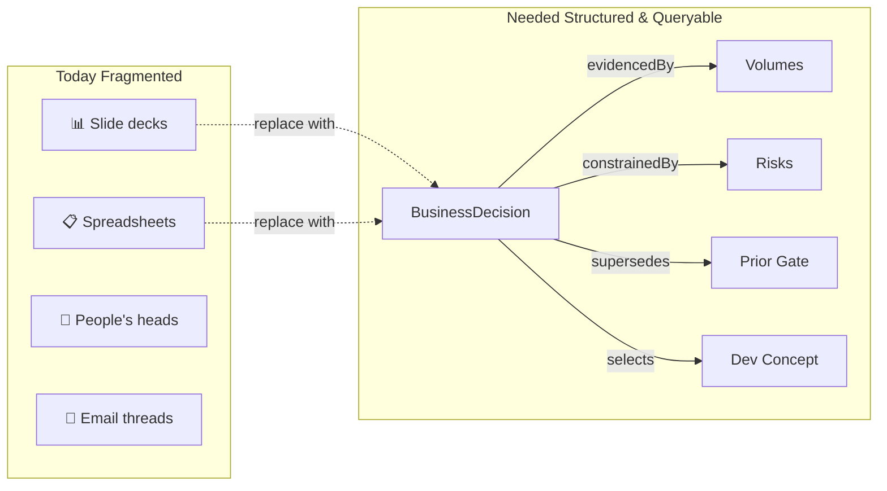
A `BusinessDecision` is an OSDU **master-data** record (`osdu:wks:master-data--BusinessDecision:1.0.0`) that captures a staged technical/business decision  not just *what* was decided, but *why*, *based on what evidence*, *constrained by which risks*, and *how it relates* to prior and subsequent decisions.

It inherits from `AbstractProjectActivity`, which provides the `Parameters[]` mechanism  the same typed input/output/context pattern used by `Activity` and other project entities. This inheritance is the key design choice: a decision gate is treated as a specialised activity with richer governance semantics.

**Why does this matter?**

- **Traceability**  link every decision to its evidence chain: volumes, geomodels, forecasts, risks, development concepts
- **Auditability**  regulatory and partner reviews demand frozen, reproducible evidence packages
- **Cross-gate analysis**  how do volumes, risks, economics evolve from DG1 through DG4 to FID?
- **Decision quality**  move from "was the process followed?" to "was the decision good?"
---

## 2. Business Cases & Decision Types

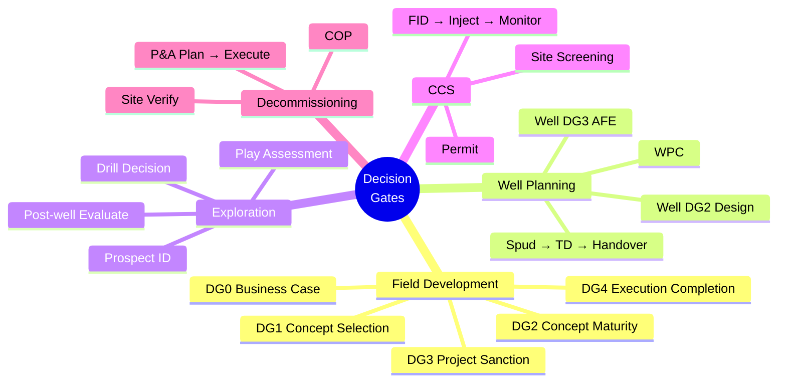
The BD schema is **domain-agnostic**  the same record structure models any staged decision:

| Decision Type | Typical Gates | Key Evidence | Business Driver |
|---|---|---|---|
| **Field development** | DG0 → DG1 → DG2 → DG3 (sanction) → DG4 | Volumes, geomodel, forecast, risks, dev concept | Optimise recovery, manage investment risk |
| **Well planning (WPC)** | WPC → Well DG2 → Well DG3 (AFE) → Spud → TD → Handover | Trajectories, cost estimates, well design, hazards | Drill-or-defer, well placement optimisation |
| **Exploration** | Play → Prospect → Drill Decision → Evaluate → Report | Seismic, play assessment, prospect risk | Discover new resources, manage exploration risk |
| **CCS** | Screen → Permit → FID → Inject → Monitor | Storage capacity, containment, MMV plan | Comply with regulations, sequester CO₂ |
| **IOR** | Screen → Feasibility → DG3 → Execute → Evaluate | Reservoir simulation, injection tests, EOR screening | Improve recovery from mature fields |
| **Decommissioning** | COP → P&A Plan → Execute → Verify | Cost estimate, environmental assessment, P&A design | Safely abandon infrastructure |

Each type has its own milestone vocabulary (DecisionLevel reference data) and evidence requirements, but all share the same linking patterns (`Parameters[]`, `RiskIDs`, `PriorActivityIDs`).

**A decision gate (DG)** is a predefined point in the Capital Value Process (CVP) where Equinor decides to move the project to the next phase, further mature it in the current phase, or terminate the business case.
---

## 3. Decision Gate Lifecycle

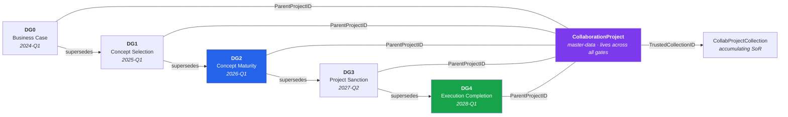
A decision gate **does not exist in isolation**. It is one step in a multi-year lifecycle. The temporal flow matters:

1. **DG0  Business-Case Maturity:** Early concept framing. Opportunity recognised, licence strategy and pre-investment needs aligned. BD record created with project name, reservoir link, initial risk register.
2. **DG1  Concept Selection:** Shortlist viable development concepts. REV volumes, initial development concepts, geomechanical/geological risks. BD `supersedes` DG0. *(In MF-TEX / accelerated workflows, DG1 may be omitted or combined with DG2.)*
3. **DG2  Concept Maturity:** Target maturation  the selected concept is matured toward sanction. Well planning and long-lead items identified. Multiple alternatives evaluated, one selected (`selects`), alternatives rejected (`alternativeTo`). Evidence frozen in PersistedCollection. BD `supersedes` DG1.
4. **DG3  Project Sanction:** Investment decision. Board-level approval (PDO / plan approval). All evidence and risk documentation must be auditable. The Decision Gate Support Package (DGSP) is the frozen pre-read for this gate. BD `supersedes` DG2.
5. **DG4  Execution Completion:** Basis for operations. Execution-to-operation handover. Confirms production readiness, commissioning complete, punch-list closed.

**Between gates**, teams iterate on subsurface models, run simulations, update volumes, add/resolve risks. The `CollaborationProject` (§6) acts as the living workspace, while each BD record represents a **frozen decision point**.

**Cross-gate deltas** are the analytical payoff: how did P50 STOIIP change from DG1 to DG2? Which risks were added vs. resolved? Did the chosen development concept survive from DG2 to DG3?

In practice, DG0 and DG1 are often created retroactively when a team adopts BD  the data model supports backfilling.

### 3.1 Related Governance Terms

| Term | Meaning |
|------|--------|
| **Decision Gate Support Package (DGSP)** | Frozen set of project documents (decision memo, QC reviews, CAR/MDQC reports, cost/economics, risks) prepared as the pre-read for each DG approval |
| **VPbo / APbo** | Validation/approval of business opportunity  milestones in MF-TEX and business-opportunity flows that interact with DG0/DG2 for keeper wells and prospects |
| **SDG / SDG3–SDG4** | Stage gates in Technology/Delivery model  used for technology/solution implementation; value reporting starts from SDG3/SDG4 in T&I governance |
| **MF-TEX** | Marginal Field / Accelerated Field Development  customised gate sequencing where DG1 can be omitted, phases combined, and DG2 may include early long-lead pre-investments |
---

## 4. Data Model Deep Dive

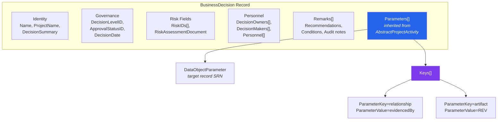
The BD record has four layers of structured data:

**Layer 1  Identity & Governance:**

| Field | Purpose | Example |
|---|---|---|
| `Name` | Human-readable gate title | "Drogon DG2  Concept Select" |
| `ProjectName` | Project context | "Drogon Field Development" |
| `DecisionLevelID` | Reference to `DecisionLevel` | `osdu:reference-data--DecisionLevel:DG2:` |
| `ApprovalStatusID` | Reference to `DecisionApprovalStatus` | `…DecisionApprovalStatus:Approved:` |
| `DecisionDate` | When the decision was made | `2026-05-10` |
| `DecisionDueDate` | Target date | `2026-06-01` |
| `DecisionSummary` | Executive summary | "Approve concept select …" |

**Layer 2  Risk & Documentation:**

| Field | Purpose |
|---|---|
| `RiskIDs[]` | Array of `master-data--Risk` record references |
| `RiskAssessmentDocument` | Link to SRA/CRA document WPC |
| `PriorActivityIDs[]` | Activities that produced the evidence |

**Layer 3  Personnel & Governance:**

| Field | Purpose |
|---|---|
| `Personnel[]` | Team members with `ProjectRoleID` |
| `DecisionOwners[]` | Decision owner(s)  accountability |
| `DecisionMakers[]` | Decision maker(s)  authority |
| `Remarks[]` | Structured annotations: Recommendation, Condition, Risk note, Audit |

**Layer 4  Parameters[] (the relationship layer):**

This is the most important part. Each `Parameters[]` entry links the BD to a target record with typed semantics:

```json
{
  "Title": "Volumes  DG2 Statistics",
  "DataObjectParameter": "dev:wpc--ReservoirEstimatedVolumes:<uuid>:1",
  "Keys": [
    { "ParameterKey": "relationship", "ParameterValue": "evidencedBy" },
    { "ParameterKey": "artifact", "ParameterValue": "REV" }
  ]
}
```

The `Keys[]` sub-array carries the edge semantics. The `relationship` key names the edge type; the `artifact` key names the target kind (used for rendering icons and grouping). This convention turns every `Parameters[]` entry into a **typed, directed edge**  sufficient for graph rendering without a dedicated graph database.
---

## 5. Relationship Types  The Edge Vocabulary

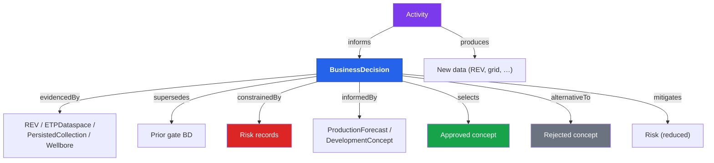
Nine relationship types, all stored as `Parameters[].Keys[ParameterKey="relationship"]` values. All labels read **from the source record's perspective**:

| # | Edge Type | Source → Target | Semantics | Example |
|---|---|---|---|---|
| 1 | `evidencedBy` | BD → target | This decision is supported/proved by target | BD ← REV (volumes support the decision) |
| 2 | `supersedes` | BD → prior BD | This decision replaces target | DG2 → DG1 (new gate replaces prior) |
| 3 | `constrainedBy` | BD → Risk | This decision is limited/bounded by target | BD ← Porosity Risk |
| 4 | `mitigates` | BD → Risk | This evidence reduces target risk's impact | Activity output → Risk (new data mitigates) |
| 5 | `alternativeTo` | BD → DevConcept | This decision evaluated target as alternative | BD → Reduced-scope concept |
| 6 | `informedBy` | BD → target | This decision is informed/influenced by target | BD ← ProductionForecast |
| 7 | `selects` | BD → DevConcept | This decision approves/selects target | BD → Full 7-segment tieback |
| 8 | `produces` | Activity → output | This activity created target data | Simulation run → REV |
| 9 | `informs` | Activity → BD | This activity contributed to decision | Ensemble run → DG2 BD |

**Direction convention:** Edges radiate **outward** from the source record. A BD's `Parameters[]` entries point TO the evidence, TO the prior gate, TO the risks. An Activity's `Parameters[]` entries point TO the BD it informs and TO the data it produces.

**Why not a graph database?** OSDU is a schema-validated document store. There is no native graph traversal API, no reverse-link index, no N-hop query. The "graph" is computed at the application layer (ORES) by following `Parameters[]` references with REST calls. This trade-off means zero infrastructure cost for graph capabilities  at the price of more REST calls per page load.
---

## 6. CollaborationProject  The Cross-Gate Namespace

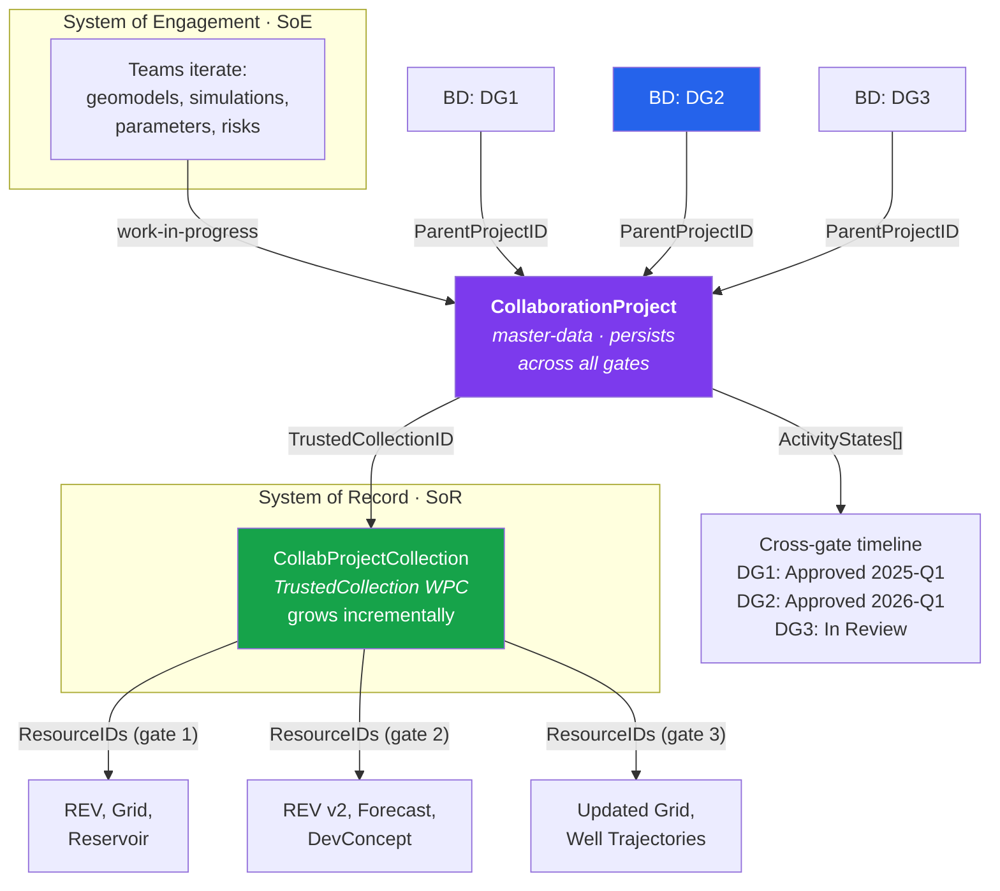
A `CollaborationProject` (`master-data--CollaborationProject:1.0.0`) is the **persistent identity** that outlives any single gate. Think of CP as the "project folder" and BD as the "gate review meeting minutes". It bridges the **System of Engagement** (where teams iterate on work-in-progress) and the **System of Record** (where curated, trusted data accumulates).

**Key relationships:**

| Field | Purpose | Lifecycle |
|---|---|---|
| `ParentProjectID` (on BD) | Links each gate decision to the CP | Set at BD creation |
| `TrustedCollectionID` (on CP) | Points to the `CollaborationProjectCollection` WPC  the accumulating SoR | Grows across gates |
| `ActivityStates[]` (on CP) | Cross-gate timeline with `MilestoneID`, dates, status | Updated per gate |
| `LifecycleEvents[]` (on CP) | Audit trail: approvals, escalations, revisions | Append-only |
| `Remarks[]` (on CP) | Structured annotations (recommendations, conditions) | Per event |

**SoE ↔ SoR separation:**

- **SoE**  teams update geomodels, run simulations, explore alternatives. Data is volatile, iterative, not yet trusted.
- **SoR**  when a gate is approved, curated data references are added to the `CollaborationProjectCollection.ResourceIDs[]`. This is the "golden dataset"  the official, trusted version of each artifact.
- **The CP bridges both**  it knows about the ongoing collaboration (SoE) AND points to the accumulating trusted collection (SoR).

**CP vs. BD:**

| Aspect | CollaborationProject | BusinessDecision |
|---|---|---|
| Kind | `master-data` | `master-data` |
| Lifecycle | Multi-year, persists across gates | Per gate, one record per decision point |
| Purpose | Cross-gate namespace + SoR accumulation | Gate-scoped decision record + evidence |
| Evidence | TrustedCollection grows incrementally | PersistedCollection is per-gate snapshot |
| Timeline | ActivityStates[] spans all gates | DecisionDate is one moment |
---

## 7. Evidence Packages  PersistedCollection

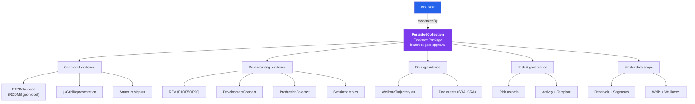
A `PersistedCollection` (`work-product-component--PersistedCollection:1.0.0`) bundles all evidence artifacts for a single gate into a **frozen, versioned set**. Unlike the CollaborationProject's TrustedCollection (which grows incrementally), a PersistedCollection is a **snapshot**  it represents "everything the gate committee saw when they approved".

**Why freeze evidence?**

- **Auditability**  "show me exactly what was reviewed at DG2" is answered by one record with N DataReferences
- **Reproducibility**  if volumes were recalculated after DG2, the PersistedCollection still points to the DG2-era values
- **Regulatory compliance**  partner reviews, government audits, license applications all require frozen evidence sets
- **Dispute resolution**  "we approved based on these volumes, not the updated ones"

**Structure:** The PersistedCollection's `DataReferences[]` array lists every artifact  typically 50–150 record SRNs grouped by discipline. ORES renders these grouped by kind (geomodel, volumes, risks, wells, etc.).

**CP TrustedCollection vs. PersistedCollection:**

| Aspect | TrustedCollection (CP) | PersistedCollection (BD) |
|---|---|---|
| Scope | All gates to date | One gate |
| Mutability | Grows per gate | Frozen at approval |
| Purpose | "What's currently trusted?" | "What was reviewed at this gate?" |
| Record type | `CollaborationProjectCollection` WPC | `PersistedCollection` WPC |
---

## 8. Activity & Provenance

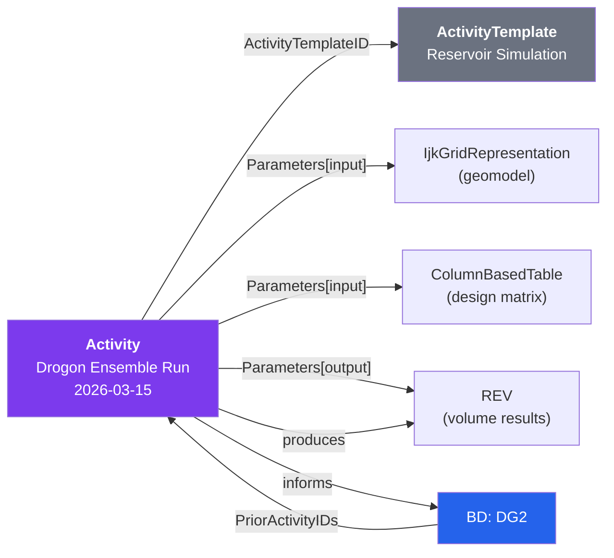
`Activity` records (`work-product-component--Activity:1.0.0`) are the **provenance layer**  they record who did what, when, with which inputs, producing which outputs. Each Activity is a "verb" in the decision narrative.

**Activity → BD linkage:**

| Direction | Mechanism | Semantics |
|---|---|---|
| Activity → BD | `Parameters[].Keys[relationship=informs]` | "This activity contributed to the decision" |
| Activity → output data | `Parameters[].Keys[relationship=produces]` | "This activity created this data" |
| BD → Activity | `PriorActivityIDs[]` | "This decision was based on these activities" |

**ActivityTemplate** defines the workflow type  e.g., "Reservoir Simulation", "Ensemble Run", "QC Review". Templates are shared across activities: all reservoir simulations reference the same template. This enables portfolio-level queries: "all DG2 decisions that included a reservoir simulation activity".

**Provenance chain example:**
1. Geologist creates geomodel in RMS → Activity (Interpretation) `produces` IjkGridRepresentation
2. Reservoir engineer runs simulation → Activity (Ensemble Run) takes grid as input, `produces` REV
3. DG2 committee reviews REV → BD is `informedBy` REV, links Activity via `PriorActivityIDs`

The full chain: **human action → Activity → data artifact → BD → decision**. Every link is queryable.

ORES provides Activity presets: Custom, Reservoir Simulation, Ensemble Run, Drilling & Completion, Production Test, Interpretation, QC.

---

## 9. Risk Management Across Gates

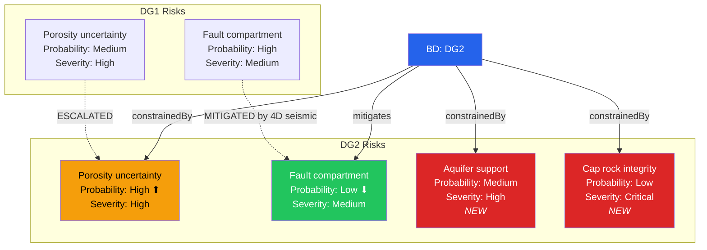
Risk records (`master-data--Risk:1.2.0`) are linked to BDs via two mechanisms:

1. **`RiskIDs[]`**  built-in BD field, lists all Risk record references for the gate
2. **`Parameters[].Keys[relationship=constrainedBy]`**  typed edge, carries semantics

**Risk lifecycle across gates** is the analytical payoff:

| Pattern | Meaning | Edge Type |
|---|---|---|
| **Escalated** | Risk probability or severity increased between gates | `constrainedBy` (on new BD) |
| **Mitigated** | New evidence reduced risk impact | `mitigates` (on new BD or Activity) |
| **Resolved** | Risk no longer applies | Risk dropped from `RiskIDs[]` |
| **New** | Risk identified since last gate | New Risk record, added to `RiskIDs[]` |

**Risk record structure:**

| Field | Purpose |
|---|---|
| `Name` | "Porosity downgrade in Valysar" |
| `RiskCategoryID` | Reference to `RiskCategory` (geological, economic, HSE, …) |
| `ProbabilityLevel` | Low / Medium / High |
| `SeverityLevel` | Low / Medium / High / Critical |
| `MitigationStrategy` | Free text description |
| `MitigationOwner` | Responsible person |

ORES renders risk evolution as **chips with colour-coded severity/probability** and computes deltas between gates automatically.
---

## 10. Alternatives & Concept Evaluation

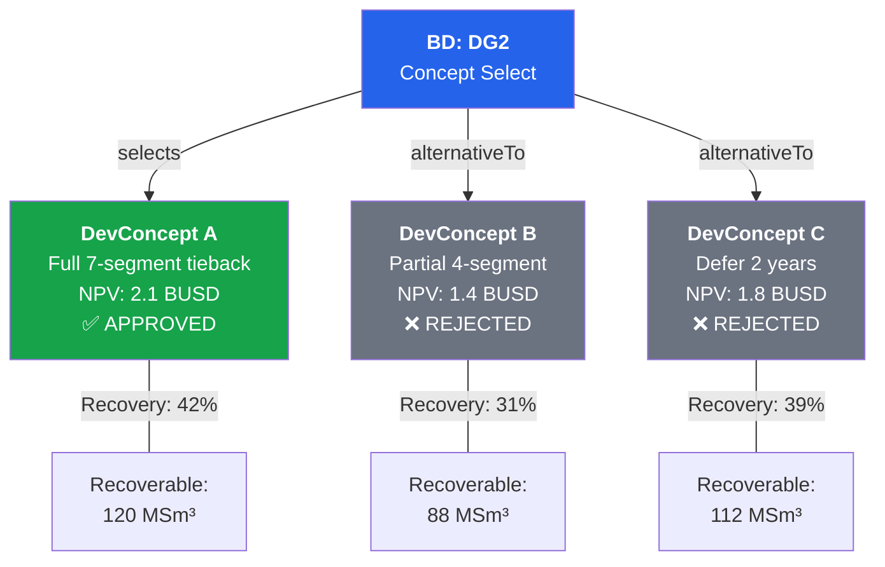
DG2 (Concept Select) is the gate where alternatives are formally evaluated. The BD uses two edge types for this:

| Edge | Target | Meaning |
|---|---|---|
| `selects` | Approved DevelopmentConcept | "This decision approves this concept for further development" |
| `alternativeTo` | Rejected DevelopmentConcept | "This decision evaluated this concept but did not select it" |

Each `DevelopmentConcept` WPC (`work-product-component--DevelopmentConcept:1.0.0`  custom schema in ORES) carries:
- Facility description, well count, recovery factor
- Economics KPIs (NPV, IRR, CAPEX, OPEX)
- Ranking rationale

The selection rationale is captured in the BD's `DecisionSummary` and `Remarks[]` (with `RemarkSource: Recommendation`).

**Why this matters:** Concept evaluation is often the most scrutinised part of a gate review. Having the alternatives, their KPIs, and the selection rationale in structured, queryable records enables:
- Post-decision review: "was the selected concept actually the best?"
- Portfolio analysis: "across all DG2s, what % of selected concepts had the highest NPV?"
- Learning: "which rejected alternatives were reconsidered at later gates?"

Alternatively, concepts can be modelled inline using `ext.equinor.Alternatives[]` on the BD record  simpler but less reusable than separate DevelopmentConcept WPCs.

---

## 11. Using ORES  Search

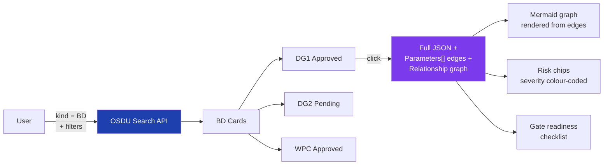
Open the **Search** tab (`/search`) and query for kind `osdu:wks:master-data--BusinessDecision:*.*.*`.

OSDU Search returns card-rendered results showing each decision gate record with its name, project, decision level, and approval status. Click a result card to see:

1. **Full JSON**  every field, every Parameters[] entry
2. **Relationship graph**  Mermaid-rendered from Parameters[] edges (auto-generated by `bd_enrichment.py`)
3. **Risk chips**  colour-coded by severity/probability, with delta indicators if prior gate exists
4. **Gate readiness checklist**  derived from `ActivityStates[]` with completion status

**Search filters:**

| Filter | Field | Example |
|---|---|---|
| Decision level | `data.DecisionLevelID` | `"*DG2*"` |
| Approval status | `data.ApprovalStatusID` | `"*Approved*"` |
| Project | `data.ProjectName` | `"Drogon*"` |
| Reservoir | `data.Parameters.DataObjectParameter` | `"*Reservoir*"` |
| Date range | `data.DecisionDate` | `[2026-01-01 TO 2026-12-31]` |
---

## 12. Using ORES  Analyse

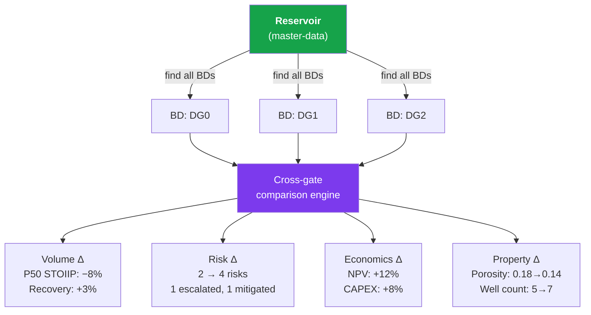
Open the **Analyse** tab (`/analyse`). ORES lists all `Reservoir` master-data records. Select a reservoir and ORES automatically:

1. **Finds all BDs** linked to that reservoir (via `Parameters.DataObjectParameter`)
2. **Orders by gate** (DG0 → DG1 → DG2 → …) using `DecisionLevelID`
3. **Fetches evidence** for each gate  REV volumes, risks, economics, properties
4. **Computes deltas**  side-by-side comparison across gates

**What the cross-gate view shows:**

| Category | Metrics Compared |
|---|---|
| **Volumes** | STOIIP P10/P50/P90, Recoverable, Recovery Factor  per segment and total |
| **Risks** | Count, severity distribution, escalated/mitigated/new/resolved per gate |
| **Economics** | NPV, IRR, CAPEX, OPEX  from DevelopmentConcept or BD economics fields |
| **Properties** | Any field that changed between gates (porosity, well count, facility design) |
| **Timeline** | Milestone dates vs. actual dates, schedule slippage |

**Analytical insights this enables:**

- **Estimation bias calibration**  are early-gate volumes systematically optimistic?
- **Risk pattern recognition**  which risk types always escalate? which mitigation strategies work?
- **Concept stability**  does the selected concept survive from DG2 to DG3, or is it revised every gate?
- **Schedule adherence**  how often do milestone dates slip between gates?

Volume comparison is per-segment: zone-level changes (e.g. Valysar drops 15% but Therys gains 8%) can be masked when only the total is shown. Works with any reservoir that has ≥2 BD records linked to it.

---

## 13. Using ORES  AddGate Web UI

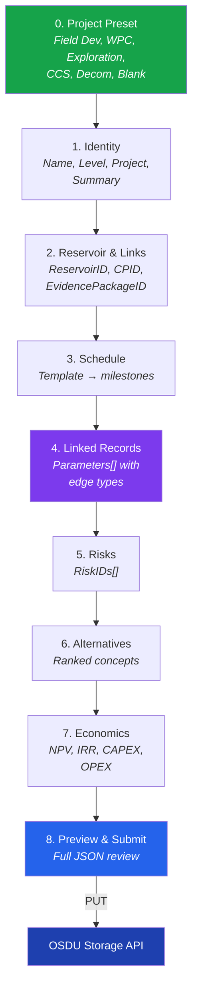
The ORES [/add-dg](/add-dg) page supports **full self-service creation** of BusinessDecision records  including all linked metadata typically provided by scripts.

| Panel | What it fills | Data Model Impact |
|-------|--------------|-------------------|
| **0. Project Preset** | One-click scaffold | Auto-fills milestones, economics, alternatives per decision type |
| **1. Identity** | Name, DecisionLevel, ProjectName, DecisionSummary | Core BD fields |
| **2. Reservoir & Links** | ReservoirID, CollaborationProjectID, EvidencePackageID | Master-data relationships |
| **3. Schedule / Milestones** | Pick template → auto-populate rows | `ActivityStates[]` on CP |
| **4. Linked Records** | DataObject parameters with relationship edge type | `Parameters[]` with `Keys[]` |
| **5. Risks** | RiskIDs array with browse | `RiskIDs[]` field |
| **6. Alternatives** | Ranked development alternatives with rationale | DevelopmentConcept + `selects`/`alternativeTo` |
| **7. Economics** | KPI name/value/unit (NPV, IRR, CAPEX, OPEX) | Economics fields or DevConcept data |
| **8. Preview** | Full JSON payload review before submission | Validates against OSDU schema |

**The linked records panel (§4) is the most important step**  it creates `Parameters[]` entries with:
- Target record SRN (browse or paste)
- Artifact type (REV, ETPDataspace, PersistedCollection, …)
- Relationship edge type (evidencedBy, informedBy, constrainedBy, …)

This is where the relationship graph is built.
### 13.1 Schedule Templates

| Template | Milestones | Typical Use |
|----------|-----------|-------------|
| Field Development | SSVP → DG0 → DG1 → DG2 → DG3 → DG4 → Install → First Oil → Plateau | Norwegian Sea field dev |
| Field Dev Wells | Well Concept → DG2 → DG3 → Rig → Spud → TD → Complete → Handover | Individual well decisions |
| Exploration Well | Prospect ID → Play Mature → Drill Decision → Design → Spud → TD → Evaluate → Report | Frontier/near-field exploration |
| CCS | Site Screen → Permit → DG3 → Appraisal → FID → Inject → Steady State → Monitor | Northern Lights / other CCS |
| IOR | Screen → Feasibility → Concept → DG3 → Execute → First Response → Evaluate | Polymer flooding, WAG, etc. |
| Decommissioning | COP → Decom Plan → Well P&A → Topsides → Subsea → Site Verify | End-of-life assets |

### 13.2 Scripts vs Web UI

| Use Case | Recommended | Why |
|----------|-------------|-----|
| One-off demo BD (workshop, talk, test) | **Web UI** | Interactive, visual feedback, no code needed |
| Bulk ingestion (100+ records, RDDMS manifests) | **Scripts** (`demo/ontology/ingest.py`) | Repeatable, version-controlled, handles partition rewriting |
| Reproducible CI/CD pipeline | **Scripts** (git-tracked specs) | Deterministic, testable, auditable |
| Exploring schema structure | **Web UI** (payload preview) | See the exact JSON before submitting |
| Cross-instance deployment (interop → interop) | **Scripts** with partition rewriting | `_rewrite_partition()` handles SRN/legal/ACL differences |

### 13.3 Activity Tab

The Activity tab supports `ActivityTemplate` and `Activity` records with presets:

| Preset | Use Case |
|--------|----------|
| Custom | Any workflow not covered by other presets |
| Reservoir Simulation | Eclipse/OPM/IX runs |
| Ensemble Run | FMU-based stochastic simulation |
| Drilling & Completion | Well operations |
| Production Test | DST, production logging |
| Interpretation | Seismic, geological, petrophysical |
| QC | Quality control review |

See [Activity guide](/howto/activity) for details.
---

## 14. Summary  How the Pieces Fit Together

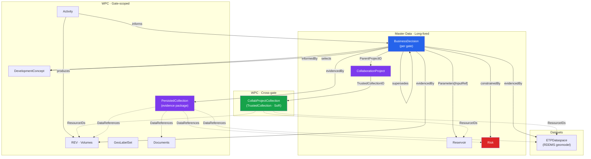
The full pattern:

1. **One `BusinessDecision` per gate**  carries identity, governance, risks, personnel, Parameters[] edges
2. **One `CollaborationProject` per asset/discipline**  persists across all gates, bridges SoE and SoR
3. **One `PersistedCollection` per gate** (DG2+)  frozen evidence snapshot for audit and regulatory review
4. **`Activity` records** for provenance  who did what, when, producing which outputs
5. **9 edge types** (`evidencedBy`, `supersedes`, `constrainedBy`, `mitigates`, `alternativeTo`, `informedBy`, `selects`, `produces`, `informs`)  all stored as `Parameters[].Keys[ParameterKey="relationship"]`
6. **Cross-gate analysis** by traversing the `supersedes` chain and computing deltas on volumes, risks, economics, properties

The knowledge graph emerges at the application layer (ORES), not from the platform. OSDU provides schema-validated storage and keyword search. ORES provides graph traversal, enrichment, visualisation, and cross-gate analytics.

---

## 15. Demo Guide  New Ontology Features

The BD search and analysis views now include six ontology-driven panels. Here's how to demonstrate them:

### Gate Completeness Progress Bar

1. `/search` → search for a BD with `ActivityStates[]` populated (e.g. "Drogon DG2")
2. The **progress bar** appears at the top of the BD card showing checklist completion (e.g. 7/10 milestones satisfied)
3. Expand the checklist grid to see each `MilestoneID` with its status (Satisfied / Outstanding / Waived)
4. **Talking point:** Gate readiness is data-driven  no separate spreadsheet tracking

### Visual Provenance DAG

1. In any BD card, expand the **"Provenance"** details panel
2. The flowchart shows: Inputs → Activity → Outputs, grouped by `ParameterRoleID`
3. Click any node to navigate to the source OSDU record
4. **Talking point:** Every decision is traceable to the workflow execution that produced its evidence

### Decision Alternative Comparison

1. Search for a BD with multiple alternatives (e.g. "Drogon DG1"  3 alternatives)
2. The **comparison table** appears inline: rank, name, recommended action, economics, rationale
3. Click **"Open full comparison in Analyse →"** for cross-gate alternative evolution
4. **Talking point:** Alternatives are structured data, not buried in slide decks

### Object Relationship Graph Explorer

1. In any BD card, expand the **"Relationships"** panel
2. See grouped links: parents, children, references, RDDMS dataspaces  each clickable
3. RDDMS dataspace references link directly to the `/keys` browser for that dataspace
4. **Talking point:** The full evidence graph is navigable from the decision record

### Cross-Gate Risk Evolution

1. `/analyse` → select multiple Drogon gates (DG0, DG1, DG2)
2. The **risk evolution** section shows open/mitigated/total per gate with trend indicators (↑/↓/✓)
3. Stacked bar chart visualises risk profile changes over time
4. **Talking point:** Risk evolution across gates answers "are we managing uncertainty or just adding it?"

### Activity Feed (CollaborationProject)

1. In any BD card linked to a CollaborationProject, expand the **"Activity Feed"** panel
2. The vertical timeline shows events: EvidenceAdded, RiskEscalation, VolumeUpdate, StateTransition
3. Each event has a timestamp, type badge, and description
4. **Talking point:** The project journal is auto-populated from `LifecycleEvents[]`  no manual logging

### Connecting to subsurface data

To demonstrate the full subsurface-to-decision link:

1. Start at `/keys` → run **Bypassed Oil** compound filter on `maap/drogon`
2. Note the grid UUIDs with high sweet-spot fraction
3. Switch to `/search` → find the Drogon DG1 BD
4. Expand provenance → the Activity references the same geomodel
5. **Talking point:** The compound filter identifies subsurface sweet spots; the BD tracks the decision made based on those results

