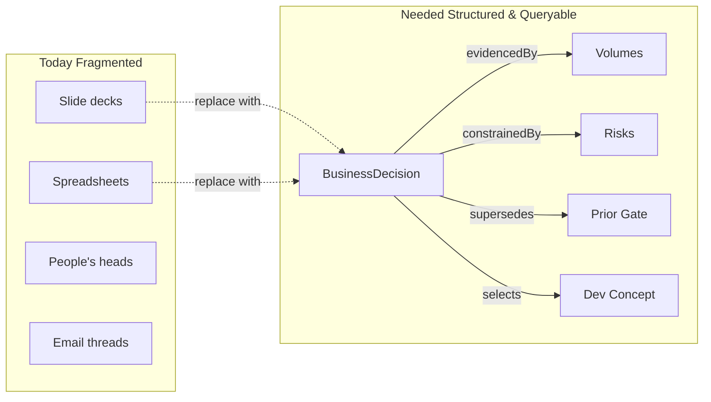
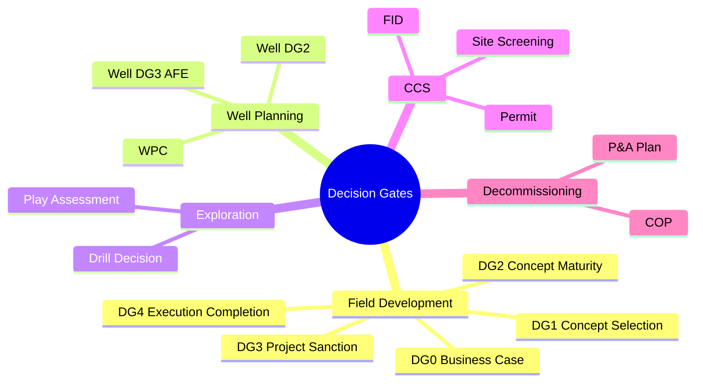
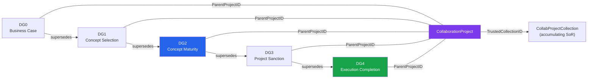
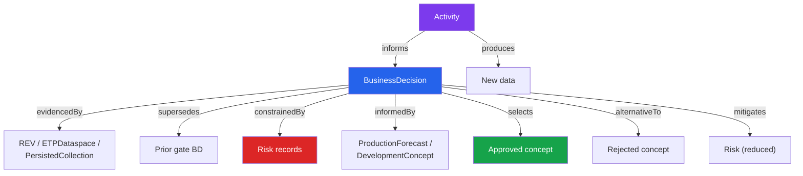
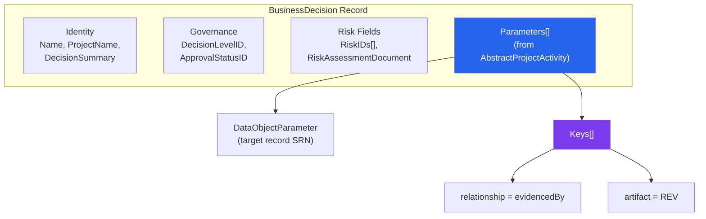
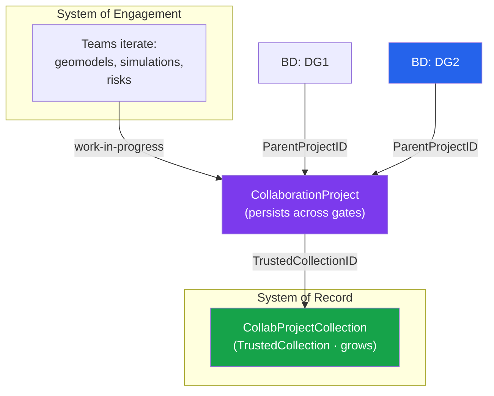
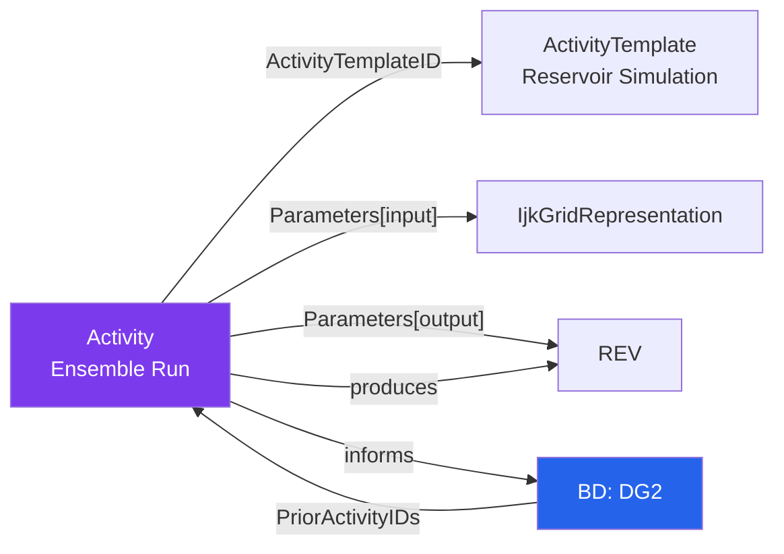
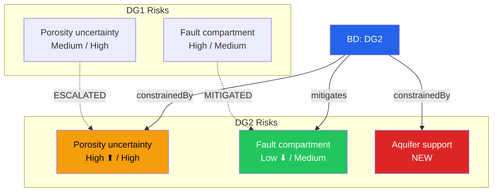
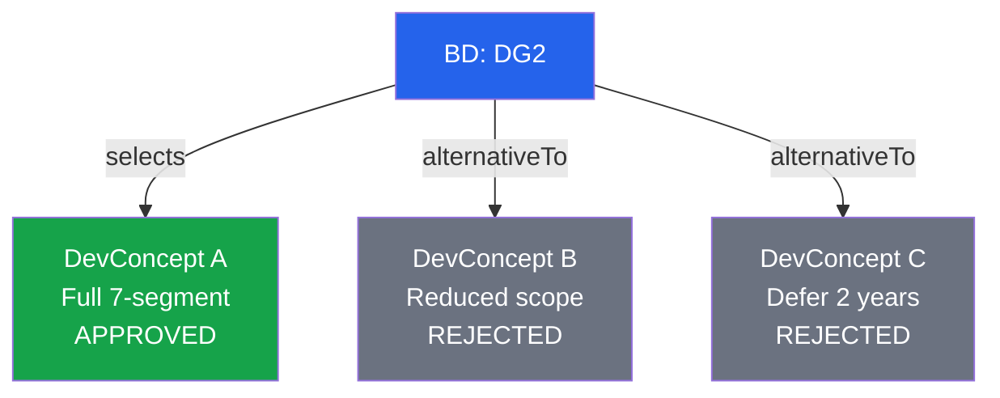
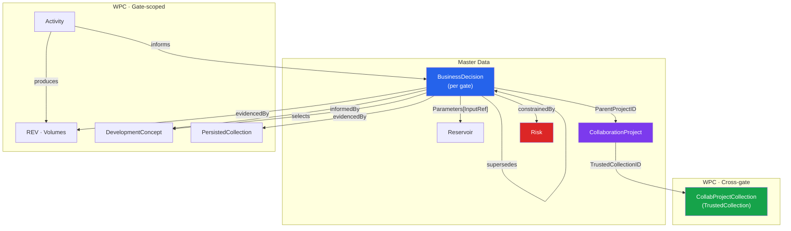

# OSDU BusinessDecision  Data Model & Implementation Guide

> **Scope:** Complete reference for modelling staged business decisions in OSDU using `osdu:wks:master-data--BusinessDecision:1.0.0`. Covers the data model, CVP gate lifecycle, relationship semantics, collaboration patterns, and implementation details. Field-agnostic.
> For ORES tooling (search, analyse, addgate UI), see [BD Demo](/howto/bd-demo).
> For the Drogon demo record inventory & pipeline, see [Drogon Data Model](/howto/drogon-data-model).

---

## 1. Why Structured Decision Records?



A `BusinessDecision` is an OSDU **master-data** record that captures a staged technical/business decision  not just *what* was decided, but *why*, *based on what evidence*, *constrained by which risks*, and *how it relates* to prior and subsequent decisions.

It inherits from `AbstractProjectActivity`, which provides the `Parameters[]` mechanism  the same typed input/output/context pattern used by `Activity` and other project entities. A decision gate is treated as a specialised activity with richer governance semantics.

**Why does this matter?**

- **Traceability**  link every decision to its evidence chain
- **Auditability**  regulatory and partner reviews demand frozen, reproducible evidence packages
- **Cross-gate analysis**  how do volumes, risks, economics evolve from DG0 through DG3?
- **Decision quality**  move from "was the process followed?" to "was the decision good?"

---

## 2. Business Cases & Decision Types



The BD schema is **domain-agnostic**  the same record structure models any staged decision:

| Decision Type | Typical Gates | Key Evidence |
|---|---|---|
| **Field development** | DG0 → DG1 → DG2 → DG3 → DG4 | Volumes, geomodel, forecast, risks, dev concept |
| **Well planning** | WPC → Well DG2 → Well DG3 (AFE) → Spud → Handover | Trajectories, cost estimates, hazards |
| **Exploration** | Play → Prospect → Drill Decision → Evaluate | Seismic, play assessment, prospect risk |
| **CCS** | Screen → Permit → FID → Inject → Monitor | Storage capacity, containment, MMV plan |
| **Decommissioning** | COP → P&A Plan → Execute → Verify | Cost estimate, environmental assessment |

Each type has its own milestone vocabulary (DecisionLevel reference data) and evidence requirements, but all share the same linking patterns (`Parameters[]`, `RiskIDs`, `PriorActivityIDs`).

---

## 3. Decision Gate Lifecycle (CVP)



1. **DG0  Business-Case Maturity:** Early concept framing. Opportunity recognised, licence strategy aligned. BD record created with project name, reservoir link, initial risk register.
2. **DG1  Concept Selection:** Shortlist viable development concepts. REV volumes, initial development concepts, geological risks. BD `supersedes` DG0. *(In MF-TEX workflows, DG1 may be omitted.)*
3. **DG2  Concept Maturity:** The selected concept is matured toward sanction. Multiple alternatives evaluated, one selected (`selects`), others rejected (`alternativeTo`). Evidence frozen in PersistedCollection. BD `supersedes` DG1.
4. **DG3  Project Sanction:** Investment decision (FID). Board-level approval (PDO). All evidence must be auditable. The DGSP is the frozen pre-read. BD `supersedes` DG2.
5. **DG4  Execution Completion:** Basis for operations. Confirms production readiness, commissioning complete, punch-list closed.

**Between gates**, teams iterate on models, run simulations, update volumes, add/resolve risks. The `CollaborationProject` acts as the living workspace, while each BD record represents a **frozen decision point**.

### 3.1 Related Governance Terms

| Term | Meaning |
|------|---------|
| **DGSP** | Decision Gate Support Package  frozen pre-read docs for each DG |
| **VPbo / APbo** | Business-opportunity milestones in MF-TEX flows |
| **SDG / SDG3–4** | Technology/Delivery stage gates |
| **MF-TEX** | Accelerated gate sequencing (DG1 may be omitted) |

---

## 4. Relationship Types  The Edge Vocabulary



Nine relationship types stored as `Parameters[].Keys[ParameterKey="relationship"]` values. All labels read **from the source record's perspective**:

| # | Edge Type | Semantics | Example |
|---|---|---|---|
| 1 | `evidencedBy` | Decision supported by target | BD ← REV |
| 2 | `supersedes` | Decision replaces target | DG2 → DG1 |
| 3 | `constrainedBy` | Decision bounded by target risk | BD ← Porosity Risk |
| 4 | `mitigates` | Evidence reduces target risk | Activity → Risk |
| 5 | `alternativeTo` | Decision evaluated target | BD → Reduced-scope concept |
| 6 | `informedBy` | Decision influenced by target | BD ← ProductionForecast |
| 7 | `selects` | Decision approves target | BD → Full tieback |
| 8 | `produces` | Activity created target data | Simulation → REV |
| 9 | `informs` | Activity contributed to decision | Ensemble run → BD |

**Direction convention:** Edges radiate **outward** from the source record. A BD's `Parameters[]` entries point TO the evidence, TO the prior gate, TO the risks.

---

## 5. Linking Patterns  Four Complementary Approaches

### A) Parameters[] (from AbstractProjectActivity)

Declare **inputs**, **outputs**, and **context** objects with rich metadata:

```json
{
  "Title": "Volumes  DG2 Statistics",
  "DataObjectParameter": "dev:wpc--ReservoirEstimatedVolumes:<uuid>:1",
  "Keys": [
    { "ParameterKey": "relationship", "ParameterValue": "evidencedBy" },
    { "ParameterKey": "artifact", "ParameterValue": "REV" }
  ]
}
```

The `Keys[]` sub-array carries edge semantics. The `relationship` key names the edge type; the `artifact` key names the target kind (used for rendering icons and grouping).

### B) Explicit BD Relationships

Built-in properties: `DecisionLevelID`, `ApprovalStatusID`, `RiskIDs`, `RiskAssessmentDocument`, `PriorActivityIDs`.

### C) CollaborationProject  Cross-DG Namespace

A `master-data--CollaborationProject` provides a persistent identity across all gates. Its `TrustedCollectionID` points to a growing SoR collection.

### D) PersistedCollection  Gate Evidence Package

Bundle artifacts into a versioned, frozen evidence set for a specific gate.

### Choosing Between Patterns

| Pattern | Best for | Lifecycle |
|---|---|---|
| `Parameters[]` | Precise typed edges per gate | Per gate |
| `CollaborationProject` | Cross-DG namespace, SoE↔SoR bridge | Persists across gates |
| `PersistedCollection` | Gate-scoped evidence snapshot | Per gate (frozen) |
| Explicit BD fields | Gate filters & governance | Per gate |

**Recommendation:** Use all three layers  BD per gate (with `Parameters[]`), CP as cross-gate namespace, PersistedCollection per gate (DG2+) for frozen evidence.

---

## 6. Data Model  Record Structure



**Identity & Governance:**

| Field | Purpose | Example |
|---|---|---|
| `Name` | Gate title | "Drogon DG2  Concept Maturity" |
| `ProjectName` | Project context | "Drogon Field Development" |
| `DecisionLevelID` | Reference to DecisionLevel | `…DecisionLevel:DG2:` |
| `ApprovalStatusID` | Approval state | `…DecisionApprovalStatus:Approved:` |
| `DecisionDate` | When decided | `2026-05-10` |
| `DecisionSummary` | Executive summary | "Approve concept maturity…" |

**Risk & Documentation:**

| Field | Purpose |
|---|---|
| `RiskIDs[]` | Array of Risk record references |
| `RiskAssessmentDocument` | Link to SRA/CRA document WPC |
| `PriorActivityIDs[]` | Activities that produced the evidence |

**Personnel & Remarks:**

| Field | Purpose |
|---|---|
| `Personnel[]` | Team members with `ProjectRoleID` |
| `DecisionOwners[]` / `DecisionMakers[]` | Accountability / authority |
| `Remarks[]` | Structured annotations (Recommendation, Condition, Audit) |

**Parameters[] roles:**

| Role | Purpose | Typical Records |
|------|---------|-----------------|
| Input | Primary evidence artifacts | REV, ColumnBasedTable, DevelopmentConcept |
| InputReference | Context/scope anchors | Reservoir, ETPDataspace, prior BD |
| Output | Produced artifacts | GenericRepresentation |

---

## 7. CollaborationProject  Cross-Gate Namespace



A `CollaborationProject` is the persistent identity that outlives any single gate  think of it as the "project folder" while each BD is the "gate review minutes". It bridges the System of Engagement (iterative work) and System of Record (trusted data).

| Field | Purpose | Lifecycle |
|---|---|---|
| `ParentProjectID` (on BD) | Links gate to CP | Set at BD creation |
| `TrustedCollectionID` (on CP) | Accumulating SoR | Grows across gates |
| `ActivityStates[]` (on CP) | Cross-gate timeline | Updated per gate |
| `LifecycleEvents[]` (on CP) | Audit trail | Append-only |

**CP vs BD:**

| Aspect | CollaborationProject | BusinessDecision |
|---|---|---|
| Lifecycle | Multi-year, persists | Per gate |
| Purpose | Cross-gate namespace + SoR | Gate-scoped decision + evidence |
| Evidence | TrustedCollection grows | PersistedCollection is per-gate |

---

## 8. Evidence Packages  PersistedCollection

A `PersistedCollection` bundles all evidence artifacts for a single gate into a **frozen, versioned set**  it represents "everything the gate committee saw when they approved".

**Why freeze evidence?** Auditability, reproducibility, regulatory compliance, dispute resolution.

| Aspect | TrustedCollection (CP) | PersistedCollection (BD) |
|---|---|---|
| Scope | All gates to date | One gate |
| Mutability | Grows per gate | Frozen at approval |
| Purpose | "What's currently trusted?" | "What was reviewed?" |

---

## 9. Activity & Provenance



`Activity` records are the provenance layer  who did what, when, with which inputs, producing which outputs.

| Direction | Mechanism | Semantics |
|---|---|---|
| Activity → BD | `Keys[relationship=informs]` | "This activity contributed to the decision" |
| Activity → data | `Keys[relationship=produces]` | "This activity created this data" |
| BD → Activity | `PriorActivityIDs[]` | "This decision was based on these activities" |

**Provenance chain:** human action → Activity → data artifact → BD → decision. Every link is queryable.

---

## 10. Risk Management Across Gates



Risk records are linked to BDs via `RiskIDs[]` (built-in) and `Parameters[].Keys[relationship=constrainedBy]` (typed edge).

| Pattern | Meaning | Edge Type |
|---|---|---|
| **Escalated** | Risk probability/severity increased | `constrainedBy` |
| **Mitigated** | New evidence reduced risk impact | `mitigates` |
| **Resolved** | Risk no longer applies | Dropped from `RiskIDs[]` |
| **New** | Risk identified since last gate | Added to `RiskIDs[]` |

---

## 11. Alternatives & Concept Evaluation



DG2 (Concept Maturity) is the gate where alternatives are formally evaluated:

| Edge | Meaning |
|---|---|
| `selects` | Decision approves this concept |
| `alternativeTo` | Decision evaluated but did not select |

Each `DevelopmentConcept` WPC carries facility description, well count, recovery factor, and economics KPIs.

---

## 12. Summary  How the Pieces Fit Together



1. **One BD per gate**  identity, governance, risks, Parameters[] edges
2. **One CP per asset/discipline**  persists across gates, bridges SoE and SoR
3. **One PersistedCollection per gate** (DG2+)  frozen evidence snapshot
4. **Activity records** for provenance
5. **9 edge types**  all stored as `Parameters[].Keys[ParameterKey="relationship"]`
6. **Cross-gate analysis** by traversing the `supersedes` chain

---

## 13. Example Payload

```json
{
  "kind": "osdu:wks:master-data--BusinessDecision:1.0.0",
  "data": {
    "Name": "Project X - Decision Gate 2",
    "DecisionLevelID": "osdu:reference-data--DecisionLevel:DG2:1.0.0",
    "ApprovalStatusID": "osdu:reference-data--DecisionApprovalStatus:Approved:1.0.0",
    "DecisionDate": "2025-12-10",
    "DecisionSummary": "Approve concept maturity based on aggregated segment volumes.",
    "RiskIDs": ["dev:master-data--Risk:DepthConversionTopReservoir:1"],
    "PriorActivityIDs": ["dev:work-product-component--Activity:EnsembleRun:1"],
    "Parameters": [
      {
        "Title": "Volumes WPC",
        "DataObjectParameter": "dev:wpc--ReservoirEstimatedVolumes:<uuid>:1",
        "Keys": [
          {"ParameterKey": "relationship", "ParameterValue": "evidencedBy"},
          {"ParameterKey": "artifact", "ParameterValue": "REV"}
        ]
      },
      {
        "Title": "Prior gate",
        "DataObjectParameter": "dev:master-data--BusinessDecision:ProjectX-DG1:1",
        "Keys": [
          {"ParameterKey": "relationship", "ParameterValue": "supersedes"},
          {"ParameterKey": "artifact", "ParameterValue": "BusinessDecision"}
        ]
      }
    ]
  }
}
```

---

## 14. Query Patterns

**Find all decisions for a reservoir:**
```json
{
  "kind": "osdu:wks:master-data--BusinessDecision:1.0.0",
  "query": "\"<reservoir-record-id>\""
}
```

**Find all Approved DG2 records:**
```json
{
  "kind": "osdu:wks:master-data--BusinessDecision:1.0.0",
  "query": "data.DecisionLevelID:\"*DG2*\" AND data.ApprovalStatusID:\"*Approved*\""
}
```

**Cross-gate lifecycle:** Follow the `supersedes` chain backwards from the latest BD to reconstruct full decision history.

---

## 15. Demo Guide  Ontology Panels in Practice

The BD search view now renders six ontology-driven panels directly on each BD card. These demonstrate how the schema fields documented above translate into interactive features:

| Panel | Schema source | What to look for |
|-------|--------------|-----------------|
| **Gate Completeness** | `ActivityStates[]` + MilestoneID/ActivityStatusID | Progress bar + per-milestone checklist |
| **Provenance DAG** | Activity → `Parameters[]` (Input/Output) | Inputs → Activity → Outputs flowchart |
| **Alternatives** | `ext.equinor.Alternatives[]` | Ranked comparison table (name, action, economics) |
| **Relationships** | `Parameters[]` edge types + ancestry | Grouped graph: parents, children, refs, RDDMS dataspaces |
| **Risk Evolution** | `RiskIDs[]` across `supersedes` chain | Per-gate open/mitigated counts with trend arrows |
| **Activity Feed** | `CollaborationProject.LifecycleEvents[]` | Vertical timeline with typed events |

### How to demonstrate

1. **Search** `/search` → query "Drogon" → find a BD with gate data
2. **Expand panels**  each `<details>` section opens to show the rendered ontology feature
3. **Cross-gate**  go to `/analyse`, select multiple gates → volume deltas + risk evolution + economics trends
4. **Create**  go to `/add-dg` → "Field Dev – DG2" preset → shows how all these fields get populated at creation time

### Linking subsurface evidence

The BD `Parameters[]` mechanism connects decisions to subsurface data:

- `Parameters[role=Output, artifact=REV]` → volume evidence (REV WPC)
- `Parameters[role=InputReference, artifact=ETPDataspace]` → RDDMS geomodel
- The same geomodel objects can be queried with **compound filters** on `/keys` (multi-property cell-level AND)
- Demo flow: `/keys` compound filter → identify sweet spots → `/search` BD → provenance shows the activity that produced the geomodel

---

## 16. References

- [BusinessDecision schema example](https://community.opengroup.org/osdu/data/data-definitions/-/blob/master/Examples/master-data/BusinessDecision.1.0.0.json)
- [AbstractProjectActivity ER](https://community.opengroup.org/osdu/data/data-definitions/-/blob/master/E-R/abstract/AbstractProjectActivity.1.2.0.md)
- [CollaborationProject ER](https://community.opengroup.org/osdu/data/data-definitions/-/blob/master/E-R/master-data/CollaborationProject.1.0.0.md)
- [PersistedCollection ER](https://community.opengroup.org/osdu/data/data-definitions/-/blob/master/E-R/work-product-component/PersistedCollection.1.0.0.md)
- [DecisionLevel reference data](https://community.opengroup.org/osdu/data/data-definitions/-/blob/master/E-R/reference-data/DecisionLevel.1.0.0.md)

---

## 17. Related Guides

- [BD Demo  ORES Tooling](/howto/bd-demo)  Search, Analyse, AddGate UI
- [Drogon Data Model](/howto/drogon-data-model)  DG1 record inventory, pipeline, RESQML & ETP
- [Volumes](/howto/volumes)  ReservoirEstimatedVolumes WPC
- [Uncertainty](/howto/uncertainty)  Ensemble simulation in OSDU
- [Risk](/howto/risk)  Risk master-data and mitigation documents
