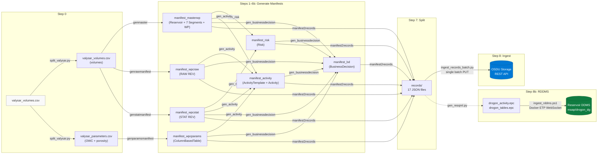

# Drogon - OSDU Data Model & Pipeline

## Overview

The Drogon use case demonstrates a complete **FMU-to-OSDU** pipeline for
static in-place reservoir volumes. Starting from a single FMU export CSV
(`valysar_volumes.csv`), the pipeline generates OSDU-compliant records
covering master data, work products, volume tables, input parameters,
activity provenance, risk assessment, and a decision gate - all linked
through typed references and ancestry.

The result is **17 records** in OSDU Storage that form a self-contained,
navigable data graph. Part of the model is also represented as
RESQML objects ingested into the **Reservoir DDMS** via ETP API or EPC file.
The data below are are available in the OSDU interop instance.

---

## Conceptual Data Model

```mermaid
graph TD
    subgraph "Master Data"
        RES["Reservoir<br/><i>Drogon</i>"]
        SEG1["ReservoirSegment<br/><i>West Lowland</i>"]
        SEG2["ReservoirSegment<br/><i>Central South</i>"]
        SEG3["ReservoirSegment<br/><i>Central North</i>"]
        SEG4["ReservoirSegment<br/><i>North Horst</i>"]
        SEG5["ReservoirSegment<br/><i>Central Ramp</i>"]
        SEG6["ReservoirSegment<br/><i>Central Horst</i>"]
        SEG7["ReservoirSegment<br/><i>East Lowland</i>"]
    end

    subgraph "Work Product Bundle"
        WP["WorkProduct<br/><i>Drogon Reservoir Study</i>"]
        RAW["REV - RAW<br/><i>per realisation</i>"]
        STAT["REV - Statistics<br/><i>P10 / P50 / P90</i>"]
        PARAMS["ColumnBasedTable<br/><i>Input Parameters</i>"]
    end

    subgraph "Activity Provenance"
        TMPL["ActivityTemplate<br/><i>Volumetrics Workflow Template</i>"]
        ACT["Activity<br/><i>DG1 Volumetrics Workflow Run</i>"]
    end

    subgraph "Decision Support"
        RISK["Risk<br/><i>Porosity &amp; Cementation</i>"]
        BD["BusinessDecision<br/><i>DG1 Concept Selection</i>"]
    end

    subgraph "Reference Data"
        REFTYPE["PropertyType<br/><i>AssociatedLiquid</i>"]
    end

    %% Ancestry: Reservoir → Segments
    RES -->|ancestry.child| SEG1
    RES -->|ancestry.child| SEG2
    RES -->|ancestry.child| SEG3
    RES -->|ancestry.child| SEG4
    RES -->|ancestry.child| SEG5
    RES -->|ancestry.child| SEG6
    RES -->|ancestry.child| SEG7

    %% WPC → WorkProduct
    RAW -->|ParentWorkProductID| WP
    STAT -->|ParentWorkProductID| WP
    PARAMS -->|ParentWorkProductID| WP

    %% WPC → Reservoir (ParentObjectID)
    RAW -->|ParentObjectID| RES
    STAT -->|ParentObjectID| RES
    PARAMS -->|ParentObjectID| RES

    %% Activity provenance chain
    ACT -->|ActivityTemplateID| TMPL
    ACT -->|Input: InputParameters| PARAMS
    ACT -->|Output: OutputParameters| PARAMS
    ACT -->|Output: OutputVolumes| RAW
    ACT -->|Output: ReportTable| STAT
    ACT -->|ancestry.parent| RES

    %% BusinessDecision → Activity, risk, reservoir
    BD -->|PriorActivityIDs| ACT
    BD -->|Parameter| RES
    BD -->|RiskID| RISK

    %% REV uses RefType
    RAW -.->|PropertyType| REFTYPE
    STAT -.->|PropertyType| REFTYPE

    %% Styling
    classDef master fill:#cfe2ff,stroke:#084298,color:#222
    classDef wpc fill:#d4edda,stroke:#155724,color:#222
    classDef wp fill:#fff3cd,stroke:#d39e00,color:#222
    classDef activity fill:#fde8d8,stroke:#c25d00,color:#222
    classDef risk fill:#f5c6cb,stroke:#721c24,color:#222
    classDef bd fill:#e2d9f3,stroke:#5a3e85,color:#222
    classDef ref fill:#e9ecef,stroke:#6c757d,color:#222

    class RES,SEG1,SEG2,SEG3,SEG4,SEG5,SEG6,SEG7 master
    class RAW,STAT,PARAMS wpc
    class WP wp
    class TMPL,ACT activity
    class RISK risk
    class BD bd
    class REFTYPE ref
```



### Record Inventory (17 records)

| # | Kind | Name | OSDU ID suffix |
|---|------|------|----------------|
| 0 | `reference-data--ReservoirEstimatedVolumePropertyType` | AssociatedLiquid | `AssociatedLiquid_` |
| 1 | `master-data--Reservoir` | Drogon | `Drogon` |
| 2–8 | `master-data--ReservoirSegment` | West Lowland, Central South/North, North Horst, Central Ramp/Horst, East Lowland | 7 UUIDs |
| 9 | `work-product` | Drogon Reservoir Study | `37dcb76b…` |
| 10 | `work-product-component--ReservoirEstimatedVolumes` | RAW (per realisation) | `68f57fdc…` |
| 11 | `work-product-component--ReservoirEstimatedVolumes` | Statistics (P10/P50/P90) | `0ed7364d…` |
| 12 | `work-product-component--ColumnBasedTable` | Input Parameters | `d8e4e9ba…` |
| 13 | `work-product-component--ActivityTemplate` | Volumetrics Workflow Template | `aa2791c8…` |
| 14 | `work-product-component--Activity` | DG1 Volumetrics Workflow Run | `ead6e342…` |
| 15 | `master-data--Risk` | Porosity & Cementation | `Drogon-PorosityAndCementation` |
| 16 | `master-data--BusinessDecision` | DG1 Concept Selection | `Drogon-DG1-Identify` |

### BusinessDecision enrichment (ext.equinor)

The Drogon BD manifest (`manifest_bd_drogon.json`) carries the following `ext.equinor` sections for rich UI rendering:

- **Authors / ReviewTeam** - names and roles
- **Alternatives** - 3 development concepts with rank, action (Pursue/Monitor/Reject)
- **DevelopmentConcept** - Subsea tieback, 4 production wells, 2 injectors, FPSO host
- **ReservoirProperties** - depth, temperature, pressure, porosity, permeability
- **KeyUncertainties** - reservoir connectivity, OWC depth, aquifer support (with impact ratings)
- **UncertaintySummary** - P10/P50/P90 STOIIP range, Monte Carlo method
- **Recommendations** - next-gate action items (generic, not DG-specific)
- **KeyEconomics** - placeholder (DG1 economics not yet finalised)

> **Note:** OSDU only persists 7 registered ext.equinor keys (see `demo/md/BusinessDecision.md` Appendix A). The remaining keys are restored at runtime by the local enrichment overlay in `app/main.py`.

---

## Relationship Patterns

### Ancestry (parent ↔ child)

Ancestry is stored in `data.ancestry` and expresses containment:

- **Reservoir** → 7 **ReservoirSegments** (`ancestry.children`)
- Each Segment → Reservoir (`ancestry.parents`)
- **Activity** → Reservoir (`ancestry.parents`); ColumnBasedTable + RAW REV + STAT REV (`ancestry.children`)

The OSDU indexer mirrors `data.ancestry.*` into the top-level `ancestry.*`
search index automatically.

### WorkProduct → WorkProductComponent

The three WPCs (RAW volumes, STAT volumes, parameters) share a common
**WorkProduct** container. Each WPC references:

- `ParentWorkProductID` → WorkProduct
- `ParentObjectID` → Reservoir (the master-data context)

### Activity Provenance

The `ActivityTemplate` declares all parameter slots for the workflow. The
`Activity` instance is the concrete execution record. It captures:

| Parameter | Role | Value |
|-----------|------|-------|
| `InputParameters` | Input (DataObject) | ColumnBasedTable WPC (`d8e4e9ba…`) |
| `Process` | Input (String) | `"RMS DecisionExample - Drogon"` |
| `NumberOfRealizations` | Input (Integer) | `3` |
| `Workflow` | Input (String) | `"DecisionExample"` |
| `Method` | Input (String) | `"User_Defined"` |
| `ReportTableName` | Input (String) | `"DecisionExample_report"` |
| `Variables` | Input (String) | JSON - 7 OWC contacts + 3 PHIT facies (Low/Base/High) |
| `DesignMatrix` | Input (String) | JSON - 3 realisations (Base / Low / High, all correlated) |
| `OutputParameters` | Output (DataObject) | ColumnBasedTable WPC (`d8e4e9ba…`) |
| `OutputVolumes` | Output (DataObject) | RAW REV WPC (`68f57fdc…`) |
| `ReportTable` | Output (DataObject) | STAT REV WPC (`0ed7364d…`) |

**Design rationale - one Activity, not three:**
One `ActivityTemplate` + one `Activity` is the correct OSDU pattern for an
atomic workflow execution. The three *logical* steps (generate parameters →
run simulation → aggregate statistics) belong in the activity *description*, not
in three separate Activity records. Three records would only be appropriate
if each step were independently re-runnable and separately provenance-tracked.

### BusinessDecision → Activity → Evidence

The BD record is the decision-support hub:

- `PriorActivityIDs` → **Activity** record (which in turn points to all evidence via its output parameters and `ancestry.children`)
- `Parameters[].DataObjectParameter` → each WPC + the Reservoir
- `RiskIDs` → Risk record(s)

Previously `PriorActivityIDs` pointed directly to the three WPCs. It now
points to the Activity, which is the correct OSDU intent - the BD cites *the
activity that produced the evidence*, not the evidence artefacts directly.

### Volume Table Structure

Both REV records and the ColumnBasedTable use the OSDU **ColumnBasedTable**
pattern (`data.Volumes` or `data.Table`):

```
KeyColumns:    [{ ColumnName, ColumnRole:"key", ValueType }]
Columns:       [{ ColumnName, ColumnRole:"value", ValueType, UnitOfMeasure }]
ColumnValues:  { "<ColumnName>": [v0, v1, …], … }
```

| WPC | Key Columns | Value Columns | Rows |
|-----|-------------|---------------|------|
| RAW REV | Realisation, Zone, SegmentID, Facies | BulkVolume, NetVolume, PoreVolume, HydrocarbonPoreVolume, … | 588 |
| STAT REV | Statistic, Zone, SegmentID, Facies | BulkVolume, NetVolume, PoreVolume, HydrocarbonPoreVolume, … | 588 |
| Parameters | Realisation, Zone, SegmentID, Facies | OWC_Depth (7 cols, m), Porosity (3 cols, Euc) | 84 |

---

## Pipeline Workflow



### Pipeline Steps

| Step | Script | Output |
|------|--------|--------|
| 0 | `split_valysar.py` | Split CSV → volumes + parameters |
| 1 | `genmaster_drogon.py` | Reservoir, 7 Segments, WorkProduct |
| 2 | `genrawmanifest_drogon.py` | RAW REV WPC |
| 3 | `genstatmanifest_drogon.py` | Statistical REV WPC |
| 4 | `genparamsmanifest_drogon.py` | ColumnBasedTable WPC |
| 5 | `gen_risk_drogon.py` | Risk manifest |
| 5b | `gen_activity_drogon.py` | ActivityTemplate + Activity |
| 6 | `gen_businessdecision_drogon.py` | BusinessDecision |
| 7 | `manifest2records_drogon.py` | `records/`  17 JSON files |
| 8 | `ingest_records_batch.py` | Batch PUT to OSDU Storage |
| 8b | `gen_resqml.py` + `ingest_rddms.sh` | RESQML EPC → RDDMS via ETP |

### Running the Pipeline

```bash
# Full pipeline (default)
bash demo/drogon_dg1/run_pipeline.sh

# Generate only, no ingestion
bash demo/drogon_dg1/run_pipeline.sh --skip-ingest

# Re-ingest single record (e.g. after editing BD)
python demo/drogon_dg1/ingest_records_batch.py --start 14 --delay 0

# RDDMS ingestion (requires Docker + open-etp-sslclient image)
bash demo/drogon_dg1/resqml/ingest_rddms.sh
bash demo/drogon_dg1/resqml/ingest_rddms.sh --skip-create   # reuse existing dataspace
```

---

## RESQML / Reservoir DDMS

Spatial objects and their semantics are represented as RESQML 2.0.1 objects ingested into the **Reservoir DDMS** via the ETP API protocol (ALternative: EPC+H5 file). The dataspace `maap/drogon_dg` holds the geomodel objects.

### ETP Ingestion

Ingestion uses the `open-etp-sslclient` Docker image to push EPC packages
into the Reservoir DDMS over ETP (Energistics Transfer Protocol):

```bash
# Create dataspace + ingest EPC
bash demo/drogon_dg1/resqml/ingest_rddms.sh

# Re-ingest into existing dataspace (skip create)
bash demo/drogon_dg1/resqml/ingest_rddms.sh --skip-create
```

The ETP channel handles authentication, dataspace creation, and object
upload in a single session. Objects are validated against the RESQML 2.0.1
schema on the server side.

### RESQML Objects

| Object Type | Count | Purpose |
|-------------|-------|---------|
| `obj_Grid2dRepresentation` | 3 | Tabular data: parameters, RAW volumes, STAT volumes |
| `StringTableLookup` | 3 | Column names and UoMs for the grid representations |
| `obj_ActivityTemplate` | 1 | Workflow definition (mirrors OSDU ActivityTemplate) |
| `obj_Activity` | 1 | Execution record (mirrors OSDU Activity) |

The RESQML Activity parameters mirror the OSDU record, with data-object
references pointing to the `Grid2dRepresentation` UUIDs:

| Parameter | RESQML type | Value / UUID |
|-----------|-------------|--------------|
| `InputParameters` | `DataObjectParameter` | params Grid2d (`38458cd4…`) |
| `Process` | `StringParameter` | `"DecisionExample - Drogon"` |
| `NumberOfRealizations` | `IntegerQuantityParameter` | `3` |
| `OutputVolumes` | `DataObjectParameter` | RAW volumes Grid2d (`d0f6d781…`) |
| `ReportTable` | `DataObjectParameter` | STAT volumes Grid2d (`fde25126…`) |

### UUID Alignment

The RESQML UUIDs (`b727ee57…` template, `aea6e528…` activity) and the OSDU
WPC IDs (`aa2791c8…` template, `ead6e342…` activity) are generated from the
same namespace seeds  ensuring cross-system traceability between OSDU Storage
and Reservoir DDMS.

> **Reference:** The source EPC files are maintained in the
> [OSDU data-definitions GitLab](https://community.opengroup.org/osdu/data/data-definitions)
> examples for reproducibility.

---

## OSDU Design Decisions

| Decision | Rationale |
|----------|-----------|
| **Ancestry in `data.ancestry`** | Top-level `ancestry` requires numeric timestamp versions. The indexer mirrors `data.ancestry` → `ancestry.*` automatically. |
| **Single batch PUT** | OSDU Storage accepts up to 500 records per PUT. Auto-falls back to sequential on failure. |
| **Two REV WPCs** (raw + stats) | Separates per-realisation detail from P10/P50/P90 summary. Same WorkProduct + Reservoir context. |
| **ColumnBasedTable for params** | OWC/porosity per segment/facies/realisation fits the key/value column schema with UoM. |
| **One Activity, not three** | One template + one activity per atomic workflow. Three logical steps belong in the description. |
| **BD → Activity** | BD cites the activity that produced evidence, not the artefacts directly. |
| **`ReportTableName`** | Renamed from `ReportTable` to avoid collision with the output DataObject of the same name. |
| **Human-readable IDs** | Singletons (Risk, BD) use descriptive IDs; multi-instance records use UUIDs. |
| **Dual ingestion** | REST API for searchable metadata; Reservoir DDMS for RESQML objects via ETP. |

---

## Explorer UI

The Record Explorer (`/strat`) provides:

- **Type dropdown** - prepopulated with all Drogon record types
- **Mermaid relationship graph** - ancestry + data references, colored by type, using Names
- **Metadata cards** - grouped into Identity, Details, References, Extensions
- **Table viewer** - renders both `Volumes` and `Table` ColumnBasedTable data with key highlighting and UoM
- **Clickable links** - OSDU ID references navigate to the linked record

---

## Web UI Alternative (Script-Free)

The ORES [/add-dg](/add-dg) web UI can create a complete BusinessDecision record interactively - equivalent to what `gen_businessdecision_drogon.py` produces:

| Step | UI Panel | Script equivalent |
|------|----------|-------------------|
| Pick project type & gate | **Project Preset** → "Field Dev – DG1" | `gen_businessdecision_drogon.py` (`DecisionLevelID`) |
| Set milestones & dates | **Schedule / Milestones** → FieldDevelopment template | `ActivityStates[]` array |
| Add alternatives | **Alternatives** panel → 3 concepts | `ext.equinor.Alternatives[]` |
| Add economics | **Economics** panel → NPV, IRR, CAPEX | `data.ProjectSpecifications[]` |
| Link evidence | **Linked Records** → REV, ColumnBasedTable, Activity IDs | `data.Parameters[]` |
| Add risks | **Risks** panel → Risk record IDs | `data.RiskIDs[]` |
| Submit | **Preview** → Ingest | `ingest_records_batch.py` |

The UI also supports creating **ActivityTemplate** and **Activity** records (Activity tab) with the "Reservoir Simulation" preset matching the Drogon template schema exactly.

**When to use which:**
- **Scripts** (`run_pipeline.sh`): reproducible, version-controlled, full pipeline including REV/CBT/RDDMS
- **Web UI** (`/add-dg`): one-off demos, exploring BD structure, rapid prototyping without Python setup

---

## Demo Walkthrough  Field Development Features

The Drogon dataset now includes **13 RDDMS catalog records** (IjkGrid, WellboreFrame, Trajectory, Fault, StructuralOrganization, GridConnectionSet, OrganizationFeature, WellboreMarkerFrame) enabling end-to-end field development demos.

### Guided demo flow

| Step | Where | What to show |
|------|-------|--------------|
| 1. Browse subsurface objects | `/keys` → Easy Mode → Browse → IjkGrid | Shows all grids in `maap/drogon` with type badges |
| 2. Filter by property | `/keys` → Easy Mode → Deep Search → PORO > 0.25 | Single-property filtering with statistics and match fraction |
| 3. Compound filter | `/keys` → **Bypassed Oil** button | Multi-property AND (PORO + PERM + Sw) → sweet-spot cell fraction |
| 4. Field dev presets | `/keys` → **Water Breakthrough** or **Segment Overview** | Multi-alias sub-queries with explanation banners |
| 5. Graph traversal | `/keys` → Relations → pick a grid UUID | Forward/reverse RESQML links (grid → CRS, properties → grid) |
| 6. Federated search | `/keys` → Easy Mode → Federated → "Drogon" | OSDU catalog + RDDMS combined results |
| 7. Decision gate | `/search` → search "Drogon DG1" | BD card with provenance DAG, alternatives, gate checklist |
| 8. Cross-gate analysis | `/analyse` → select Drogon gates | Volume deltas, risk evolution timeline, economics comparison |

### Key talking points

- **Compound filter** answers "where is the sweet spot?"  not just single-property screening
- **Multi-alias presets** combine 3–4 sub-queries into one assessment (water breakthrough = high-Sw zones + high-perm streaks + production anomaly)
- **Subsurface ↔ decision link**: the BD record's `Parameters[]` reference the Activity that produced the geomodel; the same geomodel objects are queryable via compound filter
- **No code needed**: Easy Mode field dev buttons run production GraphQL presets behind the scenes
