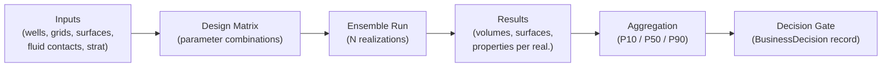
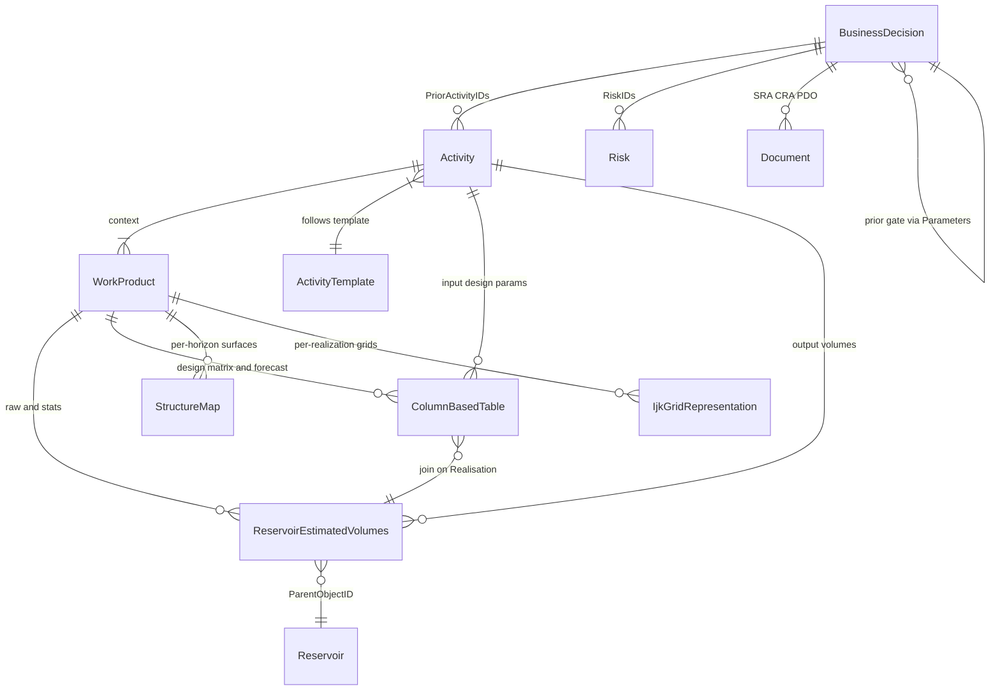
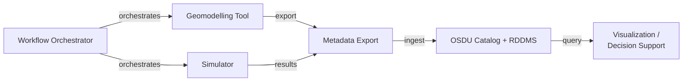

# Ensemble Simulation - OSDU Data Model & Workflow

> How ensemble-based uncertainty workflows (seismic-to-simulation) map to OSDU - from input provisioning through hundreds of realizations to decision-gate evidence.

**Related**: [BusinessDecision](/howto/business-decision) · [Volumes](/howto/volumes) · [Uncertainty](/howto/uncertainty) · [Risk](/howto/risk) · [SeisInt](/howto/seismic-interp) · [StratColumn](/howto/strat-column)

---

## 1. The Ensemble Workflow

An ensemble simulation workflow runs many realizations of a reservoir model, varying uncertain parameters (contacts, porosity, permeability, relative permeability) to produce a probability distribution of outcomes (volumes, production forecasts, recovery factors).

Typical questions:

- What is the P50 in-place volume for my reservoir?
- How does structural uncertainty propagate to recovery?
- What evidence supports the decision at this gate?
- Which input parameters dominate the outcome spread?

---

## 2. Where Data Lives

| Store | What | Examples |
|-------|------|---------|
| **OSDU Catalog** | WPC records for all inputs and outputs | Grids, surfaces, volumes, design matrices, activities |
| **RDDMS** | Array data for grids, surfaces, properties | IjkGrid geometry + PORO/PERMX/SW arrays |
| **SDMS** | Seismic cubes consumed as input | Amplitude, impedance |
| **Workflow orchestrator** | Case/ensemble/realization bookkeeping | External to OSDU - syncs results in |

The orchestrator (ERT, commercial tools, or custom scripts) runs the simulations and exports results. OSDU serves as the persistent System of Record - structured, governed, version-controlled.

---

## 3. Mapping Ensemble Concepts to OSDU

| Ensemble concept | OSDU type | Role |
|---|---|---|
| Case (versioned model package) | **WorkProduct** or **Dataspace** | Package boundary + version control |
| Ensemble (one iteration of N realizations) | **WorkProduct** or **PersistedCollection** | Groups all WPCs for one ensemble run |
| Realization (single model instance) | Key column in `ColumnBasedTable` | Realization index as row key |
| In-place volumes | `ReservoirEstimatedVolumes` WPC | Raw per-realization and aggregated statistics |
| Depth/time surfaces | `StructureMap` / `GenericRepresentation` WPC | Per-horizon surfaces |
| Grid model | `IjkGridRepresentation` WPC | Static grid geometry |
| Grid properties | Grid Property WPC | PORO, PERMX, SW, NTG, facies |
| Design matrix (parameters) | `ColumnBasedTable` WPC | Keys: CaseID, Realisation, Seed, uncertain params |
| Production forecast | `ColumnBasedTable` WPC | Time-series rates per realization |
| Polygons (faults, outlines) | `GenericRepresentation` WPC | Geometry WPCs |
| Workflow provenance | `Activity` / `ActivityTemplate` | Links inputs to outputs with parameter roles |
| Aggregated statistics | `ReservoirEstimatedVolumes` with FacetIDs | P10/P50/P90/Mean via `FacetType:statistics` |
| Decision record | `BusinessDecision` | Per-gate evidence hub |

---

## 4. Decision-Gate Alignment

Ensemble simulation aligns naturally with decision gates. Each gate demands progressively more evidence:

| Gate | Scope | Key OSDU artifacts |
|---|---|---|
| **DG1** | Screening: few realizations, simple design | Reservoir, Segments, REV, input params CBT, Risks, Activity, BD |
| **DG2** | Full ensemble (50-250 realizations) | + IjkGrid, StructureMaps, GeoLabelSet, production forecast |
| **DG3** | Dynamic simulation, history matching | + WellboreTrajectory, ProductionValues, match metrics |
| **DG4** | Full-field optimization (100-1000+ realizations) | + updated forecasts, revised uncertainties |

The `BusinessDecision` record uses `Parameters[]` with `ParameterRole = input|output|context` to link all gate evidence. Cross-gate evolution: BD at DG(n+1) references BD at DG(n) as context parameter.

---

## 5. Data Relationships

Key patterns:
1. **WorkProduct per ensemble** - groups all WPCs for one iteration
2. **Realisation as key column** - avoids record explosion for many realizations
3. **Activity as workflow record** - links design matrix to inputs to output WPCs
4. **BusinessDecision as gate record** - links Activities, Risks, Documents, and evidence
5. **Cross-gate evolution** - each gate references the prior gate

---

## 6. Data Flow

---

## 7. Ground Rules

- **One identity per artifact** - each grid, property, surface, and table has a stable UUID/SRN and version
- **Lossless provenance** - every output carries ancestry back to exact input WPCs and workflow run
- **CRS and units are first-class** - CRS definition, axis order, rotation, and UOM travel with the data
- **Round-trip fidelity** - data exported from simulators can be fully recovered from OSDU
- **Gate alignment** - the OSDU data model supports decision-gate lifecycle natively

---

## 8. Deck Round-Trip (Simulator Input/Output)

A sidecar manifest accompanies every simulator deck export:

- **Identity**: deck_id, case, realization
- **Grid**: grid_uuid, osdu_srn, dims, crs
- **Properties[]**: property_uuid, title, simulator_keyword, uom, discrete
- **Ancestry Inputs**: list of input WPC IDs

Round-trip rules:
1. **Grid Lock** - grid_uuid persists unless topology changes
2. **Property Lock** - each property retains uuid and simulator keyword
3. **CRS/UOM Lock** - manifest includes CRS type, origin, axis order, UOM
4. **Ancestry Chain** - outputs set `data.ancestry.inputs` to exact input WPC IDs

---

## 9. Terminology

| Term | Meaning |
|------|---------|
| Ensemble | A set of N realizations exploring parameter uncertainty |
| Realization | One specific combination of uncertain parameters, producing one model instance |
| Design matrix | Table of parameter values per realization (seeds, contacts, multipliers) |
| Gate (DG) | Decision Gate - a milestone requiring evidence to proceed |
| REV | ReservoirEstimatedVolumes - the OSDU WPC for volumetric results |
| CBT | ColumnBasedTable - generic tabular WPC (design matrix, forecasts) |
| Activity | OSDU provenance record linking inputs to outputs |
| BusinessDecision | OSDU decision record linking evidence to a gate |

---

## 10. References

| Topic | Link |
|---|---|
| REV schema | [OSDU Data Definitions](https://community.opengroup.org/osdu/data/data-definitions) |
| Activity semantics | [AbstractProjectActivity](https://community.opengroup.org/osdu/data/data-definitions) |
| Volume guide | [Volumes](/howto/volumes) |
| Uncertainty guide | [Uncertainty](/howto/uncertainty) |
| BusinessDecision | [BusinessDecision](/howto/business-decision) |

---

## Appendix A: Standard Results Mapping

Typical ensemble workflow outputs and their OSDU representations:

| Standard result | Export format | OSDU record type |
|---|---|---|
| In-place volumes | Parquet / CSV | `ReservoirEstimatedVolumes` |
| Structure depth surfaces | Grid format (.gri, .irap) | `StructureMap` WPC |
| Structure time surfaces | Grid format | `StructureMap` / `GenericRepresentation` |
| Static grid model | ROFF / RESQML | `IjkGridRepresentation` + property WPCs |
| Simulator tables (relperm, PVT) | CSV / Arrow | `ColumnBasedTable` WPC |
| Polygons (faults, outlines) | XYZ / GeoJSON | `GenericRepresentation` WPC |
| Production forecasts | CSV / Arrow | `ColumnBasedTable` WPC |

> See [Volumes](/howto/volumes) for the full column mapping table (BULK to Bulk, STOIIP to Oil, etc.) and JSON examples for both raw-realisation and aggregated-statistics REV records.

---

## Appendix B: OSDU Types Used

| OSDU type | Role in ensemble context |
|---|---|
| **WorkProduct** | Versioned case/ensemble package |
| **WPC** | Atomic datasets: grids, properties, surfaces, tables, volumes |
| **PersistedCollection** | Evidence package for a gate |
| **Activity / ActivityTemplate** | Workflow provenance with Parameters[] |
| **BusinessDecision** | Decision gate record |
| **Reservoir / ReservoirSegment** | Master-data anchors for volumes scoping |
| **GeoLabelSet** | Headline KPI labels for dashboards |
