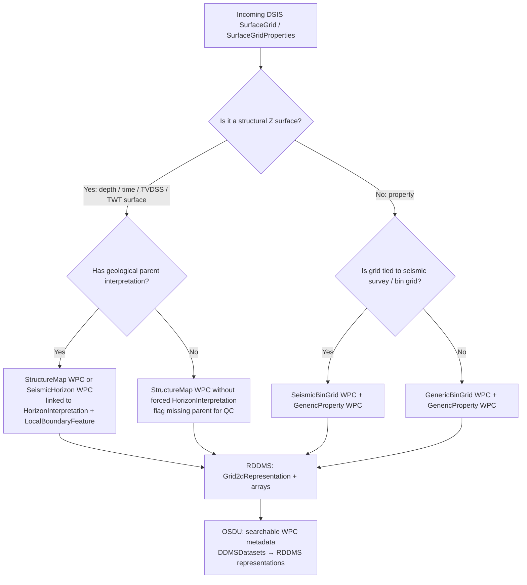
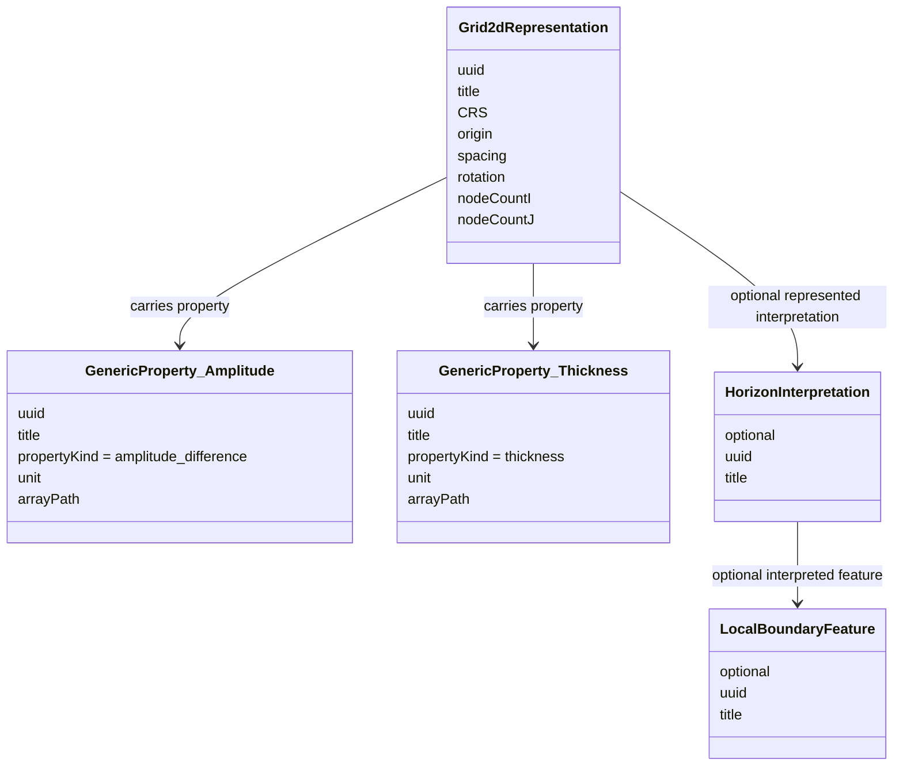
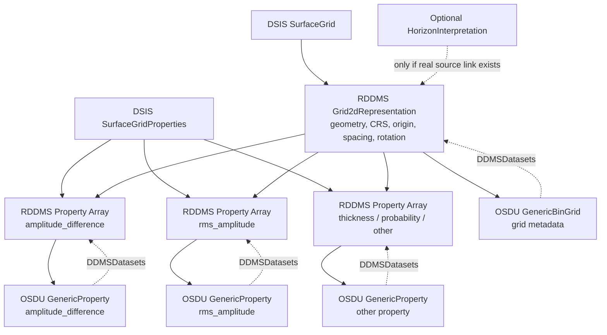
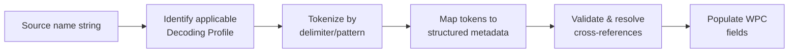

# Mapping OpenWorks Surface Grids to RDDMS & OSDU

This guide covers how to map OpenWorks / DSIS surface grids into RESQML (RDDMS) and OSDU WKS records - including when to create the full Feature–Interpretation–Representation (FIRP) hierarchy and when to skip it.

---

## 1. The Core Question

OpenWorks exposes grids through `SurfaceGrid` / `SurfaceGridProperties` (via DSIS Common Model). Many of these are **not** geological structure maps - they may be amplitude, thickness, probability, coherence, or other attribute maps on a 2D lattice.

The key principle:

> Store the **grid geometry** once in RDDMS. Store **property arrays** linked to that grid. In OSDU, distinguish between structural maps and generic grid-linked properties. **Do not fabricate geological hierarchy that doesn't exist in the source.**

> **Terminology:**
>
> | Common / source term | OSDU/RESQML precise term | What it actually is |
> |---|---|---|
> | "attribute map" | **property** | In OSDU, "attribute" means graphical display (color, line style). Use **property** for data values. |
> | "map" (informal) | **Grid2dRepresentation** or **PointSetRepresentation** | The RESQML geometry that holds the 2D grid or scattered points in RDDMS. |
> | "structure map" (informal) | **`StructureMap`** (OSDU WPC) | An OSDU catalog record (Work Product Component) that references a RDDMS representation via `DDMSDatasets`. It is *not* the grid itself. |
> | "seismic horizon" (informal) | **`SeismicHorizon`** (OSDU WPC) | Same pattern — catalog record pointing to a time-domain grid representation. |
> | "generic map" (informal) | **`GenericBinGrid`** + **`GenericProperty`** (OSDU WPCs) | Catalog records for non-structural grids and their property arrays. |
>
> This document uses:
> - **"map"** only when referring to the source data as people know it (e.g. "attribute map from OpenWorks").
> - **WPC** (`StructureMap`, `GenericBinGrid`, `GenericProperty`, `SeismicHorizon`) for OSDU catalog records.
> - **Representation** (`Grid2dRepresentation`, `PointSetRepresentation`) for the RDDMS/RESQML geometry that stores the actual grid or point data.

---

## 2. When to Create FIRP - and When Not To

### When FIRP adds genuine value

The Feature → Interpretation → Representation hierarchy matters when the source data has **real reuse or divergence**:

| Scenario | Why FIRP helps |
|----------|---------------|
| Same horizon (e.g. BCU), multiple representations (depth map, TWT map, control points, fault sticks) | One `HorizonInterpretation` → many representations. Change the interpretation name/age once, all surfaces inherit it. |
| Same feature, competing interpretations (optimistic vs conservative fault throw) | One `LocalBoundaryFeature` → two `FaultInterpretation` objects → different geometry sets. |
| Stratigraphy linkage | `HorizonInterpretation` carries `FeatureID` → `LocalBoundaryFeature` which participates in a `StratigraphicColumn`. Without it, surfaces are disconnected from the strat framework. |
| Graph-based search | "Show me all representations linked to the BCU" is a one-hop query if the Feature exists. Without it, you are doing string matching on names. |
| Impact analysis | "Which surfaces are affected if we revise the Top Draupne interpretation?" - only answerable if the interpretation node exists as a shared parent. |

### When FIRP is overhead

For bulk OpenWorks grids where:

- each grid is a standalone attribute map (amplitude, thickness, probability);
- there is no parent horizon in the source system;
- reuse across multiple representations will never happen;

…then **don't fabricate FIRP**. The correct mapping is:

```text
Grid2dRepresentation (geometry) → GenericBinGrid (OSDU catalog)
Property arrays              → GenericProperty (OSDU catalog)
```

No `HorizonInterpretation`, no `LocalBoundaryFeature`.

### The "empty interpretation" anti-pattern

Many existing ingestions (e.g. LMK) create Interpretation/Feature objects that are effectively empty shells with just a name copied from the representation. That is a **bad implementation of FIRP**, not a vindication of the pattern. The value comes when:

1. The interpretation carries semantic fields (`DomainTypeID`, age, conformability, sequence-strat surface type).
2. Multiple representations actually link to the same interpretation (real reuse).
3. The feature participates in a `StratigraphicColumn`.

If none of those conditions are true - and won't become true - skip the objects. The FIRP pattern is a *domain ontology*, not a bureaucratic filing requirement.

---

## 3. Decision Tree



### Classification criteria

**Structural surface** - at least one of:
- attribute is explicitly Z, depth, TVDSS, TWT, time, or structure
- unit is depth or time
- linked to `HorizonInterpretation` or seismic horizon
- values are consistent with regional depth/time
- OpenWorks relationship indicates geological surface

**Property map** (source: "attribute map") - one or more of:
- property name is amplitude, RMS amplitude, coherence, probability, thickness, etc.
- unit is not depth/time
- no `HorizonInterpretation` parent exists
- values are not plausible depth/time values

**Ambiguous** - metadata conflicts (e.g. TVDSS domain but amplitude-like name/values):
- map conservatively as `GenericProperty`
- set domain to `mixed` or unresolved
- flag QC warning — do not create `StructureMap` WPC without confirmation

---

## 4. Target Patterns

### 4.1 Property on a generic grid (preferred for most OW "attribute" grids)

```text
GenericBinGrid (WPC)
  DDMSDatasets[] → Grid2dRepresentation (RDDMS geometry)

GenericProperty (WPC, one per property)
  TargetRepresentation → GenericBinGrid
  PropertyKind → amplitude_difference / rms_amplitude / thickness / probability
  Unit → source unit
  DDMSDatasets[] → ContinuousProperty / DiscreteProperty (RDDMS array)
```

RDDMS stores: `Grid2dRepresentation` (geometry, CRS, origin, spacing, rotation) + property arrays + property-to-grid relationships.

### 4.2 Structural depth surface

Use `StructureMap` WPC only for genuine structural Z values.

```text
LocalBoundaryFeature           ← only if geologic identity exists
  → HorizonInterpretation      ← only if source provides it
    → StructureMap (WPC)
        DDMSDatasets[] → Grid2dRepresentation with Z array (RDDMS)
```

### 4.3 Structural time surface / seismic horizon

```text
HorizonInterpretation
  → SeismicHorizon (WPC)
      DDMSDatasets[] → Grid2dRepresentation with TWT array (RDDMS)
```

Optional depth-converted product:

```text
SeismicHorizon (WPC) → StructureMap (WPC)
    DDMSDatasets[] → Grid2dRepresentation with depth Z array (RDDMS)
```

### 4.4 Seismic-derived property (tied to seismic bin grid)

```text
SeismicBinGrid (WPC)
  → GenericProperty (WPC)
       PropertyKind → seismic_amplitude / seismic_timeshift / …
       Unit → source unit
       DDMSDatasets[] → ContinuousProperty on Grid2dRepresentation (RDDMS)
```

### Summary table

| Case | RDDMS content | OSDU WKS records | FIRP objects |
|---|---|---|---|
| Arbitrary property (OW "attribute map") | `Grid2dRepresentation` + property arrays | `GenericBinGrid` + `GenericProperty` WPCs | None |
| Multiple properties on same grid | One `Grid2dRepresentation` + many properties | `GenericBinGrid` + many `GenericProperty` WPCs | None |
| Seismic-derived property (OW "seismic attribute") | `Grid2dRepresentation` + property | `SeismicBinGrid` + `GenericProperty` WPCs | None |
| Structural depth surface, known horizon | `Grid2dRepresentation` with Z array | `StructureMap` WPC | `HorizonInterpretation` + `LocalBoundaryFeature` |
| Structural depth surface, no parent | `Grid2dRepresentation` with Z array | `StructureMap` WPC | None (flag for QC) |
| Property on a known horizon | `Grid2dRepresentation` + property | `GenericProperty` WPC linked to grid | `HorizonInterpretation` only if source link exists |

---

## 5. RDDMS Storage Model





### Key rule

The property array should not be stored as the structural Z geometry unless it really is structural Z.

- **Amplitude-difference (source: "attribute map")**: `Grid2dRepresentation` = XY lattice; `ContinuousProperty` = amplitude_difference values; `GenericProperty` WPC captures semantics.
- **TVDSS structural surface**: `Grid2dRepresentation` = XY lattice with Z array = TVDSS depth values; domain = depth; WPC = `StructureMap`.

---

## 6. Domain Mapping: Time, Depth, Mixed

Two separate concepts:

1. **Representation geometry domain** - is the surface time, depth, or mixed?
2. **Property value semantics** - what do the array values represent (amplitude, thickness, probability, depth, time)?

If a grid is labelled TVDSS in OpenWorks but the name/values indicate RMS amplitude difference, do **not** create a `StructureMap` WPC. Create a `GenericProperty` WPC with amplitude semantics and flag the conflict.

### Precedence order for classification

1. **Explicit source metadata** - OW property type, DSIS property metadata, unit, CRS/vertical domain
2. **Relationship context** - linked `HorizonInterpretation`, seismic horizon, bin grid
3. **Value semantics** - depth-like range, time-like range, property categories
4. **Name and remark** - use as weak classifier only, not sole authority
5. **Fallback** - create `GenericProperty` WPC, set domain to mixed, flag for QC

---

## 7. Linking Properties to Horizons

Only link a `GenericProperty` to `HorizonInterpretation` when:

- OpenWorks has a parent horizon relationship;
- the map is explicitly a property extracted along a named horizon;
- the source workflow records the interpretation relationship.

Do **not** link when:

- the map is a standalone surface-grid property;
- the parent horizon is missing;
- the relationship would be inferred only from name similarity.

Instead, use provenance: `Activity` records, source project alias, or collection membership.

---

## 8. Worked Example

### Source observation

> The source object has a TVDSS domain in OpenWorks, but the name and remark suggest it is an RMS amplitude difference map. It ended up in RDDMS with domain `mixed`.

### If the values are amplitude difference

```text
RDDMS:   Grid2dRepresentation (XY lattice) + ContinuousProperty (amplitude values)
OSDU:    GenericBinGrid WPC + GenericProperty WPC (kind=amplitude_difference)
Domain:  mixed (fallback)
FIRP:    None
QC flag: source domain says TVDSS but property appears non-depth
```

### If the values are actually TVDSS depth

```text
RDDMS:   Grid2dRepresentation with depth Z values
OSDU:    StructureMap WPC + HorizonInterpretation (if available)
Domain:  depth
FIRP:    Yes, if geologic identity is known
```

---

## 9. Round-Trip Fidelity

RDDMS preserves RESQML Citation metadata in OSDU `ExtensionProperties`:

| RESQML field | OSDU ExtensionProperties key | Scope |
|---|---|---|
| `Citation.Format` | `AuthoringSoftware` | All WPCs (base class) |
| `Citation.Originator` | `Interpreter` | StructureMap, SeismicHorizon |

RDDMS manifest export includes `*Property` objects by default (`DEFAULT_DATASPACE_TYPE_PATTERNS`), so `GenericProperty` / `ContinuousProperty` records on grids appear in manifests alongside their parent representations.

---

## 10. Vendor Clarifications Needed

| # | Question |
|---|---|
| 1 | Which DSIS/OW fields determine structural vs property map? |
| 2 | Which field determines RESQML domain (`time`/`depth`/`mixed`)? |
| 3 | Is `mixed` assigned due to conflicting metadata, non-depth values, or missing interpretation? |
| 4 | Are name/remark, units, and value ranges used in classification? |
| 5 | Are parent horizon links inspected? |
| 6 | Can the mapper emit QC warnings for conflicting metadata? |
| 7 | Can the mapper produce `GenericProperty` rather than `StructureMap` for property maps? |
| 8 | Can multiple properties share one grid representation in RDDMS? |

---

## 11. Name-to-Metadata Decoding

Property maps often carry structured metadata encoded in their names via naming conventions. Rather than storing names as opaque strings, we define **decoding profiles** that extract structured metadata from names at ingestion time.

### 11.1 The Generic Pattern



A **Decoding Profile** defines:

| Component | Purpose |
|---|---|
| **ProfileType** | Which category (seismic property, thickness, velocity, probability, …) |
| **MetadataVersion** | Version of the naming standard (conventions evolve) |
| **TokenPattern** | How to split the name (delimiter, positional, regex) |
| **TokenMapping** | Per-token: target field + abbreviation lookup table |
| **ValidationRules** | Cross-field consistency checks |
| **OriginalSource** | Authoring system that produced the name |

### 11.2 Decoding Precedence

Name-decoded metadata is **secondary** to explicit source-system metadata:

| Priority | Source |
|---|---|
| 1 (highest) | Explicit source-system fields (DSIS property type, OW metadata) |
| 2 | Decoded from naming standard |
| 3 | User override at ingestion time |
| 4 (lowest) | Inferred from values/context |

If decoded metadata conflicts with explicit source → flag QC warning, prefer explicit.

> This aligns with Section 6 precedence: name-decoding sits at level 4 ("Name and remark") in the classification hierarchy.

### 11.3 Common Decoded Fields

Every property, regardless of type, shares these fields:

| Field | Description | Example |
|---|---|---|
| `MapType` | Dimensionality or workflow category | 3D, 4D, Isopach, Probability |
| `FieldAbbreviation` | Short code for field/area → resolved to `Field_id` | JS → Johan Sverdrup |
| `ExtractionMethod` | Statistical/extraction method | Max, RMS, P50, Value |
| `WindowMode` | Vertical extraction window | BetweenHorizons, AroundHorizon, Fixed |
| `HorizonNames` | Reference horizons used | → resolved to `HorizonInterpretation` IDs |
| `OriginalSource` | Authoring application | Auto4D, Petrel, OpenWorks |

### 11.4 Profile Examples

Each profile type has its own token pattern. Brief examples:

| Profile | Example name | Key decoded fields |
|---|---|---|
| **Seismic property** | `4D_JS_FulRes_21sp-20au_DiffTS_0535_maxp` | MapType=4D, Field=JS, Coverage=Full, Difference=Timeshifted, Extraction=MaxPositive |
| **Thickness** | `Iso_JS_TopDraupne_BaseDraupne_TVT` | MapType=Isopach, Horizons=[TopDraupne, BaseDraupne], ThicknessType=TVT |
| **Velocity** | `Vint_JS_TopAasgard_Z22_kr2024` | VelocityType=Interval, Horizons=[TopAasgard, Z22], ModelVersion=kr2024 |
| **Probability** | `Prob_JS_HC_P50_TopTarbert` | MapType=Probability, PropertyKind=HC, Extraction=P50 |
| **Depth conversion residual** | `DcRes_JS_TopVolve_v3` | MapType=DepthConversionResidual, Horizon=TopVolve, ModelVersion=v3 |

Full token-by-token breakdowns for each profile are in the appendices.

### 11.5 Mapping Decoded Metadata to OSDU WPCs

| Decoded field | OSDU target | Notes |
|---|---|---|
| `FieldAbbreviation` | `Field_id` | Resolved via reference data lookup — not stored as abbreviation |
| `HorizonNames` | Horizon IDs or `ExtensionProperties` | Lookup against OSDU catalog; store raw names if unresolved |
| `MapType` | `ExtensionProperties.MapType` | — |
| `ExtractionMethod` | `ExtensionProperties.ExtractionMethod` | Informs `PropertyKind` |
| `WindowMode` | `ExtensionProperties.WindowMode` | — |
| `OriginalSource` | `ExtensionProperties.AuthoringSoftware` | — |
| Seismic volume refs | `SeismicTraceData` WPC IDs | Resolved during ingestion (catalog lookup) |
| Bin grid ref | `SeismicBinGrid` WPC ID | Resolved during ingestion |

### 11.6 Integration with Classification (Section 3)

Name decoding feeds into the decision tree:

- Decoded `MapType` = velocity/thickness/probability/residual → **property** path (`GenericProperty` WPC, no FIRP)
- Decoded fields indicate structural Z → **structural** path (`StructureMap` WPC)
- Decoded `HorizonNames` that resolve to existing records → link (don't fabricate)
- Decoded `ExtractionMethod` → determines `PropertyKind`

### 11.7 Registering New Profiles

When a new naming convention is encountered:

1. Collect ≥5 representative names
2. Identify token pattern (delimiter, positions, optional segments)
3. Build abbreviation → value lookup tables
4. Define validation rules and conditional fields
5. Map decoded fields to OSDU WPC target fields
6. Assign a `MetadataVersion` (start at 0.1.0)
7. Add full profile to the appendices

---

## Quick Reference

| Source data has… | Create FIRP? | Target WPCs |
|---|---|---|
| Explicit horizon/fault identity in OW | Yes | `StructureMap` → `HorizonInterpretation` → `LocalBoundaryFeature` |
| Multiple surfaces sharing one geologic horizon | Yes - reuse the Interpretation | Shared `HorizonInterpretation`, multiple `Grid2dRepresentation`s |
| Standalone property (no parent horizon) | **No** | `GenericBinGrid` + `GenericProperty` WPCs |
| Structural Z surface with known geologic name | Yes | Full FIRP chain |
| Ambiguous metadata | **No** — store conservatively | `GenericProperty` WPC + QC flag |
| Name-decoded metadata, no explicit source link | **No** | Decoded fields → `ExtensionProperties` + `GenericProperty` WPC |

---

## Appendix A: Seismic Property Decoding Profile (Full)

Complete token-by-token breakdown for seismic-derived properties (commonly called "seismic attribute maps" in source systems).

**MetadataVersion**: 0.4.0  
**OriginalSource**: Auto4D / OpenWorks / Petrel

### A.1 Token Pattern

Example: `4D_JS_FulRes_21sp-20au_DiffTS_0535_maxp`

| Position | Token | Decoded value | Target field |
|---|---|---|---|
| 1 | `4D` | 4D | `MapType` (3D / 4D) |
| 2 | `JS` | Johan Sverdrup | `FieldAbbreviation` → `Field_id` |
| 3 | `FulRes` | Full resolution | `SeismicCoverage` = Full |
| 4 | `21sp-20au` | Survey vintages | `OriginalSeismicVolumeA` / `B` (via lookup) |
| 5 | `DiffTS` | Timeshifted difference of Amplitude | `SeismicDifference` + `SeismicTraceContent` |
| 6 | `0535` | Angle/frequency stack | Stack identifier |
| 7 | `maxp` | Max Positive | `ExtractionMethod` |

### A.2 Seismic-Specific Fields

| Field | Options | Conditional |
|---|---|---|
| `SeismicTraceContent` | Amplitude / Quadrature / Relative Acoustic Impedance / Timeshift / Timestrain / Extended Elastic Inversion / … | — |
| `SeismicDifference` | Value / Raw difference / Timeshifted difference | Only if `MapType=4D` |
| `SeismicCoverage` | Full / Masked / Padded | — |
| `DifferenceType` | Attribute of difference / Difference of attribute | Only if `MapType=4D` |
| `SamplingMethod` | Trilinear / Nearest | — |
| `HorizonOffsets` | e.g. `[-10, 10]` | Depends on `WindowMode` |

### A.3 ExtractionMethod Vocabulary

| Abbreviation | Decoded |
|---|---|
| `maxp` | MaxPositive |
| `maxn` | MaxNegative |
| `maxa` | MaxAbsolute |
| `rms` | RMS |
| `mean` | Mean |
| `var` | Variance |
| `sump` | SumPositive |
| `sumn` | SumNegative |
| `suma` | SumAbsolute |
| `val` | Value (single-sample) |

### A.4 WindowMode Interpretation

| WindowMode | HorizonNames | HorizonOffsets |
|---|---|---|
| `BetweenHorizons` | List of 2 horizon names | Offset per horizon |
| `AroundHorizon` | 1 horizon name | 2 offsets (above/below) |
| `Fixed` | 2 constant time/depth values | — |

### A.5 Seismic Difference Token Decoding

| Token fragment | `SeismicTraceContent` | `SeismicDifference` |
|---|---|---|
| `DiffTS` | Amplitude | Timeshifted difference |
| `DiffRaw` | Amplitude | Raw difference |
| `TS` | Timeshift | Value |
| `TSn` | Timestrain | Value |
| `Quad` | Quadrature | (per MapType) |
| `RAI` | Relative Acoustic Impedance | (per MapType) |

### A.6 Full Metadata Record (example)

For `4D_JS_FulRes_21sp-20au_DiffTS_0535_maxp`:

```yaml
MetadataVersion: "0.4.0"
OriginalSource: Auto4D
MapType: 4D
FieldAbbreviation: JS  # → resolved to Field_id
SeismicCoverage: Full
SeismicTraceContent: Amplitude
SeismicDifference: Timeshifted difference
DifferenceType: AttributeOfDifference
ExtractionMethod: MaxPositive
WindowMode: BetweenHorizons
SamplingMethod: Trilinear
HorizonNames:
  - "3D+TAasgard+JS+Z22+Merge_EQ20231_PH2DG3"
  - "3D+IUTU+JS+Z22+Merge_EQ20231_PH2DG3"
HorizonOffsets: [-10, 10]
# Resolved during ingestion:
Field_id: "npequinor-dev:master-data--Field:c675c7f4-..."
SeismicBingrid_id: "npequinor-dev:work-product-component--SeismicBinGrid:850bc425..."
OriginalSeismicVolumeA_id: "npequinor-dev:work-product-component--SeismicTraceData:10263538421"
OriginalSeismicVolumeB_id: "npequinor-dev:work-product-component--SeismicTraceData:10264895363"
SeismicHorizons_ids:
  - "npequinor-dev:work-product-component--SeismicHorizon:a7a81843-..."
  - "npequinor-dev:work-product-component--SeismicHorizon:63ab10a4..."
```
