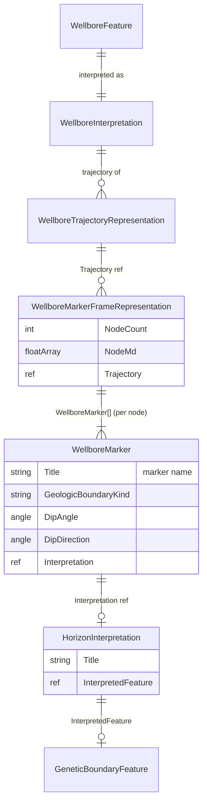
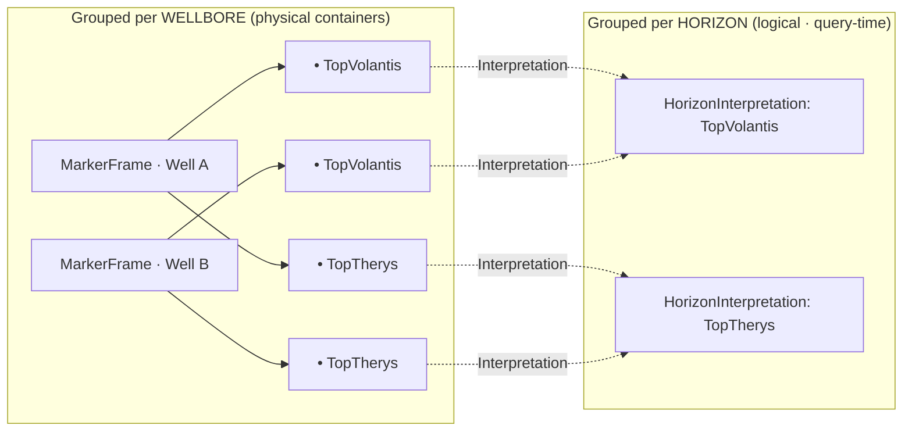

# Wellbore Markers - Data Model & Workflow

> Reference for the **WellboreMarkerFrame** data model in **RESQML 2.0 / RDDMS**, its
> relationship to **wells** and **horizons/geological features**, how individual
> markers are grouped, and the mapping to the **OSDU `WellboreMarkerSet`** work-product
> component.
>
> Closes with guidance on improving the OSDU mapping for realistic ingest, query, and
> lifecycle management - and on **avoiding record explosion** (one catalog record per
> marker pick).

---

## 1) What a "marker" is

A **wellbore marker** (a.k.a. *formation top*, *horizon pick*, *well pick*) is a single
**measured-depth (MD) point along a wellbore** where the borehole crosses a geological
boundary - the top of a formation, a sequence-stratigraphic surface, a fault cut, or a
fluid contact.

A marker is therefore inherently a **relationship**, not a standalone thing:

```
marker  =  (this wellbore)  ×  (this geological boundary)  @  this MD
```

It only has meaning when tied to **both** a wellbore (which provides geometry via the
trajectory) **and** a geological feature/interpretation (which provides identity - *what*
the boundary is).

---

## 2) RESQML `WellboreMarkerFrameRepresentation`

RESQML never stores a marker as a top-level object. Markers are **grouped per wellbore**
into a single **`WellboreMarkerFrameRepresentation`** ("marker frame"). The frame holds an
array of MD values and a matching array of `WellboreMarker` child elements; XYZ is *not*
stored - it is interpolated on demand along the referenced trajectory.

### 2.1 Object shape (as seen on the wire in maap/drogon)

```jsonc
{
  "$type": "resqml20.obj_WellboreMarkerFrameRepresentation",
  "Uuid": "2bb808bf-…",
  "Citation": { "Title": "…", "Originator": "maap" },
  "RepresentedInterpretation": { /* optional → EarthModel/WellboreInterpretation */ },

  "NodeCount": 9,
  "NodeMd": [ -25, 0, 1591.6, … ],          // one MD per marker (HDF/bulk array)
  "Trajectory": {                            // DataObjectReference → trajectory
    "ContentType": "…;type=obj_WellboreTrajectoryRepresentation",
    "UUID": "523bb0ee-…"
  },

  "WellboreMarker": [                        // one entry per NodeMd value
    {
      "$type": "resqml20.WellboreMarker",
      "Uuid": "08a79067-…",
      "Citation": { "Title": "MSL" },        // ← the marker / pick name
      "GeologicBoundaryKind": "horizon",     // horizon | fault | geobody | fluid contact
      "Interpretation": {                    // DataObjectReference → HorizonInterpretation
        "ContentType": "…;type=obj_HorizonInterpretation",
        "UUID": "94643335-…"
        // → InterpretedFeature → GeneticBoundaryFeature (the "what it is")
      },
      "DipAngle": null,                      // optional PlaneAngleMeasure (geological dip)
      "DipDirection": null                   // optional PlaneAngleMeasure (dip azimuth)
    }
    // … 8 more, index-aligned with NodeMd …
  ]
}
```

Key facts:

- **`NodeMd[i]` ↔ `WellboreMarker[i]`** are positionally aligned (index `i` is the marker).
- **No XYZ** is stored. Position = interpolate `NodeMd[i]` along the trajectory's
  `controlPointParameters` (MDs) → `controlPoints` (XYZ). This is exactly what
  `resqml_viz._interp_along_traj()` does.
- **`DipAngle` / `DipDirection`** describe the **geological layering** at the pick (the
  bedding-plane orientation) - *not* the wellbore direction. They are usually empty; when
  present the viewer draws an oriented bedding disk (`resqml_viz._dip_to_normal()`).

### 2.2 Relationships (RESQML object graph)



- **To the well**: `WellboreMarkerFrame → Trajectory → WellboreInterpretation →
  WellboreFeature`. Geometry (XYZ) is borrowed from the trajectory; the frame stores only
  MDs.
- **To the geology**: each `WellboreMarker → Interpretation (HorizonInterpretation /
  FaultInterpretation) → InterpretedFeature (GeneticBoundaryFeature /
  TectonicBoundaryFeature)`. The **feature** is the shared, well-independent identity of
  the boundary.

---

## 3) Grouping: single marker vs per-well vs per-horizon

This is the crux of the model - three different "scopes" of the same data.

| Scope | What it is | How it's represented |
|-------|------------|----------------------|
| **One marker** | A single pick `(wellbore, horizon, MD)` | A `WellboreMarker` element **inside** a frame - *never* its own object |
| **All markers of one wellbore** | The full formation-top set for a well | **One `WellboreMarkerFrameRepresentation`** (the natural grouping unit) |
| **One horizon across many wells** | Every pick of, say, "TopVolantis" | **Not a single object** - it's the *set of `WellboreMarker` nodes (in many frames) whose `Interpretation`/feature is that horizon*. Retrieved by query, not by container |



**Takeaway:** the **container** is per-wellbore; the **per-horizon view is a join** over
the shared `Interpretation`/`Feature` reference. You get horizon-wide queries *for free*
**only if** every marker carries a stable reference to the same interpretation - which is
precisely what makes the OSDU mapping (below) succeed or fail.

---

## 4) OSDU mapping - `WellboreMarkerSet`

OSDU mirrors the RESQML grouping decision: the work-product component
**`osdu:wks:work-product-component--WellboreMarkerSet:1.2.0`** is **per wellbore** and
carries an inline **`Markers[]`** array - directly analogous to the RESQML marker frame.

### 4.1 Record shape (as generated in this repo)

See [demo/drogon_dg1/gen_markers_strat_drogon.py](../demo/drogon_dg1/gen_markers_strat_drogon.py)
and [demo/drogon_dg1/manifest_markers_drogon.json](../demo/drogon_dg1/manifest_markers_drogon.json).

```jsonc
{
  "id": "dev:work-product-component--WellboreMarkerSet:<uuid>:",
  "kind": "osdu:wks:work-product-component--WellboreMarkerSet:1.2.0",
  "acl": { … }, "legal": { … },
  "data": {
    "Name": "15/9-F-1 C – Formation Tops",
    "Description": "Formation top picks for wellbore 15/9-F-1 C",
    "WellboreID": "dev:master-data--Wellbore:55d473c8-…:1",   // → the well
    "StratigraphicColumnID": "…",                              // optional context
    "StratigraphicColumnRankInterpretationID": "",
    "Markers": [
      {
        "MarkerName": "Seabed",
        "MarkerMeasuredDepth": 118.7,
        "MarkerSubSeaVerticalDepth": 118.7,
        "MarkerObservationNumber": 1,
        "Missing": "",
        "MarkerTypeID": "",            // reference-data: horizon / fault / contact
        "InterpretationID": "",        // → HorizonInterpretation (the "what")
        "MarkerInterpreter": "…",
        "GeologicalAge": ""
      }
      // … one entry per formation top …
    ]
  }
}
```

### 4.2 RESQML ↔ OSDU field correspondence

| RESQML (`WellboreMarkerFrame` / `WellboreMarker`) | OSDU (`WellboreMarkerSet` / `Markers[]`) | Notes |
|---|---|---|
| `WellboreMarkerFrameRepresentation` | `WellboreMarkerSet` (one per wellbore) | Same grouping unit |
| `Trajectory → … → WellboreFeature` | `data.WellboreID` | Link to the well |
| `NodeMd[i]` | `Markers[i].MarkerMeasuredDepth` | MD; OSDU adds `MarkerSubSeaVerticalDepth` (TVDSS) |
| `WellboreMarker[i].Citation.Title` | `Markers[i].MarkerName` | Pick name |
| `GeologicBoundaryKind` | `Markers[i].MarkerTypeID` | horizon / fault / contact (ref-data in OSDU) |
| `Interpretation` (→ HorizonInterpretation) | `Markers[i].InterpretationID` / `GeologicalUnitInterpretationID` | The cross-well horizon identity |
| `DipAngle` | `Markers[i].SurfaceDipAngle` *(schema field; empty here)* | Geological dip |
| `DipDirection` | `Markers[i].SurfaceDipAzimuth` *(schema field; empty here)* | Geological dip azimuth |
| - | `MarkerObservationNumber` | Ordinal / multiple-interpretation discriminator |
| `RepresentedInterpretation` / strat context | `StratigraphicColumnID`, `…RankInterpretationID` | Optional strat-column context |

The repo also keeps an **RDDMS ↔ catalog cross-reference by UUID** (see
`RDDMS_HORIZONS` / `RDDMS_UNIT_XREFS` in the generator), so OSDU WPC records and the
RESQML objects in the `maap/drogon` dataspace can be matched without duplicating geometry.

---

## 5) Improvements: realistic OSDU mapping, query & management

### 5.1 Avoid record explosion - group, don't shatter

The single most important rule:

> **One `WellboreMarkerSet` per wellbore, with markers inline in `Markers[]` - never one
> catalog record per marker pick.**

Why a per-marker record is harmful:

- **Cardinality blow-up.** *N* wells × *M* formation tops = *N·M* records. A field of 200
  wells × 20 tops = **4,000 records** instead of **200**. Indexing, ACL propagation,
  legal-tag scans, versioning, and Search aggregations all scale with record count.
- **Loss of the natural transaction.** A well's tops are interpreted and revised together;
  splitting them forces multi-record consistency you don't need.
- **Reference duplication.** Every shard re-states `WellboreID`, ACL, and legal tags.

The inline-array design matches both RESQML (`WellboreMarker[]`) and OSDU
(`Markers[]`) and keeps the catalog count proportional to **wellbores**, not picks.

### 5.2 Make the horizon-wide query work (the real reason to map carefully)

Per-wellbore grouping is only useful if you can still answer *"give me every pick of
TopVolantis across the field."* That requires a **stable, shared interpretation reference
on every marker**:

- Populate `Markers[].InterpretationID` (or `GeologicalUnitInterpretationID`) with the
  **HorizonInterpretation/StratigraphicUnitInterpretation id**, not just a free-text
  `MarkerName`. Free-text names ("Top Volantis" vs "TopVolantis" vs "Valysar") do **not**
  join reliably.
- Keep `MarkerName` for display, but treat the **interpretation id as the join key** - it
  is the OSDU equivalent of RESQML's `Interpretation → Feature` edge.
- Query patterns then become:
  - *Tops on a well* → Search `WellboreMarkerSet` by `data.WellboreID` (one record).
  - *A horizon across wells* → Search by `data.Markers.InterpretationID` (nested) - no
    geometry scan, no per-marker records.

### 5.3 Units & geometry - don't bake assumptions

- Carry MD/TVD units via the schema's **`FrameOfReference`/UOM** rather than assuming
  metres; the current generator stores bare numbers.
- **Do not** persist marker XYZ. Keep only MD (+ optional TVDSS) and resolve XYZ from the
  trajectory at read time (as the viewer does). This keeps markers correct when the
  trajectory is re-surveyed.
- When dip/azimuth are known, populate `SurfaceDipAngle`/`SurfaceDipAzimuth` - the ORES
  viewer already renders these as oriented bedding disks.

### 5.4 Multiple interpretations of the same top

Real assets have several picks of the same boundary (different interpreters / vintages):

- Use **`MarkerObservationNumber`** (and/or `MarkerInterpreter`, a vintage/date field) to
  distinguish co-located picks **within one set**, instead of minting new records.
- Prefer **record versioning** (OSDU keeps version history on `id`) for revisions of an
  existing set over creating parallel records.

### 5.5 Lifecycle / management

- **Update the set as a whole.** Re-ingesting the wellbore's `WellboreMarkerSet` produces
  a new version; consumers fetch latest. Avoid mutating individual markers across records.
- **Soft-delete / "Missing".** The `Missing` flag (already in the array) marks a formation
  that is *absent* in this well (eroded/faulted out) without deleting the row - important
  for completeness analytics.
- **Provenance.** Keep `MarkerInterpreter` + lineage to the source database and the
  RDDMS object UUID so the catalog record and the RESQML representation stay reconcilable.

### 5.6 Summary heuristic

| Concern | Anti-pattern | Recommended |
|---|---|---|
| Granularity | One record per marker | One `WellboreMarkerSet` per wellbore |
| Horizon join | Match on `MarkerName` text | Match on `InterpretationID` (stable ref) |
| Geometry | Store XYZ per marker | Store MD; interpolate on trajectory |
| Units | Bare numbers | `FrameOfReference`/UOM |
| Multiple picks | New records | `MarkerObservationNumber` + versioning |
| Absent tops | Delete row | `Missing` flag |
| RDDMS link | Re-ingest geometry | Cross-reference by UUID |

---

## 6) Where this lives in ORES

| Concern | Code |
|---|---|
| 3D rendering (MD → XYZ, dip disks) | [app/resqml_viz.py](../app/resqml_viz.py) - `_interp_along_traj`, `_dip_to_normal` |
| Marker frame export from correlation | [app/weco_router.py](../app/weco_router.py) - `WellboreMarkerFrame` builder |
| OSDU `WellboreMarkerSet` generation | [demo/drogon_dg1/gen_markers_strat_drogon.py](../demo/drogon_dg1/gen_markers_strat_drogon.py) |
| Sample manifest | [demo/drogon_dg1/manifest_markers_drogon.json](../demo/drogon_dg1/manifest_markers_drogon.json) |
| Stratigraphic-column context | [md/StratColumn.md](StratColumn.md) |
