# OSDU as System of Record for Subsurface Decision Gates

**ECIM 2026  Conference Presentation (12 min)**

---

## Slide 1: Title

### Graphic

*(Equinor / ORES branding slide)*

### Text

**"OSDU as System of Record for Subsurface Decision Gates"**

Equinor / ORES Team  ECIM 2026, Haugesund

> **Comment**
> - Introduce the question: can OSDU handle structured decision data, not just datasets?
> - Frame the talk: we built it, tested it on two instances, here's what works and what doesn't.

---

## Slide 2: Motivation  The Decision Data Problem

### Graphic

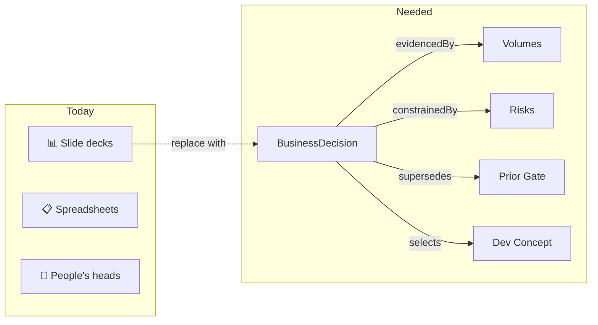

### Text

- A DG2 concept-select links to **volumes, risks, geomodels, forecasts, prior gates, and alternative concepts**
- Teams need to trace **why** a decision was made  not just what was decided
- Cross-gate tracking (DG1→DG2→DG3→FID) requires **relationship continuity** across years
- Regulatory and partner reviews demand **auditable evidence chains**

Can OSDU's existing schema and services support this without additional graph infrastructure?

> **Comment**
> - Today this knowledge lives in slide decks, spreadsheets, and people's heads. Not queryable, not traceable, not auditable.
> - What's needed: a typed relationship layer  named, directed links with lifecycle and provenance.
> - The question isn't "should we build a graph database?"  it's "can we get enough structure from what OSDU already has?"

---

## Slide 3: Use Cases

### Graphic

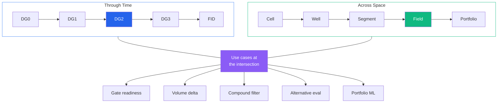

### Text

| Axis | Scale | Use Case | ORES Feature |
|---|---|---|---|
| **Time** | Per gate | Gate readiness  is the evidence complete? | Progress bar + milestone checklist |
| **Time** | Cross-gate | Volume / risk / economics evolution DG0→FID | Cross-gate analysis + trend charts |
| **Time** | Lifecycle | Risk escalation, mitigation, resolution | Risk evolution timeline |
| **Space** | Cell / property | Where is the sweet spot? (multi-property AND) | Compound filter on grid arrays |
| **Space** | Well / interval | Best completion interval above OWC? | Well log deep search + markers |
| **Space** | Segment / fault block | Is injection reaching the producer? | Connectivity explorer + fault data |
| **Space** | Field | Bypassed oil, water breakthrough, segment ranking | Field dev presets (one-click) |
| **Space** | Portfolio | P50 bias across assets, risk attribution | Cross-asset BD queries + ML corpus |
| **Both** | Bridge | Decision → query → improve model → next gate | Feedback loop (provenance chain) |

> **Comment**
> - Use cases span two axes: through time (gate progression) and across space (cell → portfolio).
> - The compound filter is the bridge: decision record identifies a risk, compound query locates the sweet spot.
> - Portfolio queries are the long-term payoff: same schema across 50+ assets = queryable corpus.
> - Every use case maps to an existing feature  not hypothetical.

---

## Slide 4: Strategy  Reusing OSDU Schema Fields as Relationship Primitives

### Graphic

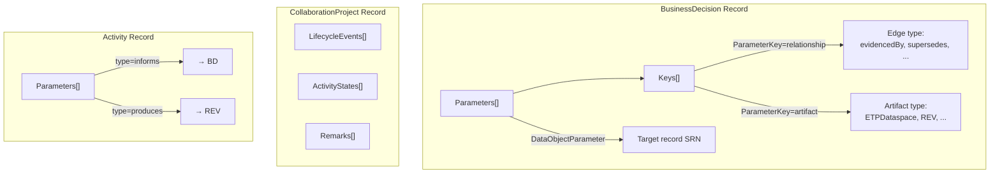

### Text

No new `kind` definitions needed. Conventions on existing fields:

| Pattern | OSDU Field | Used How |
|---|---|---|
| **Named relationships** | `Parameters[].Keys[ParameterKey="relationship"]` | Edge type: `evidencedBy`, `supersedes`, `constrainedBy`, `mitigates`, `alternativeTo`, `informedBy`, `selects`, `produces` |
| **Audit trail** | `CollaborationProject.LifecycleEvents[]` | Timestamped events: approvals, escalations, revisions |
| **Gate checklist** | `ActivityStates[]` with prefixed `MilestoneID` | Required deliverables per gate with completion status |
| **Actions as verbs** | `Activity` + `ActivityTemplate` | Each user action = one Activity record with typed Parameters |
| **Typed annotations** | `Remarks[]` with `RemarkSource` | Categorised notes: Recommendation, Condition, Risk, Audit |
| **Evidence packages** | `PersistedCollection` → `Parameters[]` | Frozen artifact sets linked to decisions |

> **Comment**
> - The key insight: `Keys[ParameterKey="relationship"]` turns every `Parameters[]` entry into a typed, directed edge.
> - Edge labels are defined from the source record's perspective: a BD is `evidencedBy` its volumes, `constrainedBy` its risks.
> - This is not a graph database  no native traversal, no path queries  but it provides enough structure for application-layer graph rendering and relationship-aware search.
> - All of this passes OSDU schema validation. No schema changes needed.

---

## Slide 5: Drogon Example  DG1 → DG2 Decision Lifecycle

### Graphic

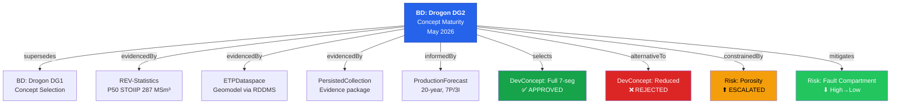

### Text

**The Story:** Drogon field, Valysar formation.
DG1 approved Feb 2026. Between gates: porosity downgrade (0.18→0.14), new risks, 4D seismic confirms fault communication.
DG2 approved May 2026  full 7-segment subsea tieback.

| Metric | DG1 | DG2 |
|---|---|---|
| P50 STOIIP (MSm³) | 312 | 287 (−8%) |
| Risks | 2 | 4 (+2 new) |
| Relationship edges | 5 | 13 |
| Gate checklist items |  | 9 (8✓ + 1 outstanding) |

> **Comment**
> - Walk through the graph: DG2 supersedes DG1, links volumes, geomodel, production forecast, two dev concepts, two risks.
> - Edge labels read from BD's perspective: "this decision is evidencedBy the volumes", "constrainedBy the risk".
> - Direction matches storage  Parameters[] on the BD record point to targets.
> - 13 edges on one BD record  this is real complexity encoded in standard fields.

---

## Slide 6: Demo  ORES Rendering

### Graphic

`[PLACEHOLDER: ORES screenshot  gate readiness panel with progress bar + checklist]`

`[PLACEHOLDER: ORES screenshot  Mermaid relationship graph for Drogon DG2]`

`[PLACEHOLDER: ORES screenshot  risk evolution panel]`

`[PLACEHOLDER: ORES screenshot  volume comparison DG1 vs DG2]`

### Text

Live demo on interop instance (or screenshots if connectivity issues).

Four panels shown:
1. **Gate readiness**  progress bar + checklist (8/9 complete)
2. **Relationship graph**  Mermaid-rendered from Parameters[] edges
3. **Risk evolution**  severity/probability changes across gates
4. **Volume comparison**  P10/P50/P90 delta DG1→DG2

> **Comment**
> - This is running live against OSDU (admeinterop.energy.azure.com).
> - All data ingested via generic generators  no manual record construction.
> - The graph is built at runtime: bd_enrichment.py follows edges, fetches targets in parallel, renders Mermaid.
> - Same data is queryable on interop (admeinterop)  portable across instances.

---

## Slide 7: Architecture

### Graphic

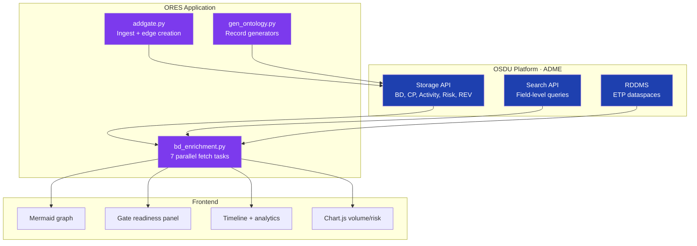

### Text

- **Platform layer**: OSDU Storage + Search + RDDMS  stores records, returns query results
- **Application layer**: ORES (Python FastAPI)  follows edges, builds graph, computes analytics
- **Frontend**: Mermaid graphs, Chart.js, gate readiness panels

Verified on 2 OSDU instances (interop + interop). Deployed on Radix.

> **Comment**
> - Key point: the platform stores data and answers queries. The application builds the knowledge graph.
> - bd_enrichment.py does 7 parallel async fetches per BD view  CP, activities, risks, volumes, checklist, remarks, relationships.
> - No graph database needed. The "graph" is computed on every page load from standard OSDU API calls.
> - Trade-off: more REST calls vs. zero infrastructure cost.

---

## Slide 8: What OSDU Provides vs. What It Lacks

### Graphic

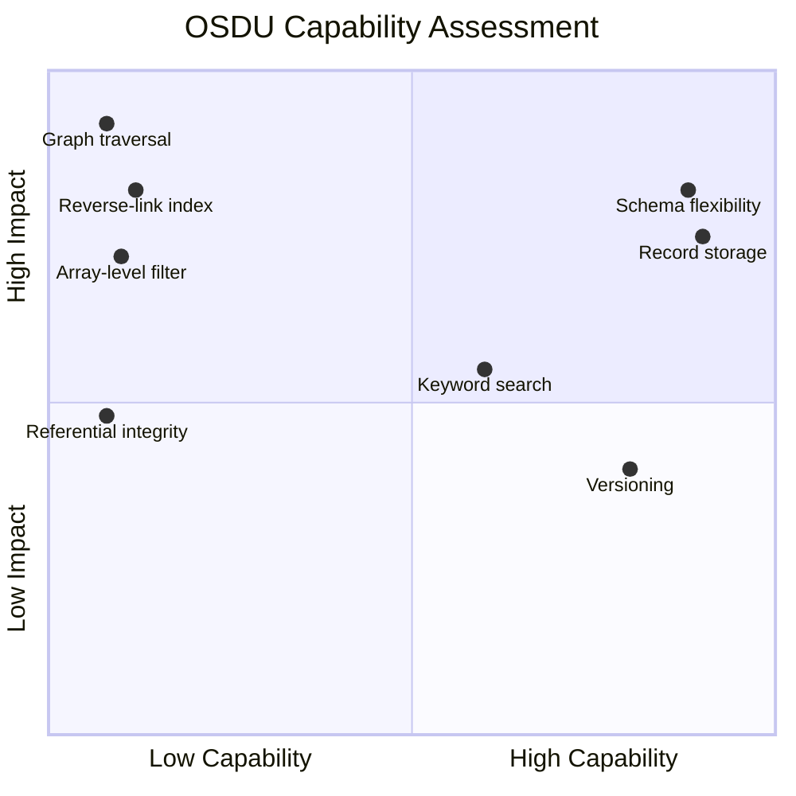

### Text

**What works:** Record storage, schema flexibility (`Parameters[]` + `Keys[]`), search by field values, versioning.

**Critical gaps:**

| Gap | Impact | Workaround |
|---|---|---|
| No graph traversal API | N-hop = N sequential REST calls | ORES enrichment (7 parallel fetches) |
| No reverse-link index | "What links TO this record?" = full scan | Search by `DataObjectParameter` value |
| No referential integrity | Deleted targets → dangling edges | Application-level validation |
| No aggregation in Search | No GROUP BY, SUM, AVG | Client-side computation |

**Classification:** OSDU is a **schema-validated document store** with sufficient flexibility for relationship encoding. The knowledge graph emerges at the application layer, not from the platform itself.

> **Comment**
> - Be honest about what OSDU can and can't do. This is a strength of the talk.
> - Top-right quadrant (high impact, low capability) = where the platform needs investment.
> - Every gap has a workaround today  but they don't scale to thousands of BDs.
> - Key message: we're not claiming OSDU is a graph database. We're showing it's flexible enough for a useful subset.

---

## Slide 9: Beyond Governance  Decision Science

### Graphic

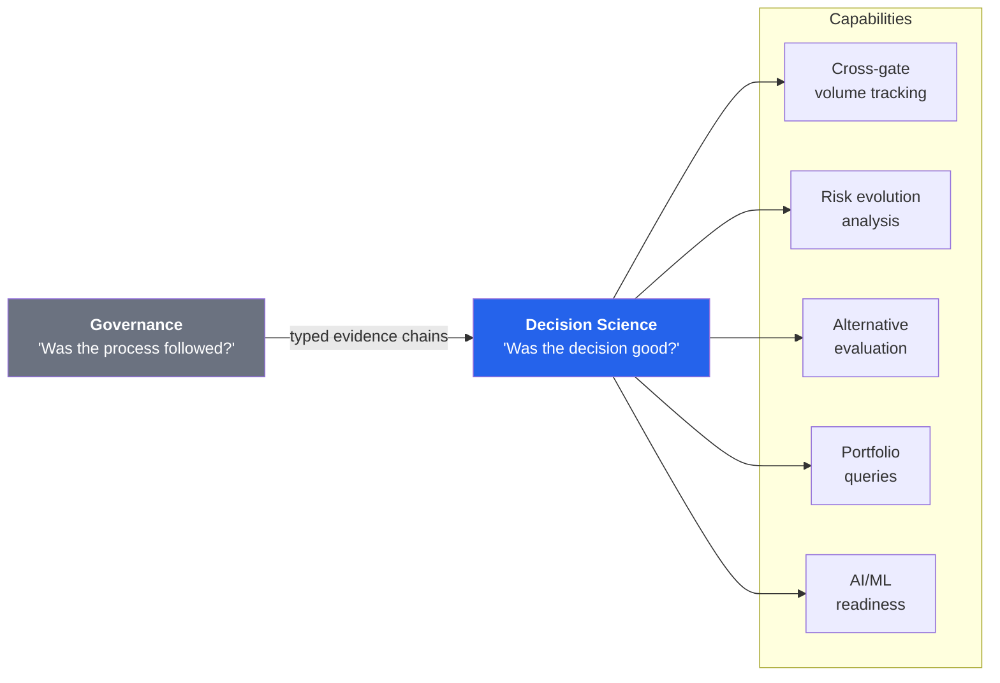

### Text

| Capability | What It Enables |
|---|---|
| **Cross-gate volume tracking** | Calibrate estimation bias across an asset portfolio |
| **Risk evolution analysis** | Which risks escalate vs. resolve? Systematic patterns |
| **Sensitivity attribution** | Which parameter change drove the volume revision? |
| **Alternative evaluation** | Structured comparison of development concepts |
| **Portfolio-level queries** | "All DG2 decisions with NPV > 300 MUSD and outstanding risks" |

Further domains: FMU ensemble tracking, well decision trees, CCS monitoring lifecycle, IOR screening, asset handover  all using the same schema field patterns.

> **Comment**
> - This is the real value proposition: moving from process compliance to analytical insight.
> - Cross-gate volume tracking lets you calibrate your estimation bias across your entire portfolio.
> - Risk evolution analysis reveals systematic patterns  which risk types always escalate?
> - All of this requires typed, queryable evidence chains  exactly what we've built.
> - AI/ML angle: structured decision data as training corpus for decision-support models.

---

## Slide 9b: The Feedback Loop

### Graphic

```mermaid
graph LR
    BD["<b>BD</b><br/>Decision record<br/><i>identifies gap</i>"]
    QUERY["<b>Query</b><br/>Compound filter<br/><i>locates sweet spot</i>"]
    ANALYSE["<b>Analyse</b><br/>Cross-gate delta<br/><i>tracks evolution</i>"]
    BRANCH["<b>Branch</b><br/>Dataspace clone<br/><i>tests alternative</i>"]
    IMPROVE["<b>Improve</b><br/>Update geomodel<br/><i>new simulation</i>"]
    DECIDE["<b>Decide</b><br/>Next-gate BD<br/><i>supersedes prior</i>"]

    BD -->|"risk: compartment"| QUERY
    QUERY -->|"Sw>0.5 in EastLowland"| ANALYSE
    ANALYSE -->|"volume -8%, risk +2"| BRANCH
    BRANCH -->|"infill well scenario"| IMPROVE
    IMPROVE -->|"new REV, updated risk"| DECIDE
    DECIDE -->|"supersedes"| BD

    style BD fill:#2563eb,color:#fff
    style QUERY fill:#10b981,color:#fff
    style ANALYSE fill:#8b5cf6,color:#fff
    style BRANCH fill:#f59e0b,color:#000
    style IMPROVE fill:#ef4444,color:#fff
    style DECIDE fill:#2563eb,color:#fff
```

### Text

The analytical journey is a cycle:

| Step | Action | Data flow |
|---|---|---|
| **1. Decision** | BD risk identifies "fault compartmentalisation" | BD → risk record |
| **2. Query** | Compound filter: PORO > 0.2 AND PERM > 50 AND Sw < 0.5 | Grid arrays → sweet-spot cells |
| **3. Analyse** | Cross-gate delta: STOIIP -8%, 2 new risks since DG1 | Volume + risk evolution |
| **4. Branch** | Clone dataspace → add infill well → run simulation | RDDMS clone → new scenario |
| **5. Improve** | Updated geomodel with infill well scenario | New REV + revised risks |
| **6. Decide** | New BD (DG2) supersedes DG1, records outcome | BD with updated Parameters[] |

All connected through `Parameters[]` edges and `Activity` provenance.

> **Comment**
> - This is the narrative arc the demo should follow.
> - Each step is a live feature: BD panels → /keys compound filter → /analyse → dataspace clone → /add-dg
> - The cycle closes: the next BD supersedes the prior, and cross-gate analytics show the delta.

---

## Slide 10: Status & Outlook

### Graphic

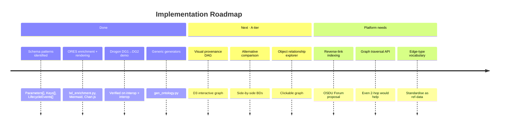

### Text

**What exists today:**
- ORES with enrichment, graph rendering, and ingestion (deployed on Radix)
- Verified on 2 OSDU instances (interop + interop)
- 6 relationship patterns demonstrated with Drogon DG1→DG2 data
- Generic generators for repeatable record creation

**What's needed:**
1. **Conventions**  Agreement on edge-type vocabulary (`ParameterKey` values)
2. **Reference data**  MilestoneID entries per gate type
3. **Application logic**  Enrichment code to follow links and render graphs
4. **Platform**  Reverse-link indexing, graph traversal API, spatial/temporal query operators

> **Comment**
> - Emphasise: this is working today, on real OSDU instances, with real data.
> - The A-tier items are days of work, not months.
> - The platform asks are concrete and bounded  we're not asking for a graph database, just better indexing and a 2-hop traversal API.
> - Call to action: standardise the edge-type vocabulary through OSDU Forum.

---

## Slide 11: Key Takeaway

### Graphic

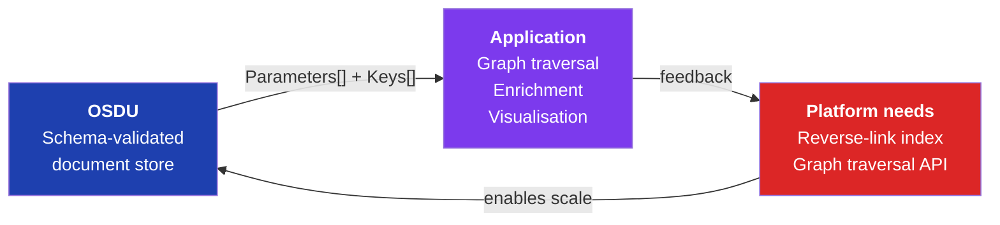

### Text

> **OSDU's schema model is flexible enough to encode typed decision-evidence relationships.**
> The platform provides the storage and search foundation.
> The knowledge graph  traversal, rendering, analysis  is built at the application layer.

Nine relationship types. One key convention (`ParameterKey="relationship"`).
Full decision lifecycle coverage from DG1 through FID.

> **Comment**
> - Land the message: OSDU is not a knowledge graph, but you can build one on top of it.
> - What OSDU is: a document store with sufficient flexibility for relationship encoding.
> - What the application adds: graph traversal, enrichment, visualisation, cross-gate analytics.
> - What the platform needs next: reverse-link indexing, graph traversal API, spatial/temporal query operators.
> - Close with: "Nine types, one convention, full lifecycle coverage."

---

## Appendix A: Relationship Type Vocabulary

### Graphic

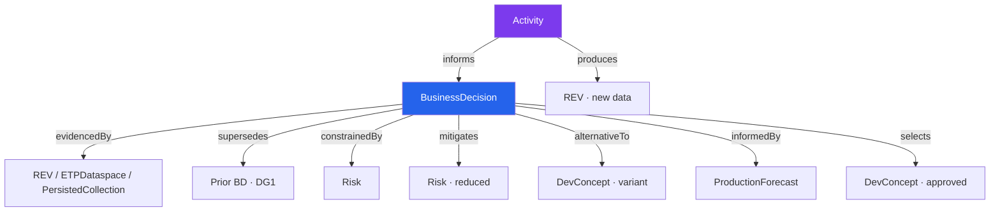

### Text

All edges are stored as `Parameters[]` on the source record. Labels are defined from the source record's perspective.

| Edge Type | Semantics (source → target) | Example |
|---|---|---|
| `evidencedBy` | Source is supported/proved by target | BD ← REV-Statistics (volumes support the decision) |
| `supersedes` | Source replaces target | BD DG2 → BD DG1 (new gate replaces prior) |
| `constrainedBy` | Source is limited/bounded by target | BD ← Porosity Risk (risk constrains the decision) |
| `mitigates` | Source's evidence reduces impact of target | BD → Fault Risk (4D seismic mitigates compartment risk) |
| `alternativeTo` | Source is a variant of target | DevConcept Reduced ↔ DevConcept Full (symmetric) |
| `informedBy` | Source is informed by target (input) | BD ← ProductionForecast (forecast is input to decision) |
| `selects` | Source selects/approves target (output) | BD → DevelopmentConcept (decision approves this concept) |
| `produces` | Source produces target (Activity output) | Activity → REV (volume update produces new volumes) |
| `informs` | Source informs target (Activity → BD) | Activity → BD (action informs the decision) |

## Appendix B: Record Structure (JSON)

```json
{
  "Parameters": [{
    "Title": "Updated geomodel (RDDMS)",
    "Selection": "Post-DG1: structural uncertainty + porosity revised",
    "DataObjectParameter": "dev:dataset--ETPDataspace:maap-drogon_dg2:1",
    "ParameterKindID": "dev:reference-data--ParameterKind:DataObject:",
    "ParameterRoleID": "dev:reference-data--ParameterRole:InputReference:",
    "Keys": [
      {"ParameterKey": "artifact", "StringParameterKey": "ETPDataspace"},
      {"ParameterKey": "relationship", "StringParameterKey": "evidencedBy"}
    ]
  }]
}
```

The `Keys[]` array adds metadata to any parameter link  transforming a simple reference into a typed, semantically rich edge.

## Appendix C: File References

| File | Content |
|---|---|
| `demo/ontology/specs/` | All ontology generator specs (Drogon DG1/DG2, Omegas WPC) |
| `demo/ontology/ingest.py` | Unified generate + ingest script |
| `demo/scripts/generators/gen_ontology.py` | Generic ontology record generator |
| `app/bd_enrichment.py` | Backend enrichment (resolves CP, checklist, relationships) |
| `app/templates/bd_ontology_panels.html` | GUI components (gate, graph, timeline) |
| `md/BusinessDecision.md` | BD schema & linking patterns guide |
| `md/Activity.md` | Activity & ActivityTemplate guide |
| `md/BdDemo.md` | Drogon demo walkthrough |
| `md/DevConcept.md` | DevelopmentConcept schema reference |
| `md/Risk.md` | Risk data management approach |
