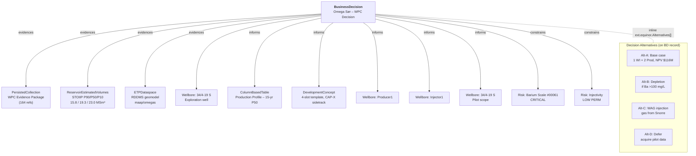

# Omega Sør – WPC Ontology & Dataset

**Internal reference - SWIP Team**

---

## 1. Overview

Omega Sør Alfa is a satellite reservoir (Brent Group, Tarbert + Rannoch Fm) under the **Snorre field** (block 34/4, Tampen, Norwegian North Sea). This document describes how the OSDU M27 ontology patterns are applied to a **Well Planning Committee (WPC) decision**, and documents the full dataset: sources, record graph, ingestion pipeline.

**Target platform:** OSDU eqndev (`equinorswedev.energy.azure.com`, partition `dev`)
**RDDMS dataspace:** `maap/omegas`

---

## 2. Authoritative Data Sources

All data originates from the following systems. Local files in `demo/eqn/omegas/` are transfer artefacts only.

### 2.1 SharePoint - Decision Documents

Project area: [Petec – Marginal Subsea Tieback Portfolio – OS](https://statoilsrm.sharepoint.com/sites/IDM-PM954-Petec/Snorre%20IOROS/DG1/OS)

| Document | Content | Used by |
|----------|---------|---------|
| [20260615_OmegaSør_SSVP.pptx](https://statoilsrm.sharepoint.com/:p:/r/sites/IDM-PM954-Petec/Snorre%20IOROS/DG1/OS/SSVP/20260615_OmegaS%C3%B8r_SSVP.pptx?d=w93c48c340f23443e909fcf1e17be45a4&csf=1&web=1&e=wurdeE) | SSVP presentation - volumes, risks, economics, wells, maps | BD, CP, REV, Risks, DevelopmentConcept |
| `Well information and design basis - Omega S.xlsx` | Casing design, PPFG, formation prognosis, contingency liner | TubularAssembly, PPFGDataset, PlannedLithology, GeoLabelSet |
| `RCmeeting_OmegaSor.pptx` | Resource Committee meeting | BD economics |
| `DW112 - Activity Program Signature Presentation NO 34_4-19 S Omega S.pptx` | Drilling activity program (BHA, casing, risk) | Activities, Drilling, Risks |
| `EOWR - Omega S.pptx` | End-of-well report (34/4-19 S) | WellLog, WellboreMarkerSet |
| `Risk analysis concept phase.pptx` | Risk register & mitigations | Risk records |
| `Handover MWP to PreEx.pptx` | MWP → Pre-exploration handover | Document record |
| `Handover PEX to OC.pptx` | Pre-exploration → OC handover | Document record |
| `34_4-19 S Omega S_DW100 Handover...docx` | DW → Licence handover | Document record |

Well project site: [WCPNO344-19S](https://statoilsrm.sharepoint.com/sites/WCPNO344-19S)

### 2.2 RMS Geomodel

```
\\statoil.net\unix_st\project\snorre\reservoirmodels\omegasor\2026.2.0\rms\model\os_cond.rms15.0.1.0
```

RMS 15 model - authoritative source for horizons, faults, grid, trajectories, properties, and **volumetrics**. Ingested to RDDMS via EPC export → ETP import (or direct RMS→ETP in production).

Volume tables exported from RMS (`os.vol.xls_oil_1.xls`, `os.vol.xls_total_1.xls`) → used for ReservoirEstimatedVolumes and GeoLabelSet Table data.

### 2.3 DecisionSpace Geoscience (DSG) - Seismic

| Property | Value |
|----------|-------|
| Project | `sipi_OmegaS_Postwell_2026` |
| District | VM (SNORRE_AREA / SNORRE_TORDIS_VIGDIS) |
| Seismic survey | CGG23M01_NVG21PH2-DAZ_final_Ki-PreSDM_t_fullstk |
| Full extents | IL 4000–7860, XL 26490–33020, 0–9.0s @ 4ms |
| Clip | IL 6250–6450, XL 31200–31400 (±100 around 34/4-19 S) |
| Output | `CGG23M01_...Snorre_OmegaSorAlpha.sgy` (164 MB) → converted to OpenVDS → uploaded to Seismic DDMS |

### 2.4 SMDA - Exploration Well (cross-partition)

| Property | Value |
|----------|-------|
| Well | 34/4-19 S (NO 34/4-19 S) |
| SMDA Well ID | `data:master-data--Well:78aa3a39a9fe444eb50e3d843a25d796:` |
| SMDA Wellbore ID | `data:master-data--Wellbore:7dccc5be5a4944eda7cdc0c877be2729:` |
| SMDA Trajectory ID | `data:work-product-component--WellboreTrajectory:98bc5676b8fb4f6bbab429597bbe2491` |
| TD (driller) | 4120 m MD / 3902.81 m TVD |
| RT elevation | 30 m MSL (EPSG:5715) |

> The exploration well exists in the `data` partition (SMDA official). All references use cross-partition IDs - no duplicates in `dev`.

---

## 3. Ontology - Record Graph

### 3.1 Business Decision Structure



```
BusinessDecision: Omega Sør – WPC Decision
│
├── evidences  → PersistedCollection (WPC Evidence Package, 164 refs)
├── evidences  → ReservoirEstimatedVolumes (STOIIP P90/P50/P10 = 15.8/19.3/23.0 MSm³)
├── evidences  → ETPDataspace (RDDMS geomodel: maap/omegas)
├── evidences  → Wellbore:34-4-19S (exploration well)
│
├── informs    → ColumnBasedTable (Production Profile - 15-year P50)
├── informs    → DevelopmentConcept (4-slot template, CAP-X sidetrack)
├── informs    → Wellbore:Producer1 (planned producer)
├── informs    → Wellbore:Injector1 (planned injector)
├── informs    → Wellbore:34-4-19S (pilot scope)
│
├── constrains → Risk: Barium Scale (#00061) - CRITICAL
├── constrains → Risk: Injectivity - LOW PERM
│
├── PriorActivityIDs → Activity: WellCostEstimate
├── RiskIDs[] → 8 risks
│
└── ProjectSpecifications:
       NPV $116M, IRR 62%, CAPEX $213M, Breakeven $25/bbl, 16.5 Mboe

CollaborationProject: Omega Sør Field Development
├── LifecycleEvents[]:  8 events (project creation → SSVP delivery)
├── ActivityStates[]:   9 gate items (7 completed, 1 in-progress, 1 planned)
├── TrustedCollectionID → CollaborationProjectCollection (Trusted SoR)
└── Personnel[]:         stakeholders (RL, TL, geoscientist, drilling eng)
```

### 3.2 Relationship Edges (Parameters[])

| Edge Type | Artifact | Title |
|---|---|---|
| `evidences` | PersistedCollection | WPC Evidence Package |
| `evidences` | REV-stats | Statistical volumes (P90/Mean/P10) |
| `evidences` | ETPDataspace | Geomodel dataspace (RDDMS) |
| `evidences` | - | Exploration well 34/4-19 S |
| `informs` | ProductionForecast | Production profile (15-year) |
| `informs` | DevelopmentConcept | Development Concept (4-slot template layout) |
| `informs` | Producer | Planned producer well |
| `informs` | Injector | Planned injector well |
| `informs` | Pilot | Pilot well scope |
| `constrains` | - | Barium scale risk (#00061) |
| `constrains` | - | Injectivity risk |

All implemented via `Keys[ParameterKey="relationship"]` - same pattern as Drogon DG1/DG2.

### 3.3 Interpretation Chain (RDDMS → Catalog)

```
LocalBoundaryFeature (16)
 ├── HorizonInterpretation (6) ← .FeatureID
 │    └── StructureMap (10) ← .InterpretationID
 │         └── DDMSDatasets[] → eml://reservoir-ddms2/dataspace('maap/omegas')/...
 └── FaultInterpretation (10) ← .FeatureID
      └── GenericRepresentation (fault sticks, points) ← .InterpretationID

SeismicBinGrid (315×362 @ 50m)
 └── SeismicTraceData ← .BinGridID
      ├── DDMSDatasets[] → sd://dev/omegas-CGG23M01-snorre-fullstk-vds
      └── Artefacts[] → VDS (ConvertedContent) + SEGY (OriginalContent)
```

---

## 4. Well Technical Records

### DevelopmentConcept (`OmegaSor-WPC:1`)

Source: SSVP pptx + RCmeeting pptx

- **WellPlan**: 1 producer + 1 injector + 2 contingent slots
- **FacilityConcept**: Subsea tieback to Snorre N, 4-slot template, 8" prod flowline
- **DrainageStrategy**: Water injection (Tarbert), WAG-ready for Phase 2
- **EconomicsSummary**: NPV $116M at $75/bbl, CAPEX $213M

### GeoLabelSet (`OmegaSor-FormEval:1`)

Source: `Well information and design basis - Omega S.xlsx` + SSVP pptx

| Zone | NTG | Phi | Sw | K (mD) | NetPay (m) | STOIIP P50 (MSm³) |
|------|-----|-----|----|----|--------|--------|
| Tarbert Fm | 0.92 | 0.24 | 0.18 | 850 | 52 | 13.1 |
| Rannoch Fm | 0.72 | 0.19 | 0.25 | 120 | 36 | 6.2 |
| **TOTAL** | **0.84** | **0.22** | **0.21** | **510** | **88** | **19.3** |

Linked to `Reservoir:OmegaSorAlfa:1` (parent: `Field:Snorre:`) via `LabelledEntityID`.

### ColumnBasedTable - Production Profile (`OmegaSor-ProdProfile:1`)

Source: SSVP pptx slide (simulation output)

15-year P50 forecast. Phase 1 (Jan 2029), Phase 2 (Jan 2030). Oil + water rates, cumulative oil.

### ColumnBasedTable - Well Cost AFE (`OmegaSor-WellCostAFE:1`)

Source: `Well information and design basis - Omega S.xlsx`

Per-phase cost breakdown: mobilisation, surface hole, intermediate, reservoir section, completion, testing.

### TubularAssembly × 3

Source: `Well information and design basis - Omega S.xlsx` (WBS & Temp table, casing sheets)

| Record | Content |
|--------|---------|
| `OmegaSor-Producer1-Completion:1` | Casing + completion for producer (CAP-X sidetrack) |
| `OmegaSor-Injector1-Completion:1` | Casing + completion for injector (4-slot template) |
| `OmegaSor-Contingency7Liner:1` | 7" contingency liner design |

### PPFGDataset (`OmegaSor-PPFG-Predrill:1`)

Source: `Well information and design basis - Omega S.xlsx` (WBS & Temp table)

### PlannedLithology (`OmegaSor-FormPrognosis:1`)

Source: `Well information and design basis - Omega S.xlsx` (Geo Prognosis sheet)

---

## 5. Risk Records (8)

Source: `Risk analysis concept phase.pptx` + SSVP pptx

| ID | Name | Severity |
|----|------|----------|
| `OmegaSor-BariumScale-00061:1` | Barium scale (PIMS #00061) | **Critical** |
| `OmegaSor-Injectivity:1` | Low permeability / injectivity | Medium |
| `OmegaSor-VolumeUncertainty:1` | Subsurface volume uncertainty | Medium |
| `OmegaSor-DrillingCompletion:1` | Drilling & completion risk | Medium |
| `OmegaSor-ScheduleCost:1` | Schedule & cost overrun | Medium |
| `OmegaSor-ShallowGas:1` | Shallow gas (Hordaland Group) | Low-Medium |
| `OmegaSor-BOPReliability:1` | BOP reliability / well control | Low |
| `OmegaSor-H2S:1` | H₂S potential in reservoir | Low |

---

## 6. Gate Lifecycle (CollaborationProject)

### LifecycleEvents (8)

| Date | Event |
|------|-------|
| 2026-01-15 | Project created post exploration |
| 2026-02-01 | Exploration well results ingested |
| 2026-03-15 | Layout alternative - 4-slot template replaces injection CAP-X |
| 2026-06-10 | Simulation model delivered |
| 2026-06-10 | Economics delivered |
| 2026-06-12 | Barium scale risk raised to critical |
| 2026-06-15 | SSVP presentation delivered |
| 2026-06-15 | Preliminary well plans finalized |

### ActivityStates - Gate Checklist (9 items)

| Milestone | Status | Date |
|-----------|--------|------|
| SSVP-Volumes | ✅ Completed | 2026-06-10 |
| SSVP-Economics | ✅ Completed | 2026-06-10 |
| SSVP-WellPlan | ✅ Completed | 2026-06-15 |
| SSVP-DrainageStrategy | ✅ Completed | 2026-06-15 |
| SSVP-RiskAssessment | ✅ Completed | 2026-06-15 |
| SSVP-GeoModel | ✅ Completed | 2026-06-15 |
| SSVP-FacilityDesign | ✅ Completed | 2026-06-15 |
| SSVP-PilotWellScope | 🔄 InProgress | 2026-06-15 |
| SSVP-Approval | 📋 Planned | 2026-09-30 |

Gate readiness: **7/9 = 78%** (pilot well scope pending, approval target Sep 2026).

### Typed Remarks (BD)

| Source | Count | Example |
|--------|-------|---------|
| SSVP-Recommendation | 5 | "Approve Phase 1 wells (1P + 1I) for Omega Sør Alfa" |
| SSVP-Condition | 2 | "Pilot well must acquire formation water sample for Ba analysis" |
| SSVP-SubsurfaceRisk | 3 | "Gas cap probability negligible (PVT confirms). HIPS not required." |
| DG0-Recommendation | 2 | "Customize subsurface deliveries per adapted CVP" |
| Audit-Note | 2 | "SSVP presentation 2026-06-15. Concept screening validated post-exploration." |

---

## 7. Record Inventory (209 total)

| Manifest | Records | Source System | Content |
|----------|---------|---------------|---------|
| `manifest_rddms_omegas.json` | 136 | RMS → EPC → RDDMS | Horizons, Faults, Grid, Trajectories, Properties |
| `manifest_master_omegas.json` | 8 | SSVP pptx | Reservoir, Segments, Wells, Wellbores |
| `manifest_bd_omegas.json` | 1 | SSVP pptx | BusinessDecision (WPC) |
| `manifest_collection_omegas.json` | 3 | - | CollaborationProject, ProjectCollection, PersistedCollection |
| `manifest_risk_omegas.json` | 5+3 | Risk analysis pptx + SSVP | 8 Risk records |
| `manifest_volumes_omegas.json` | 2 | RMS volumetrics | REV + InPlace ColumnBasedTable |
| `manifest_drilling_omegas.json` | 10 | DW112 + EOWR | Trajectories, Activities, Documents |
| `manifest_welltechnical_omegas.json` | 10 | Design basis xlsx | DevelopmentConcept, TubularAssembly, GeoLabelSet, ProdProfile, WellCost |
| Seismic (direct push) | 4 | DSG → SEGY → VDS → Seismic DDMS | SeismicBinGrid, TraceData, FileCollections |
| Exploration BD | 5 | DW112 + EOWR + handovers | BD, PersistedCollections, Documents |
| Field | 1 | - | Field:Snorre |

### By Kind (grouped)

| Category | Kinds | Count |
|----------|-------|-------|
| **Decision** | BusinessDecision (2), CollaborationProject (2), PersistedCollection (6), CollaborationProjectCollection (1) | 11 |
| **Wells** | Well (2), Wellbore (3), WellboreTrajectory (6), WellLog (2), WellboreMarkerSet (1) | 14 |
| **Technical** | DevelopmentConcept (1), TubularAssembly (3), ColumnBasedTable (15), GeoLabelSet (1), PPFGDataset (1), PlannedLithology (1), Activity (8) | 30 |
| **Subsurface** | Field (1), Reservoir (1), ReservoirSegment (2), ReservoirEstimatedVolumes (1) | 5 |
| **Risks** | Risk (8) | 8 |
| **Documents** | Document (2) | 2 |
| **Geomodel** | ETPDataspace (1), GenericProperty (25+), GenericRepresentation (18+), HorizonInterpretation (6), FaultInterpretation (10), StratigraphicColumn/Unit (8+), LocalBoundaryFeature (16), LocalModelCompoundCrs (1) | 85+ |
| **Seismic** | SeismicBinGrid (1), SeismicTraceData (1), FileCollection.SEGY (1), FileCollection.OpenVDS (1) | 4 |

---

## 8. Ingestion Pipeline

### Prerequisites

```bash
cd ~/rddms && npm run build            # Local OpenETP client
pip install httpx segyio h5py openvds   # Python deps
```

### Full Pipeline

```bash
# 1. EPC → RDDMS → Catalog (via local OpenETP client)
cd ~/ores/demo/eqn/omegas
python ingest_omegas.py --local-client

# 2. Seismic: DSG export (SEGY) → VDS → Seismic DDMS → OSDU catalog
python ingest_seismic_omegas.py --convert --patch-collections \
  "dev:work-product-component--PersistedCollection:OmegaSor-WPC-Evidence:1" \
  "dev:work-product-component--CollaborationProjectCollection:OmegaSor-FieldDev-Collection:1"

# 3. Exploration BD (separate gate)
cd exploration && python ingest_exploration.py
```

### Pipeline Steps

| Step | Script | Source → Target |
|------|--------|-----------------|
| 1 | `ingest_omegas.py` | RMS EPC → RDDMS dataspace `maap/omegas` |
| 2 | `ingest_omegas.py --local-client` | RDDMS → OSDU catalog (136 WPC records via manifest build) |
| 3 | `gen_*.py` generators | SharePoint docs → custom manifests (BD, risks, volumes, wells, collections) |
| 4 | `ingest_omegas.py` | Push all manifests to OSDU Storage API |
| 5 | `ingest_seismic_omegas.py` | DSG SEGY → VDS → Seismic DDMS + catalog records |
| 6 | `exploration/ingest_exploration.py` | DW112/EOWR → Exploration BD + documents |

---

## 9. Comparison: WPC vs. Drogon DG2

| Aspect | Drogon DG2 (Concept Select) | Omega Sør WPC |
|--------|-------|-------|
| Decision type | Concept selection (3 alternatives) | Well planning approval |
| Edge types used | evidences, supersedes, constrains, mitigates, alternativeTo, informs | evidences, constrains, informs |
| `alternativeTo` | Yes (reduced-scope vs full) | No (single concept) |
| `supersedes` | Yes (DG1→DG2 evolution) | No (first WPC gate) |
| Well technical depth | Minimal | Full (TubularAssembly, PPFG, PlannedLithology) |
| GeoLabelSet | Not used | Per-zone formation evaluation with Table |
| DevelopmentConcept | v4 with alternatives | v4 with inline WellPlan + FacilityConcept |
| Economics | NPV $520M, IRR 17% | NPV $116M, IRR 62% |
| Geomodel source | RMS (Drogon synthetic) | RMS (real Snorre-area geology) |
| Seismic source | - | DSG (CGG23M01 clip) → VDS → Seismic DDMS |

---

## 10. Known Issues

| Issue | Impact | Status |
|-------|--------|--------|
| No WGS84 spatial transform | SpatialArea uses "ProjectedCRS:Unknown" | Needs pyproj ED50→WGS84 |
| No SeismicHorizon (TWT) records | Only depth StructureMaps from RMS | Would need DSG TWT export |
| PersistedCollection version suffix inconsistency | Some `:1`, some `:` | Both resolve |
| DeviationSurvey not converted by RDDMS client | No WPC for DeviationSurveyRepresentation | Trajectories work via WellboreTrajectory |

---

## 11. Script & File References

| File | Purpose |
|------|---------|
| `demo/eqn/omegas/_shared.py` | Constants: CRS, spatial bbox, ACL, field metadata |
| `demo/eqn/omegas/ontology_examples/bd_omegas_ssvp.json` | BD record (WPC decision with relationship edges) |
| `demo/eqn/omegas/ontology_examples/cp_omegas_ssvp.json` | CP record (lifecycle, gate checklist) |
| `demo/eqn/omegas/gen_well_technical_omegas.py` | Well technical generator (DevConcept, TubularAssembly, GeoLabelSet, ProdProfile, WellCost) |
| `demo/eqn/omegas/gen_master_omegas.py` | Master data (Field, Reservoir, Well, Wellbore) |
| `demo/eqn/omegas/gen_drilling_omegas.py` | Drilling activities + planned trajectories |
| `demo/eqn/omegas/gen_risk_omegas.py` | Risk records |
| `demo/eqn/omegas/gen_volumes_omegas.py` | ReservoirEstimatedVolumes |
| `demo/eqn/omegas/gen_collection_omegas.py` | PersistedCollection + CollaborationProjectCollection |
| `demo/eqn/omegas/gen_businessdecision_omegas.py` | BusinessDecision (WPC) |
| `demo/eqn/omegas/ingest_seismic_omegas.py` | Seismic pipeline (SEGY→VDS→OSDU) |
| `demo/eqn/omegas/exploration/` | Exploration well BD + drilling + documents |
