# WPC Ontology – OSDU M27 Patterns for Well Planning Decisions

**Internal reference — SWIP Team (workshop / 1-hour deep dive)**

---

## 1. Purpose

### Graphic

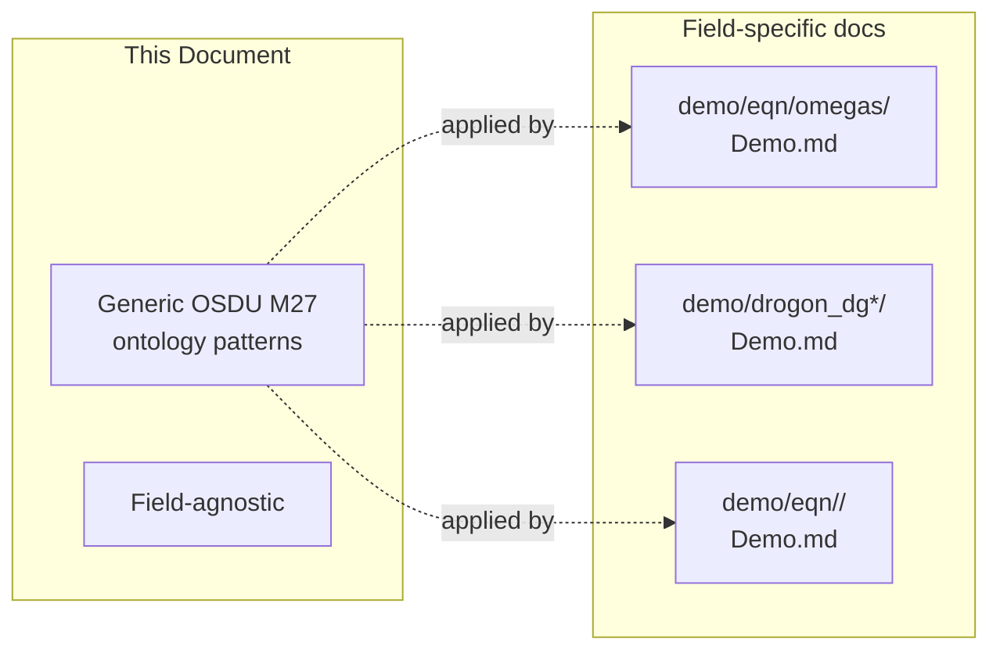

### Text

This document defines the **generic OSDU M27 ontology patterns** used to model Well Planning Committee (WPC) decisions in the ORES platform. It is field-agnostic — specific datasets (Omega Sør, Drogon, etc.) are documented in their respective `Demo.md` files under `demo/eqn/<field>/`.

> **Comment**
> - This is the reference architecture doc, not a presentation script.
> - Use it for onboarding, code review, and as the canonical source of truth for field conventions.
> - Each section corresponds to a topic that could fill 5–10 minutes in a workshop setting.

---

## 2. Record Graph – Generic WPC Structure

A WPC decision is modelled as a **BusinessDecision** record linked to evidence, constraints, and outputs via typed `Parameters[]` edges.

### Graphic

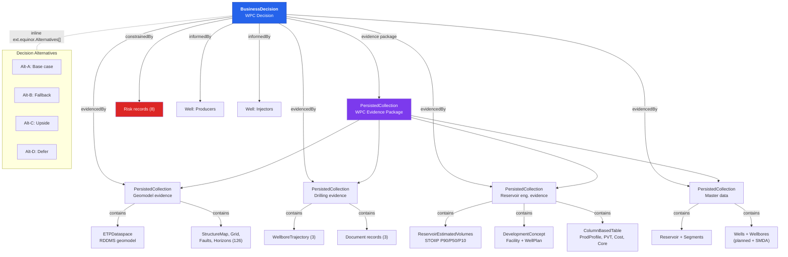

> **Comment**
> - The BD is the hub — all edges radiate out via Parameters[].
> - Evidence is nested: PersistedCollections group by discipline, then reference individual records.
> - Risks are direct edges (constrainedBy), not nested inside collections.
> - Alternatives use the Equinor extension (ext.equinor.Alternatives[]) — inline, not separate records.
> - Walk through each discipline branch: geomodel → RDDMS, drilling → trajectories, reseng → volumes + dev concept, master data → wells.

### 2.1 Evidence Package Structure

### Graphic

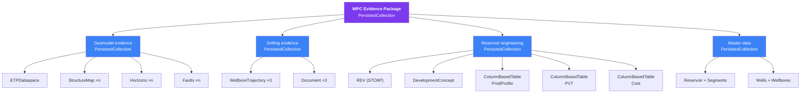

### Text

The WPC evidence is organised as a **nested hierarchy** of PersistedCollections by discipline. Items with >3 records are grouped into a sub-collection. The top-level evidence package references the sub-collections (not individual records).

> **Comment**
> - PersistedCollections are frozen snapshots — they capture the state of evidence at decision time.
> - The nesting keeps the BD's Parameters[] list manageable (4–5 top-level refs instead of 50+).
> - Collections can be compared across gates: "what changed in the geomodel evidence between DG0 and DG1?"

### 2.2 Core Record Types

### Text

| Record Kind | Role in WPC | Key Fields |
|---|---|---|
| `BusinessDecision` | Gate decision record | DecisionLevelID, ApprovalStatusID, Parameters[], RiskIDs[], ProjectSpecifications[], ext.equinor.Alternatives[] |
| `CollaborationProject` | Long-lived project wrapper | LifecycleEvents[], ActivityStates[] (gate checklist), Personnel[], TrustedCollectionID |
| `PersistedCollection` | Frozen evidence snapshot (can nest) | DataReferences[] (list of evidence record IDs or sub-collection IDs) |
| `CollaborationProjectCollection` | Living SoR collection | Updated as new records are ingested |
| `ReservoirEstimatedVolumes` | Statistical volumes | Volumes.ColumnBasedTable with P90/P50/P10 per zone |
| `DevelopmentConcept` | Facility + well plan | FacilityConcept, WellPlan, DrainageStrategy, ReservoirTarget |
| `GeoLabelSet` | Formation evaluation | Per-zone: NTG, Phi, Sw, K, NetPay, STOIIP/Recoverable/RF per percentile |
| `ColumnBasedTable` | Tabular data (many uses) | Production profiles, well cost AFE, PVT, core data, design matrix |
| `TubularAssembly` | Casing + completion | Components[], Perforations[], BHAComponents[] |
| `Risk` | Decision hazards | Severity, Probability, MitigationActions[], MitigationActionIDs[], ext.equinor status |
| `Activity` | Workflow provenance | ActivityTemplateID, Parameters[] (inputs/outputs), WorkflowStatus |

> **Comment**
> - All kinds are standard OSDU M27 — no custom schema definitions.
> - The only Equinor extension is `ext.equinor` on BD (Alternatives, economics) and Risk (status, residual fields).
> - GeoLabelSet is the most underused M27 kind — it's perfect for per-zone reservoir property summaries.
> - ColumnBasedTable is the Swiss Army knife: production, PVT, cost, core, design matrix, SCAL.

### 2.3 Relationship Edges (Parameters[])

### Graphic

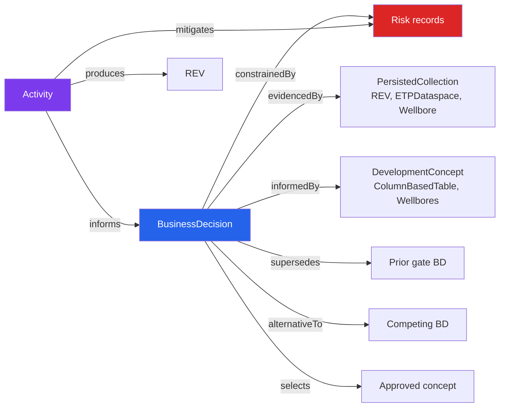

### Text

All inter-record links use `Parameters[]` with `Keys[ParameterKey="relationship"]` to define typed edges:

| Edge Type | Meaning | Example Target |
|---|---|---|
| `evidencedBy` | Target provides evidence for the decision | PersistedCollection, REV, ETPDataspace, Wellbore |
| `informedBy` | Target is an input that informs the decision | DevelopmentConcept, ColumnBasedTable (production), planned Wellbores |
| `constrainedBy` | Target constrains the decision | Risk records |
| `supersedes` | Gate evolution (DG0→DG1) | Prior gate's BD |
| `alternativeTo` | Decision alternatives | Competing BD at same gate level |
| `selects` | Decision selects/approves target output | Approved DevelopmentConcept |
| `mitigates` | Mitigation action reduces impact of target | Activity → Risk |
| `produces` | Activity produces new data | Activity → REV |
| `informs` | Activity informs the decision | Activity → BD |

> **Comment**
> - Edge labels are always from the source record's perspective.
> - `evidencedBy` = "this BD is evidenced by the target" — passive voice, BD is the subject.
> - `informedBy` for inputs, `selects` for outputs — distinguishes direction of influence.
> - `constrainedBy` vs `mitigates`: risks constrain the decision; activities mitigate risks.
> - All 9 edge types use the same `Keys[ParameterKey="relationship"]` mechanism — vocabulary only.

### 2.4 Interpretation Chain (RDDMS → Catalog)

### Graphic

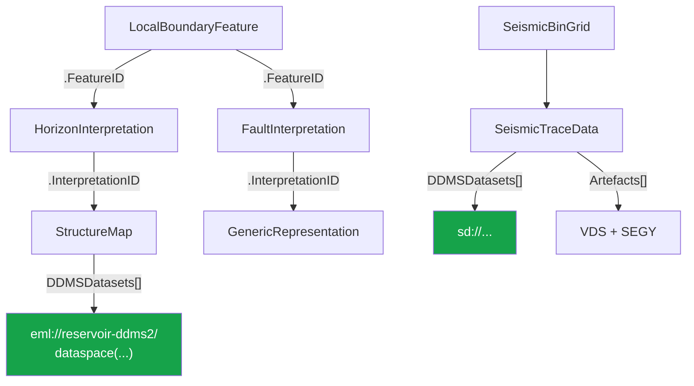

### Text

The RDDMS interpretation chain links OSDU catalog records to ETP dataspace objects:

- `LocalBoundaryFeature` → `HorizonInterpretation` → `StructureMap` → RDDMS via `DDMSDatasets[]`
- `LocalBoundaryFeature` → `FaultInterpretation` → `GenericRepresentation`
- `SeismicBinGrid` → `SeismicTraceData` → Seismic DDMS (`sd://`) + VDS/SEGY artefacts

> **Comment**
> - This is the bridge between OSDU catalog (document store) and RDDMS (ETP binary data).
> - The DDMSDatasets[] field contains the EML URI — that's the pointer into the dataspace.
> - In the Drogon demo, the geomodel evidence PersistedCollection holds ETPDataspace records that reference these chains.
> - Seismic follows a parallel path through SeismicBinGrid → TraceData → VDS.

---

## 3. Canonical Field Conventions

### 3.1 Volume Properties

### Graphic

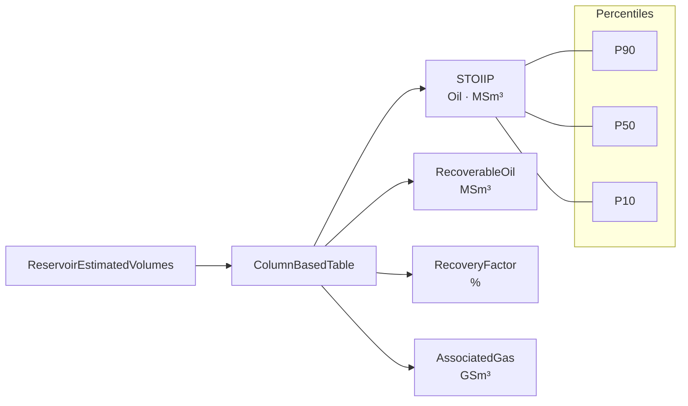

### Text

| ColumnName | PropertyTypeID | UoM | FacetID |
|---|---|---|---|
| `STOIIP` / `Oil.P50` | `ReservoirEstimatedVolumePropertyType:Oil` | MSm3 / Sm3 | `StatisticalFacet:P50` |
| `RecoverableOil` / `Recoverable.P50` | `...PropertyType:RecoverableOil` | MSm3 / Sm3 | P50 |
| `RecoveryFactor` / `RecoveryFactor.P50` | `...PropertyType:RecoveryFactor` | % | P50 |
| `AssociatedGas` | `...PropertyType:AssociatedGas` | GSm3 | P50 |

> **Comment**
> - PropertyTypeIDs are standard OSDU reference data — not custom.
> - FacetID distinguishes percentiles: same PropertyType, different statistical representation.
> - Column naming convention: `{Property}.{Percentile}` for multi-percentile tables, plain `{Property}` for single-case.
> - UoM consistency matters — MSm³ for field-level summaries, Sm³ for zone-level breakdown.

### 3.2 Reservoir Properties (GeoLabelSet)

### Text

| ColumnName | PropertyTypeID | UoM |
|---|---|---|
| `NetToGross` | `ReservoirPropertyType:NetToGross` | fraction |
| `Porosity` | `ReservoirPropertyType:Porosity` | fraction |
| `WaterSaturation` | `ReservoirPropertyType:WaterSaturation` | fraction |
| `Permeability` | `ReservoirPropertyType:Permeability` | mD |
| `PermeabilityGeometric` | `ReservoirPropertyType:PermeabilityGeometric` | mD |
| `NetPay` | `ReservoirPropertyType:NetPay` | m |

> **Comment**
> - GeoLabelSet gives one row per reservoir segment — each row is a zone with all petrophysical properties.
> - Two permeability types: arithmetic (for flow capacity) and geometric (for upscaling).
> - All fractions, not percentages — this is the OSDU convention.

### 3.3 PVT Properties (ColumnBasedTable)

### Text

| ColumnName | PropertyTypeID | UoM |
|---|---|---|
| `ReservoirPressure` | `ReservoirPropertyType:Pressure` | bar |
| `ReservoirTemperature` | `ReservoirPropertyType:Temperature` | degC |
| `BubblePoint` | `ReservoirPropertyType:BubblePointPressure` | bar |
| `Viscosity` | `ReservoirPropertyType:Viscosity` | mPas |
| `FormationVolumeFactor` | `ReservoirPropertyType:FormationVolumeFactor` | rm3/Sm3 |
| `GasOilRatio` | `ReservoirPropertyType:GasOilRatio` | Sm3/Sm3 |
| `OilDensity` | `ReservoirPropertyType:OilDensity` | kg/m3 |
| `APIGravity` | `ReservoirPropertyType:APIGravity` | degAPI |

> **Comment**
> - PVT is typically one ColumnBasedTable per PVT region (often = per reservoir segment).
> - Low/Base/High cases encoded as separate columns or separate records — convention varies by field.
> - PropertyTypeIDs follow the ReservoirPropertyType namespace, not a separate PVT namespace.

### 3.4 Economics (ProjectSpecifications)

### Graphic

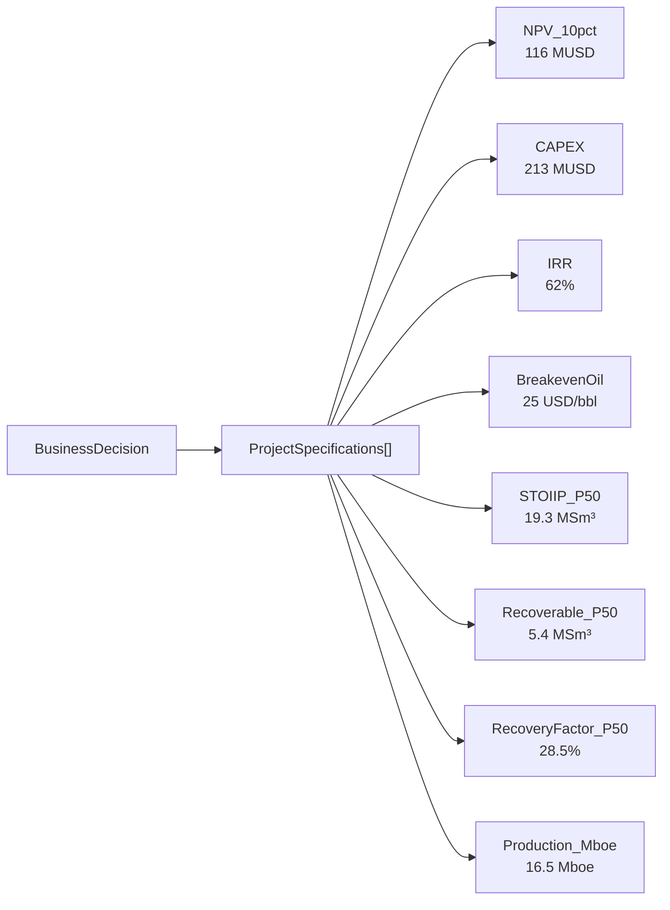

### Text

| ParameterTypeID | UoM | Example |
|---|---|---|
| `NPV_10pct` | MUSD | 116 |
| `CAPEX` | MUSD | 213 |
| `IRR` | % | 62 |
| `BreakevenOil` | USD/bbl | 25 |
| `STOIIP_P50` | MSm3 | 19.3 |
| `Recoverable_P50` | MSm3 | 5.4 |
| `RecoveryFactor_P50` | % | 28.5 |
| `Production_Mboe` | Mboe | 16.5 |

> **Comment**
> - ProjectSpecifications[] is the BD's inline economics — same structure for both the main decision and each Alternative.
> - These are headline KPIs shown on the BD card in ORES search results.
> - NPV_10pct means 10% discount rate — Equinor standard.
> - Production_Mboe is total field life, not annual.

### 3.5 Risk Severity & Probability

### Graphic

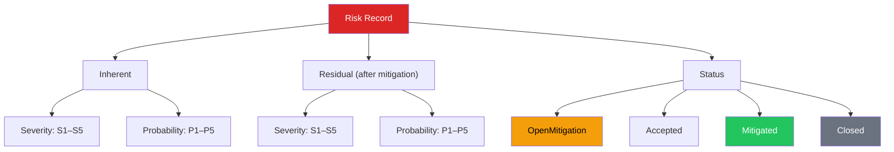

### Text

| Field | Reference Data | Scale |
|---|---|---|
| `InherentSeverity` | `RiskSeverity:S1`..`S5` | S1 (negligible) → S5 (catastrophic) |
| `InherentProbability` | `RiskProbability:P1`..`P5` | P1 (rare) → P5 (almost certain) |
| `ResidualSeverity/Probability` | Same codes | After mitigation |
| `Status` | Text | OpenMitigation, Accepted, Mitigated, Closed |

> **Comment**
> - 5×5 risk matrix: S1-S5 × P1-P5 = 25 cells. Standard Equinor risk classification.
> - Inherent = before mitigation, Residual = after. Both stored on the same Risk record.
> - Status tracks lifecycle: OpenMitigation → Mitigated → Closed (or Accepted if risk is tolerable).
> - MitigationActions[] is free text; MitigationActionIDs[] links to Activity records for tracked mitigations.

---

## 4. WPC Domain Coverage

### Graphic

```mermaid
mindmap
  root((WPC Decision<br/>DG0/DG1))
    Decision & Economics
      BusinessDecision
      Alternatives
      CollaborationProject
      PersistedCollection
    Volumes & Recovery
      REV (STOIIP P90/P50/P10)
      GeoLabelSet (per-zone)
      ColumnBasedTable (scenarios)
    Petrophysics & PVT
      GeoLabelSet (NTG, Phi, Sw, K)
      ColumnBasedTable (PVT)
      ColumnBasedTable (Core, SCAL)
    Geology & Structure
      StratigraphicColumn
      WellboreMarkerSet
      StructureMap (RDDMS)
      FaultInterpretation
    Well Design
      DevelopmentConcept
      TubularAssembly
      ColumnBasedTable (cost)
      PPFGDataset
    Risks & Mitigations
      Risk (×8)
      Activity (mitigations)
      BD.Remarks[] (contingency)
    Simulation & FMU
      Activity + Template
      ColumnBasedTable (design matrix)
      ColumnBasedTable (forecast)
```

### Text

A comprehensive WPC decision requires structured records across these domains. Each uses standard OSDU M27 kinds — no custom schema extensions needed beyond `ext.equinor`.

> **Current scope (Aug 2026):** Field development WPC at **DG0/DG1**. Per Equinor's Decision Gate Process mapping, DG0–DG1 content types are: Wells, FluidContacts, Time/Depth Maps, Velocity Model, HC Volumes, Reservoir Properties (GeoLabelSet), Production Tables. The demo additionally covers PVT, Core Analysis, FMU/DesignMatrix, Well Design, and Risks — exceeding DG0/DG1 minimum requirements.

> **Comment**
> - The mindmap shows the full domain coverage — 7 categories, ~20 record kinds.
> - All of this is standard M27. The only custom part is the linking convention (ParameterKey="relationship").
> - DG0/DG1 is the current scope; DG2/DG3/FID add economics depth, facility design, and regulatory requirements.
> - Each domain section below details the exact record kinds and field conventions.

### 4.1 Decision & Economics

### Text

| Aspect | Record Kind(s) | Key Fields |
|---|---|---|
| Gate decision | BusinessDecision | DecisionLevelID, ApprovalStatusID, ProjectSpecifications[] |
| Alternatives | BD.ext.equinor.Alternatives[] | Name, Rank, Rationale, RecommendedAction, ProjectSpecifications[] |
| Gate lifecycle | CollaborationProject | LifecycleEvents[], ActivityStates[] |
| Evidence package | PersistedCollection | ResourceCollectionID (frozen refs) |

### 4.2 Volumes & Recovery

### Text

| Aspect | Record Kind(s) | Key Fields |
|---|---|---|
| Statistical volumes | ReservoirEstimatedVolumes | P90/P50/P10 STOIIP, Recoverable, RF per zone |
| In-place summary | ColumnBasedTable | Static model volumes (bulk, net, pore, HCPV, STOIIP) |
| Recovery per zone | GeoLabelSet | Oil.P50, Recoverable.P50, RecoveryFactor.P50 per segment |
| Scenario profiles | ColumnBasedTable (per scenario) | OilRate, WaterRate, CumOil over time |

### 4.3 Petrophysics & PVT

### Text

| Aspect | Record Kind(s) | Key Fields |
|---|---|---|
| Formation evaluation | GeoLabelSet | NTG, Phi, Sw, K (geometric + arithmetic), NetPay per zone |
| PVT properties | ColumnBasedTable (PVT) | Pres, Tres, Pb, μ, Bo, GOR, API, ρ_oil per zone |
| Core analysis | ColumnBasedTable (CoreData) | CCA plug count, delivery status, study types |
| Petrophysical method | GeoLabelSet.Description / Remarks | Archie params, calibration method, cut-offs |
| SCAL/Relperm | ColumnBasedTable (Relperm) | Krw, Kro curves, endpoints, analogue source |

### 4.4 Geology & Structure

### Text

| Aspect | Record Kind(s) | Key Fields |
|---|---|---|
| Stratigraphy | StratigraphicColumn | Zones, facies, key surfaces |
| Formation tops | WellboreMarkerSet | Depth picks per well |
| Structure maps | StructureMap (RDDMS) | Grid2d representations |
| Faults | FaultInterpretation + GenericRepresentation | Named faults + sticks |
| OWC uncertainty | GeoLabelSet or ColumnBasedTable | OWC range (min/mean/max) |

### 4.5 Well Design

### Graphic

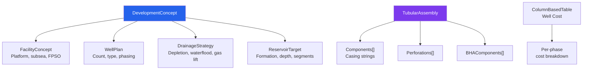

### Text

| Aspect | Record Kind(s) | Key Fields |
|---|---|---|
| Development concept | DevelopmentConcept | FacilityConcept, WellPlan, DrainageStrategy |
| Casing & completion | TubularAssembly | Components, perforations, BHA, chemical injection |
| Well cost | ColumnBasedTable | Per-phase cost breakdown |
| PPFG | PPFGDataset | Pore pressure / fracture gradient curves |
| Formation prognosis | PlannedLithology | Expected lithology vs depth |

### 4.6 Risks & Mitigations

### Graphic

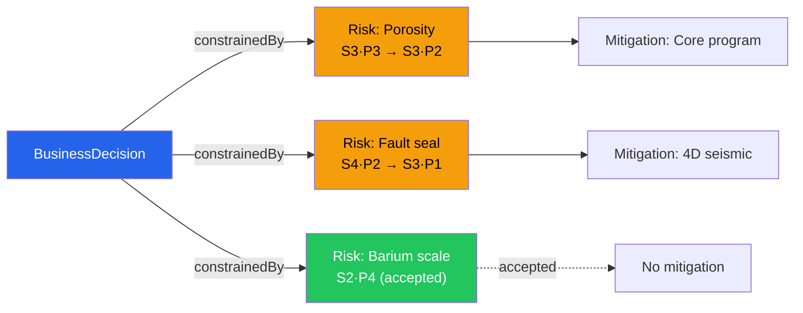

### Text

| Aspect | Record Kind(s) | Key Fields |
|---|---|---|
| Risk register | Risk (multiple) | Severity, Probability (inherent + residual), MitigationActions[] |
| Mitigation actions | Activity | Linked via Risk.MitigationActionIDs[], with due dates |
| Contingency chains | BD.Remarks[] + Risk.Description | Decision trees (Ba thresholds, OWC outcomes) |

> **Comment**
> - Risks are first-class records, not inline text — they have their own lifecycle and can be tracked across gates.
> - The 5×5 severity×probability matrix maps to reference data codes (S1–S5, P1–P5).
> - Inherent vs residual: two snapshots on the same record, showing mitigation effectiveness.
> - Contingency chains (e.g., "if Ba > 200 ppm, switch to alternative B") are encoded in Remarks[] with RemarkSource="Contingency".

### 4.7 Simulation & FMU

### Graphic

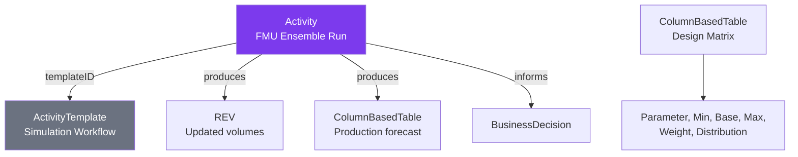

### Text

| Aspect | Record Kind(s) | Key Fields |
|---|---|---|
| Simulation workflow | Activity + ActivityTemplate | Grid size, ensemble count, software |
| Design matrix | ColumnBasedTable | Parameter name, min, base, max, weight, distribution |
| Production forecast | ColumnBasedTable | Year, OilRate, WaterRate, GasRate, CumOil, WaterCut |
| PVT for simulator | ColumnBasedTable | Pres, Tres, Pb, Bo, Rs, μ per case (low/base/high) |

> **Comment**
> - FMU ensemble runs are modelled as Activity records — each run is a first-class provenance event.
> - ActivityTemplate defines the workflow type (e.g., "Eclipse simulation", "OPM Flow run") — shared across activities.
> - Design matrix captures the uncertainty parameters used in the ensemble — min/base/max with weights.
> - The Activity's Parameters[] edges link to both inputs (design matrix) and outputs (REV, production profiles).

---

## 5. Enrichment & Rendering Pipeline

### 5.1 BD Enrichment Functions (`bd_enrichment.py`)

### Graphic

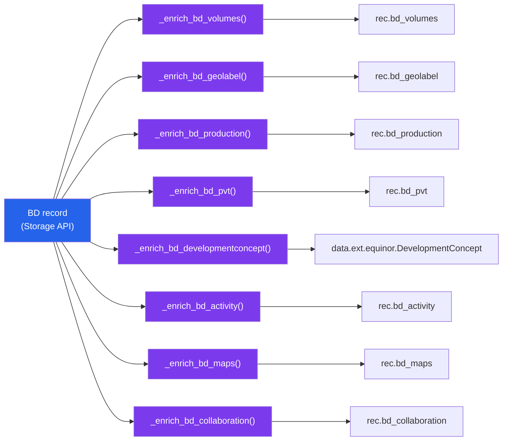

### Text

| Function | Resolves | Template Variable |
|---|---|---|
| `_enrich_bd_volumes()` | REV → stat volumes (P90/P50/P10) | `rec.bd_volumes` |
| `_enrich_bd_geolabel()` | GeoLabelSet → per-zone properties + volumes | `rec.bd_geolabel` |
| `_enrich_bd_production()` | ColumnBasedTable → 15-year forecast | `rec.bd_production` |
| `_enrich_bd_pvt()` | ColumnBasedTable (PVT) → base-case fluid props | `rec.bd_pvt` |
| `_enrich_bd_developmentconcept()` | DevelopmentConcept → facility/well plan | `data.ext.equinor.DevelopmentConcept` |
| `_enrich_bd_activity()` | Activity → workflow provenance | `rec.bd_activity` |
| `_enrich_bd_maps()` | ETPDataspace → Grid2d maps | `rec.bd_maps` |
| `_enrich_bd_collaboration()` | CollaborationProject → lifecycle + personnel | `rec.bd_collaboration` |

> **Comment**
> - All 8 enrichment functions run in parallel (asyncio.gather) — total latency ≈ slowest single call.
> - Each function follows Parameters[] edges by type: volumes follows `evidencedBy` + artifact=REV, maps follows `evidencedBy` + artifact=ETPDataspace, etc.
> - The template variable names (rec.bd_*) are what Jinja templates use to render panels.
> - Adding a new domain: write a new `_enrich_bd_*()`, add it to the gather, add a template partial.

### 5.2 Search Template Sections

### Graphic

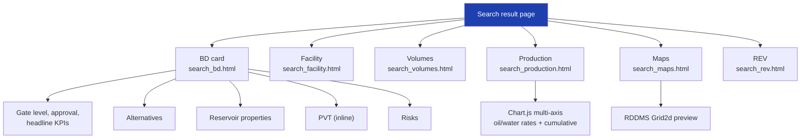

### Text

| Section | Template | Displays |
|---|---|---|
| BD card | `search_bd.html` | Gate level, approval, headline KPIs, alternatives, reservoir properties, PVT, risks |
| Facility | `search_facility.html` | FacilityConcept, WellPlan, DrainageStrategy tiles |
| Volumes | `search_volumes.html` | ColumnBasedTable rendering |
| Production | `search_production.html` | Chart.js multi-axis (oil/water rates + cumulative) |
| PVT | `search_bd.html` (inline) | Low/Base/High case fluid property table |
| Maps | `search_maps.html` | RDDMS Grid2d preview |
| REV | `search_rev.html` | Statistical volumes card |

### 5.3 Analyse Template Sections

### Graphic

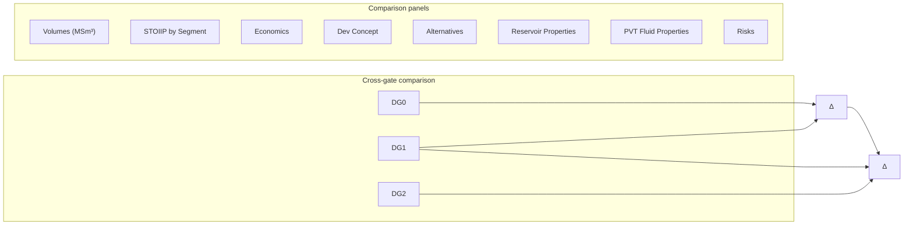

### Text

| Section | Comparison | Deltas |
|---|---|---|
| Volumes (MSm³) | STOIIP, Recoverable, RF per percentile per gate | Last gate Δ |
| STOIIP by Segment | Per zone per gate | Δ abs + % |
| Economics | NPV, CAPEX, IRR, Breakeven per gate | Last gate Δ |
| Development Concept | Facility, wells, formation per gate | (descriptive) |
| Alternatives | Ranked alternatives per gate | (per-gate) |
| Reservoir Properties | NTG, Phi, Sw, K, NetPay per segment per gate | Δ |
| PVT Fluid Properties | Pres, Tres, Pb, μ, Bo, GOR per gate (base case) | Δ |
| Risks | Risk chips with severity evolution | Added/removed/mitigated/reduced |

> **Comment**
> - The analyse view is the key differentiator vs. raw OSDU search — it computes deltas across gates.
> - Each panel shows the same data type at each gate, plus the change from last gate.
> - Risk evolution shows which risks were added, removed, escalated, or mitigated between gates.
> - The STOIIP-by-segment panel catches zone-level changes that the total might hide.

---

## 6. Implementation Patterns

### 6.1 Generator Pattern

### Graphic

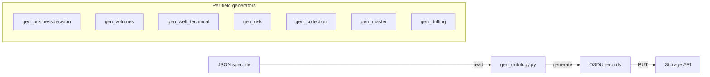

### Text

Each field dataset has a set of `gen_*.py` scripts that produce OSDU manifest JSON files:

```
gen_businessdecision_{field}.py  → manifest_bd_{field}.json
gen_volumes_{field}.py           → manifest_volumes_{field}.json
gen_well_technical_{field}.py    → manifest_welltechnical_{field}.json
gen_risk_{field}.py              → manifest_risk_{field}.json
gen_collection_{field}.py        → manifest_collection_{field}.json
gen_master_{field}.py            → manifest_master_{field}.json
gen_drilling_{field}.py          → manifest_drilling_{field}.json
```

> **Comment**
> - Each generator reads a JSON spec (or CSV/XLSX for tabular data) and produces OSDU-compliant records.
> - The generic `gen_ontology.py` handles BD + CP + Activity; domain generators handle the rest.
> - Manifests are intermediate JSON — they can be inspected before ingestion.
> - The pattern is intentionally simple: one script per domain, one manifest per domain, all idempotent (PUT overwrites).

### 6.2 Ingestion Pipeline

### Graphic

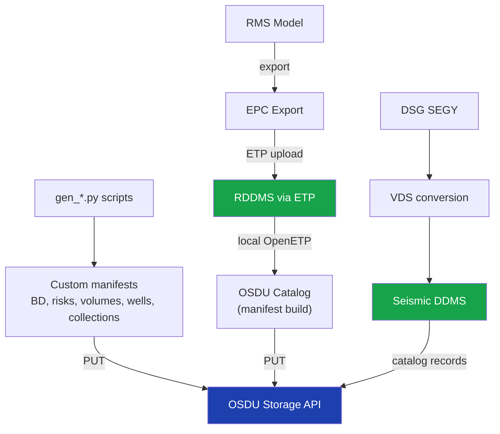

### Text

```
1. RMS model → EPC export → RDDMS (via ETP)
2. RDDMS → OSDU catalog (manifest build via local OpenETP client)
3. gen_*.py scripts → custom manifests (BD, risks, volumes, wells, collections)
4. Push all manifests → OSDU Storage API
5. Seismic: DSG SEGY → VDS → Seismic DDMS + catalog records
```

> **Comment**
> - Two parallel paths: RDDMS for geomodel binary data, Storage API for structured records.
> - The EPC→RDDMS path uses fesapi + pyetp for upload, then a local manifest builder creates catalog records.
> - Custom manifests (step 3) are where all the ontology linking happens — BD gets Parameters[] edges to everything.
> - Seismic follows a third path through DSG VDS conversion → Seismic DDMS → catalog.
> - All paths converge on the same Storage API — the BD doesn't care how its evidence got there.

### 6.3 Adding a New Domain Record

### Graphic

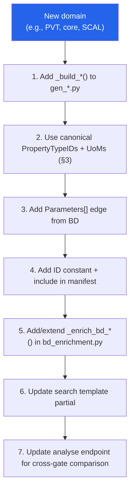

### Text

To add a new domain (e.g., PVT, core data, SCAL):

1. Add a `_build_*()` function to the appropriate `gen_*.py`
2. Use canonical OSDU PropertyTypeIDs and UoMs (see §3)
3. Add a `Parameters[]` edge from BD to the new record
4. Add ID constant and include in the manifest `WorkProductComponents` list
5. If the data should appear in BD enrichment, add/extend `_enrich_bd_*()` in `bd_enrichment.py`
6. Update search template partial to render the new data
7. Update analyse endpoint to include in cross-gate comparison

> **Comment**
> - This is the cookbook for extending the ontology to a new data domain.
> - Steps 1–4 are data engineering; steps 5–7 are application development.
> - The key principle: every new domain gets a Parameters[] edge from the BD — that's what makes it discoverable.
> - PropertyTypeIDs must be canonical OSDU reference data — don't invent custom ones unless no standard exists.

---

## 7. References

- [BusinessDecision.md](BusinessDecision.md) — BD schema & patterns
- [StratColumn.md](StratColumn.md) — Stratigraphic column guide
- [SeisInt.md](SeisInt.md) — Seismic interpretation data model
- [Dev.md](Dev.md) — Ingestion patterns & developer guide
- [PWS.md](PWS.md) — Project workspace lifecycle
- OSDU Schema Docs: [community.opengroup.org/osdu/data/data-definitions](https://community.opengroup.org/osdu/data/data-definitions)
