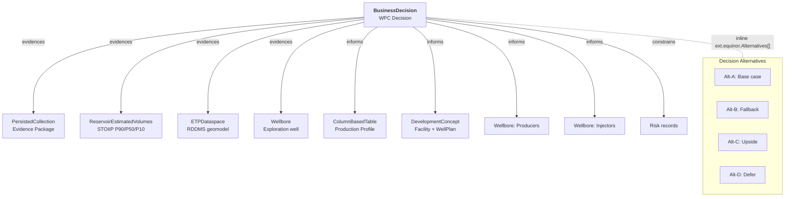

# WPC Ontology – OSDU M27 Patterns for Well Planning Decisions

**Internal reference - SWIP Team**

---

## 1. Purpose

This document defines the **generic OSDU M27 ontology patterns** used to model Well Planning Committee (WPC) decisions in the ORES platform. It is field-agnostic — specific datasets (Omega Sør, Drogon, etc.) are documented in their respective `Demo.md` files under `demo/eqn/<field>/`.

---

## 2. Record Graph – Generic WPC Structure

A WPC decision is modelled as a **BusinessDecision** record linked to evidence, constraints, and outputs via typed `Parameters[]` edges.



### 2.1 Core Record Types

| Record Kind | Role in WPC | Key Fields |
|---|---|---|
| `BusinessDecision` | Gate decision record | DecisionLevelID, ApprovalStatusID, Parameters[], RiskIDs[], ProjectSpecifications[], ext.equinor.Alternatives[] |
| `CollaborationProject` | Long-lived project wrapper | LifecycleEvents[], ActivityStates[] (gate checklist), Personnel[], TrustedCollectionID |
| `PersistedCollection` | Frozen evidence snapshot | ResourceCollectionID (list of all evidence record IDs) |
| `CollaborationProjectCollection` | Living SoR collection | Updated as new records are ingested |
| `ReservoirEstimatedVolumes` | Statistical volumes | Volumes.ColumnBasedTable with P90/P50/P10 per zone |
| `DevelopmentConcept` | Facility + well plan | FacilityConcept, WellPlan, DrainageStrategy, ReservoirTarget |
| `GeoLabelSet` | Formation evaluation | Per-zone: NTG, Phi, Sw, K, NetPay, STOIIP/Recoverable/RF per percentile |
| `ColumnBasedTable` | Tabular data (many uses) | Production profiles, well cost AFE, PVT, core data, design matrix |
| `TubularAssembly` | Casing + completion | Components[], Perforations[], BHAComponents[] |
| `Risk` | Decision hazards | Severity, Probability, MitigationActions[], MitigationActionIDs[], ext.equinor status |
| `Activity` | Workflow provenance | ActivityTemplateID, Parameters[] (inputs/outputs), WorkflowStatus |

### 2.2 Relationship Edges (Parameters[])

All inter-record links use `Parameters[]` with `Keys[ParameterKey="relationship"]` to define typed edges:

| Edge Type | Meaning | Example Target |
|---|---|---|
| `evidences` | Supporting evidence for the decision | PersistedCollection, REV, ETPDataspace, Wellbore |
| `informs` | Outputs that the decision informs | DevelopmentConcept, ColumnBasedTable (production), planned Wellbores |
| `constrains` | Constraints on the decision | Risk records |
| `supersedes` | Gate evolution (DG1→DG2) | Prior gate's BD |
| `alternativeTo` | Decision alternatives | Competing BD at same gate level |
| `mitigates` | Mitigation action → risk | Activity → Risk |

### 2.3 Interpretation Chain (RDDMS → Catalog)

```
LocalBoundaryFeature
 ├── HorizonInterpretation ← .FeatureID
 │    └── StructureMap ← .InterpretationID
 │         └── DDMSDatasets[] → eml://reservoir-ddms2/dataspace(...)
 └── FaultInterpretation ← .FeatureID
      └── GenericRepresentation ← .InterpretationID

SeismicBinGrid
 └── SeismicTraceData ← .BinGridID
      ├── DDMSDatasets[] → sd://...
      └── Artefacts[] → VDS + SEGY
```

---

## 3. Canonical Field Conventions

### 3.1 Volume Properties

| ColumnName | PropertyTypeID | UoM | FacetID |
|---|---|---|---|
| `STOIIP` / `Oil.P50` | `ReservoirEstimatedVolumePropertyType:Oil` | MSm3 / Sm3 | `StatisticalFacet:P50` |
| `RecoverableOil` / `Recoverable.P50` | `...PropertyType:RecoverableOil` | MSm3 / Sm3 | P50 |
| `RecoveryFactor` / `RecoveryFactor.P50` | `...PropertyType:RecoveryFactor` | % | P50 |
| `AssociatedGas` | `...PropertyType:AssociatedGas` | GSm3 | P50 |

### 3.2 Reservoir Properties (GeoLabelSet)

| ColumnName | PropertyTypeID | UoM |
|---|---|---|
| `NetToGross` | `ReservoirPropertyType:NetToGross` | fraction |
| `Porosity` | `ReservoirPropertyType:Porosity` | fraction |
| `WaterSaturation` | `ReservoirPropertyType:WaterSaturation` | fraction |
| `Permeability` | `ReservoirPropertyType:Permeability` | mD |
| `PermeabilityGeometric` | `ReservoirPropertyType:PermeabilityGeometric` | mD |
| `NetPay` | `ReservoirPropertyType:NetPay` | m |

### 3.3 PVT Properties (ColumnBasedTable)

| ColumnName | PropertyTypeID | UoM |
|---|---|---|
| `ReservoirPressure` | `ReservoirPropertyType:Pressure` | bar |
| `ReservoirTemperature` | `ReservoirPropertyType:Temperature` | degC |
| `BubblePoint` | `ReservoirPropertyType:BubblePointPressure` | bar |
| `Viscosity` | `ReservoirPropertyType:Viscosity` | mPas |
| `FormationVolumeFactor` | `ReservoirPropertyType:FormationVolumeFactor` | rm3/Sm3 |
| `GasOilRatio` | `ReservoirPropertyType:GasOilRatio` | Sm3/Sm3 |
| `OilDensity` | `ReservoirPropertyType:OilDensity` | kg/m3 |
| `APIGravity` | `ReservoirPropertyType:APIGravity` | degAPI |

### 3.4 Economics (ProjectSpecifications)

| ParameterTypeID | UoM | Example |
|---|---|---|
| `NPV_10pct` | MUSD | 116 |
| `CAPEX` | MUSD | 213 |
| `IRR` | % | 62 |
| `BreakevenOil` | USD/bbl | 25 |
| `STOIIP_P50` | MSm3 | 19.3 |
| `Recoverable_P50` | MSm3 | 5.4 |
| `RecoveryFactor_P50` | % | 28.5 |
| `Production_Mboe` | Mboe | 16.5 |

### 3.5 Risk Severity & Probability

| Field | Reference Data | Scale |
|---|---|---|
| `InherentSeverity` | `RiskSeverity:S1`..`S5` | S1 (negligible) → S5 (catastrophic) |
| `InherentProbability` | `RiskProbability:P1`..`P5` | P1 (rare) → P5 (almost certain) |
| `ResidualSeverity/Probability` | Same codes | After mitigation |
| `Status` | Text | OpenMitigation, Accepted, Mitigated, Closed |

---

## 4. WPC Domain Coverage

A comprehensive WPC decision requires structured records across these domains. Each uses standard OSDU M27 kinds — no custom schema extensions needed beyond `ext.equinor`.

> **Current scope (Aug 2026):** Field development WPC at **DG0/DG1**. Per Equinor's Decision Gate Process mapping, DG0–DG1 content types are: Wells, FluidContacts, Time/Depth Maps, Velocity Model, HC Volumes, Reservoir Properties (GeoLabelSet), Production Tables. The demo additionally covers PVT, Core Analysis, FMU/DesignMatrix, Well Design, and Risks — exceeding DG0/DG1 minimum requirements.

### 4.1 Decision & Economics

| Aspect | Record Kind(s) | Key Fields |
|---|---|---|
| Gate decision | BusinessDecision | DecisionLevelID, ApprovalStatusID, ProjectSpecifications[] |
| Alternatives | BD.ext.equinor.Alternatives[] | Name, Rank, Rationale, RecommendedAction, ProjectSpecifications[] |
| Gate lifecycle | CollaborationProject | LifecycleEvents[], ActivityStates[] |
| Evidence package | PersistedCollection | ResourceCollectionID (frozen refs) |

### 4.2 Volumes & Recovery

| Aspect | Record Kind(s) | Key Fields |
|---|---|---|
| Statistical volumes | ReservoirEstimatedVolumes | P90/P50/P10 STOIIP, Recoverable, RF per zone |
| In-place summary | ColumnBasedTable | Static model volumes (bulk, net, pore, HCPV, STOIIP) |
| Recovery per zone | GeoLabelSet | Oil.P50, Recoverable.P50, RecoveryFactor.P50 per segment |
| Scenario profiles | ColumnBasedTable (per scenario) | OilRate, WaterRate, CumOil over time |

### 4.3 Petrophysics & PVT

| Aspect | Record Kind(s) | Key Fields |
|---|---|---|
| Formation evaluation | GeoLabelSet | NTG, Phi, Sw, K (geometric + arithmetic), NetPay per zone |
| PVT properties | ColumnBasedTable (PVT) | Pres, Tres, Pb, μ, Bo, GOR, API, ρ_oil per zone |
| Core analysis | ColumnBasedTable (CoreData) | CCA plug count, delivery status, study types |
| Petrophysical method | GeoLabelSet.Description / Remarks | Archie params, calibration method, cut-offs |
| SCAL/Relperm | ColumnBasedTable (Relperm) | Krw, Kro curves, endpoints, analogue source |

### 4.4 Geology & Structure

| Aspect | Record Kind(s) | Key Fields |
|---|---|---|
| Stratigraphy | StratigraphicColumn | Zones, facies, key surfaces |
| Formation tops | WellboreMarkerSet | Depth picks per well |
| Structure maps | StructureMap (RDDMS) | Grid2d representations |
| Faults | FaultInterpretation + GenericRepresentation | Named faults + sticks |
| OWC uncertainty | GeoLabelSet or ColumnBasedTable | OWC range (min/mean/max) |

### 4.5 Well Design

| Aspect | Record Kind(s) | Key Fields |
|---|---|---|
| Development concept | DevelopmentConcept | FacilityConcept, WellPlan, DrainageStrategy |
| Casing & completion | TubularAssembly | Components, perforations, BHA, chemical injection |
| Well cost | ColumnBasedTable | Per-phase cost breakdown |
| PPFG | PPFGDataset | Pore pressure / fracture gradient curves |
| Formation prognosis | PlannedLithology | Expected lithology vs depth |

### 4.6 Risks & Mitigations

| Aspect | Record Kind(s) | Key Fields |
|---|---|---|
| Risk register | Risk (multiple) | Severity, Probability (inherent + residual), MitigationActions[] |
| Mitigation actions | Activity | Linked via Risk.MitigationActionIDs[], with due dates |
| Contingency chains | BD.Remarks[] + Risk.Description | Decision trees (Ba thresholds, OWC outcomes) |

### 4.7 Simulation & FMU

| Aspect | Record Kind(s) | Key Fields |
|---|---|---|
| Simulation workflow | Activity + ActivityTemplate | Grid size, ensemble count, software |
| Design matrix | ColumnBasedTable | Parameter name, min, base, max, weight, distribution |
| Production forecast | ColumnBasedTable | Year, OilRate, WaterRate, GasRate, CumOil, WaterCut |
| PVT for simulator | ColumnBasedTable | Pres, Tres, Pb, Bo, Rs, μ per case (low/base/high) |

---

## 5. Enrichment & Rendering Pipeline

### 5.1 BD Enrichment Functions (`bd_enrichment.py`)

| Function | Resolves | Template Variable |
|---|---|---|
| `_enrich_bd_volumes()` | REV → stat volumes (P90/P50/P10) | `rec.bd_volumes` |
| `_enrich_bd_geolabel()` | GeoLabelSet → per-zone properties + volumes | `rec.bd_geolabel` |
| `_enrich_bd_production()` | ColumnBasedTable → 15-year forecast | `rec.bd_production` |
| `_enrich_bd_pvt()` | ColumnBasedTable (PVT) → base-case fluid props | `rec.bd_pvt` |
| `_enrich_bd_developmentconcept()` | DevelopmentConcept → facility/well plan | `data.ext.equinor.DevelopmentConcept` |
| `_enrich_bd_activity()` | Activity → workflow provenance | `rec.bd_activity` |
| `_enrich_bd_maps()` | ETPDataspace → Grid2d maps | `rec.bd_maps` |
| `_enrich_bd_collaboration()` | CollaborationProject → lifecycle + personnel | `rec.bd_collaboration` |

### 5.2 Search Template Sections

| Section | Template | Displays |
|---|---|---|
| BD card | `search_bd.html` | Gate level, approval, headline KPIs, alternatives, reservoir properties, PVT, risks |
| Facility | `search_facility.html` | FacilityConcept, WellPlan, DrainageStrategy tiles |
| Volumes | `search_volumes.html` | ColumnBasedTable rendering |
| Production | `search_production.html` | Chart.js multi-axis (oil/water rates + cumulative) |
| PVT | `search_bd.html` (inline) | Low/Base/High case fluid property table |
| Maps | `search_maps.html` | RDDMS Grid2d preview |
| REV | `search_rev.html` | Statistical volumes card |

### 5.3 Analyse Template Sections

| Section | Comparison | Deltas |
|---|---|---|
| Volumes (MSm³) | STOIIP, Recoverable, RF per percentile per gate | Last gate Δ |
| STOIIP by Segment | Per zone per gate | Δ abs + % |
| Economics | NPV, CAPEX, IRR, Breakeven per gate | Last gate Δ |
| Development Concept | Facility, wells, formation per gate | (descriptive) |
| Alternatives | Ranked alternatives per gate | (per-gate) |
| Reservoir Properties | NTG, Phi, Sw, K, NetPay per segment per gate | Δ |
| PVT Fluid Properties | Pres, Tres, Pb, μ, Bo, GOR per gate (base case) | Δ |
| Risks | Risk chips with severity evolution | Added/removed/mitigated/reduced |

---

## 6. Implementation Patterns

### 6.1 Generator Pattern

Each field dataset has a set of `gen_*.py` scripts that produce OSDU manifest JSON files:

```
gen_businessdecision_{field}.py  → manifest_bd_{field}.json
gen_volumes_{field}.py           → manifest_volumes_{field}.json
gen_well_technical_{field}.py    → manifest_welltechnical_{field}.json
gen_risk_{field}.py              → manifest_risk_{field}.json
gen_collection_{field}.py        → manifest_collection_{field}.json
gen_master_{field}.py            → manifest_master_{field}.json
gen_drilling_{field}.py          → manifest_drilling_{field}.json
```

### 6.2 Ingestion Pipeline

```
1. RMS model → EPC export → RDDMS (via ETP)
2. RDDMS → OSDU catalog (manifest build via local OpenETP client)
3. gen_*.py scripts → custom manifests (BD, risks, volumes, wells, collections)
4. Push all manifests → OSDU Storage API
5. Seismic: DSG SEGY → VDS → Seismic DDMS + catalog records
```

### 6.3 Adding a New Domain Record

To add a new domain (e.g., PVT, core data, SCAL):

1. Add a `_build_*()` function to the appropriate `gen_*.py`
2. Use canonical OSDU PropertyTypeIDs and UoMs (see §3)
3. Add a `Parameters[]` edge from BD to the new record
4. Add ID constant and include in the manifest `WorkProductComponents` list
5. If the data should appear in BD enrichment, add/extend `_enrich_bd_*()` in `bd_enrichment.py`
6. Update search template partial to render the new data
7. Update analyse endpoint to include in cross-gate comparison

---

## 7. References

- [BusinessDecision.md](BusinessDecision.md) — BD schema & patterns
- [StratColumn.md](StratColumn.md) — Stratigraphic column guide
- [SeisInt.md](SeisInt.md) — Seismic interpretation data model
- [Dev.md](Dev.md) — Ingestion patterns & developer guide
- [PWS.md](PWS.md) — Project workspace lifecycle
- OSDU Schema Docs: [community.opengroup.org/osdu/data/data-definitions](https://community.opengroup.org/osdu/data/data-definitions)
