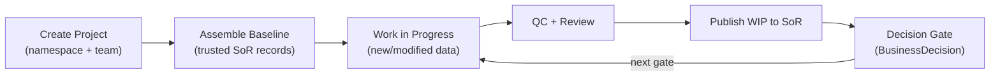
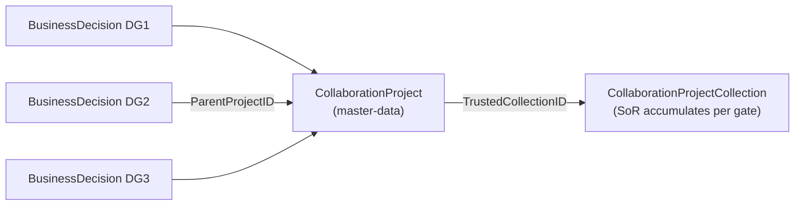
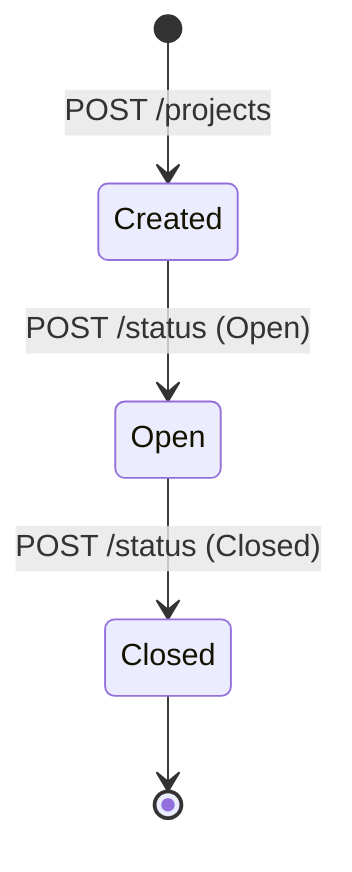
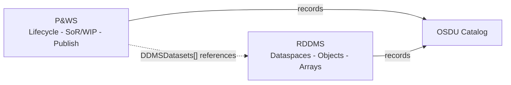
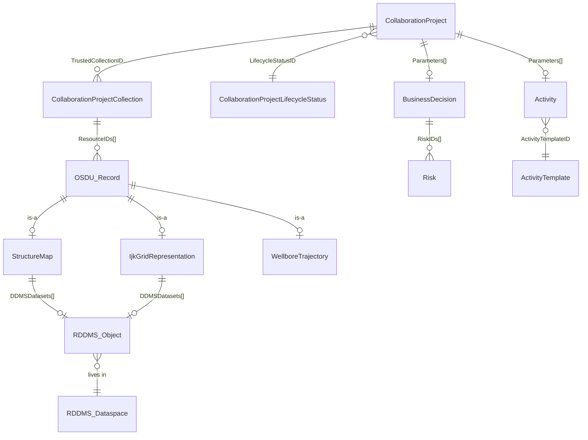
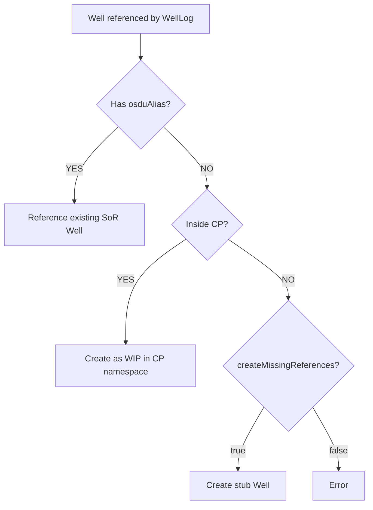

# Project & Workflow Service (P&WS)

> How to organize multi-discipline collaboration in OSDU - from creating a project namespace through WIP/SOR lifecycle to decision-gate closure.
>
> **Source of truth:** [CollaborationPrj.md (RDDMS Home)](https://community.opengroup.org/osdu/platform/domain-data-mgmt-services/reservoir/home/-/blob/main/docs/CollaborationPrj.md) — this page adds P&WS API specifics and Equinor workflows.

**Related**: [Activity](/howto/activity) · [BusinessDecision](/howto/business-decision) · [Volumes](/howto/volumes) · [Risk](/howto/risk) · [Query](/howto/query-guide)

> [!IMPORTANT]
> **Availability (June 2026)**: P&WS exists as an AWS provider (`provider/pws-aws`) but is not deployed on Azure ADME. The schemas are defined in OSDU Data Definitions and work today via the Storage API on any platform. This guide covers both the P&WS API (for when it ships) and preparation patterns using existing OSDU + RDDMS capabilities.

---

## 1. The Collaboration Workflow

A `CollaborationProject` is a persistent namespace that bridges work-in-progress (WIP) and trusted System of Record (SoR). It persists across decision gates, accumulating curated data at each milestone.



Typical questions:

- How do I isolate WIP data from the trusted baseline?
- How do I track what was published at each decision gate?
- How do I connect RDDMS dataspaces to project governance?
- How do I give partners controlled access to a data room?

---

## 2. What Is What

| Concept | Kind | Role |
|---------|------|------|
| **CollaborationProject** | `master-data` | Persistent cross-gate namespace |
| **CollaborationProjectCollection** | `work-product-component` | Versioned SoR accumulator (ResourceIDs[]) |
| **CollaborationProjectLifecycleStatus** | `reference-data` | Open / Closed |
| **BusinessDecision** | `master-data` | Per-gate decision hub, links via ParentProjectID |



---

## 3. SoR and WIP

| Layer | What | How |
|-------|------|-----|
| **SoR (Trusted)** | Existing OSDU records selected as project baseline | Add IDs to TrustedCollectionID |
| **WIP** | New/modified records in project namespace | Ingest via Storage API; tracked separately |
| **Publish** | Promote WIP to SoR | Publishing endpoint; returns 409 on conflict |

---

## 4. Project Lifecycle



Typical flow:

1. Create project (namespace, team, purpose)
2. Open - assemble trusted SoR baseline (wells, grids, surfaces)
3. Ingest WIP records into project namespace
4. QC and review
5. Publish WIP to SoR (409 = conflict, resolve first)
6. Close project (audit trail preserved)

Auto-logged events: Created, Open, SOR Resources added, WIP Resources published, Closed.

---

## 5. RDDMS Integration

P&WS governs project lifecycle; RDDMS stores domain data (grids, properties, surfaces, arrays). They connect through OSDU catalog records containing `DDMSDatasets[]` URIs.



### Namespace-to-dataspace mapping

| Approach | Description |
|----------|-------------|
| **Layered** (recommended) | `<project>/sor` (locked) + `<project>/wip` (unlocked). Publishing = copy objects from WIP to SoR dataspace |
| **1:1** | One dedicated dataspace per project |
| **Shared** | Multiple projects share dataspaces (simpler but weaker isolation) |

### Dataspace convention (works today)

```
<project-id>/sor    - locked baseline
<project-id>/wip    - unlocked working area
<project-id>/review - cloned from wip, locked for QC
```

### RDDMS endpoints for collaboration

| Endpoint | Method | Purpose |
|----------|--------|---------|
| `/dataspaces` | POST | Create project dataspaces |
| `/dataspaces/:id/clone` | POST | Fork SoR to WIP snapshot |
| `/dataspaces/:id/lock` | POST | Freeze SoR baseline (read-only) |
| `/dataspaces/:id/lock` | DELETE | Re-open for edits |
| `/dataspaces/:id` | DELETE | Cleanup at project closure |
| `/resources/:dataspaceId` | PUT | Write objects to WIP |
| `/query/graph/search` | POST | Discover relationships |

ETP protocol additionally supports `CopyDataspacesContent` (bulk WIP to SoR) and `CopyToDataspace` (selective publish).

---

## 6. Use Cases

### Reservoir study (DG2/DG3)
Create project scoped to target reservoir. Assemble trusted baseline. Each discipline works in WIP. Publish after QC. Project persists across gates.

### Ensemble simulation
Link project to ensemble case and design matrix. Ingest volumes/surfaces as WIP. Review in visualization tools. Publish P10/P50/P90 to SoR. Activity records capture provenance.

### Well planning
Add existing wells + geomodel as trusted SoR. Design new trajectories as WIP. Run collision checks. Publish approved trajectories; discard rejected at closure.

### RESQML data package
Reference RDDMS dataspace via `Parameters[GeoModelDataspace]`. Register catalog records as trusted SoR. Import modified objects as WIP. Use GraphQL deep-search to compare. Publish approved records.

### Cross-asset data sharing
Restrict `ProjectContributorACL` to partner users. Trusted resources = "data room". Partner contributes WIP. Joint review then publish agreed records. Closure = audit trail.

---

## 7. Working Today (Without P&WS API)

These patterns are forward-compatible with P&WS when it ships.

### Create a CollaborationProject record (Storage API)

```json
{
  "kind": "osdu:wks:master-data--CollaborationProject:1.0.0",
  "data": {
    "ProjectID": "DG2-Field-2025",
    "ProjectName": "Field DG2 Concept Select",
    "Purpose": "Evaluate development concepts",
    "ProjectBeginDate": "2025-01-15",
    "LifecycleStatusID": "osdu:reference-data--CollaborationProjectLifecycleStatus:Open:",
    "Personnel": [
      {"PersonName": "Alice Geologist", "ProjectRoleID": "Lead"},
      {"PersonName": "Bob Engineer", "ProjectRoleID": "Contributor"}
    ],
    "Parameters": [
      {"ParameterID": "GeoModelDataspace", "DataObjectParameter": "eml:///dataspace('dg2-field/sor')"},
      {"ParameterID": "WIPDataspace", "DataObjectParameter": "eml:///dataspace('dg2-field/wip')"},
      {"ParameterID": "TargetReservoir", "DataObjectParameter": "osdu:master-data--Reservoir:field:"}
    ],
    "LifecycleEvents": [
      {"EventID": "1", "Name": "Created", "DateTime": "2025-01-15T09:00:00Z", "Remark": "Initial setup"}
    ]
  }
}
```

### Trusted Collection record

```json
{
  "kind": "osdu:wks:work-product-component--CollaborationProjectCollection:1.0.0",
  "data": {
    "ResourceIDs": [
      "osdu:work-product-component--WellboreTrajectory:traj-1:",
      "osdu:work-product-component--StructureMap:surf-topReservoir:",
      "osdu:work-product-component--IjkGridRepresentation:grid-main:"
    ]
  }
}
```

Reference from `CollaborationProject.TrustedCollectionID`. Update version to add resources.

### Manual lifecycle journaling

Append entries to `LifecycleEvents[]` on each project milestone:

| Event | When |
|-------|------|
| SOR Dataspace Locked | After locking baseline |
| WIP Dataspace Created | After clone |
| RESQML Import | After writing objects to WIP |
| QC Review | Reviewer sign-off |
| Published to SOR | After WIP to SoR copy |
| Closed | Final |

### Migration to P&WS

When the service deploys on your platform, existing records are schema-compatible. P&WS will recognize your CollaborationProject records, continue the lifecycle journal, and use your CollaborationProjectCollection as TrustedCollectionID targets.

---

## 8. Terminology

| Term | Meaning |
|------|---------|
| CP | CollaborationProject - the master-data record |
| SoR | System of Record - trusted, curated baseline |
| WIP | Work in Progress - editable working area |
| Publish | Promote WIP records to SoR (conflict detection) |
| Namespace | Isolation boundary for WIP records |
| TrustedCollectionID | Link from CP to the WPC that lists SoR resource IDs |
| Dataspace | RDDMS isolation container (maps to CP namespace) |

---

## 9. References

| Topic | Link |
|-------|------|
| P&WS repo | [community.opengroup.org/.../project-and-workflow](https://community.opengroup.org/osdu/platform/system/project-and-workflow) |
| OpenAPI spec | [openapi.yaml](https://community.opengroup.org/osdu/platform/system/project-and-workflow/-/blob/main/docs/api/openapi.yaml) |
| CollaborationProject schema | [OSDU Data Definitions](https://community.opengroup.org/osdu/data/data-definitions/-/blob/master/E-R/master-data/CollaborationProject.1.0.0.md) |
| MVP1 notebook | [mvp1.ipynb](https://community.opengroup.org/osdu/platform/system/project-and-workflow/-/blob/main/docs/notebook/mvp1.ipynb) |
| Query guide | [Query](/howto/query-guide) |
| Activity and provenance | [Activity](/howto/activity) |
| BusinessDecision | [BusinessDecision](/howto/business-decision) |

---

## Appendix A: Schema Key Fields

| Field | Type | Description |
|-------|------|-------------|
| `ProjectID` | string | Short identifier |
| `ProjectName` | string | Display name |
| `Purpose` | string | Objectives |
| `ProjectBeginDate` / `ProjectEndDate` | ISO 8601 | Schedule window |
| `Namespace` | UUID | WIP isolation namespace |
| `LifecycleStatusID` | ref-data ID | Open or Closed |
| `TrustedCollectionID` | WPC ID | Points to CollaborationProjectCollection |
| `DefaultWIPACL` | object | ACL applied to WIP resources |
| `ProjectContributorACL` | object | Who can contribute |
| `Personnel[]` | array | Team members with name and role |
| `Parameters[]` | array | Links to dataspaces, reservoirs, collections |
| `LifecycleEvents[]` | array | Journal: EventID, Name, DateTime, Remark |

---

## Appendix B: P&WS API Reference

All endpoints require `Authorization: Bearer <token>`, `data-partition-id`, and `Content-Type: application/json`.

| Method | Endpoint | Description |
|--------|----------|-------------|
| POST | `/projects` | Create project |
| GET | `/projects` | List projects (limit, offset) |
| GET | `/projects/{id}` | Get project |
| POST | `/projects/{id}/status` | Set status (Open or Closed) |
| GET | `/projects/{id}/resources` | List trusted SoR resource IDs |
| POST | `/projects/{id}/resources` | Add SoR records (body = array of IDs) |
| DELETE | `/projects/{id}/resources` | Remove from trusted set |
| GET | `/projects/{id}/wip-resources` | List WIP resource IDs |
| POST | `/projects/{id}/wip-resources/publishing` | Publish WIP to SoR (409 on conflict) |
| GET | `/projects/{id}/lifecycleevents` | List lifecycle events |
| POST | `/projects/{id}/lifecycleevents` | Add event (Name, Remark) |

---

## Appendix C: Entity Relationships



---

## Appendix D: RDDMS Technical Design

> The RDDMS manifest builder automatically generates CP records from ETP dataspaces. Available on AWS OSDU (M27+). On Azure ADME, ingest CP records via Storage API directly.

### Dataspace to CP mapping

| ETP Dataspace | CollaborationProject Field | Notes |
|---|---|---|
| `path` | `data.Namespace` / `data.ProjectName` | WIP namespace + display name |
| `storeCreated` | `data.CreationDateTime` | When created |
| ACL (customData) | `data.DefaultWIPACL` / `data.ProjectContributorACL` | Access control |
| Lock state | `data.LifecycleStatusID` | Open (unlocked) / Closed (locked) |
| UUID v5(path) | `id` | Deterministic, stable |

### Consistency model

The manifest build is the sync point. Between builds, OSDU may be stale.

| Guaranteed | Not guaranteed |
|-----------|---------------|
| Deterministic identity (UUID v5) | Real-time sync |
| Version tracking (bumps on update) | Lock propagation to OSDU |
| Idempotent (repeatable builds) | Cross-DDMS coordination |
| Additive updates (never deletes) | Deletion cascade |

### Multi-domain collaboration

Use the `x-collaboration` header to tie multiple DDMS instances to the same CP:

```
Reservoir DDMS:  dataspace 'project-alpha/reservoir'
Seismic DDMS:    dataspace 'project-alpha/seismic'
Well DDMS:       dataspace 'project-alpha/wells'
```

With `x-collaboration: {"id": "shared-cp-uuid"}`, all manifest builds reference the same CollaborationProject.

### Wells strategy

Wells are master-data (SoR-owned) but WellLogs must reference them:



Guidance:
- Well exists in OSDU - use `osduAlias` or `x-collaboration` header
- New field study - use CollaborationProject dataspace (wells are WIP until published)
- Production - let MDM own Well creation; reference via alias
