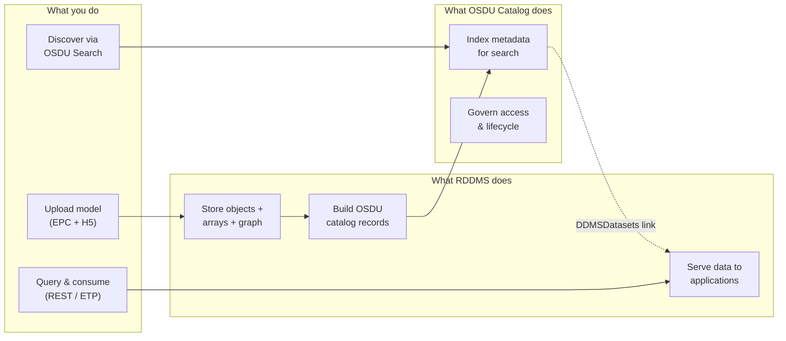
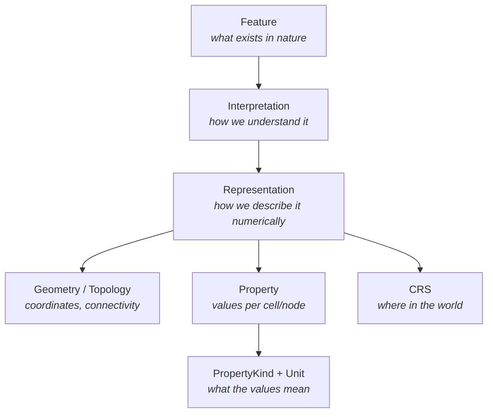
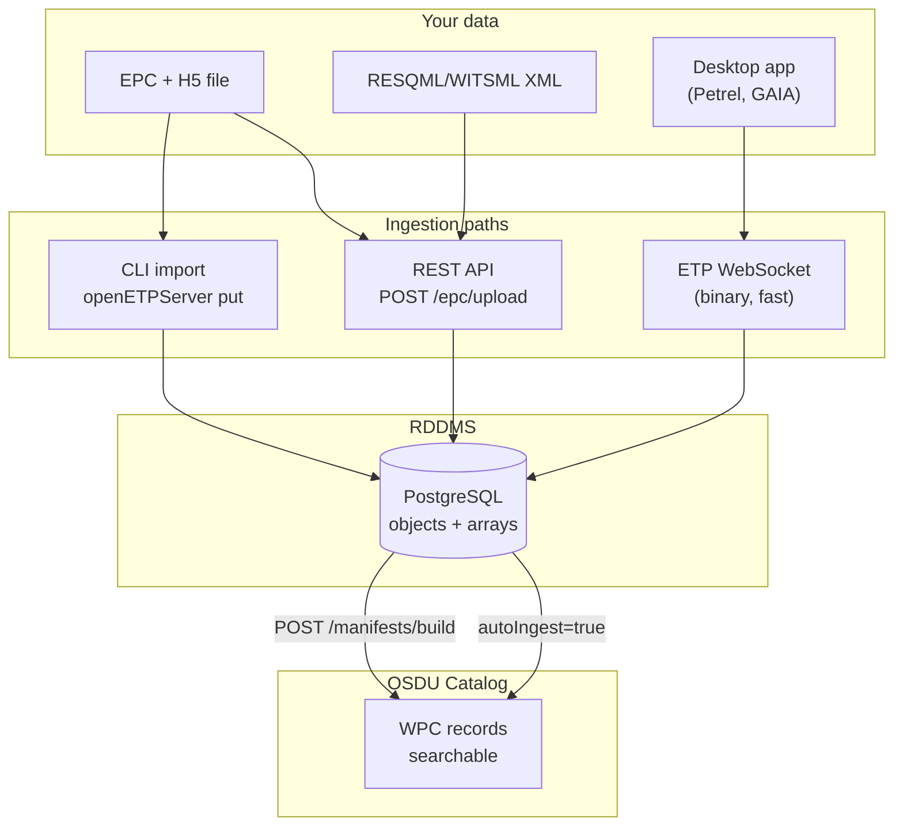
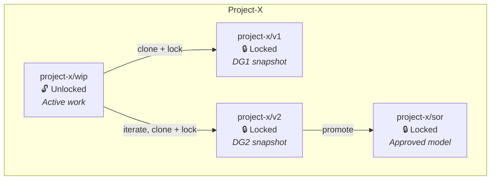
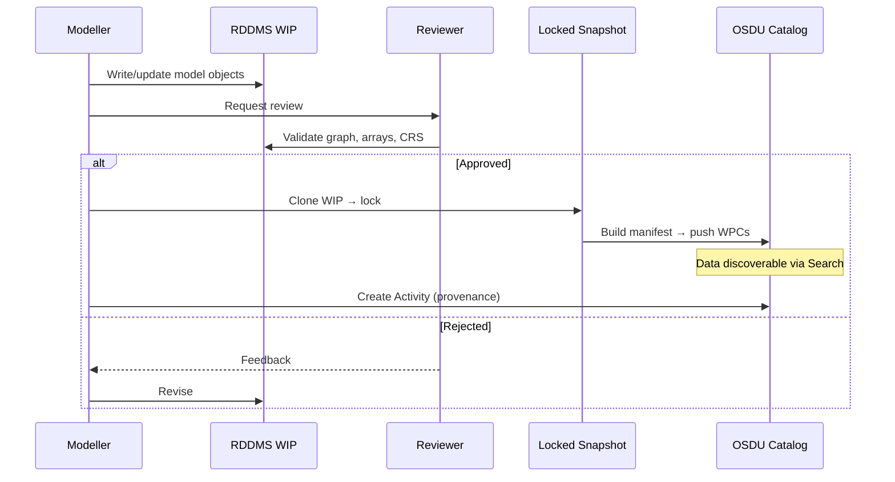
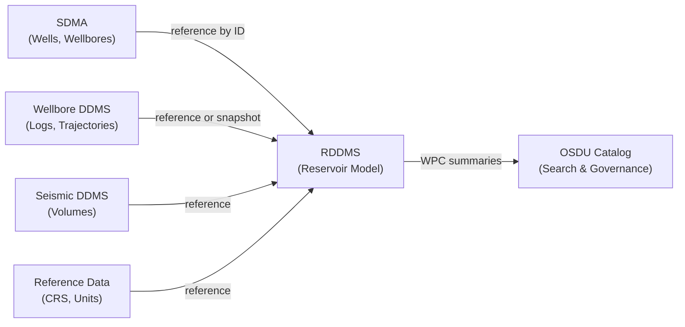
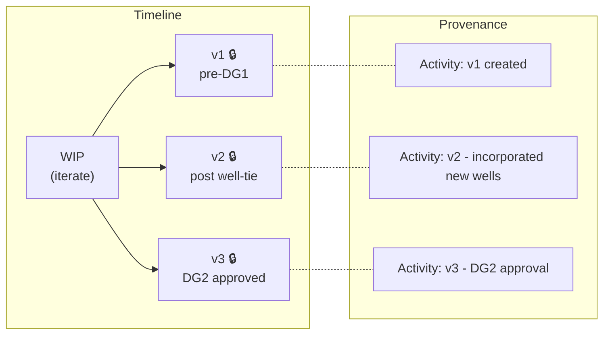
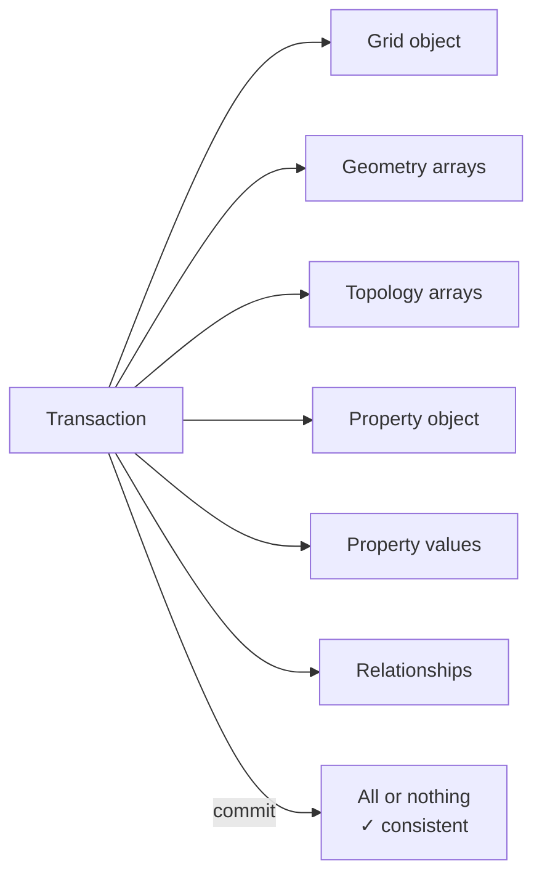

# RDDMS Governance & Usage Guide

> A practical guide for **users** (geoscientists, reservoir engineers) and **data managers** who work with the Reservoir Domain Data Management Service.

[[_TOC_]]

---

## What Is RDDMS?

The Reservoir DDMS stores, serves, and manages subsurface model data — the RESQML objects that describe geological structures, grids, surfaces, properties, and their relationships.

**The fundamental principle:**

> Catalog **discovers** reservoir models. RDDMS **manages and serves** reservoir model content.

---

## Why Not Just Store Arrays?

RESQML is not "metadata + arrays." It's a **domain object graph** where meaning comes from linked objects:

If you split this graph across systems (arrays in one, objects in another), every application must reassemble the meaning. RDDMS keeps them together.

| System | Owns | Does NOT own |
|--------|------|-------------|
| **RDDMS** | Model graph, arrays, topology, properties, derived objects | Enterprise wells, official logs, raw seismic |
| **OSDU Catalog** | Discovery metadata, WPC summaries, lineage, governance | Numerical arrays, object relationships |
| **Other DDMSes** | Their domain data (wells, logs, seismic, CRS, units) | Reservoir model objects |

---

## How Data Gets In

| Path | Best for | Catalog registration |
|------|----------|---------------------|
| **EPC upload** (`POST /epc/upload`) | One-shot model upload | `?autoIngest=true` — automatic |
| **ETP WebSocket** | Streaming, desktop apps, large arrays | Separate manifest build step |
| **REST PUT** | Web clients, scripting | Separate manifest build step |
| **CLI import** | Offline bulk import | Manual manifest + push |

### Auto-Ingest: One-Call Ingestion

With `autoIngest=true`, the EPC upload stores your data AND registers it in the OSDU catalog in a single call — matching the user experience of other DDMSes (Seismic, Wellbore):

| Mode | How it works | Data searchable |
|------|-------------|-----------------|
| `autoIngest=records` (default) | Pushes directly to Storage Service | Immediately |
| `autoIngest=workflow` | Submits to Airflow DAG | After 30-90s |
| `autoIngest=false` | No catalog registration | Only via RDDMS APIs |

---

## Dataspaces: Where Your Data Lives

Every piece of data lives in a **dataspace** — a named, governed container:

| Dataspace type | Lock | Purpose | Who can write |
|---------------|------|---------|---------------|
| **WIP** (work-in-progress) | Unlocked | Active modelling | Project contributors |
| **Snapshot** | Locked | Gate evidence, reproducibility | Nobody (immutable) |
| **SoR** (system of record) | Locked | Approved model version | Nobody (immutable) |

### Rules

- **WIP is isolated** — project teams work without affecting others
- **Snapshots are immutable** — once locked, content cannot change
- **ACL = data-room boundary** — access is controlled per dataspace
- **Sharing = access grant, not copy** — avoid uncontrolled replication

---

## The Publish Workflow

Each publish creates:
1. **Locked snapshot** — immutable model state
2. **OSDU WPC records** — searchable catalog entries with `DDMSDatasets[]` links
3. **Activity record** — provenance (who, when, what changed, inputs/outputs)
4. **Lifecycle event** — human-readable changelog entry

---

## What RDDMS Owns vs. What It References

### RDDMS Owns (model content)

- Features, interpretations, representations
- Grid geometry and topology
- Surface meshes and point sets
- Continuous and discrete properties (PORO, PERMX, SW, FACIES...)
- Structural frameworks and sealed models
- Model-derived objects (blocked wells, upscaled logs, grid/well intersections)
- Property kinds, stratigraphic context within the model
- Binary arrays (geometry, values)

### RDDMS References (external authority)

- Enterprise wells and wellbores → **SDMA / Wellbore DDMS**
- Official trajectories and logs → **Wellbore DDMS**
- Seismic volumes → **Seismic DDMS**
- CRS and unit definitions → **Reference-data services**
- Enterprise stratigraphy → **Central catalog**

### Reference Patterns

| Pattern | When to use | Example |
|---------|------------|---------|
| **Reference only** | Master data that stays authoritative elsewhere | Well ID, CRS EPSG code |
| **Snapshot** | Reproducibility requires frozen state | Trajectory version used for blocked wells |
| **Derive** | Model creates new objects from external inputs | Blocked-wellbore representation, upscaled properties |
| **Copy** | Data-room or partner boundaries require it | JV export, regulatory submission |

> **Rule:** Reference first. Snapshot only when reproducibility demands it. Derive for model-specific objects. Copy only when governance requires it.

---

## Versioning Without Git

RDDMS dataspaces are mutable (WIP) or immutable (locked). There's no built-in version history like Git. Instead, use this pattern:

| Mechanism | Purpose |
|-----------|---------|
| **Locked snapshots** | Immutable model states (the "versions") |
| **Activity records** | What changed, who, when, inputs/outputs |
| **Lifecycle events** | Human-readable changelog on CollaborationProject |
| **PersistedCollection** | Frozen gate evidence (what a decision was based on) |

---

## Transactions and Consistency

Reservoir model updates often involve multiple objects:

- All objects in a transaction commit together or roll back together
- No partial model states become visible
- External transactions (caller-managed) or internal (auto-commit)
- Timeout: 300s default, with keepalive pings

---

## Access Control

| Dataspace | Owners | Viewers | Lock |
|-----------|--------|---------|------|
| Project WIP | Project contributors | Project viewers | Unlocked |
| Snapshot | Field/project owners | Project viewers | Locked |
| Model SoR | Asset owners | Enterprise viewers | Locked |
| JV/shared | JV contributors | Partner data-room | Locked |

**Rules:**
- ACL is the data-room boundary
- Legal tags validated before promotion or sharing
- Published records never more permissive than source data
- Cross-border sharing validates data countries

---

## Practical Domain Rules

### Wells & Wellbores

| RDDMS stores | RDDMS does NOT store |
|--------------|---------------------|
| References to wells/wellbores | New official well records |
| Blocked-wellbore representations | Uncontrolled copies of raw logs |
| Grid/well intersections | Official trajectories |
| Simulation connection objects | — |

### Logs

| RDDMS stores | RDDMS does NOT store |
|--------------|---------------------|
| References to source logs | Raw/governed logs (Wellbore DDMS owns) |
| Upscaled log-derived properties | Uncontrolled log copies |
| Provenance linking to source | — |

### Stratigraphy, CRS, Units

- Reference from enterprise services
- Snapshot only when reproducibility requires it
- Project-local stratigraphy = proposal, not replacement for enterprise data

### FMU & Ensembles

| RDDMS stores | Stays in results store |
|--------------|----------------------|
| Selected model objects & realizations | Raw FMU ensemble outputs |
| P10/P50/P90 promoted summaries | Full ensemble runs |
| Static model versions | — |

---

## Implementation Checklist

### Project setup

- [ ] Create `CollaborationProject` in OSDU catalog
- [ ] Create project WIP dataspace (e.g. `project-x/wip`)
- [ ] Set dataspace ACL groups (owners + viewers)
- [ ] Register legal tags
- [ ] Create initial `CollaborationProjectCollection`

### During work

- [ ] Write model objects to WIP (ETP, REST, or EPC upload)
- [ ] Reference wells/logs/CRS from authoritative sources (don't duplicate)
- [ ] Create Activity records for significant updates
- [ ] Validate: object graph integrity, arrays present, CRS correct

### At decision gate

- [ ] Clone WIP → locked snapshot
- [ ] Build manifest (`POST /manifests/build` or `autoIngest=true`)
- [ ] Verify WPC records in OSDU Search
- [ ] Create Activity (provenance for this version)
- [ ] Create `PersistedCollection` (frozen gate evidence)
- [ ] Link to `BusinessDecision` if at formal gate

### At project close

- [ ] Lock final snapshot
- [ ] Archive/retain snapshots per retention policy
- [ ] Delete abandoned WIP dataspaces
- [ ] Keep all snapshots referenced by BusinessDecision
- [ ] Record final lifecycle event

---

## Comparison: RDDMS as Full DDMS vs. Arrays-Only

| Aspect | RDDMS as proper DDMS ✓ | Arrays-only (objects in catalog) |
|--------|----------------------|-------------------------------|
| Object graph | Preserved, queryable | Split across services |
| Array meaning | Linked to context | Separated from context |
| Transactions | Atomic model updates | Distributed coordination needed |
| Reproducibility | Dataspace = complete model | Must reassemble from multiple services |
| Domain query | "What properties on this grid?" | Must query catalog + RDDMS separately |
| Application perf | Single service call | Multiple cross-service hops |
| Complexity | Higher implementation | Simpler but brittle |

---

## Risks & Mitigations

| Risk | Mitigation |
|------|-----------|
| RDDMS becomes duplicate Wellbore DDMS | Reference wells/logs, derive model objects only |
| Catalog becomes accidental model DB | Keep catalog to summaries + DDMS links |
| Stale external references | Store source version + timestamp; snapshot when needed |
| No native versioning | Locked snapshots + Activities + lifecycle events |
| Orphan arrays or objects | Transaction layer enforces reference integrity |
| ACL sprawl | Standardize naming; automate project setup/cleanup |

---

## Glossary

| Term | Meaning |
|------|---------|
| **FIRP** | Feature → Interpretation → Representation → Property (RESQML object pattern) |
| **WPC** | Work Product Component (OSDU catalog record type) |
| **DDMSDatasets** | Field on a WPC linking to the authoritative DDMS location |
| **SoR** | System of Record — locked, governed, authoritative |
| **SoE** | System of Engagement — mutable, project-scoped, collaborative |
| **EPC** | Energistics Package Convention — ZIP file containing RESQML XML objects |
| **Dataspace** | Named container in RDDMS (like a folder/project/version) |
| **Manifest** | OSDU JSON structure that registers DDMS content in the catalog |
| **autoIngest** | EPC upload option that auto-builds manifest + pushes to catalog |

---

## Further Reading

- [RddmsIntegration.md](RddmsIntegration.md) — Technical details: parser comparison, CRS mapping, M27 object compression
- [RestApi.md](/home/maap/rddms/RestApi.md) — Full REST API reference
- [RDDMS Architecture](https://community.opengroup.org/osdu/platform/domain-data-mgmt-services/reservoir/home) — Service components and deployment
