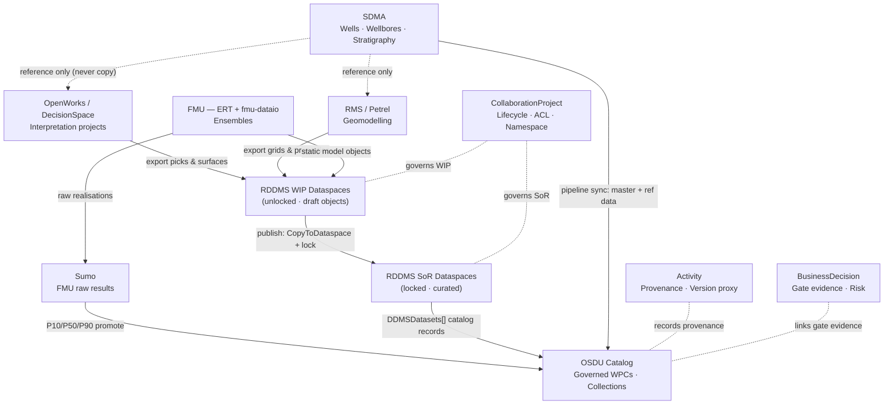
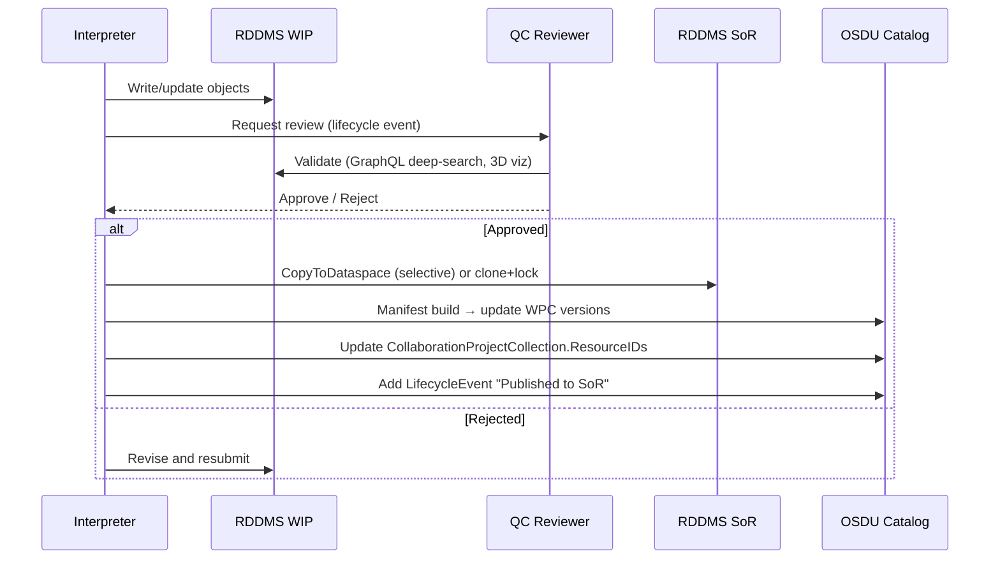
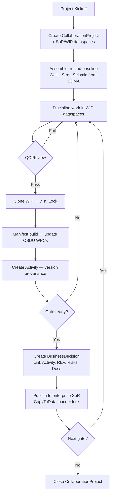

# Subsurface Project Data Governance Strategy

> **Scope**: End-to-end governance for subsurface projects spanning wellbore master data, OpenWorks/DecisionSpace interpretation sets, SDMA reference data, FMU ensembles, and RDDMS content storage — with versioning, SoR/SoE separation, and cross-discipline collaboration.
>
> **Related**: [PWS](PWS.md) · [Activity](Activity.md) · [FmuOsdu](FmuOsdu.md) · [Uncertainty](Uncertainty.md) · [SeisInt](SeisInt.md)

---

## 1. Design Principles

| # | Principle | Rationale |
|---|-----------|-----------|
| 1 | **Master data is sacred** | Wells, wellbores, reservoirs, stratigraphy are system-of-record (SoR) anchored in SDMA. Never duplicate — only reference. |
| 2 | **Reference data is governed centrally** | CRS, units, facets, strat columns, fluid contacts come from the enterprise catalog. Projects consume, never fork. |
| 3 | **Work-in-progress is isolated** | Each project/study operates in a WIP namespace until QC and publish. |
| 4 | **Versions via Activities + CollaborationProject** | RDDMS has no native versioning — mimic it using Activity provenance, CollaborationProject lifecycle events, and dataspace snapshots. |
| 5 | **ACL = data room boundary** | Access is governed per dataspace + OSDU ACL group. Sharing = ACL grant, not data copy. |
| 6 | **Copies are explicit and traceable** | Any SoR→SoE or SoE→SoR transition is recorded with lineage (ancestry.parents, Activity parameters). |

---

## 2. Architecture Layers



**Data flow summary:**

| From | To | Mechanism |
|---|---|---|
| OpenWorks / RMS / ERT | RDDMS WIP | Export RESQML objects (ETP / EPC) |
| RDDMS WIP | RDDMS SoR | `CopyToDataspace` + lock |
| RDDMS SoR | OSDU Catalog | Manifest build → `DDMSDatasets[]` on WPCs |
| SDMA | OSDU Catalog | Pipeline sync (wells, strat, ref-data) |
| SDMA | SoE tools | Reference only (never copy) |
| FMU | OSDU (via Sumo) | fmu-dataio → Sumo → OSDU sync |
| Governance (CP) | WIP + SoR | ACL, namespace, lifecycle |
| Activity / BD | OSDU Catalog | Provenance + gate evidence |

---

## 3. Synchronisation with Master & Reference Data

### 3.1 Wellbore & Trajectory (SDMA → OSDU → RDDMS)

| Source system | What | Sync mechanism | Frequency |
|---|---|---|---|
| SDMA / EDM | Well, Wellbore, WellboreTrajectory | SDMA→OSDU ingestion pipeline | Near-real-time (event-driven) |
| OSDU catalog | WellboreTrajectory WPC ID | Referenced by RDDMS WellLog/markers via `osduAlias` | At manifest build |
| OpenWorks | Well picks, checkshots | Export → RDDMS WIP → manifest → OSDU WPC | Per interpretation iteration |

**Rule**: Projects never create wells. They **reference** SDMA-owned well master data via `osduAlias` in RDDMS or direct `WellboreID` in OSDU WPCs.

### 3.2 Stratigraphy & Reference Data (SDMA → OSDU)

| Data | OSDU Kind | Governance |
|---|---|---|
| Stratigraphic Column | `StratigraphicColumn` / `StratigraphicColumnRank` | Enterprise-owned; projects reference `StratColumnID` |
| Fluid contacts (OWC/GOC) | Reference-data or `ColumnBasedTable` | Governed per field; project may propose updates via BD |
| CRS definitions | `CoordinateReferenceSystem` | Never project-local; always enterprise catalog |
| Units of measure | `UnitOfMeasure` | Enterprise catalog |

### 3.3 Interpretation Sets (WPC — OpenWorks/DecisionSpace)

Interpretation sets (horizon picks, fault sticks, velocity models) live in the application project but must be **cataloged** in OSDU and **stored** in RDDMS for persistence:

```
OpenWorks Project
  → Export RESQML (EPC/H5 or ETP stream)
    → RDDMS WIP dataspace
      → Manifest build → OSDU WPCs (HorizonControlPoints, GenericRepresentation, StructureMap)
        → CollaborationProjectCollection (trusted set)
```

---

## 4. Versioning Strategy (No Native RDDMS Versions)

RDDMS dataspaces are **mutable** and have **no version history**. We mimic versioning with three complementary mechanisms:

### 4.1 Dataspace Snapshots (Clone + Lock)

| Step | Action | Effect |
|---|---|---|
| 1 | Create WIP dataspace: `<project>/wip` | Mutable working area |
| 2 | Work, iterate, QC | Objects evolve in-place |
| 3 | Clone WIP → snapshot: `<project>/v1` | Immutable point-in-time copy |
| 4 | Lock snapshot: `POST /dataspaces/<project>/v1/lock` | Read-only forever |
| 5 | Continue work in WIP | Next iteration begins |
| 6 | At next gate: clone → `<project>/v2`, lock | New frozen version |

**Naming convention**: `<project-id>/v<n>` for locked snapshots, `<project-id>/wip` for active work.

### 4.2 Activity as Version Record

Each significant model update creates an Activity that serves as a **version record**:

```json
{
  "kind": "osdu:wks:work-product-component--Activity:1.0.0",
  "data": {
    "Name": "Geomodel v3 — post-well-tie update",
    "WorkflowStatus": "Completed",
    "CreationDateTime": "2026-03-15T10:00:00Z",
    "Parameters": [
      {"Title": "InputDataspace", "ParameterRoleID": "...:Input:", 
       "StringParameter": "eml:///dataspace('project-alpha/v2')"},
      {"Title": "OutputDataspace", "ParameterRoleID": "...:Output:", 
       "StringParameter": "eml:///dataspace('project-alpha/v3')"},
      {"Title": "ChangeDescription", "ParameterRoleID": "...:Input:", 
       "StringParameter": "Incorporated 3 new wells, re-picked Top Reservoir"},
      {"Title": "GridModel", "ParameterRoleID": "...:Output:", 
       "DataObjectParameter": "dev:work-product-component--IjkGridRepresentation:grid-main:3"}
    ]
  }
}
```

### 4.3 CollaborationProject Lifecycle Events as Changelog

```json
"LifecycleEvents": [
  {"EventID": "1", "Name": "Created", "DateTime": "2026-01-15T09:00:00Z", "Remark": "Initial SoR baseline locked"},
  {"EventID": "2", "Name": "v1 Snapshot", "DateTime": "2026-02-01T14:00:00Z", "Remark": "Pre-DG1 structural model"},
  {"EventID": "3", "Name": "v2 Snapshot", "DateTime": "2026-03-10T11:00:00Z", "Remark": "Post well-tie, 4 new picks"},
  {"EventID": "4", "Name": "v3 Snapshot", "DateTime": "2026-04-20T09:30:00Z", "Remark": "DG2 final — published to SoR"}
]
```

### 4.4 Version Discovery Query

Find all versions (locked snapshots) for a project:

```
GET /dataspaces?filter=path:startsWith('project-alpha/v')&locked=true
```

Map to OSDU: search Activities where `Parameters[InputDataspace]` or `Parameters[OutputDataspace]` match the project prefix.

---

## 5. SoR vs SoE — When to Copy, When to Reference

| Scenario | Pattern | Mechanism |
|---|---|---|
| **Project reads well trajectories** | Reference (never copy) | `osduAlias` / `WellboreID` link |
| **Project reads strat column** | Reference | `StratColumnID` on surfaces/interpretations |
| **Project creates new interpretation** | WIP → eventually publish | RDDMS WIP dataspace, manifest to OSDU |
| **FMU produces ensemble surfaces** | WIP → stat publish | P10/P50/P90 promoted; raw stays in Sumo |
| **Cross-asset sharing** | Controlled copy | Clone relevant dataspace subset + ACL grant |
| **DG gate promotion** | Publish WIP → SoR | `CopyToDataspace` (ETP) or clone+lock + catalog update |

### 5.1 Publish Workflow (SoE → SoR)



### 5.2 Baseline Provisioning (SoR → SoE)

When starting a new project or study iteration:

1. Create `CollaborationProject` with `TrustedCollectionID` pointing to baseline WPCs
2. Create RDDMS dataspaces: `<project>/sor` (clone from enterprise SoR, lock) + `<project>/wip` (unlocked)
3. Record baseline in `Parameters[GeoModelDataspace]` and `Parameters[WIPDataspace]`
4. Log `LifecycleEvent: "SoR Baseline Locked"`

---

## 6. Metadata Mapping Across Systems

### 6.1 OpenWorks/DecisionSpace → RDDMS → OSDU

| OW/DP concept | RDDMS object | OSDU WPC | Key metadata |
|---|---|---|---|
| Horizon interpretation | `HorizonInterpretation` (RESQML) | `HorizonInterpretation:1.2.0` | FeatureID, DomainType |
| Fault interpretation | `FaultInterpretation` (RESQML) | `FaultInterpretation` | FeatureID |
| Horizon picks | `PointSetRepresentation` | `HorizonControlPoints:1.0.0` | InterpretationID, DomainType |
| Fault sticks | `PolylineSetRepresentation` | `GenericRepresentation:1.2.0` (Role=FaultStick) | InterpretationID |
| Depth surface (grid) | `Grid2dRepresentation` | `StructureMap:1.0.0` | BinGridID, InterpretationID |
| TWT surface | `Grid2dRepresentation` | `SeismicHorizon:2.1.0` | InterpretationID |
| Velocity model | `IjkGridRepresentation` or property | Velocity WPC | CRS, domain |

### 6.2 FMU/ERT → OSDU

| FMU concept | OSDU kind | Key linkage |
|---|---|---|
| Case | WorkProduct (case package) | Contains all WPCs for one case |
| Ensemble | WorkProduct or PersistedCollection | Groups realizations |
| Realization | Key column in CBT/REV | `Realisation` integer |
| Design matrix | `ColumnBasedTable` | `CaseID`, `Realisation`, `Seed` keys |
| Output volumes | `ReservoirEstimatedVolumes` | `ParentObjectID` → Reservoir |
| Grid + properties | `IjkGridRepresentation` + property WPCs | `DDMSDatasets[]` → RDDMS |
| Provenance | Activity (Parameters[]) | Input/Output/Context roles |
| Gate evidence | BusinessDecision | `PriorActivityIDs`, Parameters[] |

### 6.3 Metadata Completeness Checklist

Every published WPC **must** carry:

- [ ] `ancestry.parents[]` — lineage to input WPCs
- [ ] `DDMSDatasets[]` — link to RDDMS content (if applicable)
- [ ] `InterpretationID` or `ParentObjectID` — semantic anchor
- [ ] CRS reference (explicit or via RDDMS LocalCrs)
- [ ] `Source` — originating system/user
- [ ] ACL — appropriate data.acl viewers/owners groups

---

## 7. ACL & Dataspace Governance

### 7.1 ACL Group Design

| Group pattern | Scope | Members |
|---|---|---|
| `data.default.viewers@{partition}` | Enterprise read | All authenticated users |
| `data.{field}.owners@{partition}` | Field-level write | Asset team leads |
| `data.{project-id}.contributors@{partition}` | Project WIP write | Project team |
| `data.{project-id}.viewers@{partition}` | Project read (data room) | Reviewers, partners |

### 7.2 Dataspace ↔ ACL Mapping

| Dataspace | Lock state | ACL owners | ACL viewers |
|---|---|---|---|
| `<project>/sor` | Locked | `data.{field}.owners` | `data.default.viewers` |
| `<project>/wip` | Unlocked | `data.{project-id}.contributors` | `data.{project-id}.viewers` |
| `<project>/v<n>` | Locked | `data.{field}.owners` | `data.{project-id}.viewers` |
| `enterprise/wells` | Locked | SDMA pipeline | `data.default.viewers` |
| `enterprise/strat` | Locked | Reference data steward | `data.default.viewers` |

### 7.3 Cross-Asset / Partner Sharing

For joint ventures or cross-asset collaboration:

1. Create dedicated dataspace: `<jv-project>/shared`
2. Clone relevant SoR objects into it (explicit copy, not reference)
3. Set ACL to include partner group: `data.{jv-project}.contributors`
4. Record in CollaborationProject with `ProjectContributorACL` set
5. At completion: publish agreed records back to each party's SoR

---

## 8. Collaboration Patterns in RDDMS

### 8.1 Single-Discipline (e.g., structural interpretation)

```
enterprise/sor (locked, read-only baseline)
  ↓ clone
project-x/wip (interpreter works here)
  ↓ QC + approve
project-x/v1 (clone + lock = version snapshot)
  ↓ publish selected objects
enterprise/sor (updated — new version of catalog WPCs)
```

### 8.2 Multi-Discipline (geology + geophysics + reservoir)

```
project-x/sor         — shared locked baseline (wells, strat, seismic)
project-x/geo-wip     — geologist: picks, surfaces
project-x/gph-wip     — geophysicist: velocity, TWT horizons  
project-x/res-wip     — reservoir engineer: grid, properties

Integration points:
  geo-wip surfaces → res-wip grid (copy specific objects)
  gph-wip velocity → geo-wip depth conversion (reference)
```

Each sub-discipline has its own WIP dataspace but shares the same CollaborationProject and `TrustedCollectionID` baseline.

### 8.3 FMU Ensemble Iteration

```
project-x/sor          — curated static model (grid, properties, contacts)
project-x/fmu-wip      — ERT writes per-realization outputs here
project-x/fmu-v1       — DG1 snapshot (clone + lock)
project-x/fmu-v2       — DG2 snapshot (clone + lock after 250 realizations)

OSDU catalog:
  WorkProduct (case package) → IjkGrid + property WPCs → DDMSDatasets[] → project-x/fmu-v<n>
  Activity records per major iteration
  BusinessDecision at each gate → references WorkProduct + Activity + REV stats
```

---

## 9. Decision Gate Workflow



---

## 10. Practical Implementation Checklist

### Project Setup

1. [ ] Create `CollaborationProject` record (Storage API or ORES Add DG tab)
2. [ ] Create RDDMS dataspaces: `<project>/sor`, `<project>/wip`
3. [ ] Clone enterprise SoR baseline into `<project>/sor`, lock it
4. [ ] Set ACL groups for the project team
5. [ ] Record baseline WPCs in `CollaborationProjectCollection`
6. [ ] Log lifecycle event: "Created"

### During Work

7. [ ] All discipline work happens in WIP dataspaces only
8. [ ] Reference (never copy) wells and reference data from SDMA/enterprise
9. [ ] At each significant milestone: clone WIP → `<project>/v<n>`, lock
10. [ ] Create Activity record per version with change description
11. [ ] Run manifest build to keep OSDU catalog in sync

### At Decision Gate

12. [ ] Final QC: GraphQL deep-search + 3D visualization
13. [ ] Create BusinessDecision linking all evidence (Activities, REV, Risks)
14. [ ] Publish approved objects to enterprise SoR (CopyToDataspace)
15. [ ] Update `CollaborationProjectCollection.ResourceIDs`
16. [ ] Log lifecycle event: "Published to SoR"
17. [ ] If final gate: Close CollaborationProject

---

## 11. Risk & Limitations

| Risk | Mitigation |
|---|---|
| RDDMS dataspace drift (objects modified without Activity record) | Enforce manifest builds at regular intervals; audit via `storeLastWrite` timestamp |
| No atomic multi-dataspace transaction | Accept eventual consistency; use lifecycle events as sync checkpoints |
| P&WS not yet on Azure ADME | Use Storage API patterns (§8 of PWS.md) — forward-compatible |
| Large ensembles (1000+ realizations) overwhelm RDDMS | Store raw realizations in Sumo; promote only P10/P50/P90 statistics to RDDMS/OSDU |
| ACL sprawl across many projects | Standardize group naming; automate creation/cleanup via project lifecycle |
| Cross-platform interpretation tools (OW vs Petrel) create duplicate objects | Use `osduAlias` and `InterpretationID` to de-duplicate at catalog level |

---

## 12. Summary: Data Flow by Role

| Role | Reads from | Writes to | Governed by |
|---|---|---|---|
| **Geophysicist** | Enterprise seismic, WIP velocity | `<project>/gph-wip` | CollaborationProject ACL |
| **Geologist** | SDMA wells, WIP picks | `<project>/geo-wip` | CollaborationProject ACL |
| **Reservoir Engineer** | SoR grid/surfaces, FMU outputs | `<project>/res-wip` | CollaborationProject ACL |
| **FMU Pipeline (ERT)** | SoR static model, design matrix | `<project>/fmu-wip` → Sumo → OSDU | Activity provenance |
| **Data Steward** | All of the above | Enterprise SoR (publish) | BusinessDecision approval |
| **Partner / JV** | Shared data room | `<jv>/shared` WIP | ProjectContributorACL |
