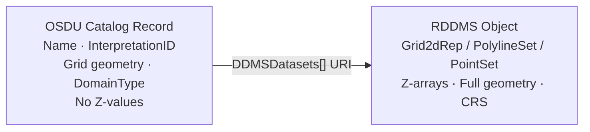
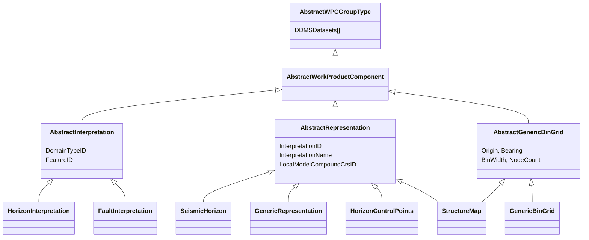
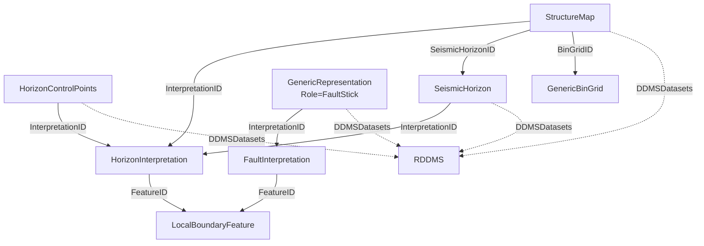
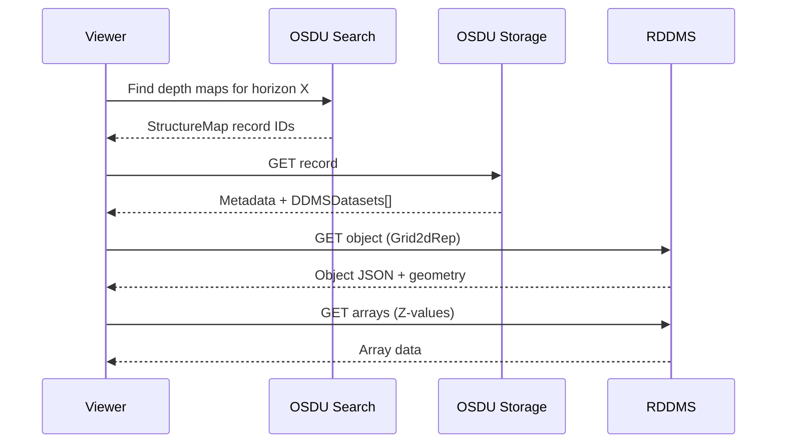

# Seismic Interpretation - Data Model & Workflow Guide

---

## 1. Where Data Lives

| Layer | Stores | Access |
|---|---|---|
| **OSDU Catalog** | Metadata: name, interpretation link, grid geometry, CRS, domain | Search + Storage API |
| **RDDMS** | Actual data: Z-arrays, XY coords, full geometry, CRS objects | RDDMS REST / ETP |

The OSDU record **never** contains Z-value arrays. `DDMSDatasets[]` is the only link to actual data:



> `DDMSDatasets[]` (from `AbstractWPCGroupType`) is the **only** link to data. Fields like `BinGridID`, `InterpretationID`, `SeismicHorizonID` point to metadata records.

### Schemas

| Schema | Purpose |
|---|---|
| `StructureMap:1.0.0` | Depth/time gridded surfaces |
| `GenericBinGrid:1.0.0` | Reusable lattice grid definition |
| `HorizonControlPoints:1.0.0` | Interpreter seed picks |
| `GenericRepresentation:1.2.0` | Universal RDDMS catalog entry |
| `SeismicHorizon:2.1.0` | TWT horizon on seismic surveys |
| `HorizonInterpretation:1.2.0` | Geologic meaning of a horizon |

---

## 2. Schema Inheritance



**Key patterns:**
- **AbstractInterpretation** = geologic meaning (the "what") - no geometry
- **AbstractRepresentation** = geometry metadata (the "how") - linked via `InterpretationID`
- **StructureMap** has **dual inheritance**: Representation + GenericBinGrid
- `DDMSDatasets[]` links to RDDMS - no OSDU schema carries actual values

---

## 3. Interpretation Chain



**Complete chain for one horizon:**

```
LocalBoundaryFeature → HorizonInterpretation → HorizonControlPoints (picks)
                                             → SeismicHorizon (TWT grid)
                                             → StructureMap (Depth grid)
```

---

## 4. Record Types

### 4.1 Fault Polylines - `GenericRepresentation:1.2.0`

| Field | Value |
|---|---|
| `Role` | `FaultStick` |
| `Type` | `PolylineSetRepresentation` |
| `InterpretationID` | → FaultInterpretation |
| `DDMSDatasets[]` | EML URI to geometry |
| `ancestry.parents[]` | FaultInterp + BoundaryFeature |

**Classification**: Only objects with `FaultInterpretation` content type and manual-pick naming (e.g. `DL_*`, `TL_*`). Excludes algorithmic extractions.

### 4.2 Horizon Control Points - `HorizonControlPoints:1.0.0`

| Field | Value |
|---|---|
| `RepresentationRole` | `Pick` |
| `RepresentationType` | `PointSet` |
| `DomainTypeID` | `Depth` or `Time` (from CRS) |
| `InterpretationID` | → HorizonInterpretation |
| `DDMSDatasets[]` | EML URI to XYZ data |

**Classification**: Only objects linked to `HorizonInterpretation`. Excludes model-extracted points (`*_extracted`).

### 4.3 Structure Maps - `StructureMap:1.0.0`

| Field | Value |
|---|---|
| `InterpretationID` | → HorizonInterpretation |
| `BinGridID` | → GenericBinGrid (shared lattice) — *mutually exclusive with inline grid props* |
| `SeismicHorizonID` | → SeismicHorizon (TWT source) |
| `DomainTypeID` | `Depth` |
| Inline grid props | `OriginEasting`/`OriginNorthing`, `MapGridBearingOfBinGridJaxis`, `BinWidthOnIaxis`/`BinWidthOnJaxis`, `NodeCountOnIAxis`/`NodeCountOnJAxis` |
| `DDMSDatasets[]` | EML URI to Z-values |

> Per the schema (`AbstractGenericBinGrid`): “Only one approach should be populated.” `BinGridID`
> and the inline grid props are **mutually exclusive** — see §7.

---

## 5. Object Classification

FMU interpretation data follow a naming convention:

| Prefix | Meaning | OSDU schema |
|---|---|---|
| `DL_` | Depth Lines (fault sticks) | GenericRepresentation |
| `TL_` | Time Lines (fault sticks) | GenericRepresentation |
| `DP_` | Depth Points (horizon picks) | HorizonControlPoints |
| `TP_` | Time Points (picks in TWT) | HorizonControlPoints |
| `DS_` | Depth Surface (gridded) | StructureMap |
| `TS_` | Time Surface (gridded) | SeismicHorizon |
| `GL_*` | Grid Lines (algorithmic) | **Not cataloged** |
| `*_extracted` | Model outputs | **Not cataloged** |

Workflow suffixes: `_interp` (initial), `_filter` (QC'd), `_filter_from_time` (depth-converted).

**Rule**: Only manual interpretation objects are cataloged. Algorithmically reproducible outputs from FMU/HUM runs are excluded.

---

## 6. RESQML → OSDU Metadata Mapping

### Citation → OSDU fields

| RESQML | OSDU field | Mapped? |
|---|---|---|
| `Title` | `data.Name` | ✓ |
| `Originator` | `data.Source` | Partial |
| `Creation` | `ResourceCreationDateTime` | Available |
| `Format` | (authoring software) | Not mapped |

### Interpretation link

| RESQML | OSDU |
|---|---|
| `RepresentedInterpretation.UUID` | `InterpretationID` |
| `RepresentedInterpretation.Title` | `InterpretationName` |
| CRS type (LocalDepth3d / LocalTime3d) | `DomainTypeID` |
| `InterpretedFeature.UUID` | `ancestry.parents[]` |

### What OSDU enriches (not in RESQML)

| Field | Source |
|---|---|
| `ExistenceKind` | Set by pipeline |
| `Role` / `Type` | Derived from classification |
| Grid geometry (inline) | Extracted from RDDMS arrays |
| `SpatialArea` (GeoJSON) | Would need CRS transform |

---

## 7. Grid Strategy

### Pattern A - Inline Grid

StructureMap carries its own geometry (Origin, BinWidth, NodeCount). Self-contained; use for unique one-off grids.

### Pattern B - External BinGrid Reference

StructureMap references a shared `GenericBinGrid` via `BinGridID`. One grid definition, many surfaces. Use when multiple horizons share the same lattice.

| | Pattern A (inline) | Pattern B (external) |
|---|---|---|
| Self-contained | Yes | No |
| Grid reuse | No | Yes |
| Best for | One-off exports | Multi-surface interp sets |

---

## 8. Dual-Catalog Pattern

Each RDDMS object should have **both** a universal and a specialised catalog entry:

| Layer | Schema | Purpose |
|---|---|---|
| Universal | `GenericRepresentation:1.2.0` | "This object exists" |
| Specialised | `StructureMap:1.0.0` | Depth map - searchable by grid |
| Specialised | `HorizonControlPoints:1.0.0` | Picks - searchable by horizon |
| Specialised | `SeismicHorizon:2.1.0` | TWT - searchable by survey |

---

## 9. GenericBinGrid vs SeismicBinGrid

| Aspect | SeismicBinGrid | GenericBinGrid |
|---|---|---|
| Direction | I & J via P6 vectors | J bearing only |
| Counts | Inline/Crossline | NodeCountOnI/JAxis |
| Use case | Seismic survey geometry | Non-seismic grids |

Conversion: `BinWidth = √(X²+Y²)`, `Bearing = atan2(X,Y)`.

---

## 10. End-to-End Retrieval



### Key RDDMS Endpoints

| Endpoint | Purpose |
|---|---|
| `GET /resources/:ds` | List objects |
| `GET /resources/:ds/:type/:uuid` | Fetch object |
| `GET /.../arrays/:path` | Fetch array data |
| `POST /query/graph/search` | Traverse interp chains |
| `POST /query/resources/find` | Filter by type |
| `POST /dataspaces/:id/clone` | Fork for project |
| `POST /dataspaces/:id/lock` | Freeze as SoR |

---

## 11. Interpreter Workflow Support

| Workflow step | Data model support |
|---|---|
| **Pick horizons** | `HorizonControlPoints` → `InterpretationID` links meaning |
| **Pick faults** | `GenericRepresentation` (FaultStick) → fault identity |
| **Grid/interpolate** | `StructureMap` + grid geometry; shares `InterpretationID` with picks |
| **Depth convert** | `SeismicHorizon` → `StructureMap` via `SeismicHorizonID` |
| **Share baseline** | Lock dataspace → clone for new project |
| **Version/iterate** | Dataspace snapshot (clone+lock) + Activity provenance |
| **Publish to SoR** | `CopyToDataspace` + lock + manifest build |

### Collaboration dataspace pattern

```
<project>/sor       - locked baseline
<project>/wip       - interpreter works here
<project>/v1        - first QC'd snapshot (clone + lock)
<project>/v2        - post-well-tie update
enterprise/sor      - approved results published here
```

---

## 12. References

- [StructureMap:1.0.0](https://community.opengroup.org/osdu/data/data-definitions/-/blob/master/E-R/work-product-component/StructureMap.1.0.0.md)
- [GenericBinGrid:1.0.0](https://community.opengroup.org/osdu/data/data-definitions/-/blob/master/E-R/work-product-component/GenericBinGrid.1.0.0.md)
- [HorizonControlPoints:1.0.0](https://community.opengroup.org/osdu/data/data-definitions/-/blob/master/E-R/work-product-component/HorizonControlPoints.1.0.0.md)
- [HorizonInterpretation:1.2.0](https://community.opengroup.org/osdu/data/data-definitions/-/blob/master/E-R/work-product-component/HorizonInterpretation.1.2.0.md)
- [GenericRepresentation:1.2.0](https://community.opengroup.org/osdu/data/data-definitions/-/blob/master/E-R/work-product-component/GenericRepresentation.1.2.0.md)
- [P&WS Guide](PWS.md) - Project lifecycle for interpretation workspaces
- [Governance Strategy](STRATEGY.md) - SoR/SoE, versioning, ACL patterns
