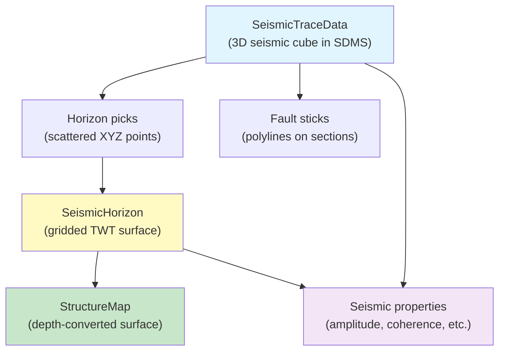
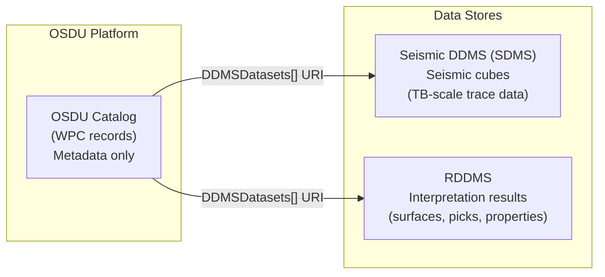
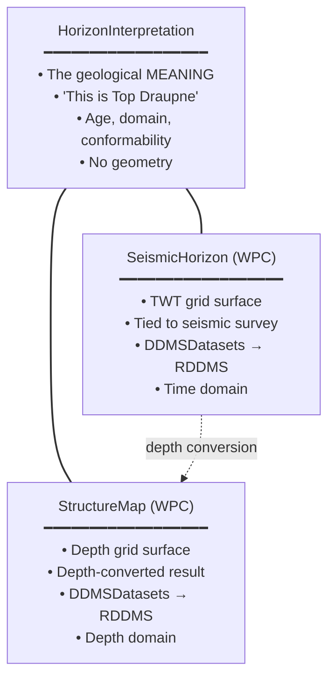
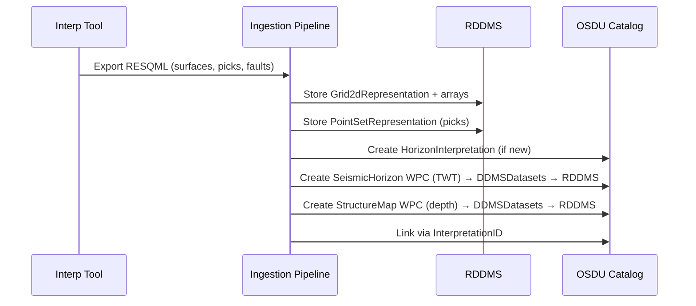
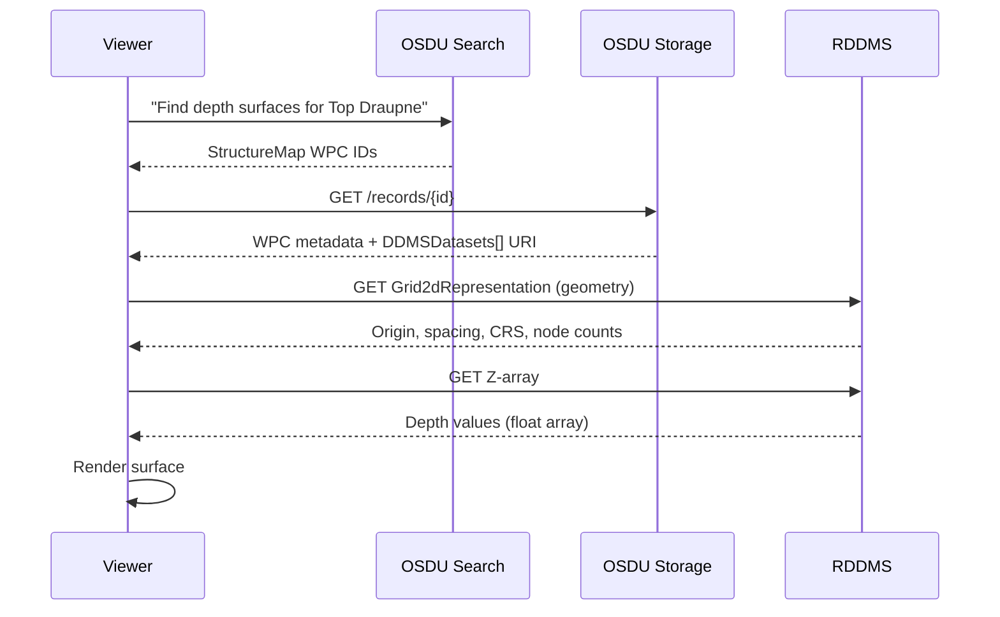
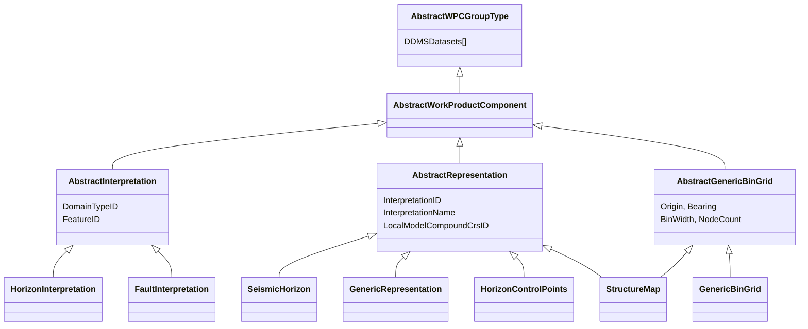

# Seismic Interpretation - Data Model & Workflow Guide

This guide explains how seismic interpretation results are stored in OSDU + RDDMS: from picking horizons on a seismic cube, through time-domain surfaces, to depth-converted maps and derived properties.

---

## 1. The Interpretation Workflow

An interpreter starts with a **seismic cube** and produces **surfaces, picks, and properties**. Each step creates different data objects:



| Workflow step | What the interpreter does | What gets created |
|---|---|---|
| **1. Pick on seismic** | Identify a reflector on inline/crossline sections | Scattered XYZ picks in TWT |
| **2. Grid the picks** | Interpolate picks into a continuous surface | Gridded TWT horizon (SeismicHorizon) |
| **3. Depth-convert** | Apply velocity model to convert TWT → depth | Gridded depth surface (StructureMap) |
| **4. Extract properties** | Compute amplitude/coherence/etc. along the horizon | Property grids (GenericProperty) |
| **5. Pick faults** | Trace fault intersections on sections | Fault stick polylines |

Each of these artefacts lives in a specific data store and is cataloged with a specific OSDU WPC schema.

---

## 2. Where Data Lives - Three Stores

Data is split across **three** systems based on type and volume:



| Store | What it holds | Scale | Access |
|---|---|---|---|
| **OSDU Catalog** | WPC metadata records (name, links, grid params, domain) - **no data values** | KB per record | Search + Storage API |
| **Seismic DDMS (SDMS)** | 3D/2D seismic trace data (amplitudes, gathers) via OpenVDS | TB per cube | SDMS REST API |
| **RDDMS** | Interpretation results: surfaces, picks, fault sticks, properties (RESQML objects) | MB per surface | RDDMS REST / ETP |

### Key principle

The **OSDU catalog record never contains data values** (no Z-arrays, no amplitudes). It contains only metadata and a `DDMSDatasets[]` URI that points to the actual data in RDDMS or SDMS.

### What goes where

| Data type | Store | Reason |
|---|---|---|
| Seismic cubes (traces, gathers) | **SDMS** | Optimized for large regular volumes, random access by inline/crossline |
| Gridded horizons (TWT or depth) | **RDDMS** | RESQML `Grid2dRepresentation` + Z-arrays |
| Horizon picks (scattered points) | **RDDMS** | RESQML `PointSetRepresentation` |
| Fault sticks (polylines) | **RDDMS** | RESQML `PolylineSetRepresentation` |
| Property grids (amplitude, thickness) | **RDDMS** | RESQML `ContinuousProperty` on `Grid2dRepresentation` |
| Bin grid definitions | **OSDU Catalog** | Lightweight metadata - no bulk arrays |

---

## 3. What Is What - The Three Horizon Records

Users often confuse `SeismicHorizon`, `HorizonInterpretation`, and `StructureMap`. They serve different purposes:



| Record | Answers the question | Domain | Has geometry? | Has data? |
|---|---|---|---|---|
| **`HorizonInterpretation`** | *"What geological surface is this?"* | - | No | No |
| **`SeismicHorizon`** (WPC) | *"Where is it in TWT on this survey?"* | Time | Grid metadata | Z-arrays in RDDMS |
| **`StructureMap`** (WPC) | *"Where is it in depth?"* | Depth | Grid metadata | Z-arrays in RDDMS |

### Why they're separate

- **One horizon** (e.g. "Top Draupne") can have **multiple representations**: a TWT surface on survey A, another on survey B, a depth-converted map, control points.
- The `HorizonInterpretation` is the **shared identity** - change its name/age once, all linked representations inherit it.
- `SeismicHorizon` and `StructureMap` are **geometry containers** that point back to the interpretation via `InterpretationID`.

### The full chain

```
LocalBoundaryFeature          ← "There exists a geological boundary here"
  └─ HorizonInterpretation    ← "We interpret it as Top Draupne, Cretaceous, conformable"
       ├─ HorizonControlPoints ← "Here are the interpreter's seed picks"
       ├─ SeismicHorizon       ← "Here is the gridded TWT surface on survey EQ2023"
       └─ StructureMap         ← "Here is the depth-converted surface"
```

---

## 4. Non-Structural Properties

Not everything derived from seismic is a structural surface. Amplitude maps, coherence extractions, thickness maps, etc. are **properties** - not structure.

| If the grid values are… | Use this WPC | Rationale |
|---|---|---|
| Structural Z (TWT or depth) | `SeismicHorizon` or `StructureMap` | These represent where a geological surface is |
| Anything else (amplitude, coherence, probability, thickness) | `GenericProperty` | These are measurements/computations on a grid |

```text
GenericBinGrid (WPC)                    ← grid geometry definition
  DDMSDatasets[] → Grid2dRepresentation ← actual lattice in RDDMS

GenericProperty (WPC)                   ← one per property
  PropertyKind → amplitude / coherence / thickness / …
  DDMSDatasets[] → ContinuousProperty   ← value array in RDDMS
```

Multiple properties can share one `Grid2dRepresentation` - store the grid once, link each property to it.

> **Terminology reminder:** In OSDU, "attribute" means graphical display properties (color, line style). For data values, always use **property**.

---

## 5. Terminology

> | Informal term | Precise OSDU/RESQML term | What it is |
> |---|---|---|
> | "map" / "surface" | `Grid2dRepresentation` or `PointSetRepresentation` | RESQML geometry in RDDMS holding the actual grid or points |
> | "structure map" | `StructureMap` (WPC) | OSDU catalog record referencing a depth `Grid2dRepresentation` via `DDMSDatasets` |
> | "seismic horizon" | `SeismicHorizon` (WPC) | Catalog record pointing to a TWT `Grid2dRepresentation` |
> | "property" / "attribute map" | `GenericProperty` (WPC) | Catalog record for non-structural values on a grid |
> | "bin grid" | `GenericBinGrid` or `SeismicBinGrid` (WPC) | Reusable lattice definition |
> | "seismic cube" | `SeismicTraceData` (WPC) + data in SDMS | The 3D volume interpreters work on |
>
> This document uses:
> - **WPC** for OSDU catalog records.
> - **Representation** for RDDMS/RESQML geometry objects.
> - Informal terms ("map", "horizon") only when referring to what users see in their tools.

---

## 6. Ingestion - How It Gets Into the System

When interpretation results are ingested from tools (Petrel, OpenWorks, DecisionSpace) into OSDU + RDDMS:



**What happens at each step:**

1. **RESQML export** - the interpretation tool exports surfaces as `Grid2dRepresentation` objects with Z-arrays, picks as `PointSetRepresentation`, faults as `PolylineSetRepresentation`.

2. **RDDMS storage** - geometries and arrays are stored in RDDMS. Each object gets a UUID and an EML URI.

3. **WPC creation** - for each RDDMS object, the pipeline creates an OSDU catalog record:
   - Determine type: structural Z → `StructureMap`/`SeismicHorizon`? Or a property → `GenericProperty`?
   - Extract grid metadata (origin, spacing, node count) from the RDDMS object
   - Set `DDMSDatasets[]` to point at the RDDMS URI
   - Set `InterpretationID` to link to the geological meaning
   - Set `DomainTypeID` from CRS (time → Time, depth → Depth)

4. **Linking** - connect WPCs into the interpretation chain:
   - `StructureMap.InterpretationID` → `HorizonInterpretation`
   - `StructureMap.SeismicHorizonID` → `SeismicHorizon` (its TWT source)
   - `StructureMap.BinGridID` → `GenericBinGrid` (shared lattice, if applicable)

### Classification during ingestion

| RESQML CRS type | Z-values represent… | → WPC type |
|---|---|---|
| `LocalTime3d` | TWT surface (ms) | `SeismicHorizon` |
| `LocalDepth3d` | Depth surface (m/ft) | `StructureMap` |
| Any | Amplitude, coherence, probability | `GenericProperty` |
| - | Scattered XYZ picks | `HorizonControlPoints` |

---

## 7. Retrieving Data - End to End

How an application fetches a depth surface for display:



The key insight: **search OSDU for metadata, fetch data from RDDMS**. The WPC is the finding aid; the representation is the data.

---

## 8. Grid Strategy

Two ways to define the 2D lattice for a `StructureMap`:

| | Inline grid | External `GenericBinGrid` reference |
|---|---|---|
| How | Grid params stored directly on the StructureMap WPC | `BinGridID` → shared `GenericBinGrid` WPC |
| Reuse | No - each surface carries its own definition | Yes - many surfaces share one grid |
| Best for | One-off exports, unique grids | Multi-horizon interpretation sets on the same lattice |

These are **mutually exclusive** - populate one or the other, never both.

> **`SeismicBinGrid` vs `GenericBinGrid`**: Seismic cubes (`SeismicTraceData`) require `SeismicBinGrid` (schema validation enforces this). Interpretation results (`StructureMap`, etc.) use `GenericBinGrid`. They describe the same lattice differently: SeismicBinGrid uses P6 bin vectors; GenericBinGrid uses bearing + bin width.

---

## 9. Collaboration - Dataspaces

Interpreters work in isolated RDDMS dataspaces, then publish:

```
<project>/wip       ← interpreter works here (read/write)
<project>/v1        ← first QC'd snapshot (clone + lock)
<project>/v2        ← post-well-tie update (clone + lock)
enterprise/sor      ← approved results published here (locked)
```

| Action | RDDMS operation | Effect |
|---|---|---|
| Start work | Clone from baseline | Private read/write copy |
| Checkpoint | Clone + lock | Immutable snapshot |
| Publish | CopyToDataspace + lock + manifest build | Enterprise-visible |

---

## 10. Object Classification (FMU Convention)

| Prefix | Meaning | → WPC schema |
|---|---|---|
| `DS_` | Depth Surface | `StructureMap` |
| `TS_` | Time Surface | `SeismicHorizon` |
| `DP_` | Depth Points (picks) | `HorizonControlPoints` |
| `TP_` | Time Points (picks) | `HorizonControlPoints` |
| `DL_` | Depth Lines (faults) | `GenericRepresentation` |
| `TL_` | Time Lines (faults) | `GenericRepresentation` |
| `GL_*` | Grid Lines (algorithmic) | **Not cataloged** |
| `*_extracted` | Model outputs | **Not cataloged** |

Suffixes: `_interp` (initial), `_filter` (QC'd), `_filter_from_time` (depth-converted).

**Rule**: Only manual interpretation results are cataloged. Algorithmically reproducible outputs are excluded.

---

## 11. References

- [StructureMap:1.0.0](https://community.opengroup.org/osdu/data/data-definitions/-/blob/master/E-R/work-product-component/StructureMap.1.0.0.md)
- [GenericBinGrid:1.0.0](https://community.opengroup.org/osdu/data/data-definitions/-/blob/master/E-R/work-product-component/GenericBinGrid.1.0.0.md)
- [HorizonControlPoints:1.0.0](https://community.opengroup.org/osdu/data/data-definitions/-/blob/master/E-R/work-product-component/HorizonControlPoints.1.0.0.md)
- [HorizonInterpretation:1.2.0](https://community.opengroup.org/osdu/data/data-definitions/-/blob/master/E-R/work-product-component/HorizonInterpretation.1.2.0.md)
- [GenericRepresentation:1.2.0](https://community.opengroup.org/osdu/data/data-definitions/-/blob/master/E-R/work-product-component/GenericRepresentation.1.2.0.md)
- [P&WS Guide](PWS.md) - Project lifecycle for interpretation workspaces

---

## Appendix A: Schema Inheritance



**Key patterns:**
- **AbstractInterpretation** = geologic meaning (the "what") - no geometry
- **AbstractRepresentation** = geometry metadata (the "how") - linked via `InterpretationID`
- **StructureMap** has **dual inheritance**: Representation + GenericBinGrid
- `DDMSDatasets[]` links to RDDMS - no OSDU schema carries actual values

---

## Appendix B: WPC Field Reference

### B.1 StructureMap:1.0.0

| Field | Value / Link |
|---|---|
| `InterpretationID` | → HorizonInterpretation |
| `BinGridID` | → GenericBinGrid (shared lattice) - *mutually exclusive with inline props* |
| `SeismicHorizonID` | → SeismicHorizon (TWT source) |
| `DomainTypeID` | `Depth` |
| `OriginEasting` / `OriginNorthing` | Grid origin (inline only) |
| `MapGridBearingOfBinGridJaxis` | Rotation (inline only) |
| `BinWidthOnIaxis` / `BinWidthOnJaxis` | Cell size (inline only) |
| `NodeCountOnIAxis` / `NodeCountOnJAxis` | Grid dimensions (inline only) |
| `DDMSDatasets[]` | EML URI → `Grid2dRepresentation` in RDDMS |

### B.2 SeismicHorizon:2.1.0

| Field | Value / Link |
|---|---|
| `InterpretationID` | → HorizonInterpretation |
| `DomainTypeID` | `Time` |
| `Interpreter` | Native field (from RESQML `Originator`) |
| `DDMSDatasets[]` | EML URI → `Grid2dRepresentation` in RDDMS |

### B.3 HorizonControlPoints:1.0.0

| Field | Value / Link |
|---|---|
| `RepresentationRole` | `Pick` |
| `RepresentationType` | `PointSet` |
| `DomainTypeID` | `Depth` or `Time` (from CRS) |
| `InterpretationID` | → HorizonInterpretation |
| `DDMSDatasets[]` | EML URI → `PointSetRepresentation` in RDDMS |

### B.4 GenericRepresentation:1.2.0 (Fault Sticks)

| Field | Value / Link |
|---|---|
| `Role` | `FaultStick` |
| `Type` | `PolylineSetRepresentation` |
| `InterpretationID` | → FaultInterpretation |
| `DDMSDatasets[]` | EML URI → `PolylineSetRepresentation` in RDDMS |
| `ancestry.parents[]` | FaultInterpretation + LocalBoundaryFeature |

### B.5 GenericBinGrid:1.0.0

| Field | Description |
|---|---|
| `OriginEasting` / `OriginNorthing` | Grid origin |
| `MapGridBearingOfBinGridJaxis` | J-axis bearing |
| `BinWidthOnIaxis` / `BinWidthOnJaxis` | Cell sizes |
| `NodeCountOnIAxis` / `NodeCountOnJAxis` | Grid dimensions |
| `LocalModelCompoundCrsID` | CRS reference |

---

## Appendix C: RESQML → OSDU Metadata Mapping

### Citation fields

| RESQML | OSDU field | Notes |
|---|---|---|
| `Title` | `data.Name` | - |
| `Originator` | `data.Interpreter` | SeismicHorizon, SeismicFault (native field) |
| `Originator` | `data.ExtensionProperties.Interpreter` | StructureMap (no native field) |
| `Creation` | `ResourceCreationDateTime` | - |
| `Format` | `data.ExtensionProperties.AuthoringSoftware` | - |

### Interpretation link

| RESQML | OSDU |
|---|---|
| `RepresentedInterpretation.UUID` | `InterpretationID` |
| `RepresentedInterpretation.Title` | `InterpretationName` |
| CRS type (LocalDepth3d / LocalTime3d) | `DomainTypeID` |
| `InterpretedFeature.UUID` | `ancestry.parents[]` |

### Fields OSDU enriches beyond RESQML

| Field | Source |
|---|---|
| `ExistenceKind` | Set by pipeline |
| `Role` / `Type` | Derived from classification |
| Grid geometry (inline) | Extracted from RDDMS representation |
| `SpatialArea` (GeoJSON) | Requires CRS transform |

---

## Appendix D: Dual-Catalog Pattern

Each RDDMS object should have **both** a universal and a specialised catalog entry:

| Layer | Schema | Purpose |
|---|---|---|
| Universal | `GenericRepresentation:1.2.0` | "This RDDMS object exists" - always discoverable |
| Specialised | `StructureMap:1.0.0` | Depth surface - searchable by grid, horizon, domain |
| Specialised | `HorizonControlPoints:1.0.0` | Picks - searchable by interpretation |
| Specialised | `SeismicHorizon:2.1.0` | TWT surface - searchable by survey |

---

## Appendix E: RDDMS Endpoints

| Endpoint | Purpose |
|---|---|
| `GET /resources/:ds` | List objects in dataspace |
| `GET /resources/:ds/:type/:uuid` | Fetch single object |
| `GET /.../arrays/:path` | Fetch array data (Z-values, XY coords) |
| `POST /query/graph/search` | Traverse interpretation chains |
| `POST /query/resources/find` | Filter by type/property |
| `POST /dataspaces/:id/clone` | Fork dataspace for project |
| `POST /dataspaces/:id/lock` | Freeze as Source of Record |

