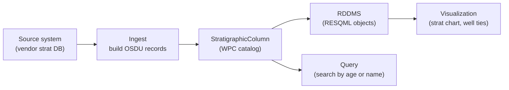
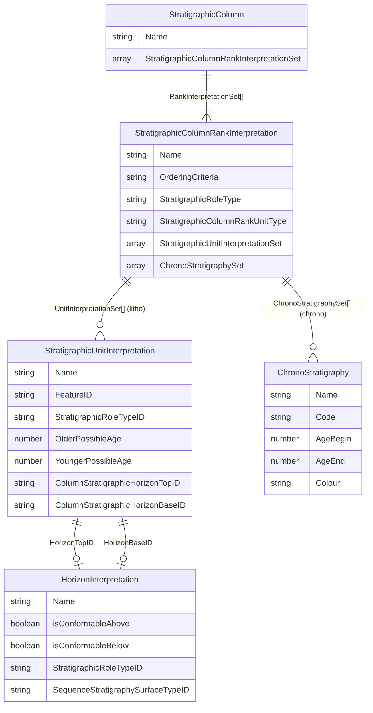
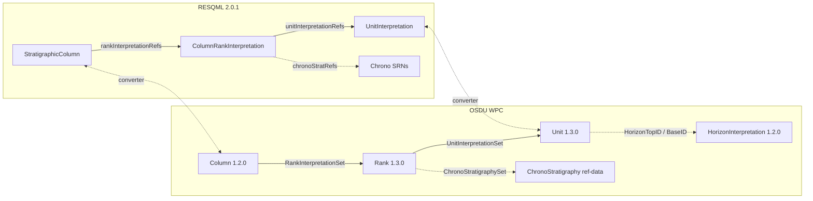

# Stratigraphy - Data Model & Workflow

> How stratigraphic columns are represented in OSDU and RDDMS - from field lithostratigraphy to global chronostratigraphy.

**Related**: [SeisInt](/howto/seismic-interp) · [BusinessDecision](/howto/business-decision) · [Maps](/howto/maps) · [Query](/howto/query-guide)

---

## 1. The Stratigraphic Workflow

A stratigraphic column defines the geological ordering - which rock units sit above or below others, when they were deposited, and where their boundaries lie. It is the backbone for correlation, mapping, and reservoir modelling.



Typical questions this data model answers:

- What formations exist in my field, and in what order?
- What is the age range of a given unit?
- Which horizons bound a unit, and are they conformable?
- How does my local lithostratigraphy relate to the global time scale?

---

## 2. Where Data Lives

| Store | What | Access |
|-------|------|--------|
| **OSDU Catalog** | WPC records describing the column, ranks, units, horizons | Search API, Storage API, GraphQL |
| **RDDMS** | RESQML objects (StratigraphicColumn, RankInterpretation, UnitInterpretation) | ETP, REST |
| **Reference Data** | ChronoStratigraphy entries (ICS time scale) | Search on `reference-data--ChronoStratigraphy` |

The catalog holds metadata and relationships. RDDMS holds the corresponding RESQML objects. The link between them is `DDMSDatasets[]` on the WPC record.

---

## 3. What Is What - Core Entities

| Entity | OSDU kind | Role |
|--------|-----------|------|
| **StratigraphicColumn** | `work-product-component` v1.2.0 | The column itself - ordered list of Rank references |
| **StratigraphicColumnRankInterpretation** | `work-product-component` v1.3.0 | One rank level (e.g. Group, Formation) - holds units OR chrono refs |
| **StratigraphicUnitInterpretation** | `work-product-component` v1.3.0 | A rock-body interval with age, lithology, and boundary references |
| **HorizonInterpretation** | `work-product-component` v1.2.0 | A boundary surface between units (conformability, sequence-strat type) |
| **ChronoStratigraphy** | `reference-data` v1.0.0 | ICS time-scale entry with age range, hierarchy code, and colour |

### How they connect

```
Column
  +-- Rank (ordered list)
       +-- Unit (rock body)     -- or --     ChronoStratigraphy ref (time-scale entry)
            +-- HorizonTop (optional boundary)
            +-- HorizonBase (optional boundary)
```

A Rank holds **either** units **or** chrono references - never both. This is the Rank XOR constraint.

---

## 4. Two Column Types

| Dimension | Chronostratigraphy | Lithostratigraphy |
|-----------|-------------------|-------------------|
| **Classified by** | Time (geological age) | Rock character (lithology) |
| **Rank hierarchy** | Eonothem - Erathem - System - Series - Stage | Supergroup - Group - Formation - Member - Bed |
| **Rank content** | `ChronoStratigraphySet[]` pointing to reference-data | `StratigraphicUnitInterpretationSet[]` pointing to WPC records |
| **Age source** | `AgeBegin` / `AgeEnd` on chrono ref-data | `OlderPossibleAge` / `YoungerPossibleAge` on Unit WPC |
| **Hierarchy encoding** | Code path (e.g. `Ph.Mz.K.UK.Ma`) | Parent/child naming or level field |
| **Scope** | Global (ICS standard) | Local to a field or basin |

A single column can contain both chrono and litho Ranks. A typical field column has litho Ranks for formation-level detail, while a reference column carries the ICS chrono scale.

---

## 5. Units vs Horizons

Units and Horizons represent the same stratigraphy from two viewpoints:

| Aspect | Unit | Horizon |
|--------|------|---------|
| Geometry | Volume / interval (rock body) | Surface / boundary |
| Time | Age range (duration) | Single age point |
| Properties | Thickness, lithology, depositional env | Conformability, seq-strat surface type |
| RESQML type | `StratigraphicUnitInterpretation` | `HorizonInterpretation` |

**Key insight**: the Rank schema has no `HorizonInterpretationSet`. Horizons are boundary references attached to individual Units via `HorizonTopID` / `HorizonBaseID`. They are optional - the boundary between two stacked units is implied by their ordering.

---

## 6. Terminology

| Term | Meaning |
|------|---------|
| Column | Top-level container - an ordered collection of Ranks |
| Rank | One level of the hierarchy (e.g. "Formation rank") |
| Unit | A rock-body interval at one rank level |
| Horizon | A named boundary surface between units |
| Chrono | Time-based classification (ICS global standard) |
| Litho | Rock-based classification (local to field/basin) |
| Rank XOR | A Rank holds either Units or Chrono refs, never both |
| Age (Ma) | Millions of years ago. OlderPossibleAge >= YoungerPossibleAge |

---

## 7. Retrieval

### Search for columns

```json
{
  "kind": "osdu:wks:work-product-component--StratigraphicColumn:1.2.0",
  "query": "data.Name:\"ICS*\""
}
```

### Search for units by age range

```json
{
  "kind": "osdu:wks:work-product-component--StratigraphicUnitInterpretation:1.3.0",
  "query": "data.OlderPossibleAge:[65 TO *] AND data.YoungerPossibleAge:[* TO 65]"
}
```

### Traverse column structure

1. Fetch Column - get `RankInterpretationSet[]`
2. Fetch each Rank - get `StratigraphicUnitInterpretationSet[]` or `ChronoStratigraphySet[]`
3. For each Unit - optionally resolve `HorizonTopID` / `HorizonBaseID`

---

## 8. Ingestion - OSDU to RDDMS

### Conversion pipeline

```
OSDU WPC Records                    RESQML 2.0.1 Objects (RDDMS)
-----------------                    ----------------------------
StratigraphicColumn          ->  resqml20.obj_StratigraphicColumn
  +- Rank (chrono/litho)     ->  resqml20.obj_StratigraphicColumnRankInterpretation
  |   +- Unit                ->  resqml20.obj_StratigraphicUnitInterpretation
  |   |   +- (feature)       ->  resqml20.obj_RockVolumeFeature
  |   +- (org feature)       ->  resqml20.obj_OrganizationFeature
  +- ...
```

### Design decisions

- **Deterministic UUIDs** - UUID5 from OSDU record ID ensures idempotent re-push
- **Ages in ExtraMetadata** - RESQML has no native age fields on UnitInterpretation
- **PUT order** - features first, then interpretations, then column (referential dependency)
- **Synthetic units skipped** - gap-fill placeholders are not pushed to RDDMS

### API endpoints

| Method | Path | Purpose |
|--------|------|---------|
| POST | `/api/strat/ingest/rddms` | Convert OSDU column to RESQML and PUT to RDDMS |
| GET | `/api/strat/dataspaces.json` | List available RDDMS dataspaces |

---

## 9. References

| Topic | Link |
|-------|------|
| StratigraphicColumn 1.2.0 | [E-R doc](https://community.opengroup.org/osdu/data/data-definitions/-/blob/master/E-R/work-product-component/StratigraphicColumn.1.2.0.md) |
| StratigraphicColumnRankInterpretation 1.3.0 | [E-R doc](https://community.opengroup.org/osdu/data/data-definitions/-/blob/master/E-R/work-product-component/StratigraphicColumnRankInterpretation.1.3.0.md) |
| StratigraphicUnitInterpretation 1.3.0 | [E-R doc](https://community.opengroup.org/osdu/data/data-definitions/-/blob/master/E-R/work-product-component/StratigraphicUnitInterpretation.1.3.0.md) |
| HorizonInterpretation 1.2.0 | [E-R doc](https://community.opengroup.org/osdu/data/data-definitions/-/blob/master/E-R/work-product-component/HorizonInterpretation.1.2.0.md) |
| ChronoStratigraphy 1.0.0 | [E-R doc](https://community.opengroup.org/osdu/data/data-definitions/-/blob/master/E-R/reference-data/ChronoStratigraphy.1.0.0.md) |
| RESQML 2.0.1 | [Energistics](https://docs.energistics.org/RESQML/RESQML_TOPICS/RESQML-000-000-titlepage.html) |

---

## Appendix A: Entity-Relationship Diagram



---

## Appendix B: Age Semantics & Field Paths

### Age convention

```
Older (bigger Ma)  <---  AgeBegin / OlderPossibleAge
                         |   duration of the unit / interval
Younger (smaller Ma) <--  AgeEnd / YoungerPossibleAge
```

All ages in Ma (millions of years ago), positive values. Convention: `OlderPossibleAge >= YoungerPossibleAge`.

### Field priority (fallback order)

| Priority | Chrono record fields | Unit record fields |
|----------|---------------------|--------------------|
| 1 | `data.AgeBegin` / `data.AgeEnd` | `data.OlderPossibleAge` / `data.YoungerPossibleAge` |
| 2 | `data.TopMa` / `data.BaseMa` | `data.TimeRange.TopAgeMa` / `data.TimeRange.BaseAgeMa` |
| 3 | `data.AgeBeginMa` / `data.AgeEndMa` | `data.TopMa` / `data.BaseMa` |
| 4 | - | `data.VendorMetadata.Raw.TopAgeMa` / `.BaseAgeMa` |
| 5 | - | `data.VendorMetadata.Raw.top_age` / `.base_age` |

---

## Appendix C: Hierarchical Composition

```
StratigraphicColumn "ICS Chrono 2017"
  +-- Rank "Eonothem"  (chrono)  ->  [Phanerozoic, Proterozoic, Archean, Hadean]
  +-- Rank "Erathem"   (chrono)  ->  [Cenozoic, Mesozoic, Paleozoic, ...]
  +-- Rank "System"    (chrono)  ->  [Quaternary, Neogene, ..., Cambrian]
  +-- Rank "Series"    (chrono)  ->  [Holocene, Pleistocene, ..., Terreneuvian]
  +-- Rank "Stage"     (chrono)  ->  [Meghalayan, Northgrippian, ..., Fortunian]

StratigraphicColumn "Field Lithostratigraphy"
  +-- Rank "Group"     (litho)   ->  [Nordland Gp, Rogaland Gp, Shetland Gp, ...]
  +-- Rank "Formation" (litho)   ->  [Utsira Fm, Lista Fm, Sele Fm, ...]
```

---

## Appendix D: RESQML - OSDU Structural Alignment



---

## Appendix E: Vendor Metadata Strategy

Source fields from vendor systems are preserved in `data.VendorMetadata.Raw`, ensuring round-trip fidelity. A `--vendor-map` JSON option additionally copies selected fields into structured OSDU paths.

Example field mapping (vendor-specific):

| Source field | OSDU target path | Notes |
|------|-----------------|-------|
| `strat_column_identifier` | `StratigraphicColumn.data.Name` | Column display name |
| `strat_unit_level` | Determines which Rank the row belongs to | Grouping key |
| `identifier` | `StratigraphicUnitInterpretation.data.Name` | Unit display name |
| `top_age` (Ma) | `data.TimeRange.TopAgeMa` | Older boundary |
| `base_age` (Ma) | `data.TimeRange.BaseAgeMa` | Younger boundary |
| `color_html` | `data.Rendering.ColorHtml` | Display colour |
