# Uncertainty Modelling — RDDMS & RESQML Integration

> How Reservoir DDMS, RESQML, PRODML and OSDU catalog schemas jointly support uncertainty modelling: from structural through dynamic, from single realisations to full ensembles, from in-place volumes to time-series forecasts.

**Related**: [Volumes](/howto/volumes) · [BusinessDecision](/howto/business-decision) · [Activity](/howto/activity) · [Properties](/howto/properties) · [Risk](/howto/risk)

> **Scope**: This document covers the **RDDMS workstream contribution** to uncertainty modelling. Grid schemas, simulation initialisation, and reservoir-management schemas are maintained separately in `datadef/reservoirmod/` and `datadef/reservoir-master/` — we reference but do not replicate them. Our focus is the integration layer: how RESQML spatial data, OSDU catalog metadata, Activity provenance, and collection packaging combine to support uncertainty workflows.

---

## 1. Architecture — What RDDMS Provides

```mermaid
%%{init: {'theme': 'dark'}}%%
flowchart LR
  subgraph RDDMS["Reservoir DDMS (spatial data)"]
    style RDDMS fill:#1a3a5c,stroke:#4a9eff
    G[IjkGrid + Properties]
    S[StructureMaps]
    TS[TimeSeries Properties]
    SF[SaturationFunctionSet]
    FM[FluidModel / PRODML]
    EPC[EPC Container]
  end

  subgraph CAT["OSDU Catalog (metadata)"]
    style CAT fill:#2d5a1e,stroke:#6abf4b
    REV[ReservoirEstimatedVolumes]
    CBT[ColumnBasedTable<br/>Design Matrix · Forecasts]
    ACT[Activity + Template]
    BD[BusinessDecision]
    PC[PersistedCollection]
    WP[WorkProduct]
  end

  subgraph REF["Reference Data"]
    style REF fill:#5a3d1e,stroke:#c98a3d
    UOM[UnitOfMeasure]
    FAC[FacetType: statistics · scenario]
    PROP[PropertyType · PropertyKind]
  end

  EPC -->|manifest| CAT
  G -->|volumes| REV
  TS -->|time steps| CBT
  ACT -->|provenance| EPC
  ACT -->|provenance| REV
  BD -->|evidence| PC
  REF -.->|governs| CAT
```

**Key principle**: RDDMS stores the **spatial arrays** (grids, surfaces, properties including time-dependent series). OSDU catalog stores **searchable metadata** (volumes, design matrices, activity records, collections). The bridge is the **manifest** — auto-generated on ingestion — plus **Activity provenance** linking inputs to outputs.

---

## 2. Uncertainty Taxonomy

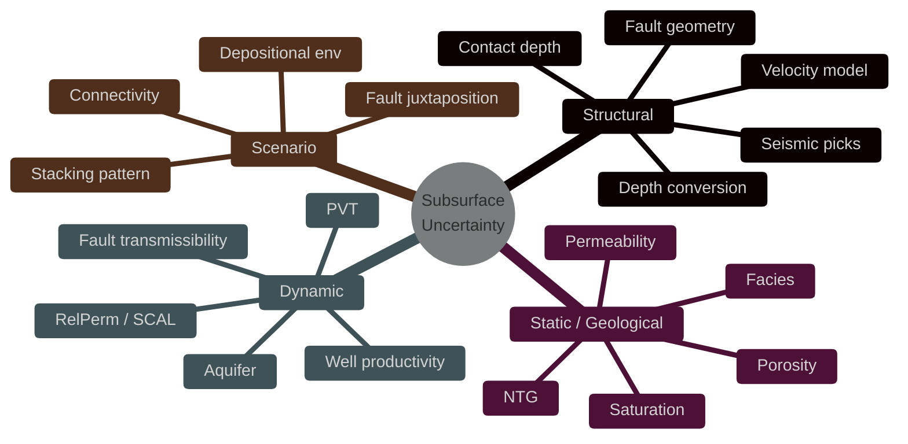

### Scenario vs Realisation vs Sensitivity

```mermaid
%%{init: {'theme': 'dark'}}%%
flowchart LR
  SC[Scenario<br/>discrete geological<br/>alternative]
  EN[Ensemble<br/>N realisations per<br/>scenario via design matrix]
  SE[Sensitivity<br/>one-at-a-time<br/>parameter variation]

  SC -->|"different grid topology<br/>separate WorkProduct"| EN
  EN -->|"continuous multipliers<br/>same grid"| REV[P10 / P50 / P90]
  SE -->|"tornado ranking"| REV

  style SC fill:#8b3a3a,stroke:#ff6b6b
  style EN fill:#1a3a5c,stroke:#4a9eff
  style SE fill:#5a3d1e,stroke:#c98a3d
```

| | Scenario | Realisation | Sensitivity |
|---|---|---|---|
| **Nature** | Discrete geological ambiguity | Continuous parameter sampling | One-at-a-time variation |
| **Grid** | Different topology possible | Same topology | Same topology |
| **OSDU** | Separate WorkProduct + `FacetType=scenario` | Design matrix rows + `RealizationIndex` | Design matrix rows (one param varies) |
| **RESQML** | Separate EarthModelInterpretation | `RealizationIndex` on properties | Same mechanism as realisation |

---

## 3. FIRP and Uncertainty — The RESQML Backbone

The **Feature → Interpretation → Representation → Property** chain is how RESQML naturally supports uncertainty: multiple interpretations of the same feature, multiple representations per interpretation, multiple property realisations per representation.

```mermaid
%%{init: {'theme': 'dark'}}%%
flowchart TD
  F[Feature<br/>e.g. Top Reservoir Horizon]
  style F fill:#5a3d1e,stroke:#c98a3d

  I1[Interpretation A<br/>Optimistic structure]
  I2[Interpretation B<br/>Conservative structure]
  style I1 fill:#1a3a5c,stroke:#4a9eff
  style I2 fill:#1a3a5c,stroke:#4a9eff

  R1[Representation<br/>Grid2d depth surface A]
  R2[Representation<br/>Grid2d depth surface B]
  style R1 fill:#2d5a1e,stroke:#6abf4b
  style R2 fill:#2d5a1e,stroke:#6abf4b

  P1["Property PORO<br/>Realisation 0..N<br/>(RealizationIndex)"]
  P2["Property PORO<br/>Realisation 0..N"]
  style P1 fill:#8b3a3a,stroke:#ff6b6b
  style P2 fill:#8b3a3a,stroke:#ff6b6b

  F --> I1 & I2
  I1 --> R1
  I2 --> R2
  R1 --> P1
  R2 --> P2
```

**Scenarios** = different Interpretations (different FIRP branches) → different grid topologies → separate WorkProducts.
**Realisations** = same Representation, different Property arrays distinguished by `RealizationIndex` → same WorkProduct, different design matrix rows.

### EarthModelInterpretation Patterns

| Pattern | When | Storage cost | Query complexity |
|---|---|---|---|
| **Monolithic EMI** | Parameter variation only; grid topology fixed | Low | Low — one EMI, swap PropertySets |
| **Structural-denormalised** | Different velocity models → different grids; shared stratigraphy | Medium | Medium — one EMI per structural variant |
| **Fully denormalised** | Discrete scenarios with fundamentally different geology | High | High — separate EMI per scenario |

---

## 4. Time-Dependent Data — TimeSeries Properties

RESQML provides native support for **time-dependent properties** — pressure, saturation, production rates at simulation time steps. This is distinct from the static (in-place) properties and is key for dynamic uncertainty.

```mermaid
%%{init: {'theme': 'dark'}}%%
flowchart LR
  TS["TimeSeries<br/>[t₀, t₁, t₂, … tₙ]<br/>ordered timestamps"]
  style TS fill:#5a3d1e,stroke:#c98a3d

  P1["ContinuousPropertySeries<br/>Pressure at cells<br/>TimeIndices: 0→N"]
  P2["ContinuousPropertySeries<br/>Saturation at cells<br/>TimeIndices: 0→N"]
  style P1 fill:#1a3a5c,stroke:#4a9eff
  style P2 fill:#1a3a5c,stroke:#4a9eff

  G[IjkGrid<br/>supporting representation]
  style G fill:#2d5a1e,stroke:#6abf4b

  TS --- P1 & P2
  G --- P1 & P2
```

| RESQML concept | Structure | OSDU mapping |
|---|---|---|
| `obj_TimeSeries` | Ordered list of `DateTime` (+ optional `YearOffset` for geological time) | `work-product-component--TimeSeries:1.0.0` |
| `TimeIndex` on property | `{Index: int, TimeSeries: DOR}` — points to one time step | `PropertyTimeIndexInSeries` + `PropertyTimeSeries` |
| `ContinuousPropertySeries` | Multi-timestep array: `TimeIndices` = `{Count, Start, TimeSeries}` | Multiple property WPCs or denormalised `PropertyTimeStamp[]` |
| `PropertySet` (2.0.1) | Groups properties by time step or realisation: `TimeSetKind`, `HasMultipleRealizations` | Replaced by search facets in OSDU |

**Dynamic outputs** (production forecasts, pressure histories, rate profiles) that don't need cell-level arrays use **ColumnBasedTable** in OSDU catalog:

```mermaid
%%{init: {'theme': 'dark'}}%%
flowchart LR
  SIM[Simulator output<br/>rates, pressures, cum. volumes]
  style SIM fill:#8b3a3a,stroke:#ff6b6b

  CBT_TS["ColumnBasedTable<br/>Year · OilRate · WaterRate<br/>GasRate · CumOil · WaterCut"]
  style CBT_TS fill:#2d5a1e,stroke:#6abf4b

  RESQML_TS["RESQML PropertySeries<br/>cell-level pressure(t)<br/>saturation(t)"]
  style RESQML_TS fill:#1a3a5c,stroke:#4a9eff

  SIM -->|"well/field-level<br/>time series"| CBT_TS
  SIM -->|"cell-level<br/>spatial time series"| RESQML_TS
```

---

## 5. Collections and Nesting — Packaging Uncertainty Results

RESQML and OSDU both support hierarchical packaging of uncertainty results. This is how scenarios, realisations, and gate evidence are organised.

```mermaid
%%{init: {'theme': 'dark'}}%%
flowchart TD
  BD["BusinessDecision — DG2"]
  style BD fill:#8b3a3a,stroke:#ff6b6b

  PC_GATE["PersistedCollection<br/>Gate Evidence Package<br/>(immutable snapshot)"]
  style PC_GATE fill:#5a3d1e,stroke:#c98a3d

  WP_BASE["WorkProduct<br/>BASE scenario"]
  WP_ALT["WorkProduct<br/>ALT scenario"]
  style WP_BASE fill:#1a3a5c,stroke:#4a9eff
  style WP_ALT fill:#1a3a5c,stroke:#4a9eff

  DM["ColumnBasedTable<br/>Design Matrix"]
  REV_RAW["REV raw<br/>per realisation"]
  REV_STAT["REV stats<br/>P10/P50/P90"]
  GRID["IjkGrid +<br/>Properties in DDMS"]
  style DM fill:#2d5a1e,stroke:#6abf4b
  style REV_RAW fill:#2d5a1e,stroke:#6abf4b
  style REV_STAT fill:#2d5a1e,stroke:#6abf4b
  style GRID fill:#2d5a1e,stroke:#6abf4b

  BD --> PC_GATE
  PC_GATE --> WP_BASE & WP_ALT
  WP_BASE --> DM & REV_RAW & REV_STAT & GRID
  WP_ALT --> DM & REV_RAW & REV_STAT & GRID
```

### Collection types and roles

| Container | Purpose | Mutable? | RESQML equivalent |
|---|---|---|---|
| **PersistedCollection** | Frozen gate evidence snapshot | No (versioned) | `DataobjectCollection` with `Purpose=delivery/archive` |
| **CollaborationProjectCollection** | Living trusted working set | Yes | `DataobjectCollection` with `Purpose=study` |
| **WorkProduct** | Versioned case package (one per scenario) | Per version | No direct equivalent — OSDU concept |
| **DataobjectCollection** (RESQML 2.2.1) | Hierarchical nesting with `Purpose` + `ParentCollection` | — | Self |

**Nesting**: PersistedCollections can nest (evidence package → discipline sub-packages). RESQML 2.2.1 `DataobjectCollection` adds `ParentCollection` DOR for tree structure.

---

## 6. Activity Provenance — The Integration Spine

Activity is the **central integration mechanism** connecting design matrix inputs to volume outputs, linking across RDDMS (spatial) and OSDU catalog (metadata), and tracing lineage across decision gates.

```mermaid
%%{init: {'theme': 'dark'}}%%
flowchart LR
  AT["ActivityTemplate<br/>Ensemble Volumetric<br/>Assessment"]
  style AT fill:#5a3d1e,stroke:#c98a3d

  A["Activity<br/>(concrete execution)"]
  style A fill:#1a3a5c,stroke:#4a9eff

  DM["input: Design Matrix<br/>Keys: realisation-index"]
  SB["input: Static Bundle<br/>(WorkProduct)"]
  SCEN["context: scenario-id<br/>context: Reservoir"]
  RAW["output: REV raw<br/>Keys: realisation-index"]
  STAT["output: REV stats"]
  EPC["output: EPC in DataSpace<br/>(grid + properties)"]
  style DM fill:#2d5a1e,stroke:#6abf4b
  style SB fill:#2d5a1e,stroke:#6abf4b
  style SCEN fill:#2d5a1e,stroke:#6abf4b
  style RAW fill:#8b3a3a,stroke:#ff6b6b
  style STAT fill:#8b3a3a,stroke:#ff6b6b
  style EPC fill:#8b3a3a,stroke:#ff6b6b

  AT -->|defines slots| A
  A --> DM & SB & SCEN
  A --> RAW & STAT & EPC
```

**Standard parameter keys** (kebab-case, consistent across workflows):
`realisation-index` · `seed` · `scenario-id` · `case-id` · `gate-id`

**RESQML Activity typed parameters** (2.0.2+): Float/Int/String/DOR/DateTime choice group — direct OSDU mapping. Replaces stringly-typed 2.0.1 parameters.

### Realisation mapping

```mermaid
%%{init: {'theme': 'dark'}}%%
flowchart LR
  DM_ROW["Design Matrix row<br/>Realisation=42<br/>PORO_Mult=1.1, NTG_Shift=0.03"]
  style DM_ROW fill:#2d5a1e,stroke:#6abf4b

  ACT["Activity<br/>Keys: realisation-index=42"]
  style ACT fill:#1a3a5c,stroke:#4a9eff

  REV_RAW["REV raw<br/>Realisation=42<br/>Zone × Segment volumes"]
  style REV_RAW fill:#8b3a3a,stroke:#ff6b6b

  PROP["RESQML Property<br/>RealizationIndex=42<br/>on IjkGrid"]
  style PROP fill:#5a3d1e,stroke:#c98a3d

  DM_ROW -->|input| ACT
  ACT -->|output| REV_RAW
  ACT -->|output| PROP
  DM_ROW -.->|"join on Realisation"| REV_RAW
```

---

## 7. Scenario Handling — Three Tiers

```mermaid
%%{init: {'theme': 'dark'}}%%
flowchart TD
  subgraph T1["Tier 1 — Facet Tagging (lightweight)"]
    style T1 fill:#2d5a1e,stroke:#6abf4b
    T1a["Same grid, same WorkProduct<br/>FacetType=scenario, FacetRole=BASE/ALT<br/>Good for: parameter variation within shared topology"]
  end

  subgraph T2["Tier 2 — Separate WorkProduct"]
    style T2 fill:#1a3a5c,stroke:#4a9eff
    T2a["Different grid topology per scenario<br/>Each WP has own design matrix + outputs<br/>Good for: structural uncertainty, discrete alternatives"]
  end

  subgraph T3["Tier 3 — DataSpace Branching"]
    style T3 fill:#8b3a3a,stroke:#ff6b6b
    T3a["Each scenario in own RDDMS DataSpace<br/>Independent compound query per branch<br/>Good for: full alternative evaluation with RDDMS queries"]
  end

  T1 -->|"grid topology differs"| T2
  T2 -->|"need independent RDDMS queries"| T3
```

| Tier | Mechanism | Grid shared? | RDDMS query independent? | Cost |
|---|---|---|---|---|
| 1 | Facet tag on WPCs | Yes | No — same DataSpace | Low |
| 2 | WorkProduct per scenario | No — separate grids | No — same DataSpace, different WPs | Medium |
| 3 | DataSpace per scenario | No — separate DataSpaces | Yes — compound filter per branch | High |

---

## 8. Design Matrix — Experimental Design Inputs

```json
{
  "kind": "osdu:wks:work-product-component--ColumnBasedTable:1.3.0",
  "data": {
    "Name": "Design Matrix - DG2",
    "KeyColumns": [
      {"ColumnName": "Realisation", "ColumnRole": "Key", "ValueType": "integer"}
    ],
    "Columns": [
      {"ColumnName": "PORO_Mult", "ValueType": "number",
       "Remark": "Triangular(0.8, 1.0, 1.3)"},
      {"ColumnName": "PERMX_Mult", "ValueType": "number",
       "Remark": "LogNormal(mu=0, sigma=0.7)"},
      {"ColumnName": "NTG_Shift", "ValueType": "number",
       "Remark": "Uniform(-0.08, +0.08)"},
      {"ColumnName": "RelPermFamily", "ValueType": "string",
       "Remark": "Discrete{A:0.4, B:0.35, C:0.25}"},
      {"ColumnName": "FaultTransMult", "ValueType": "number",
       "Remark": "LogNormal(mu=-1, sigma=0.8)"},
      {"ColumnName": "OWC_Depth", "ValueType": "number",
       "Remark": "Triangular(1680, 1693, 1710) [m]"}
    ]
  }
}
```

**Supported distributions**: Uniform, Triangular, Normal, LogNormal, TruncatedNormal, Discrete, Beta.

> **Gap**: Distribution definitions are free-text `Remark`. Structured format proposed — see §12.

---

## 9. Outputs — Volumes and Time Series

### 9.1 In-place volumes (REV)

```mermaid
%%{init: {'theme': 'dark'}}%%
flowchart LR
  subgraph RAW["REV Raw (per realisation)"]
    style RAW fill:#1a3a5c,stroke:#4a9eff
    R["Keys: Realisation · Zone · SegmentID<br/>Columns: Bulk · Net · Pore · HCPV · Oil · Gas<br/>each with PropertyTypeID + UnitOfMeasureID"]
  end

  subgraph AGG["REV Stats (aggregated)"]
    style AGG fill:#2d5a1e,stroke:#6abf4b
    A["Keys: Zone · SegmentID (no Realisation)<br/>Columns: Oil.P10 · Oil.P50 · Oil.P90 · Oil.Mean<br/>FacetIDs: FacetType=statistics, FacetRole=P50"]
  end

  RAW -->|"aggregate across<br/>realisations"| AGG
```

### 9.2 Dynamic time series

| Data type | Scope | OSDU type | RDDMS role |
|---|---|---|---|
| Production forecast | Well/field-level rates over time | `ColumnBasedTable` | Not stored in RDDMS |
| Pressure history | Cell-level P(x,y,z,t) | RESQML `ContinuousPropertySeries` + `TimeSeries` | Stored in RDDMS DataSpace |
| Saturation evolution | Cell-level Sw(x,y,z,t) | RESQML `ContinuousPropertySeries` + `TimeSeries` | Stored in RDDMS DataSpace |
| Rate profiles per scenario | Field-level, per scenario | `ColumnBasedTable` + `FacetType=scenario` | Not stored in RDDMS |

---

## 10. End-to-End Workflow

```mermaid
%%{init: {'theme': 'dark'}}%%
flowchart TD
  SEIS["Seismic Interpretation<br/>(time surfaces, faults)"]
  VEL["Velocity Model<br/>(depth conversion)"]
  STRUCT["Structural Framework<br/>(depth surfaces, fault model)"]
  style SEIS fill:#5a3d1e,stroke:#c98a3d
  style VEL fill:#5a3d1e,stroke:#c98a3d
  style STRUCT fill:#5a3d1e,stroke:#c98a3d

  GRID["IjkGrid Construction<br/>in RDDMS DataSpace"]
  PROP["Property Modelling<br/>PORO · NTG · PERMX · FACIES"]
  style GRID fill:#1a3a5c,stroke:#4a9eff
  style PROP fill:#1a3a5c,stroke:#4a9eff

  DM["Design Matrix<br/>(ColumnBasedTable)"]
  ACT["Activity<br/>realisation-index · scenario-id"]
  style DM fill:#2d5a1e,stroke:#6abf4b
  style ACT fill:#2d5a1e,stroke:#6abf4b

  SIM["Simulator<br/>(Eclipse · CMG · OPM · Intersect)"]
  style SIM fill:#8b3a3a,stroke:#ff6b6b

  REV["REV raw + stats"]
  TS_OUT["TimeSeries Properties<br/>P(t), Sw(t) in RDDMS"]
  FCST["Production Forecast CBT"]
  style REV fill:#2d5a1e,stroke:#6abf4b
  style TS_OUT fill:#1a3a5c,stroke:#4a9eff
  style FCST fill:#2d5a1e,stroke:#6abf4b

  BD["BusinessDecision<br/>gate evidence"]
  PC["PersistedCollection<br/>(frozen snapshot)"]
  style BD fill:#8b3a3a,stroke:#ff6b6b
  style PC fill:#5a3d1e,stroke:#c98a3d

  SEIS --> VEL --> STRUCT --> GRID
  GRID --> PROP
  PROP --> ACT
  DM --> ACT
  ACT --> SIM
  SIM --> REV & TS_OUT & FCST
  REV --> BD
  FCST --> BD
  BD --> PC
```

### Decision-gate progression

| Gate | Scope | Key artifacts |
|---|---|---|
| **DG0** | Play assessment | Reservoir, high-level REV, Risks, BD |
| **DG1** | Screening (few realisations) | + Segments, Design Matrix CBT, Activity |
| **DG2** | Full ensemble (50–250 realisations) | + IjkGrid in RDDMS, StructureMaps, scenarios, production forecast |
| **DG3** | Dynamic simulation, history matching | + TimeSeries properties in RDDMS, SCAL, match metrics |
| **DG4** | Full-field optimisation (100–1000+) | + updated forecasts, revised uncertainties, economic CBTs |

---

## 11. What Reservoir-Management Schemas Cover (reference only)

These are maintained in `datadef/reservoirmod/` and `datadef/reservoir-master/`. RDDMS hosts the spatial data; OSDU catalog hosts the metadata:

```mermaid
%%{init: {'theme': 'dark'}}%%
flowchart LR
  subgraph RESMOD["Reservoir Management Schemas<br/>(not replicated here)"]
    style RESMOD fill:#5a3d1e,stroke:#c98a3d
    RSM[ReservoirSimulationModel]
    RSE[ReservoirSimulationEquilibriumModel]
    RSR[ReservoirSimulationRegion]
    RM[Reservoir master-data]
    RS[ReservoirSegment]
  end

  subgraph RDDMS_HOST["RDDMS Hosts (spatial)"]
    style RDDMS_HOST fill:#1a3a5c,stroke:#4a9eff
    IJK[IjkGrid + properties]
    SF2[SaturationFunctionSet]
    FM2[FluidModel / PRODML]
    TS2[TimeSeries properties]
  end

  subgraph CAT_HOST["OSDU Catalog (metadata)"]
    style CAT_HOST fill:#2d5a1e,stroke:#6abf4b
    REV2[REV volumes]
    CBT2[ColumnBasedTable<br/>design matrix · forecast · PVT]
    ACT2[Activity provenance]
  end

  RSM -.->|"references"| IJK
  RSE -.->|"init conditions"| IJK
  RSR -.->|"regions on"| IJK
  IJK -->|manifest| REV2
  SF2 -->|manifest| CBT2
```

**Our contribution**: RDDMS provides the spatial storage (grids, surfaces, time-series properties, SCAL curves). The reservoir-management schemas define the *semantics* of what's stored. The Activity model links them.

---

## 12. Schema Gaps — Required Work

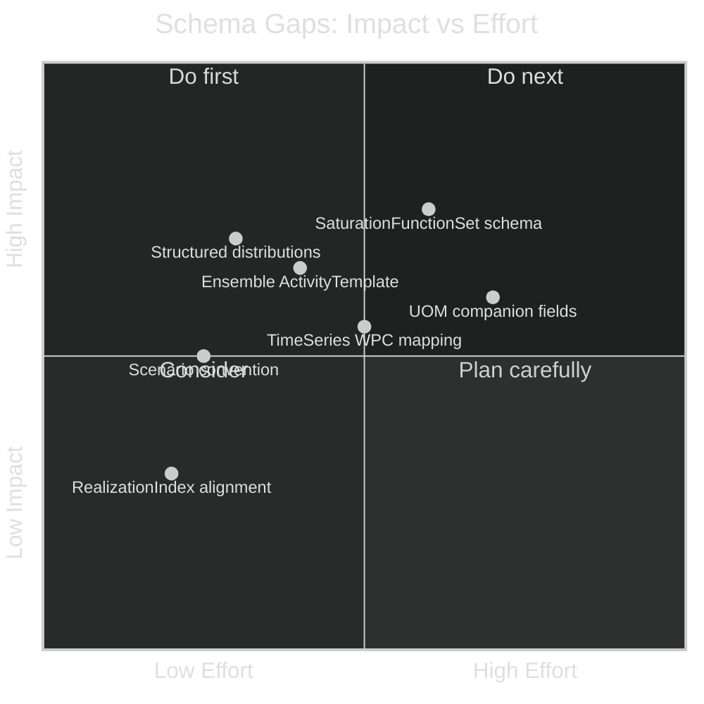

| # | Gap | RESQML | OSDU | Priority |
|---|---|---|---|---|
| **U1** | Structured distribution definitions | No schema | Free-text `Remark` | Medium |
| **U2** | Ensemble ActivityTemplate | TypedParameter (2.0.2+) | No standard template | Medium |
| **U3** | Scenario packaging convention | EMI patterns exist | No standard | Medium |
| **U4** | SaturationFunctionSet catalog | XSD done (2.3.0) | No OSDU schema | Medium |
| **U5** | TimeSeries property mapping | `PropertySeries` + `TimeSeries` exist | `TimeSeries:1.0.0` WPC, partial mapping | Medium |
| **U6** | RealizationIndex scalar | XSD done (2.0.2) | `GenericProperty.RealizationIndex` exists | Low |
| **U7** | UOM on dimensional fields | UOM on all measures | Dropped in conversion | Medium |

---

## 13. Reference — Conventions

- **Column names**: dot notation for statistics (`Oil.P10`); avoid spaces
- **Keys**: always `Realisation` in raw REV; `SegmentID` aligned to `master-data--ReservoirSegment`
- **Units**: prefer `m3`; carry in `UnitOfMeasureID`
- **Facet roles**: `ArithmeticMean`, `StandardDeviation` (not Average/StDev)
- **Scenario facets**: `FacetType=scenario` with meaningful roles (not generic LOW/HIGH)
- **Parameter keys**: `realisation-index`, `seed`, `scenario-id`, `case-id` (kebab-case)

---

## Appendix A: Standard Results Mapping

| Standard result | Format | OSDU type | RDDMS? |
|---|---|---|---|
| In-place volumes | Parquet / CSV | `ReservoirEstimatedVolumes` | No |
| Structure depth surfaces | Grid format | `StructureMap` WPC | Yes |
| Static grid model | ROFF / RESQML | `IjkGridRepresentation` + properties | Yes |
| Time-dependent properties | RESQML PropertySeries | Properties on grid in DataSpace | Yes |
| Saturation functions (Kr/Pc) | Simulator tables | `ColumnBasedTable` (pending schema) | Yes (RESQML 2.3.0) |
| PVT tables | PRODML / CSV | `ColumnBasedTable` or `FluidCharacterization` | Partial (PRODML) |
| Production forecasts | CSV / Arrow | `ColumnBasedTable` | No |
| Simulation decks | Binary | Blob + manifest in DataSpace | Yes |

## Appendix B: Simulator Deck Round-Trip

- **Grid Lock** — grid_uuid persists unless topology changes
- **Property Lock** — each property retains uuid and simulator keyword
- **CRS/UOM Lock** — manifest includes CRS type, origin, axis order, UOM
- **Ancestry Chain** — outputs set `data.ancestry.inputs` to exact input WPC IDs

## Appendix C: Vendor Toolchain Examples

| Tool | Role |
|---|---|
| ERT | Ensemble orchestrator ([github.com/equinor/ert](https://github.com/equinor/ert)) |
| fmu-dataio | Metadata export ([fmu-dataio.readthedocs.io](https://fmu-dataio.readthedocs.io/en/latest/)) |
| fmu-sumo | Cloud SoR for ensemble results ([github.com/equinor/fmu-sumo](https://github.com/equinor/fmu-sumo)) |
| OPM Flow | Open-source simulator ([opm-project.org](https://opm-project.org/)) |

