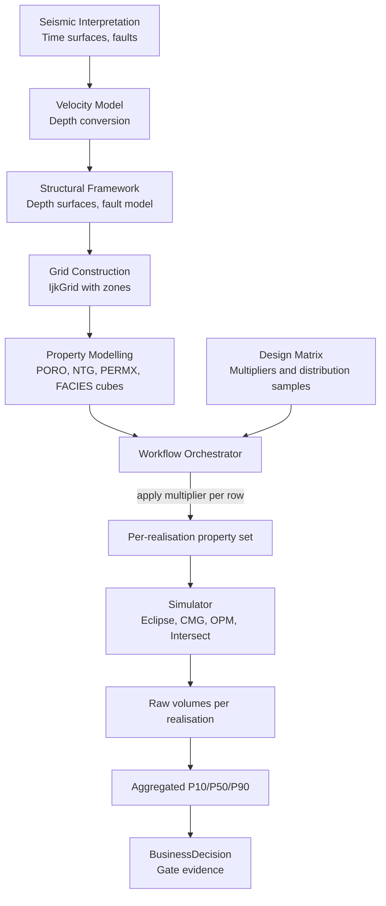
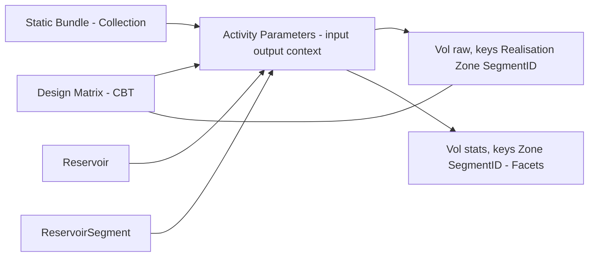
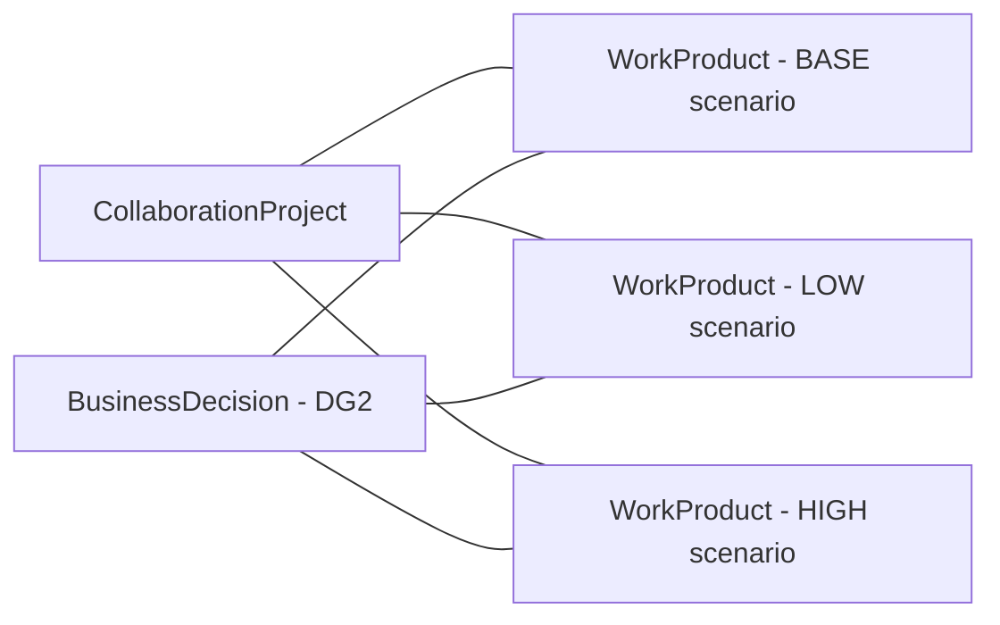
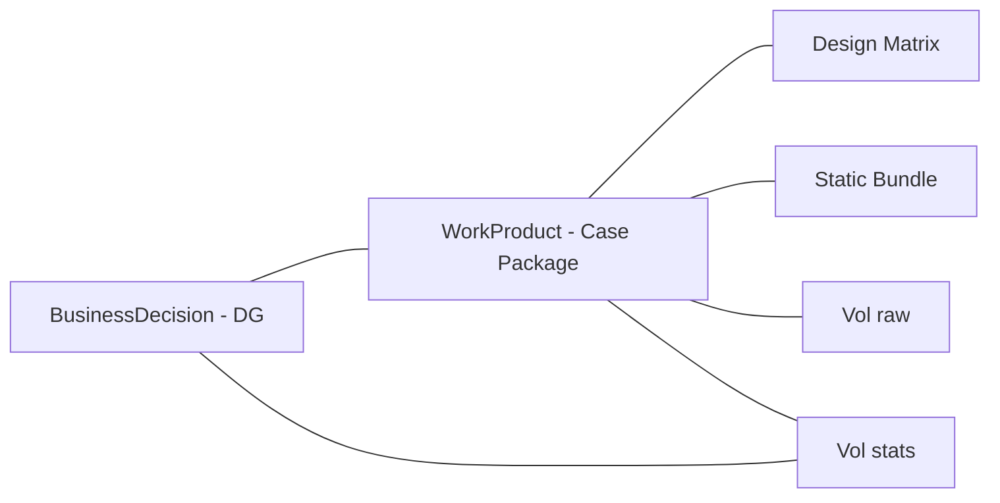
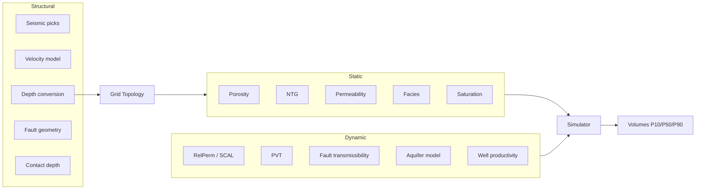
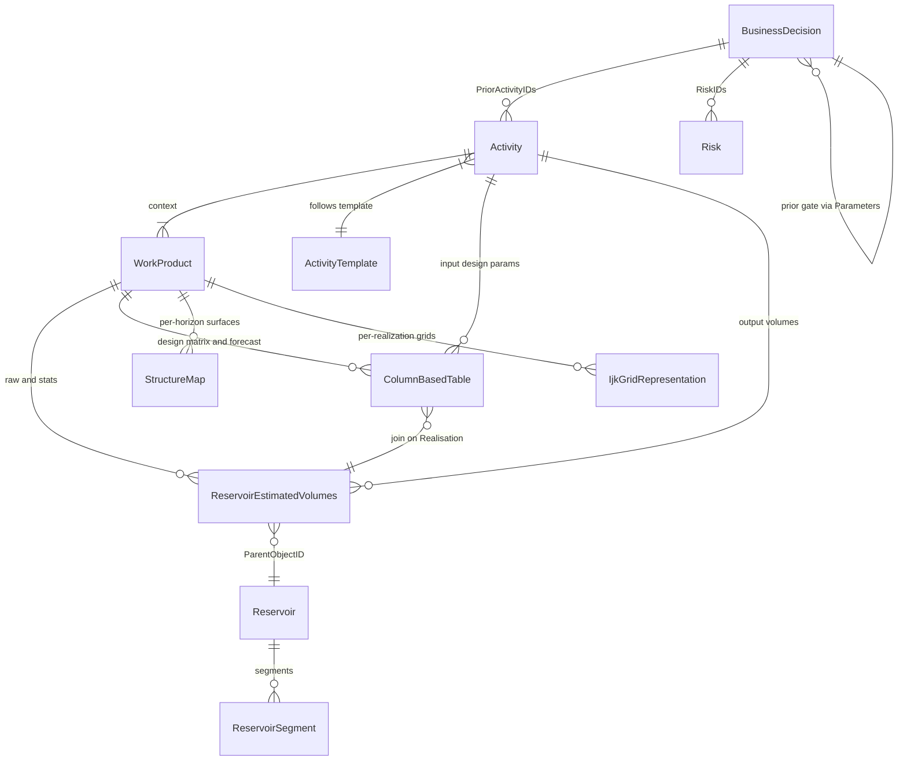

# Uncertainty & Ensemble Simulation in OSDU

> How to persist ensemble simulation inputs, scenarios, and outputs in OSDU and RESQML — from uncertainty taxonomy through design matrices and hundreds of realisations to decision-gate evidence at DG1–DG4.

**Related**: [Volumes](/howto/volumes) · [BusinessDecision](/howto/business-decision) · [Risk](/howto/risk) · [Activity](/howto/activity) · [Properties](/howto/properties) · [SeisInt](/howto/seismic-interp) · [StratColumn](/howto/strat-column)

---

## Part I — Uncertainty Concepts

### 1. Taxonomy of Subsurface Uncertainty

| Category | Nature | Question | Example |
|---|---|---|---|
| **Structural** | Geometry / topology of reservoir | "Where is the trap?" | Depth conversion velocity, fault throw, top-structure shape |
| **Geological (static)** | Rock & fluid properties on a given structure | "What fills the container?" | Porosity, NTG, facies proportions, saturation height |
| **Dynamic** | Flow behaviour under production | "How does it flow?" | Relative permeability, PVT, fault transmissibility, aquifer strength |
| **Scenario** | Discrete alternative geological model | "Which story?" | Connected aquifer vs isolated lenses |
| **Parameter variation** | Continuous multiplier/shift on a single model | "How much?" | KxMult = 0.5…2.0 |
| **Sensitivity** | One-at-a-time parameter variation | "Which parameter matters most?" | Tornado chart ranking |

A complete assessment at DG2+ typically runs **N scenarios × M realisations each**, producing N×M raw volume records but N aggregated statistics sets (one P10/P50/P90 per scenario).

### 2. Structural Uncertainty

Structural uncertainty propagates through the GRV (Gross Rock Volume) computation chain: seismic interpretation → velocity model → depth conversion → surface/fault geometry → grid topology → bulk volume.

#### 2.1 Sources of Structural Uncertainty

| Source | Uncertainty mechanism | Impact |
|---|---|---|
| **Seismic interpretation** | Pick uncertainty, mis-ties, noise | Time-domain surface position |
| **Velocity model** | Interval velocity, anisotropy, lateral variation | Depth conversion error (±10–50 m) |
| **Depth conversion method** | Layer-cake vs gradient vs tomography | Systematic bias on structure shape |
| **Fault geometry** | Throw, dip, heave; number of faults | Compartmentalisation, juxtaposition |
| **Contact depth** | OWC/GOC from pressure data, logs, or seismic | Pore volume above contact → STOIIP |
| **Erosion / unconformity** | Truncation surface position | Net sand volume, zone connectivity |

#### 2.2 Multi-Realisation Approaches

Structural uncertainty can be handled through:

1. **Deterministic surfaces with perturbation** — one base structure, apply depth shifts or surface perturbation (fast, suitable for screening at DG1)
2. **Multiple velocity models** — each producing a different depth conversion → different grids → separate scenarios (moderate cost, DG2)
3. **Full structural re-gridding** — different fault networks, different horizon geometries → fundamentally different grid topologies → separate scenarios (high cost, DG2+)

#### 2.3 GRV Outputs

| Output | Description | OSDU type |
|---|---|---|
| Depth structure maps | Per-horizon depth surfaces | `StructureMap` WPC |
| Thickness / isochore maps | Net / gross thickness per zone | `StructureMap` WPC |
| GRV maps | Bulk rock volume per cell/zone | `ColumnBasedTable` or `ReservoirEstimatedVolumes` |
| Contact depth variants | Alternative OWC/GOC depths | Design matrix parameter or scenario facet |

### 3. Geological (Static) Uncertainty

Static uncertainties affect the properties within a given structural framework. These are the parameters most commonly varied in an ensemble (design matrix) study.

#### 3.1 Key Properties Under Uncertainty

| Property | Symbol | Typical uncertainty | Impact |
|---|---|---|---|
| Porosity | PORO | ±2–5 p.u. absolute | Pore volume → STOIIP |
| Net-to-Gross | NTG | ±0.05–0.20 | Net volume → STOIIP |
| Permeability | PERMX/PERMY/PERMZ | Factor 2–10× (log-normal) | Flow rates, recovery |
| Water saturation | SW | ±0.02–0.10 | Hydrocarbon pore volume |
| Facies proportions | FACIES | ±5–15% per facies | Connectivity, NTG |
| Rock compressibility | CR | ±20–50% | Pressure support |

#### 3.2 Property Modelling Under Uncertainty

Geological properties are typically modelled through a pipeline: well data → upscaling → geostatistical simulation → property cubes. Uncertainty enters at every stage:

| Stage | Uncertainty source | Common approach |
|---|---|---|
| Well data conditioning | Log quality, depth matching, scale | QC flags, multi-well cross-validation |
| Upscaling | Block size, averaging method | Compare arithmetic / geometric / harmonic |
| Variogram | Range, sill, nugget, anisotropy | Multi-realisation with varied variogram params |
| Simulation algorithm | Sequential Gaussian, MPS, object-based | Seed variation + method comparison |
| Trend model | Compaction trend, facies proportions vs depth | Parameter variation on trend coefficients |

The design matrix captures the parameter variation applied on top of a single base-case property model. Each row represents one combination of multipliers/shifts applied at runtime.

#### 3.3 Specifying Uncertainty: Range, Distribution, Parameters

**Distribution types and statistical parameters:**

| Distribution | Use case | Parameters | Example |
|---|---|---|---|
| **Uniform** | No prior knowledge beyond bounds | min, max | NTG shift: U(−0.10, +0.10) |
| **Triangular** | Expert best-guess + bounds | min, mode, max | PORO multiplier: Tri(0.7, 1.0, 1.4) |
| **Normal** | Well-constrained, symmetric | mean, std | SW init: N(0.25, 0.03) |
| **Log-normal** | Permeability, thickness | mu_ln, sigma_ln | PERMX: LN(5.5, 1.2) → median ~245 mD |
| **Truncated normal** | Constrained symmetric | mean, std, min, max | PORO: TN(0.22, 0.03, 0.10, 0.35) |
| **Discrete** | Facies model family, rel-perm set | choices + weights | RelPermFamily: {A: 0.4, B: 0.35, C: 0.25} |
| **Beta** | Bounded proportion (NTG, Sw) | alpha, beta, [a, b] | NTG: Beta(2, 5) on [0, 1] |

#### 3.4 Common Use Cases

**A. Porosity and NTG — direct volume impact**

- `PORO_Mult`: Triangular(0.85, 1.0, 1.15) — applied to deterministic PORO field
- `NTG_Mult`: Normal(1.0, 0.12) — applied to NTG cube
- Volume impact: STOIIP ∝ PORO × NTG × (1 − Sw) × BulkVolume → ±15–25% spread

**B. Permeability — flow and recovery impact**

- `PERMX_Mult`: LogNormal(0, 0.8) — multiplicative factor on base perm field
- `Kv_Kh_Ratio`: Uniform(0.01, 0.3) — vertical-to-horizontal ratio
- Impact: Recovery factor and plateau rate; typically DG3+ (dynamic simulation)

**C. Relative permeability — discrete family uncertainty**

- `RelPermFamily`: Discrete{A: 0.4, B: 0.35, C: 0.25} — weighted by plausibility
- Impact: Step-change in recovery factor (10–30% variation); often the single largest dynamic uncertainty

**D. Saturation function and contacts**

- `OWC_Depth`: Triangular(1680, 1693, 1710)
- `CapPressure_Mult`: Uniform(0.5, 2.0) — scales J-function
- Impact: STOIIP (pore volume above OWC) + early water production risk

#### 3.5 Correlation Between Properties

Properties are often correlated (high PORO → high PERMX; low NTG → different facies). The design matrix should use **Latin Hypercube Sampling with correlation** (e.g., Iman-Conover) and document the correlation matrix as a parameter in the Activity record.

### 4. Dynamic Uncertainty

Dynamic uncertainties relate to flow simulation and production behaviour. They are typically addressed at DG3+ but some (relative permeability) already dominate at DG2.

#### 4.1 Key Dynamic Parameters

| Parameter | Uncertainty source | Impact |
|---|---|---|
| **Relative permeability** | SCAL data quality, wettability, endpoints, Corey exponents | Recovery factor (10–30% variation) |
| **Capillary pressure** | Transition zone height, J-function | Initial saturation distribution, STOIIP |
| **PVT properties** | Lab measurement quality, composition uncertainty | Bo, Rs, viscosity → recovery and pressure |
| **Fault transmissibility** | Seal capacity, SGR, clay smear | Compartmentalisation, pressure support |
| **Aquifer model** | Size, permeability, connectivity | Pressure support, water influx rate |
| **Well productivity** | Skin, completion efficiency, PI | Well rates, plateau length |
| **History match parameters** | Non-unique; multiple realisations match history | Forecast uncertainty |

#### 4.2 SCAL Data Representation

SCAL (Special Core Analysis Laboratory) data — Kr and Pc curves — requires structured representation:

| What | OSDU representation | Storage |
|---|---|---|
| Kr/Pc tables per SCAL region | `ColumnBasedTable` WPC (catalog) + RESQML `SaturationFunctionSet` (DDMS) | Structured curves in DDMS; metadata in catalog |
| Endpoint values (Swirr, Sor, Krw_max) | Design matrix columns | Varied per realisation |
| Family selection (water-wet vs mixed-wet) | Discrete parameter in design matrix | Selector index |

> **Schema gap**: No current OSDU catalog schema for `SaturationFunctionSet`. Proposed schema covers function type (drainage/imbibition Kr/Pc), phases, region count. See ToDo item O5.

#### 4.3 PVT and Fluid Properties

PVT data (formation volume factor, solution gas-oil ratio, viscosity) is typically less uncertain than rock properties but can matter for volatile/near-critical fluids:

| Approach | Method |
|---|---|
| Single deterministic PVT | Use lab report directly; no uncertainty |
| EoS-based sampling | Vary composition within measurement uncertainty; generate N consistent PVT sets |
| Bracketing | Use optimistic/pessimistic PVT tables as discrete scenarios |

### 5. Scenarios — Alternative Interpretations

#### 5.1 Why Scenarios Differ from Parameter Variation

The design matrix captures **continuous parameter uncertainty** — multipliers, shifts, family selectors applied to a *single structural/property model*. **Scenarios** capture **discrete geological ambiguity** — fundamentally different interpretations where no parameter sweep connects one to another.

| Aspect | Parameter variation | Scenario |
|---|---|---|
| Nature | Continuous (KxMult = 0.5…2.0) | Discrete (connected aquifer vs isolated lenses) |
| Model topology | Same grid, same zones | Possibly different grid, different zone count |
| Geological question | "How much?" | "Which story?" |
| Volume impact | Spread within a trend | Step-change between clusters |
| OSDU representation | Design matrix rows + Realisation key | Separate WorkProducts + scenario facet |

#### 5.2 Common Scenario Types

1. **Connectivity** — are sand bodies one connected sheet or isolated lenses?
2. **Stacking pattern** — amalgamated channel belt vs separate avulsion events
3. **Geometry** — layer-cake vs clinoform/wedge (parasequence pinch-out)
4. **Cycle counting** — more cycles present in one well than another; which are "missing"?
5. **Fault juxtaposition** — which layers correlate across a fault with growth expansion?
6. **Fluid contact** — single OWC vs tilted/compartmentalised contacts
7. **Depositional environment** — fluvial vs shallow marine vs delta front

#### 5.3 Scenario vs Sensitivity vs Ensemble

| Term | Meaning | OSDU pattern |
|---|---|---|
| **Scenario** | Discrete alternative geological model (different grid/interpretation) | Separate WorkProduct + scenario facet |
| **Sensitivity** | One-at-a-time parameter variation to rank uncertainty drivers | Design matrix rows where one parameter varies, others at base |
| **Ensemble** | Full Monte Carlo across design matrix for ONE scenario | All realisations under one WorkProduct |

---

## Part II — Experimental Design (Inputs)

### 6. Design Matrix

**Recommended schema pattern** (ColumnBasedTable):
- **KeyColumns**: `CaseID:string`, `Realisation:integer`, `Seed:integer` (optional).
- **Columns**: parameter vector per row (e.g., `KxMultiplier:number`, `RelPermFamily:string`, `NTG_Shift:number`, …); use UCUM units in column metadata where relevant.
- **Linkage**: referenced from Activities (run records) and joined to raw REV on `Realisation`.

**Example (excerpt)**:
```json
{
  "kind": "osdu:wks:work-product-component--ColumnBasedTable:1.3.0",
  "data": {
    "Name": "Design Matrix - Case A",
    "KeyColumns": [
      {"ColumnName": "CaseID", "ColumnRole": "Key", "ValueType": "string"},
      {"ColumnName": "Realisation", "ColumnRole": "Key", "ValueType": "integer"},
      {"ColumnName": "Seed", "ColumnRole": "Key", "ValueType": "integer"}
    ],
    "Columns": [
      {"ColumnName": "KxMultiplier", "ValueType": "number"},
      {"ColumnName": "RelPermFamily", "ValueType": "string"}
    ]
  }
}
```

**Full design matrix with distribution metadata:**
```json
{
  "kind": "osdu:wks:work-product-component--ColumnBasedTable:1.3.0",
  "data": {
    "Name": "Design Matrix - Drogon DG2",
    "KeyColumns": [
      {"ColumnName": "Realisation", "ColumnRole": "Key", "ValueType": "integer"}
    ],
    "Columns": [
      {"ColumnName": "PORO_Mult", "ValueType": "number",
       "Remark": "Triangular(0.8, 1.0, 1.3) - porosity multiplier"},
      {"ColumnName": "PERMX_Mult", "ValueType": "number",
       "Remark": "LogNormal(mu=0, sigma=0.7) - horizontal perm multiplier"},
      {"ColumnName": "NTG_Shift", "ValueType": "number",
       "Remark": "Uniform(-0.08, +0.08) - additive NTG adjustment"},
      {"ColumnName": "SW_Init_Mult", "ValueType": "number",
       "Remark": "Normal(1.0, 0.05) - Sw initialisation multiplier"},
      {"ColumnName": "RelPermFamily", "ValueType": "string",
       "Remark": "Discrete{A:0.4, B:0.35, C:0.25} - relative permeability set"},
      {"ColumnName": "FaciesProb_Sand", "ValueType": "number",
       "Remark": "Beta(2,5) on [0.3, 0.8] - sand proportion"},
      {"ColumnName": "OWC_Depth", "ValueType": "number",
       "Remark": "Triangular(1680, 1693, 1710) - oil-water contact depth [m]"},
      {"ColumnName": "FaultTransMult", "ValueType": "number",
       "Remark": "LogNormal(mu=-1, sigma=0.8) - fault transmissibility multiplier"},
      {"ColumnName": "AquiferMult", "ValueType": "number",
       "Remark": "Uniform(0.5, 5.0) - aquifer volume multiplier"}
    ]
  }
}
```

> **Gap**: Distribution definitions are currently free-text in `Remark`. A structured uncertainty-definition schema (distribution type + parameters + bounds) is proposed — see §18 Schema Gaps.

### 7. Static Inputs (Grids, Properties, Velocity)

Represent each artifact as a WPC and group the choice for a scenario into **one id**:
- **WorkProduct** = stable case package for DG usage.
- **CollaborationProjectCollection** = flexible working set during model development.

### 8. Persisting Uncertainty Definitions

| What to persist | Where | Format |
|---|---|---|
| Distribution definitions (type, params, bounds) | Design Matrix CBT column `Remark` or dedicated CBT | JSON or structured text |
| Sampled values (N realisations) | Design Matrix CBT rows | Numeric/string columns |
| Base-case property cubes | IjkGridRepresentation + property WPCs | ROFF/RESQML arrays |
| Correlation structure (if any) | Companion CBT or Activity parameter | Correlation matrix or copula spec |

---

## Part III — RESQML Representation

### 9. RESQML Types for Uncertainty

RESQML provides structural support for multi-realisation data and ensemble workflows. Understanding what RESQML covers (and doesn't) is essential for the OSDU mapping.

#### 9.1 Realisations on Properties

| RESQML feature | Version | Purpose |
|---|---|---|
| `RealizationIndices` (array) | 2.0.1+ | Tag a property with multiple realisation indices (e.g., P10+P50+P90 combined in one property object) |
| `RealizationIndex` (scalar) | 2.0.2+ / 2.2.1+ | Tag a property with a single realisation index (e.g., "this is realisation 42") — maps directly to OSDU `GenericProperty.RealizationIndex` |
| `PropertySet` | 2.0.1+ | Group properties by realisation, time step, or other criteria |

**Business rule**: If both `RealizationIndices` (array) and `RealizationIndex` (scalar) are present, the array takes precedence. The scalar is syntactic sugar for a single-element array.

#### 9.2 EarthModelInterpretation and Structural Uncertainty

Static uncertainty in RESQML can be represented through different `EarthModelInterpretation` (EMI) patterns:

| Pattern | Description | When to use |
|---|---|---|
| **Monolithic EMI** | One EarthModelInterpretation references all grids, horizons, faults. Property uncertainty modelled by swapping property sets (same grid topology). | Parameter variation only; grid topology fixed |
| **Structural-denormalised** | One EMI per structural variant (different velocity model → different grid). Each EMI references its own IjkGrid but may share stratigraphic interpretation. | Structural uncertainty with shared stratigraphy |
| **Fully denormalised** | Separate EMI per scenario. Each has its own complete set of interpretations, representations, and properties. | Discrete scenarios with fundamentally different geology |

> The choice between patterns affects storage cost and query complexity. Monolithic is cheapest but cannot represent structural uncertainty. Fully denormalised is most flexible but most expensive.

#### 9.3 Activity Model in RESQML

RESQML `Activity` and `ActivityTemplate` types provide provenance tracking:

| RESQML type | Purpose | OSDU equivalent |
|---|---|---|
| `ActivityTemplate` | Blueprint defining parameter slots (name, type, min/max occurs, is-input/output) | `work-product-component--ActivityTemplate` |
| `Activity` | Concrete execution record with actual parameter values referencing data objects | `work-product-component--Activity` |
| `Parameter` (2.0.1) | Stringly-typed (all values are strings) | OSDU typed parameters (string/float/int/DOR) |
| `TypedParameter` (2.0.2+) | Float/Int/String/DOR/DateTime choice group — direct OSDU mapping | Same, now with type fidelity |

**Ensemble workflow**: The Activity records the design matrix (input), static bundle (input), simulator model (input), and volume outputs (output) with `realisation-index` and `scenario-id` keys.

#### 9.4 What RESQML Does NOT Cover

| Concept | Status in RESQML | Workaround |
|---|---|---|
| **Uncertainty distributions** | No schema for distribution type/parameters | Free-text in design matrix `Remark` or Activity parameters |
| **Scenario facets** | No native concept | OSDU `FacetType=scenario` overlay |
| **Statistics facets** | No P10/P50/P90 concept | OSDU `FacetType=statistics` overlay |
| **SCAL / SaturationFunctionSet** | Added in 2.3.0 (proposed) | No OSDU catalog schema yet |
| **PVT detail** | No structured EoS representation | Simulator input files or proprietary formats |
| **Simulation run metadata** | Added in 2.2.1 (proposed) | Ad-hoc Activity parameters |

---

## Part IV — OSDU Data Model

### 10. Building Blocks

#### 10.1 Master-data (anchors for scope)
- `master-data--Reservoir` — the reservoir entity of interest.
- `master-data--ReservoirSegment` — segments or compartments under the reservoir.

*Why:* `ReservoirEstimatedVolumes` is scoped by `ParentObjectID` to Field/Reservoir/ReservoirSegment.

#### 10.2 Reference-data (governed catalogs)
- **Units**: `reference-data--UnitOfMeasure` (e.g., `m3`, `Mm3`).
- **Statistics facets**: `reference-data--FacetType:statistics`, `reference-data--FacetRole:{P10,P50,P90,ArithmeticMean,Minimum,Maximum,StandardDeviation}`.
- **Scenario facets**: `reference-data--FacetType:scenario`, `reference-data--FacetRole:{BASE,LOW,HIGH,…}`.
- **Canonical volume property types**: `reference-data--ReservoirEstimatedVolumePropertyType:{Bulk,Net,Pore,HydrocarbonPore,Oil,AssociatedGas}`.

#### 10.3 Work-product components (WPCs)
- **Design Matrix** — `work-product-component--ColumnBasedTable` (CBT).
- **Static bundles** — grids, properties, velocity as WPCs (e.g., `GenericRepresentation`, `VelocityModeling`).
- **Output volumes** — `work-product-component--ReservoirEstimatedVolumes` (REV), raw per-realisation and aggregated statistics.
- **Saturation functions** — `ColumnBasedTable` (pending dedicated schema).
- **Optional KPIs** — `work-product-component--ColumnBasedTable` for generic KPI/time series.

#### 10.4 Collections and scenario packaging
- **WorkProduct** — versioned case package (design + static bundle + chosen outputs). One per scenario.
- **CollaborationProjectCollection** — curated working set while iterating.

#### 10.5 Activity semantics (`AbstractProjectActivity`)
Use `Parameters[]` with `ParameterRole = input|output|context` and `ObjectParameterKey` to enumerate run inputs/outputs and context. Keys (e.g., `realisation-index`, `seed`, `scenario-id`) keep the mapping explicit.

**ActivityTemplate** defines the reusable blueprint — parameter slots with `IsInput`/`IsOutput`, `MinOccurs`/`MaxOccurs`, and `DefaultParameterKind`. Each concrete Activity fills the template slots with actual values.

**Example — Ensemble simulation template:**
```json
{
  "kind": "osdu:wks:work-product-component--ActivityTemplate:1.0.0",
  "data": {
    "Name": "Ensemble Volumetric Assessment",
    "Parameters": [
      {"Title": "Design Matrix", "IsInput": true, "MaxOccurs": 1,
       "DefaultParameterKind": "work-product-component--ColumnBasedTable"},
      {"Title": "Static Bundle", "IsInput": true, "MaxOccurs": 1,
       "DefaultParameterKind": "work-product--WorkProduct"},
      {"Title": "Number of Realisations", "IsInput": true, "MaxOccurs": 1},
      {"Title": "Raw Volumes", "IsOutput": true, "MaxOccurs": -1,
       "DefaultParameterKind": "work-product-component--ReservoirEstimatedVolumes"},
      {"Title": "Aggregate Statistics", "IsOutput": true, "MaxOccurs": 1,
       "DefaultParameterKind": "work-product-component--ReservoirEstimatedVolumes"}
    ]
  }
}
```

### 11. Scenario Representation in OSDU

#### A. FacetType = scenario (lightweight tagging)

Attach a scenario facet to WPCs or GeoLabelSet columns to distinguish model variants:

```json
{
  "FacetIDs": [
    { "FacetTypeID": "<partition>:reference-data--FacetType:scenario",
      "FacetRoleID": "<partition>:reference-data--FacetRole:BASE" }
  ]
}
```

Typical roles: `BASE`, `LOW`, `HIGH`, `OPTIMISTIC`, `PESSIMISTIC`, or project-specific (`CONNECTED_AQUIFER`, `ISOLATED_LENSES`).

**Query** for all records in a given scenario:
```json
{
  "kind": "osdu:wks:work-product-component--ReservoirEstimatedVolumes:1.1.0",
  "query": "data.FacetIDs.FacetRoleID:\"<partition>:reference-data--FacetRole:BASE\""
}
```

#### B. WorkProduct per scenario (full separation)

Each scenario gets its own WorkProduct (case package) containing:
- Its own static bundle (grid + properties if topology differs)
- Its own design matrix (parameter ranges may vary per scenario)
- Its own ensemble outputs (REV, surfaces)

The CollaborationProjectCollection or BusinessDecision then references **all scenario WorkProducts** to compare at a gate.

#### C. Activity linking across scenarios

Use Activity `Parameters[]` with a `scenario-id` key to trace which scenario produced which outputs:

```json
{
  "Parameters": [
    {"Title": "Scenario", "ParameterRole": "context",
     "Keys": [{"ParameterKey": "scenario-id", "StringParameterKey": "CONNECTED_AQUIFER"}],
     "ObjectParameterKey": "dev:work-product--WorkProduct:case-connected:2"},
    {"Title": "Design Matrix", "ParameterRole": "input",
     "ObjectParameterKey": "dev:work-product-component--ColumnBasedTable:dm-connected:1"},
    {"Title": "Output Volumes", "ParameterRole": "output",
     "ObjectParameterKey": "dev:work-product-component--ReservoirEstimatedVolumes:rev-connected:3"}
  ]
}
```

---

## Part V — Workflow & Provenance

### 12. End-to-End Uncertainty Workflow

The complete uncertainty assessment workflow spans structural, static, and dynamic stages:



### 13. Run Bookkeeping with Activity Parameters

For each run/iteration, create an Activity:
- **Parameters[] / input**: Design Matrix row (`realisation-index`), static bundle (WorkProduct/Collection), simulator deck/model.
- **Parameters[] / output**: raw REV (this realisation), aggregate REV (per zone/segment).
- **Parameters[] / context**: reservoir and segments; case collection; scenario-id.

**Example (schematic)**:
```json
{
  "Parameters": [
    {"Title": "Design row", "ParameterRole": "input",
     "Keys": [{"ParameterKey": "realisation-index", "StringParameterKey": "42"}],
     "ObjectParameterKey": "dev:work-product-component--ColumnBasedTable:design-matrix:1"},
    {"Title": "Static bundle", "ParameterRole": "input",
     "ObjectParameterKey": "dev:work-product--WorkProduct:caseA-static:3"},
    {"Title": "Raw volumes", "ParameterRole": "output",
     "Keys": [{"ParameterKey": "realisation-index", "StringParameterKey": "42"}],
     "ObjectParameterKey": "dev:work-product-component--ReservoirEstimatedVolumes:raw-42:1"},
    {"Title": "Aggregate volumes", "ParameterRole": "output",
     "ObjectParameterKey": "dev:work-product-component--ReservoirEstimatedVolumes:stats:5"}
  ]
}
```

**Naming keys**: use `realisation-index`, `seed`, `case-id`, `scenario-id` consistently; prefer kebab-case; avoid spaces.

### 14. Realisation Mapping

- **Join on keys**: raw REV `Realisation` ↔ Design Matrix row `Realisation`.
- **Activity link**: the run Activity carries both the **design row** and the **raw REV output** with the same `realisation-index` key in `Parameters[]`.
- **Case binding**: WorkProduct/Collection id referenced as `context` to bind the scenario.

### 15. Property Uncertainty in the Ensemble Workflow

**Key points**:
- The base-case property model is a **single WPC** (or set of WPCs for grid + properties)
- Multipliers/shifts from the design matrix are applied **at runtime** by the orchestrator
- Each realisation produces a modified property field — typically NOT stored individually (too large); only the multipliers and resulting volumes are persisted
- Statistics (P10/P50/P90 of volumes) capture the aggregate effect of property uncertainty

### 16. Scenario Workflow

| Step | Action | OSDU artifact |
|---|---|---|
| 1 | Identify discrete geological ambiguity sources | (domain knowledge, no OSDU record) |
| 2 | Build alternative static models (grids/properties) | WPCs per scenario, grouped in WorkProduct |
| 3 | Tag with scenario facet | `FacetType=scenario`, `FacetRole=<NAME>` |
| 4 | Run ensemble per scenario (separate design matrices or shared) | Design Matrix CBT + Activity |
| 5 | Aggregate statistics per scenario | REV with scenario facet |
| 6 | Compare at gate | BusinessDecision referencing all scenario WorkProducts |

### 17. Decision-Gate Alignment

Each gate demands progressively more evidence:

| Gate | Scope | Key OSDU artifacts |
|---|---|---|
| **DG0** | Play assessment: conceptual, few analogues | Reservoir, high-level REV, Risks, BD |
| **DG1** | Screening: few realisations, simple design | + Segments, input params CBT, Activity |
| **DG2** | Full ensemble (50–250 realisations) | + IjkGrid, StructureMaps, GeoLabelSet, production forecast |
| **DG3** | Dynamic simulation, history matching | + WellboreTrajectory, ProductionValues, match metrics, SCAL |
| **DG4** | Full-field optimisation (100–1000+ realisations) | + updated forecasts, revised uncertainties, economic analysis |

Cross-gate evolution: BD at DG(n+1) references BD at DG(n) as context parameter.

---

## Part VI — Schema Gaps and Required Work

### 18. RESQML ↔ OSDU Gap Analysis for Uncertainty

| Gap | RESQML status | OSDU status | Required action |
|---|---|---|---|
| **Uncertainty distributions** | No schema | No schema | Define structured format: `{type, params, bounds}` — either as OSDU extension or RESQML new type |
| **Scenario tagging** | No native concept | `FacetType=scenario` works | Document convention; consider standardising scenario-role vocabulary |
| **Statistics tagging** | No native concept | `FacetType=statistics` works | Already functional |
| **RealizationIndex scalar** | Added in 2.0.2/2.2.1 (proposed) | `GenericProperty.RealizationIndex` exists | Align converter once RESQML adoption progresses |
| **SaturationFunctionSet** | XSD done in 2.3.0 (proposed) | No OSDU catalog schema | Create OSDU schema with type/phase/region metadata |
| **SimulationRunMetadata** | XSD done in 2.2.1 (proposed) | Ghost `ReservoirSimulation*` schemas | Validate OSDU schemas against real simulator data |
| **Activity TypedParameter** | XSD done in 2.0.2/2.3.0 | OSDU already supports typed params | Converter alignment needed |
| **Correlation structure** | No schema | No schema | Persist as companion CBT or Activity parameter (convention) |
| **Design matrix ↔ distribution link** | No schema | `Remark` free-text | Propose structured column metadata extension |
| **UOM on dimensional fields** | RESQML has UOM on all measures | OSDU drops UOM in conversion | Add `*Uom` companion fields to OSDU schemas |

### 19. Simulation Initialisation (MVP1 Context)

The OSDU Simulation Initialisation MVP1 (Data Definitions F2F, Oct 2025) defined the baseline for persisting simulation inputs:

| Component | OSDU representation | Status |
|---|---|---|
| Structural grid (IJK) | `IjkGridRepresentation` + properties in DDMS | Implemented in Reservoir DDMS |
| Rock physics models | `ColumnBasedTable` for rock compressibility, endpoints | Convention — no dedicated schema |
| Saturation functions (Kr/Pc) | `ColumnBasedTable` (pending `SaturationFunctionSet` schema) | Gap |
| PVT data | `ColumnBasedTable` or PRODML `FluidCharacterization` | Partial |
| Reservoir simulation model ("sim deck") | Blob storage (binary deck) + manifest metadata | Implemented via DataSpace |
| Activity model (inputs → outputs) | `Activity` + `ActivityTemplate` | Implemented |
| Well completions | `WellboreCompletion` + `PerforationSet` | Standard OSDU schemas |

---

## Part VII — Outputs

### 20. Volumes

#### 20.1 Raw per-realisation (REV)
Keys: `Realisation`, `Zone`, `SegmentID` (with `KindID = master-data--ReservoirSegment:2.0.0`).
Columns: `Bulk`, `Net`, `Pore`, `HydrocarbonPore`, `Oil`, `AssociatedGas` — each with `PropertyTypeID` and `UnitOfMeasureID: m3`.

#### 20.2 Aggregated statistics (REV)
Keys: `Zone`, `SegmentID` (no Realisation — aggregated across runs).
Columns: dot notation `<Property>.<Statistic>` — e.g. `Bulk.P10`, `Oil.ArithmeticMean`.
Each column carries `FacetIDs` with `FacetType:statistics` + `FacetRole:<P10|P50|P90|ArithmeticMean|...>`.

> See [Volumes](/howto/volumes) for full JSON examples of both raw and aggregated REV records, column mapping, and naming conventions.

---

## Part VIII — Diagrams

### 21.1 Data flow


### 21.2 Scenario packaging


### 21.3 Case packaging and DG alignment


### 21.4 Uncertainty domain coverage


### 21.5 Entities and relations


---

## Part IX — Reference

### 22. Conventions and Tips
- **Column names**: use dot notation for statistics; avoid spaces and parentheses in labels.
- **Keys**: always include `Realisation` in raw outputs; keep `SegmentID` aligned to `ReservoirSegment` ids.
- **Units**: prefer `m3` unless business rules require `Mm3`; carry units in `UnitOfMeasureID`.
- **Facet roles**: use `ArithmeticMean` and `StandardDeviation` (not Average/StDev) for consistency.
- **Scenario facets**: use `FacetType=scenario` with meaningful roles; avoid generic LOW/HIGH if project names are clearer.
- **Legal/ACL**: apply appropriate partition tags on all records; group artefacts under a WorkProduct per DG when promoting.

### 23. Where to Read More

| Topic | Link |
|---|---|
| REV schema (OSDU) | [OSDU Data Definitions](https://community.opengroup.org/osdu/data/data-definitions) |
| ColumnBasedTable (OSDU) | [OSDU Data Definitions](https://community.opengroup.org/osdu/data/data-definitions) |
| Activity semantics (OSDU) | [OSDU Data Definitions](https://community.opengroup.org/osdu/data/data-definitions) |
| RESQML specification | [Energistics RESQML](https://www.energistics.org/resqml-data-standards/) |
| Volume guide | [Volumes](/howto/volumes) |
| BusinessDecision | [BusinessDecision](/howto/business-decision) |
| Risk | [Risk](/howto/risk) |
| Properties | [Properties](/howto/properties) |

---

## Appendix A: Standard Results Mapping

Typical ensemble workflow outputs and their OSDU representations:

| Standard result | Export format | OSDU record type |
|---|---|---|
| In-place volumes | Parquet / CSV | `ReservoirEstimatedVolumes` |
| Structure depth surfaces | Grid format (.gri, .irap) | `StructureMap` WPC |
| Structure time surfaces | Grid format | `StructureMap` / `GenericRepresentation` |
| Static grid model | ROFF / RESQML | `IjkGridRepresentation` + property WPCs |
| Saturation functions (Kr/Pc) | CSV / simulator tables | `ColumnBasedTable` WPC (pending dedicated schema) |
| PVT tables | CSV / PRODML | `ColumnBasedTable` or `FluidCharacterization` WPC |
| Polygons (faults, outlines) | XYZ / GeoJSON | `GenericRepresentation` WPC |
| Production forecasts | CSV / Arrow | `ColumnBasedTable` WPC |
| Simulation decks | Binary (Eclipse/CMG/OPM) | Blob + manifest in DataSpace |

---

## Appendix B: Simulator Deck Round-Trip

A sidecar manifest accompanies every simulator deck export:

- **Identity**: deck_id, case, realization
- **Grid**: grid_uuid, osdu_srn, dims, crs
- **Properties[]**: property_uuid, title, simulator_keyword, uom, discrete
- **Ancestry Inputs**: list of input WPC IDs

Round-trip rules:
1. **Grid Lock** — grid_uuid persists unless topology changes
2. **Property Lock** — each property retains uuid and simulator keyword
3. **CRS/UOM Lock** — manifest includes CRS type, origin, axis order, UOM
4. **Ancestry Chain** — outputs set `data.ancestry.inputs` to exact input WPC IDs

---

## Appendix C: Vendor Toolchain Examples

For teams using specific orchestration tools, these are common integration patterns:

| Tool | Role | Link |
|---|---|---|
| ERT | Ensemble-based Reservoir Tool (orchestrator) | [github.com/equinor/ert](https://github.com/equinor/ert) |
| fmu-dataio | Metadata export library (standard results) | [fmu-dataio.readthedocs.io](https://fmu-dataio.readthedocs.io/en/latest/) |
| fmu-sumo | Cloud SoR for ensemble results | [github.com/equinor/fmu-sumo](https://github.com/equinor/fmu-sumo) |
| OPM Flow | Open-source reservoir simulator | [opm-project.org](https://opm-project.org/) |
| Eclipse | Commercial reservoir simulator (SLB) | — |
| CMG | Commercial reservoir simulator (CMG) | — |
| Intersect | High-resolution simulator (SLB) | — |
