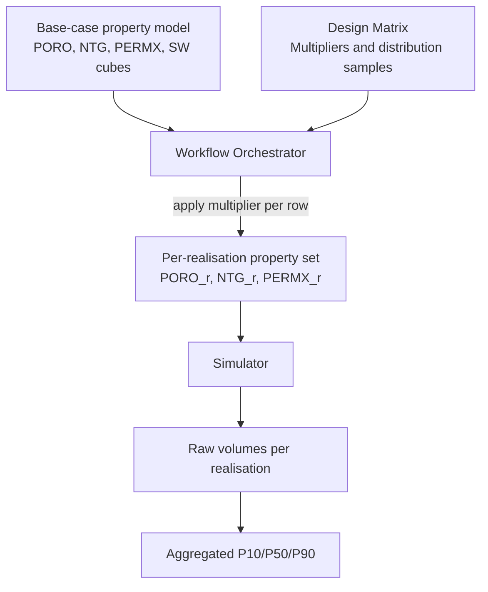
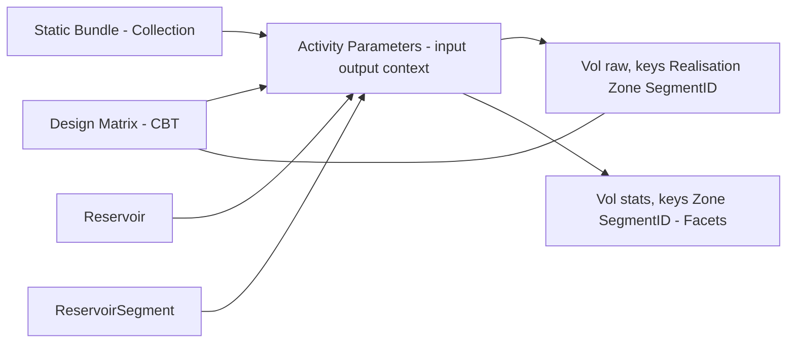
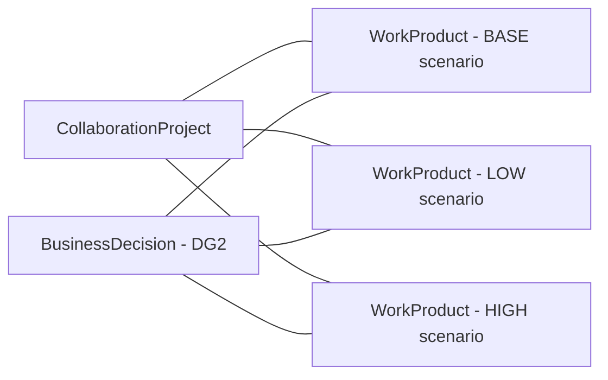
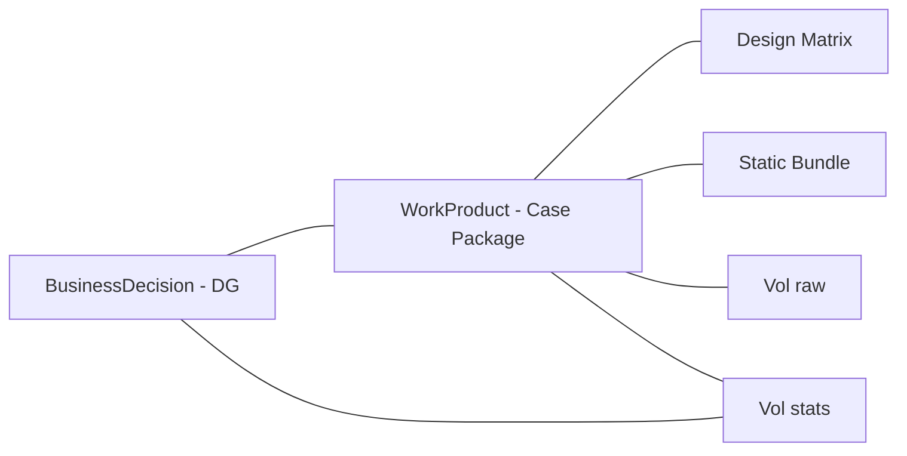
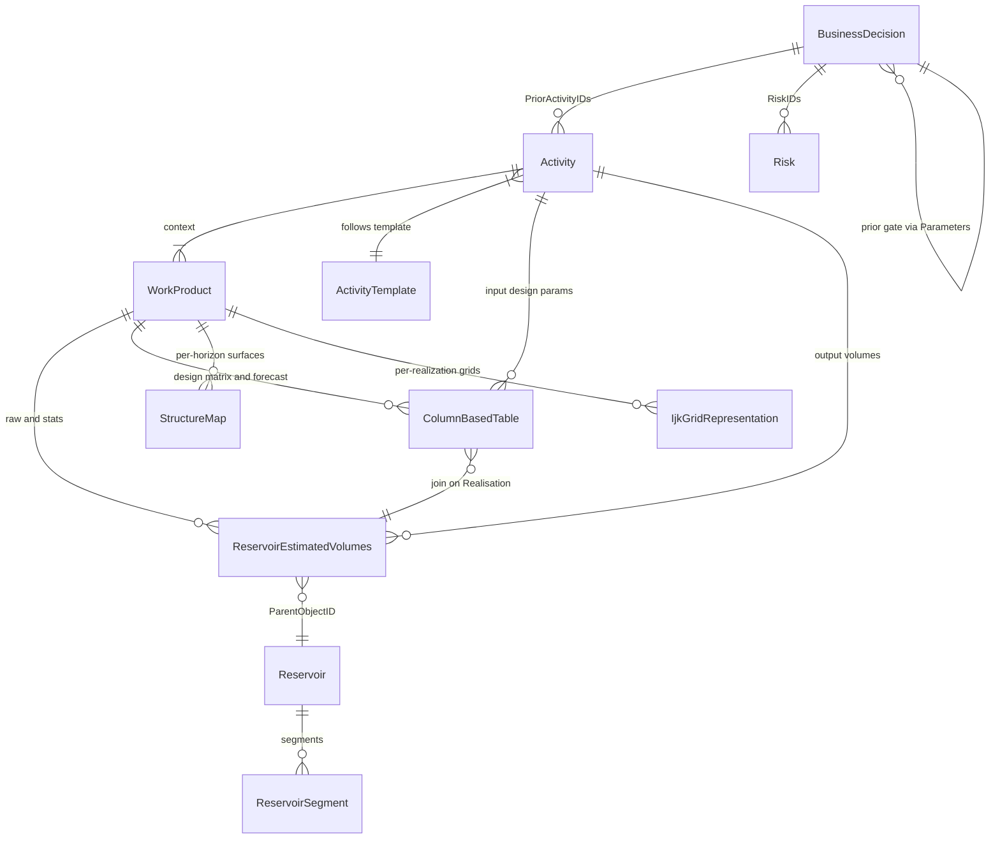

# Uncertainty & Ensemble Simulation in OSDU

> How to persist ensemble simulation inputs, scenarios, and outputs in OSDU - from design matrix through hundreds of realizations to decision-gate evidence at DG1-DG4.

**Related**: [Volumes](/howto/volumes) (REV schema, column mapping, JSON examples) · [BusinessDecision](/howto/business-decision) · [Risk](/howto/risk) · [SeisInt](/howto/seismic-interp) · [StratColumn](/howto/strat-column)

---

## Part I - Uncertainty Concepts

### 1. Taxonomy of Subsurface Uncertainty

| Category | Nature | Question answered | Example |
|---|---|---|---|
| **Scenario** | Discrete alternative geological model | "Which story?" | Connected aquifer vs isolated lenses |
| **Parameter variation** | Continuous multiplier/shift on a single model | "How much?" | KxMult = 0.5…2.0 |
| **Sensitivity** | One-at-a-time parameter variation | "Which parameter matters most?" | Tornado chart ranking |
| **Property uncertainty** | Range/distribution on rock & fluid properties | "How uncertain is PORO / NTG / Kv/Kh?" | Porosity ±3 p.u. |

A complete assessment at DG2+ typically runs **N scenarios × M realisations each**, producing N×M raw volume records but N aggregated statistics sets (one P10/P50/P90 per scenario).

### 2. Scenarios - Alternative Interpretations

#### 2.1 Why Scenarios Differ from Parameter Variation

The design matrix captures **continuous parameter uncertainty** - multipliers, shifts, family selectors applied to a *single structural/property model*. **Scenarios** capture **discrete geological ambiguity** - fundamentally different interpretations of the subsurface where no parameter sweep connects one to another.

| Aspect | Parameter variation | Scenario |
|---|---|---|
| Nature | Continuous (KxMult = 0.5…2.0) | Discrete (connected aquifer vs isolated lenses) |
| Model topology | Same grid, same zones | Possibly different grid, different zone count |
| Geological question | "How much?" | "Which story?" |
| Volume impact | Spread within a trend | Step-change between clusters |
| OSDU representation | Design matrix rows + Realisation key | Separate WorkProducts + scenario facet |

#### 2.2 Common Scenario Types

Inspired by geological ambiguity mechanisms (cf. WeCo scenario engine):

1. **Connectivity** - are sand bodies one connected sheet or isolated lenses?
2. **Stacking pattern** - amalgamated channel belt vs separate avulsion events
3. **Geometry** - layer-cake vs clinoform/wedge (parasequence pinch-out)
4. **Cycle counting** - more cycles present in one well than another; which are "missing"?
5. **Fault juxtaposition** - which layers correlate across a fault with growth expansion?
6. **Fluid contact** - single OWC vs tilted/compartmentalised contacts

#### 2.3 Scenario vs Sensitivity vs Ensemble

| Term | Meaning | OSDU pattern |
|---|---|---|
| **Scenario** | Discrete alternative geological model (different grid/interpretation) | Separate WorkProduct + scenario facet |
| **Sensitivity** | One-at-a-time parameter variation to rank uncertainty drivers | Design matrix rows where one parameter varies, others at base |
| **Ensemble** | Full Monte Carlo across design matrix for ONE scenario | All realisations under one WorkProduct |

### 3. Uncertainty in Properties

#### 3.1 Key Properties Under Uncertainty

| Property | Symbol | Typical uncertainty | Impact |
|---|---|---|---|
| Porosity | PORO | ±2–5 p.u. absolute | Pore volume → STOIIP |
| Net-to-Gross | NTG | ±0.05–0.20 | Net volume → STOIIP |
| Permeability | PERMX/PERMY/PERMZ | Factor 2–10× (log-normal) | Flow rates, recovery |
| Water saturation | SW | ±0.02–0.10 | Hydrocarbon pore volume |
| Rel-perm family | KR | Discrete choice (1 of N) | Recovery factor |
| Rock compressibility | CR | ±20–50% | Pressure support |
| Facies proportions | FACIES | ±5–15% per facies | Connectivity, NTG |

#### 3.2 Specifying Uncertainty: Range, Distribution, Parameters

**Range (min/max bounds)** - physical or geological limits:

```yaml
KxMultiplier:
  min: 0.3
  max: 3.0
NTG_Shift:
  min: -0.10
  max: +0.10
```

**Distribution types and statistical parameters:**

| Distribution | Use case | Parameters | Example |
|---|---|---|---|
| **Uniform** | No prior knowledge beyond bounds | min, max | NTG shift: U(-0.10, +0.10) |
| **Triangular** | Expert best-guess + bounds | min, mode, max | PORO multiplier: Tri(0.7, 1.0, 1.4) |
| **Normal** | Well-constrained, symmetric | mean, std | SW init: N(0.25, 0.03) |
| **Log-normal** | Permeability, thickness | mu_ln, sigma_ln | PERMX: LN(5.5, 1.2) → median ~245 mD |
| **Truncated normal** | Constrained symmetric | mean, std, min, max | PORO: TN(0.22, 0.03, 0.10, 0.35) |
| **Discrete** | Facies model family, rel-perm set | choices + weights | RelPermFamily: {A: 0.4, B: 0.35, C: 0.25} |
| **Beta** | Bounded proportion (NTG, Sw) | alpha, beta, [a, b] | NTG: Beta(2, 5) on [0, 1] |

#### 3.3 Common Use Cases

**A. Porosity and NTG - direct volume impact**

Setup: Well data gives mean porosity = 0.22 with std = 0.03. NTG from core is 0.65 ± 0.08.

- `PORO_Mult`: Triangular(0.85, 1.0, 1.15) - applied to deterministic PORO field
- `NTG_Mult`: Normal(1.0, 0.12) - applied to NTG cube
- Volume impact: STOIIP ∝ PORO × NTG × (1 − Sw) × BulkVolume → ±15–25% spread

**B. Permeability - flow and recovery impact**

Setup: Log-derived perm has factor-3 uncertainty; core shows geometric mean 150 mD, sigma_ln = 1.1.

- `PERMX_Mult`: LogNormal(0, 0.8) - multiplicative factor on base perm field
- `Kv_Kh_Ratio`: Uniform(0.01, 0.3) - vertical-to-horizontal ratio
- Impact: Recovery factor and plateau rate; typically DG3+ (dynamic simulation)

**C. Relative permeability - discrete family uncertainty**

Setup: Three candidate SCAL curves: water-wet (A), mixed-wet (B), oil-wet (C).

- `RelPermFamily`: Discrete{A: 0.4, B: 0.35, C: 0.25} - weighted by plausibility
- Impact: Step-change in recovery factor (10–30% variation); often the single largest dynamic uncertainty

**D. Saturation function and contacts**

Setup: OWC from pressure data = 1693 m ± 10 m. Transition zone height uncertain.

- `OWC_Depth`: Triangular(1680, 1693, 1710)
- `CapPressure_Mult`: Uniform(0.5, 2.0) - scales J-function
- Impact: STOIIP (pore volume above OWC) + early water production risk

#### 3.4 Correlation Between Properties

Properties are often correlated (high PORO → high PERMX; low NTG → different facies). The design matrix should use **Latin Hypercube Sampling with correlation** (e.g., Iman-Conover) and document the correlation matrix as a parameter in the Activity record.

---

## Part II - Experimental Design (Inputs)

### 4. Design Matrix

**Recommended schema pattern** (ColumnBasedTable):
- **KeyColumns**: `CaseID:string`, `Realisation:integer`, `Seed:integer` (optional).
- **Columns**: parameter vector per row (e.g., `KxMultiplier:number`, `RelPermFamily:string`, `NTG_Shift:number`, …); use UCUM units in column metadata where relevant.
- **Linkage**: referenced from Activities (run records) and joined to raw REV on `Realisation`.

**Example (excerpt)**:
```json
{
  "kind": "osdu:wks:work-product-component--ColumnBasedTable:1.3.0",
  "data": {
    "Name": "Design Matrix - Case A",
    "KeyColumns": [
      {"ColumnName": "CaseID", "ColumnRole": "Key", "ValueType": "string"},
      {"ColumnName": "Realisation", "ColumnRole": "Key", "ValueType": "integer"},
      {"ColumnName": "Seed", "ColumnRole": "Key", "ValueType": "integer"}
    ],
    "Columns": [
      {"ColumnName": "KxMultiplier", "ValueType": "number"},
      {"ColumnName": "RelPermFamily", "ValueType": "string"}
    ]
  }
}
```

**Full design matrix with distribution metadata:**
```json
{
  "kind": "osdu:wks:work-product-component--ColumnBasedTable:1.3.0",
  "data": {
    "Name": "Design Matrix - Drogon DG2",
    "KeyColumns": [
      {"ColumnName": "Realisation", "ColumnRole": "Key", "ValueType": "integer"}
    ],
    "Columns": [
      {"ColumnName": "PORO_Mult", "ValueType": "number",
       "Remark": "Triangular(0.8, 1.0, 1.3) - porosity multiplier on Tarbert Fm"},
      {"ColumnName": "PERMX_Mult", "ValueType": "number",
       "Remark": "LogNormal(mu=0, sigma=0.7) - horizontal perm multiplier"},
      {"ColumnName": "NTG_Shift", "ValueType": "number",
       "Remark": "Uniform(-0.08, +0.08) - additive NTG adjustment"},
      {"ColumnName": "SW_Init_Mult", "ValueType": "number",
       "Remark": "Normal(1.0, 0.05) - Sw initialisation multiplier"},
      {"ColumnName": "RelPermFamily", "ValueType": "string",
       "Remark": "Discrete{A:0.4, B:0.35, C:0.25} - relative permeability set"},
      {"ColumnName": "FaciesProb_Sand", "ValueType": "number",
       "Remark": "Beta(2,5) on [0.3, 0.8] - sand proportion in Ness Fm"},
      {"ColumnName": "OWC_Depth", "ValueType": "number",
       "Remark": "Triangular(1680, 1693, 1710) - oil-water contact depth [m]"}
    ]
  }
}
```

### 5. Static Inputs (Grids, Properties, Velocity)

Represent each artifact as a WPC and group the choice for a scenario into **one id**:
- **WorkProduct** = stable case package for DG usage.
- **CollaborationProjectCollection** = flexible working set during model development.

### 6. Persisting Uncertainty Definitions

| What to persist | Where | Format |
|---|---|---|
| Distribution definitions (type, params, bounds) | Design Matrix CBT column `Remark` or dedicated CBT | JSON or structured text |
| Sampled values (N realisations) | Design Matrix CBT rows | Numeric/string columns |
| Base-case property cubes | IjkGridRepresentation + property WPCs | ROFF/RESQML arrays |
| Correlation structure (if any) | Companion CBT or Activity parameter | Correlation matrix or copula spec |

---

## Part III - OSDU Data Model

### 7. Building Blocks

#### 7.1 Master‑data (anchors for scope)
- `master-data--Reservoir` - the reservoir entity of interest.
- `master-data--ReservoirSegment` - segments or compartments under the reservoir.

*Why:* `ReservoirEstimatedVolumes` is scoped by `ParentObjectID` to Field/Reservoir/ReservoirSegment.

#### 7.2 Reference‑data (governed catalogs)
- **Units**: `reference-data--UnitOfMeasure` (e.g., `m3`, `Mm3`).
- **Statistics facets**: `reference-data--FacetType:statistics`, `reference-data--FacetRole:{P10,P50,P90,ArithmeticMean,Minimum,Maximum,StandardDeviation}`.
- **Scenario facets**: `reference-data--FacetType:scenario`, `reference-data--FacetRole:{BASE,LOW,HIGH,…}`.
- **Canonical volume property types**: `reference-data--ReservoirEstimatedVolumePropertyType:{Bulk,Net,Pore,HydrocarbonPore,Oil,AssociatedGas}`.

#### 7.3 Work‑product components (WPCs)
- **Design Matrix** - `work-product-component--ColumnBasedTable` (CBT).
- **Static bundles** - grids, properties, velocity as WPCs (e.g., `GenericRepresentation`, `VelocityModeling`).
- **Output volumes** - `work-product-component--ReservoirEstimatedVolumes` (REV), raw per‑realisation and aggregated statistics.
- **Optional KPIs** - `work-product-component--ColumnBasedTable` for generic KPI/time series.

#### 7.4 Collections and scenario packaging
- **WorkProduct** - versioned case package (design + static bundle + chosen outputs). One per scenario.
- **CollaborationProjectCollection** - curated working set while iterating.

#### 7.5 Activity semantics (`AbstractProjectActivity`)
Use `Parameters[]` with `ParameterRole = input|output|context` and `ObjectParameterKey` to enumerate run inputs/outputs and context. Keys (e.g., `realisation-index`, `seed`, `scenario-id`) keep the mapping explicit.

### 8. Scenario Representation in OSDU

#### A. FacetType = scenario (lightweight tagging)

Attach a scenario facet to WPCs or GeoLabelSet columns to distinguish model variants:

```json
{
  "FacetIDs": [
    { "FacetTypeID": "<partition>:reference-data--FacetType:scenario",
      "FacetRoleID": "<partition>:reference-data--FacetRole:BASE" }
  ]
}
```

Typical roles: `BASE`, `LOW`, `HIGH`, `OPTIMISTIC`, `PESSIMISTIC`, or project-specific (`CONNECTED_AQUIFER`, `ISOLATED_LENSES`).

**Query** for all records in a given scenario:
```json
{
  "kind": "osdu:wks:work-product-component--ReservoirEstimatedVolumes:1.1.0",
  "query": "data.FacetIDs.FacetRoleID:\"<partition>:reference-data--FacetRole:BASE\""
}
```

#### B. WorkProduct per scenario (full separation)

Each scenario gets its own WorkProduct (case package) containing:
- Its own static bundle (grid + properties if topology differs)
- Its own design matrix (parameter ranges may vary per scenario)
- Its own ensemble outputs (REV, surfaces)

The CollaborationProjectCollection or BusinessDecision then references **all scenario WorkProducts** to compare at a gate.

#### C. Activity linking across scenarios

Use Activity `Parameters[]` with a `scenario-id` key to trace which scenario produced which outputs:

```json
{
  "Parameters": [
    {"Title": "Scenario", "ParameterRole": "context",
     "Keys": [{"ParameterKey": "scenario-id", "StringParameterKey": "CONNECTED_AQUIFER"}],
     "ObjectParameterKey": "dev:work-product--WorkProduct:case-connected:2"},
    {"Title": "Design Matrix", "ParameterRole": "input",
     "ObjectParameterKey": "dev:work-product-component--ColumnBasedTable:dm-connected:1"},
    {"Title": "Output Volumes", "ParameterRole": "output",
     "ObjectParameterKey": "dev:work-product-component--ReservoirEstimatedVolumes:rev-connected:3"}
  ]
}
```

---

## Part IV - Workflow & Provenance

### 9. Run Bookkeeping with Activity Parameters

For each run/iteration, create an Activity (or reuse `BusinessDecision` parameters if the run feeds a gate):
- **Parameters[] / input**: Design Matrix row (`realisation-index`), static bundle (WorkProduct/Collection), simulator deck/model.
- **Parameters[] / output**: raw REV (this realisation), aggregate REV (per zone/segment).
- **Parameters[] / context**: reservoir and segments; case collection; scenario-id.

**Example (schematic)**:
```json
{
  "Parameters": [
    {"Title": "Design row", "ParameterRole": "input",
     "Keys": [{"ParameterKey": "realisation-index", "StringParameterKey": "42"}],
     "ObjectParameterKey": "dev:work-product-component--ColumnBasedTable:design-matrix:1"},
    {"Title": "Static bundle", "ParameterRole": "input",
     "ObjectParameterKey": "dev:work-product--WorkProduct:caseA-static:3"},
    {"Title": "Raw volumes", "ParameterRole": "output",
     "Keys": [{"ParameterKey": "realisation-index", "StringParameterKey": "42"}],
     "ObjectParameterKey": "dev:work-product-component--ReservoirEstimatedVolumes:raw-42:1"},
    {"Title": "Aggregate volumes", "ParameterRole": "output",
     "ObjectParameterKey": "dev:work-product-component--ReservoirEstimatedVolumes:stats:5"}
  ]
}
```

**Naming keys**: use `realisation-index`, `seed`, `case-id`, `scenario-id` consistently; prefer kebab‑case; avoid spaces.

### 10. Realisation Mapping

- **Join on keys**: raw REV `Realisation` ↔ Design Matrix row `Realisation`.
- **Activity link**: the run Activity carries both the **design row** and the **raw REV output** with the same `realisation-index` key in `Parameters[]`.
- **Case binding**: WorkProduct/Collection id referenced as `context` to bind the scenario.

### 11. Property Uncertainty in the Ensemble Workflow



**Key points**:
- The base-case property model is a **single WPC** (or set of WPCs for grid + properties)
- Multipliers/shifts from the design matrix are applied **at runtime** by the orchestrator
- Each realisation produces a modified property field - typically NOT stored individually (too large); only the multipliers and resulting volumes are persisted
- Statistics (P10/P50/P90 of volumes) capture the aggregate effect of property uncertainty

### 12. Scenario Workflow

| Step | Action | OSDU artifact |
|---|---|---|
| 1 | Identify discrete geological ambiguity sources | (domain knowledge, no OSDU record) |
| 2 | Build alternative static models (grids/properties) | WPCs per scenario, grouped in WorkProduct |
| 3 | Tag with scenario facet | `FacetType=scenario`, `FacetRole=<NAME>` |
| 4 | Run ensemble per scenario (separate design matrices or shared) | Design Matrix CBT + Activity |
| 5 | Aggregate statistics per scenario | REV with scenario facet |
| 6 | Compare at gate | BusinessDecision referencing all scenario WorkProducts |

### 13. Decision-Gate Alignment

Each gate demands progressively more evidence:

| Gate | Scope | Key OSDU artifacts |
|---|---|---|
| **DG1** | Screening: few realizations, simple design | Reservoir, Segments, REV, input params CBT, Risks, Activity, BD |
| **DG2** | Full ensemble (50-250 realizations) | + IjkGrid, StructureMaps, GeoLabelSet, production forecast |
| **DG3** | Dynamic simulation, history matching | + WellboreTrajectory, ProductionValues, match metrics |
| **DG4** | Full-field optimization (100-1000+ realizations) | + updated forecasts, revised uncertainties |

Cross-gate evolution: BD at DG(n+1) references BD at DG(n) as context parameter.

---

## Part V - Outputs

### 14. Volumes

#### 14.1 Raw per-realisation (REV)
Keys: `Realisation`, `Zone`, `SegmentID` (with `KindID = master-data--ReservoirSegment:2.0.0`).
Columns: `Bulk`, `Net`, `Pore`, `HydrocarbonPore`, `Oil`, `AssociatedGas` - each with `PropertyTypeID` and `UnitOfMeasureID: m3`.

#### 14.2 Aggregated statistics (REV)
Keys: `Zone`, `SegmentID` (no Realisation - aggregated across runs).
Columns: dot notation `<Property>.<Statistic>` - e.g. `Bulk.P10`, `Oil.ArithmeticMean`.
Each column carries `FacetIDs` with `FacetType:statistics` + `FacetRole:<P10|P50|P90|ArithmeticMean|...>`.

> See [Volumes](/howto/volumes) for full JSON examples of both raw and aggregated REV records, column mapping, and naming conventions.

---

## Part VI - Diagrams

### 15.1 Data flow


### 15.2 Scenario packaging


### 15.3 Case packaging and DG alignment


### 15.4 Entities and relations


---

## Part VII - Reference

### 16. Conventions and Tips
- **Column names**: use dot notation for statistics; avoid spaces and parentheses in labels.
- **Keys**: always include `Realisation` in raw outputs; keep `SegmentID` aligned to `ReservoirSegment` ids.
- **Units**: prefer `m3` unless business rules require `Mm3`; carry units in `UnitOfMeasureID`.
- **Facet roles**: use `ArithmeticMean` and `StandardDeviation` (not Average/StDev) for consistency.
- **Scenario facets**: use `FacetType=scenario` with meaningful roles; avoid generic LOW/HIGH if project names are clearer.
- **Legal/ACL**: apply appropriate partition tags on all records; group artefacts under a WorkProduct per DG when promoting.

### 17. Where to Read More

| Topic | Link |
|---|---|
| REV schema (OSDU) | [OSDU Data Definitions](https://community.opengroup.org/osdu/data/data-definitions) |
| ColumnBasedTable (OSDU) | [OSDU Data Definitions](https://community.opengroup.org/osdu/data/data-definitions) |
| Activity semantics (OSDU) | [OSDU Data Definitions](https://community.opengroup.org/osdu/data/data-definitions) |
| Volume guide | [Volumes](/howto/volumes) |
| BusinessDecision | [BusinessDecision](/howto/business-decision) |
| Risk | [Risk](/howto/risk) |

---

## Appendix A: Standard Results Mapping

Typical ensemble workflow outputs and their OSDU representations:

| Standard result | Export format | OSDU record type |
|---|---|---|
| In-place volumes | Parquet / CSV | `ReservoirEstimatedVolumes` |
| Structure depth surfaces | Grid format (.gri, .irap) | `StructureMap` WPC |
| Structure time surfaces | Grid format | `StructureMap` / `GenericRepresentation` |
| Static grid model | ROFF / RESQML | `IjkGridRepresentation` + property WPCs |
| Simulator tables (relperm, PVT) | CSV / Arrow | `ColumnBasedTable` WPC |
| Polygons (faults, outlines) | XYZ / GeoJSON | `GenericRepresentation` WPC |
| Production forecasts | CSV / Arrow | `ColumnBasedTable` WPC |

---

## Appendix B: Simulator Deck Round-Trip

A sidecar manifest accompanies every simulator deck export:

- **Identity**: deck_id, case, realization
- **Grid**: grid_uuid, osdu_srn, dims, crs
- **Properties[]**: property_uuid, title, simulator_keyword, uom, discrete
- **Ancestry Inputs**: list of input WPC IDs

Round-trip rules:
1. **Grid Lock** - grid_uuid persists unless topology changes
2. **Property Lock** - each property retains uuid and simulator keyword
3. **CRS/UOM Lock** - manifest includes CRS type, origin, axis order, UOM
4. **Ancestry Chain** - outputs set `data.ancestry.inputs` to exact input WPC IDs

---

## Appendix C: Vendor Toolchain Examples

For teams using specific orchestration tools, these are common integration patterns:

| Tool | Role | Link |
|---|---|---|
| ERT | Ensemble-based Reservoir Tool (orchestrator) | [github.com/equinor/ert](https://github.com/equinor/ert) |
| fmu-dataio | Metadata export library (standard results) | [fmu-dataio.readthedocs.io](https://fmu-dataio.readthedocs.io/en/latest/) |
| fmu-sumo | Cloud SoR for ensemble results | [github.com/equinor/fmu-sumo](https://github.com/equinor/fmu-sumo) |
