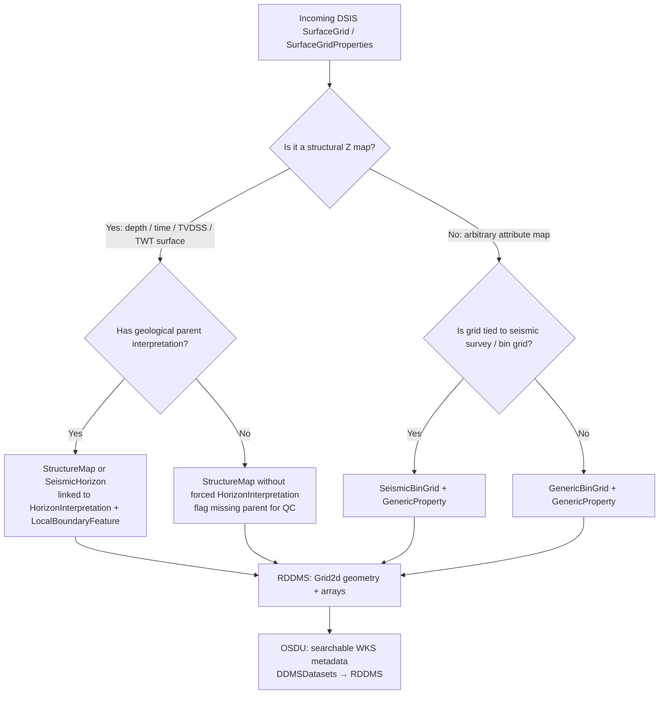
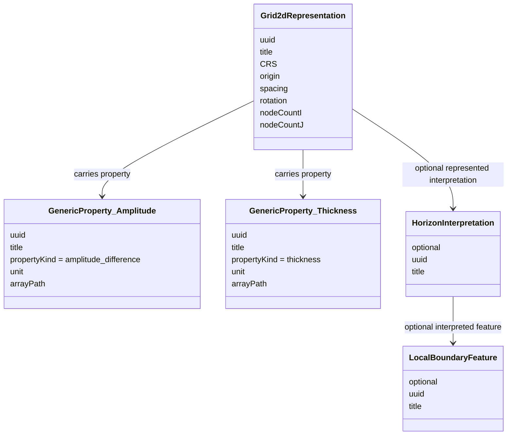
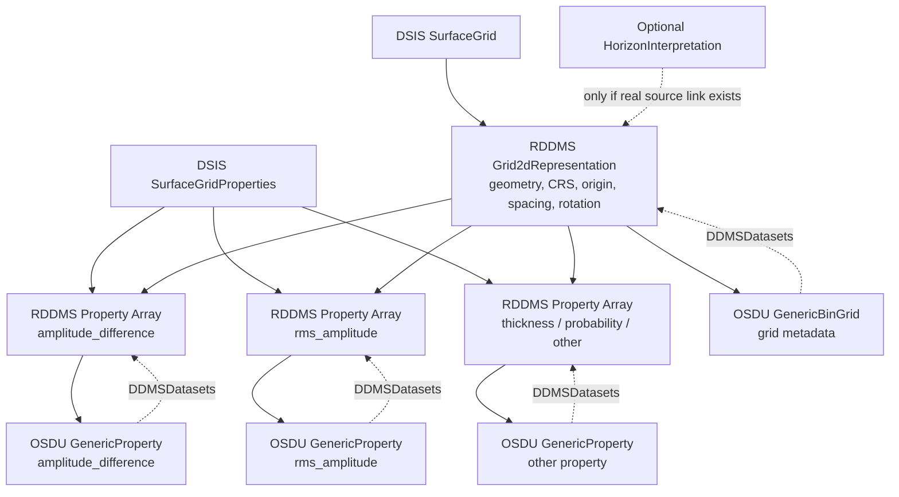

# Mapping OpenWorks Surface Grids to RDDMS & OSDU

This guide covers how to map OpenWorks / DSIS surface grids into RESQML (RDDMS) and OSDU WKS records - including when to create the full Feature–Interpretation–Representation (FIRP) hierarchy and when to skip it.

---

## 1. The Core Question

OpenWorks exposes grids through `SurfaceGrid` / `SurfaceGridProperties` (via DSIS Common Model). Many of these are **not** geological structure maps - they may be amplitude, thickness, probability, coherence, or other attribute maps on a 2D lattice.

The key principle:

> Store the **grid geometry** once in RDDMS. Store **attribute arrays as properties** linked to that grid. In OSDU, distinguish between structural maps and generic grid-linked properties. **Do not fabricate geological hierarchy that doesn't exist in the source.**

---

## 2. When to Create FIRP - and When Not To

### When FIRP adds genuine value

The Feature → Interpretation → Representation hierarchy matters when the source data has **real reuse or divergence**:

| Scenario | Why FIRP helps |
|----------|---------------|
| Same horizon (e.g. BCU), multiple representations (depth map, TWT map, control points, fault sticks) | One `HorizonInterpretation` → many representations. Change the interpretation name/age once, all surfaces inherit it. |
| Same feature, competing interpretations (optimistic vs conservative fault throw) | One `LocalBoundaryFeature` → two `FaultInterpretation` objects → different geometry sets. |
| Stratigraphy linkage | `HorizonInterpretation` carries `FeatureID` → `LocalBoundaryFeature` which participates in a `StratigraphicColumn`. Without it, surfaces are disconnected from the strat framework. |
| Graph-based search | "Show me all representations linked to the BCU" is a one-hop query if the Feature exists. Without it, you are doing string matching on names. |
| Impact analysis | "Which surfaces are affected if we revise the Top Draupne interpretation?" - only answerable if the interpretation node exists as a shared parent. |

### When FIRP is overhead

For bulk OpenWorks grids where:

- each grid is a standalone attribute map (amplitude, thickness, probability);
- there is no parent horizon in the source system;
- reuse across multiple representations will never happen;

…then **don't fabricate FIRP**. The correct mapping is:

```text
Grid2dRepresentation (geometry) → GenericBinGrid (OSDU catalog)
Property arrays              → GenericProperty (OSDU catalog)
```

No `HorizonInterpretation`, no `LocalBoundaryFeature`.

### The "empty interpretation" anti-pattern

Many existing ingestions (e.g. LMK) create Interpretation/Feature objects that are effectively empty shells with just a name copied from the representation. That is a **bad implementation of FIRP**, not a vindication of the pattern. The value comes when:

1. The interpretation carries semantic fields (`DomainTypeID`, age, conformability, sequence-strat surface type).
2. Multiple representations actually link to the same interpretation (real reuse).
3. The feature participates in a `StratigraphicColumn`.

If none of those conditions are true - and won't become true - skip the objects. The FIRP pattern is a *domain ontology*, not a bureaucratic filing requirement.

---

## 3. Decision Tree



### Classification criteria

**Structural surface** - at least one of:
- attribute is explicitly Z, depth, TVDSS, TWT, time, or structure
- unit is depth or time
- linked to `HorizonInterpretation` or seismic horizon
- values are consistent with regional depth/time
- OpenWorks relationship indicates geological surface

**Attribute map** - one or more of:
- attribute name is amplitude, RMS amplitude, coherence, probability, thickness, etc.
- unit is not depth/time
- no `HorizonInterpretation` parent exists
- values are not plausible depth/time values

**Ambiguous** - metadata conflicts (e.g. TVDSS domain but amplitude-like name/values):
- map conservatively as `GenericProperty`
- set domain to `mixed` or unresolved
- flag QC warning - do not map as `StructureMap` without confirmation

---

## 4. Target Patterns

### 4.1 Attribute maps on a generic grid (preferred for most OW grids)

```text
GenericBinGrid
  DDMSDatasets[] → RDDMS grid geometry

GenericProperty (one per attribute)
  TargetRepresentation → GenericBinGrid
  PropertyKind → amplitude_difference / rms_amplitude / thickness / probability
  Unit → source unit
  DDMSDatasets[] → RDDMS property array
```

RDDMS stores: grid representation + geometry + property arrays + CRS + unit context + property-to-grid relationships.

### 4.2 Structural depth map

Use only for genuine structural Z values.

```text
LocalBoundaryFeature           ← only if geologic identity exists
  → HorizonInterpretation      ← only if source provides it
    → StructureMap
        DDMSDatasets[] → RDDMS depth array
```

### 4.3 Structural time map / seismic horizon

```text
HorizonInterpretation
  → SeismicHorizon
      DDMSDatasets[] → RDDMS time grid array
```

Optional depth-converted product:

```text
SeismicHorizon → StructureMap
    DDMSDatasets[] → RDDMS depth-converted array
```

### 4.4 Seismic attribute map (tied to seismic bin grid)

```text
SeismicBinGrid
  → GenericProperty
       PropertyKind → seismic_attribute
       Unit → source unit
       DDMSDatasets[] → RDDMS property array
```

### Summary table

| Case | RDDMS content | OSDU WKS records | FIRP objects |
|---|---|---|---|
| Arbitrary attribute map | Grid2d + property arrays | `GenericBinGrid` + `GenericProperty` | None |
| Multiple attributes on same grid | One grid + many properties | `GenericBinGrid` + many `GenericProperty` | None |
| Seismic attribute map | Grid + property | `SeismicBinGrid` + `GenericProperty` | None |
| Structural depth map, known horizon | Grid2d + Z array | `StructureMap` | `HorizonInterpretation` + `LocalBoundaryFeature` |
| Structural depth map, no parent | Grid2d + Z array | `StructureMap` | None (flag for QC) |
| Attribute on a known horizon | Grid + property | `GenericProperty` linked to grid | `HorizonInterpretation` only if source link exists |

---

## 5. RDDMS Storage Model





### Key rule

The property array should not be stored as the structural Z geometry unless it really is structural Z.

- **Amplitude-difference map**: grid = XY lattice; property array = amplitude_difference; property kind/unit captures semantics.
- **TVDSS structural map**: grid = XY lattice; Z array = TVDSS depth values; domain = depth; WKS = `StructureMap`.

---

## 6. Domain Mapping: Time, Depth, Mixed

Two separate concepts:

1. **Representation geometry domain** - is the surface time, depth, or mixed?
2. **Property value semantics** - what do the array values represent (amplitude, thickness, probability, depth, time)?

If a grid is labelled TVDSS in OpenWorks but the name/values indicate RMS amplitude difference, do **not** map it as a depth `StructureMap`. Treat it as a `GenericProperty` with amplitude semantics and flag the conflict.

### Precedence order for classification

1. **Explicit source metadata** - OW attribute type, DSIS property metadata, unit, CRS/vertical domain
2. **Relationship context** - linked `HorizonInterpretation`, seismic horizon, bin grid
3. **Value semantics** - depth-like range, time-like range, attribute categories
4. **Name and remark** - use as weak classifier only, not sole authority
5. **Fallback** - map to `GenericProperty`, set domain to mixed, flag for QC

---

## 7. Linking Attribute Maps to Horizons

Only link a `GenericProperty` to `HorizonInterpretation` when:

- OpenWorks has a parent horizon relationship;
- the map is explicitly an attribute extracted along a named horizon;
- the source workflow records the interpretation relationship.

Do **not** link when:

- the map is a standalone surface-grid property;
- the parent horizon is missing;
- the relationship would be inferred only from name similarity.

Instead, use provenance: `Activity` records, source project alias, or collection membership.

---

## 8. Worked Example

### Source observation

> The source object has a TVDSS domain in OpenWorks, but the name and remark suggest it is an RMS amplitude difference map. It ended up in RDDMS with domain `mixed`.

### If the values are amplitude difference

```text
RDDMS:   Grid2dRepresentation (XY lattice) + ContinuousProperty (amplitude values)
OSDU:    GenericBinGrid + GenericProperty (kind=amplitude_difference)
Domain:  mixed (fallback)
FIRP:    None
QC flag: source domain says TVDSS but property appears non-depth
```

### If the values are actually TVDSS depth

```text
RDDMS:   Grid2dRepresentation with depth Z values
OSDU:    StructureMap + HorizonInterpretation (if available)
Domain:  depth
FIRP:    Yes, if geologic identity is known
```

---

## 9. Round-Trip Fidelity

RDDMS preserves RESQML Citation metadata in OSDU `ExtensionProperties`:

| RESQML field | OSDU ExtensionProperties key | Scope |
|---|---|---|
| `Citation.Format` | `AuthoringSoftware` | All WPCs (base class) |
| `Citation.Originator` | `Interpreter` | StructureMap, SeismicHorizon |

RDDMS manifest export includes `*Property` objects by default (`DEFAULT_DATASPACE_TYPE_PATTERNS`), so `GenericProperty` / `ContinuousProperty` records on grids appear in manifests alongside their parent representations.

---

## 10. Vendor Clarifications Needed

| # | Question |
|---|---|
| 1 | Which DSIS/OW fields determine structural vs attribute? |
| 2 | Which field determines RESQML domain (`time`/`depth`/`mixed`)? |
| 3 | Is `mixed` assigned due to conflicting metadata, non-depth values, or missing interpretation? |
| 4 | Are name/remark, units, and value ranges used in classification? |
| 5 | Are parent horizon links inspected? |
| 6 | Can the mapper emit QC warnings for conflicting metadata? |
| 7 | Can the mapper produce `GenericProperty` rather than `StructureMap` for attribute maps? |
| 8 | Can multiple properties share one grid representation in RDDMS? |

---

## Quick Reference

| Source data has… | Create FIRP? | Target records |
|---|---|---|
| Explicit horizon/fault identity in OW | Yes | `StructureMap` → `HorizonInterpretation` → `LocalBoundaryFeature` |
| Multiple surfaces sharing one geologic horizon | Yes - reuse the Interpretation | Shared `HorizonInterpretation`, multiple representations |
| Standalone attribute grid, no parent horizon | **No** | `GenericBinGrid` + `GenericProperty` |
| Structural Z surface with known geologic name | Yes | Full FIRP chain |
| Ambiguous metadata | **No** - map conservatively | `GenericProperty` + QC flag |
