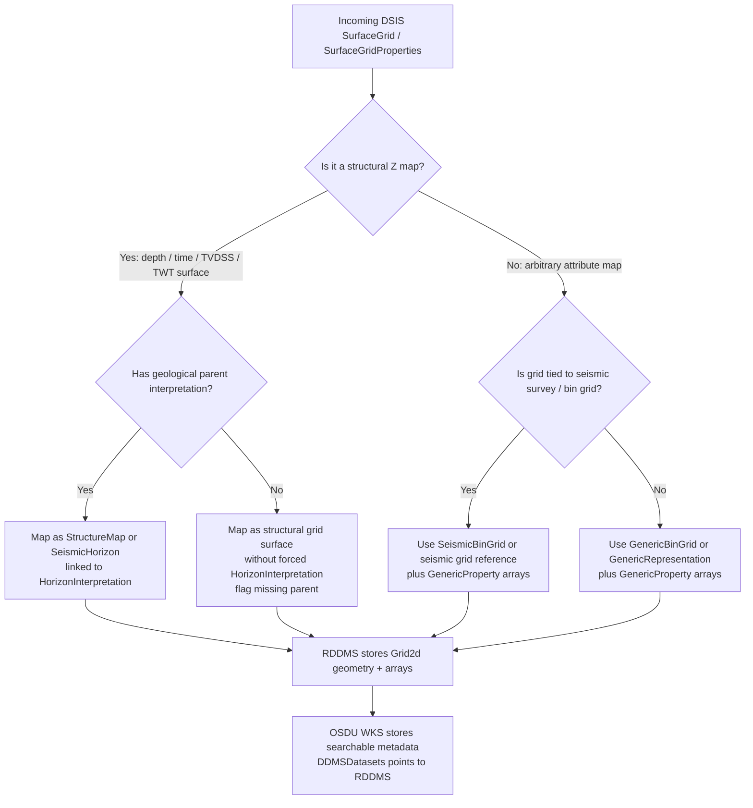
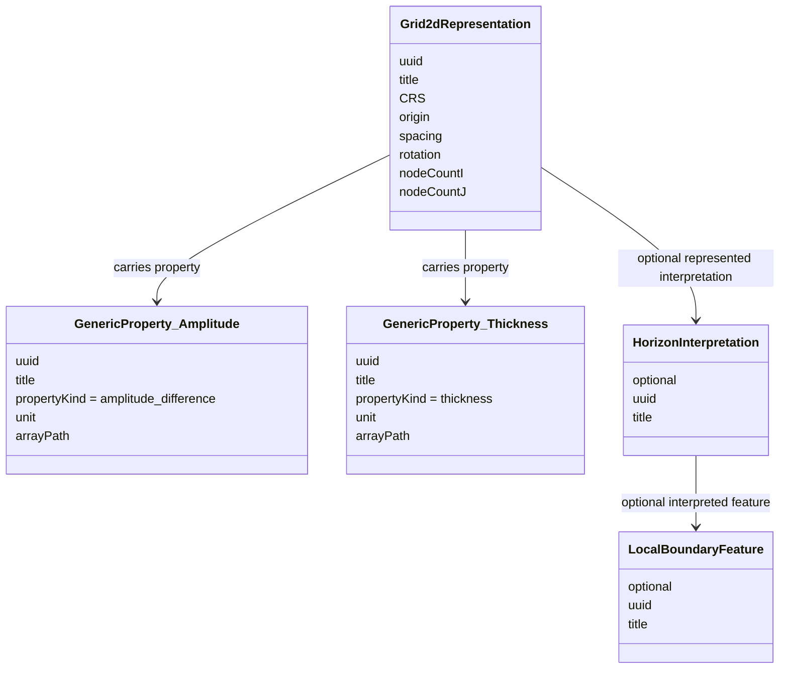
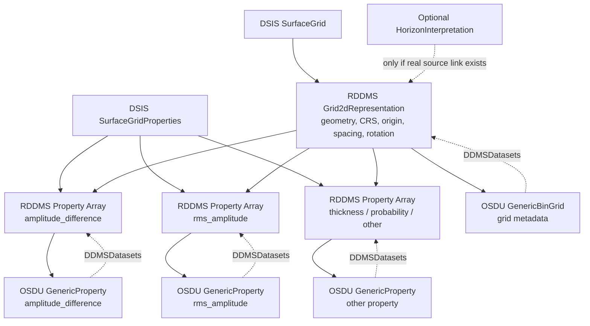

# Mapping OpenWorks / DSIS SurfaceGridProperties to RDDMS and OSDU WKS

## 1. Problem Statement

The vendor question is essentially:

> How should OpenWorks / DSIS surface grids that are really **attribute maps** be mapped into RESQML, RDDMS, and OSDU WKS when they are not structurally tied to a parent horizon or structural surface?

This matters because DSIS Common Model exposes large OpenWorks grids through `SurfaceGrid` / `SurfaceGridProperties`, while the native OpenWorks model exposes grids through composite `Rgrid(...)` keys. DSIS Common Model also appears to be the more reliable route for large grids. 【1-c5d1c8】

The key issue is that many of these objects are not geological structure maps. They may be:

- amplitude maps;
- RMS amplitude maps;
- amplitude difference maps;
- coherence maps;
- probability maps;
- quality maps;
- thickness maps;
- arbitrary computed properties on a regular 2D lattice.

Therefore, we should not assume that every OpenWorks `SurfaceGrid` or `SurfaceGridProperties` object maps to a structural `StructureMap`.

---

## 2. Core Recommendation

The best target architecture is:

> Store the **grid geometry / lattice** once in RDDMS, store the **attribute arrays as properties linked to that grid**, and expose searchable OSDU WKS records that distinguish between structural maps and arbitrary grid-linked properties.

In other words:

- if the object is a true structural depth/time map, use a structural map pattern;
- if the object is an arbitrary attribute map, use a generic grid + property pattern;
- if it is tied to a seismic bin grid, reference the seismic bin grid;
- if it is not tied to seismic, use a generic bin grid / generic representation;
- do not fabricate a `HorizonInterpretation` parent if the source system does not provide one.

---

## 3. Recommended Decision Tree



---

## 4. Main Mapping Options

## Option A — Single GenericRepresentation carrying geometry and properties

### Pattern

Use one RDDMS `Grid2dRepresentation` / `GenericRepresentation`-style object to carry:

- grid geometry;
- CRS;
- node count;
- spacing;
- origin;
- rotation;
- all attached property arrays.

In OSDU, expose this through a `GenericRepresentation` WKS record, optionally with separate `GenericProperty` WKS records if available.

### Best for

- arbitrary attribute maps;
- unparented OpenWorks surface grids;
- grids without `HorizonInterpretation`;
- grids where several attributes share the same lattice;
- interim solution before full `GenericBinGrid` / `GenericProperty` adoption.

### Pros

- Simple.
- Keeps geometry and arrays together in RDDMS.
- Avoids pretending an attribute map is a structural surface.
- Handles unparented OpenWorks grids cleanly.
- Fits the principle that RDDMS owns the RESQML graph and arrays together.

### Cons

- Less normalized at the OSDU catalog level.
- Harder to search individual properties unless each property also gets a WKS record.
- Grid reuse across many maps is less explicit.
- If only represented as `GenericRepresentation`, consumers may need RDDMS query to discover property arrays.

### Recommendation

Useful as a fallback or transitional pattern, but not the cleanest target pattern.

---

## Option B — GenericBinGrid + GenericProperty

### Pattern

Use a reusable grid definition plus one property record per attribute.

Example:

```text
GenericBinGrid
  → GenericProperty: amplitude_difference
  → GenericProperty: rms_amplitude
  → GenericProperty: probability
  → GenericProperty: thickness
```

RDDMS stores:

- the RESQML grid representation;
- the grid geometry;
- the property arrays;
- CRS and unit context;
- property-to-grid relationships.

OSDU WKS stores:

- one `GenericBinGrid` record for the reusable lattice;
- one `GenericProperty` record per property array;
- optional `GenericRepresentation` umbrella record if needed for generic discovery;
- `DDMSDatasets[]` links to RDDMS resources.

`GenericProperty` appears in the OSDU WKS work-product-component family, and examples exist in the OSDU data definitions. 【2-8945a7】【3-d38c8c】

### Best for

- attribute maps;
- multiple properties on the same grid;
- non-structural maps;
- arbitrary computed maps;
- maps that may or may not have a geological parent;
- future-proof OSDU cataloging.

### Pros

- Cleanest semantic model.
- Avoids misusing `StructureMap`.
- Makes one grid reusable by many properties.
- Makes individual properties searchable.
- Separates grid geometry from property semantics.
- Works for amplitude, probability, thickness, difference maps, etc.
- Allows a parent interpretation only when one really exists.

### Cons

- Depends on availability and adoption of `GenericBinGrid` / `GenericProperty` in the target OSDU milestone or operator schema branch.
- Requires vendor support for property-to-grid relationship mapping.
- Requires more records than a single generic representation.

### Recommendation

This should be the **preferred target pattern** for generic grid-linked attribute maps.

---

## Option C — StructureMap for structural depth/time maps only

### Pattern

Use `StructureMap` only when the grid values are genuinely structural Z values:

- depth;
- TVDSS;
- TWT depth-converted to depth;
- time structure;
- formation top;
- horizon surface.

A `StructureMap` should normally be linked to:

```text
LocalBoundaryFeature
  → HorizonInterpretation
    → StructureMap
```

or, for time seismic horizon workflows:

```text
HorizonInterpretation
  → SeismicHorizon
  → StructureMap
```

### Best for

- real horizon structure maps;
- depth maps;
- time maps;
- maps with clear geological meaning;
- maps linked to `HorizonInterpretation`.

### Pros

- Strong domain semantics.
- Good search behavior for structural interpretation workflows.
- Clear connection to horizon interpretation.
- Appropriate for depth/time maps.

### Cons

- Wrong for arbitrary properties like amplitude difference.
- Misleading if the property values are not structural Z.
- Creates false geological meaning if no parent interpretation exists.
- Can confuse consumers that expect `StructureMap` to mean depth/time structure.

### Recommendation

Use `StructureMap` only for true structural time/depth surfaces.

Do not use `StructureMap` simply because the OpenWorks object is exposed as a “surface grid”.

---

## Option D — SeismicBinGrid + GenericProperty for seismic attribute maps

### Pattern

If the grid is explicitly tied to a seismic survey or seismic lattice, use the seismic grid as the spatial definition and attach the attribute maps as properties.

Example:

```text
SeismicBinGrid
  → GenericProperty: amplitude_difference
  → GenericProperty: rms_amplitude
  → GenericProperty: coherence
```

OSDU has published `SeismicBinGrid` WKS documentation. `SeismicBinGrid` represents surface positions for subsurface nodes in processed trace data with common positions and can support different sampling and extents in trace data. 【4-cc3e79】

### Best for

- maps extracted from seismic volumes;
- RMS amplitude maps on seismic survey grids;
- attribute maps aligned to inline/crossline geometry;
- time-slice or horizon-bound seismic attributes.

### Pros

- Correct when the lattice is seismic.
- Avoids duplicating bin grid geometry.
- Allows link to seismic survey / bin-grid context.
- Good for seismic interpretation workflows.

### Cons

- Not appropriate for arbitrary non-seismic grids.
- Requires a valid seismic bin grid identity.
- Should not be forced if the source grid is only a map grid, not a seismic bin grid.

### Recommendation

Use this only when the grid is genuinely tied to seismic survey / bin-grid geometry.

---

## 5. Recommended WKS Records by Case

| Case | RDDMS representation | Primary WKS records | Optional WKS records | Parent interpretation |
|---|---|---|---|---|
| True depth structural map | `Grid2dRepresentation` with Z values | `StructureMap` | `GenericRepresentation` | `HorizonInterpretation` if known |
| True time structural map / seismic horizon | `Grid2dRepresentation` with TWT values | `SeismicHorizon` or time `StructureMap` pattern | `GenericRepresentation` | `HorizonInterpretation` if known |
| Depth-converted horizon | `Grid2dRepresentation` with depth Z values | `StructureMap` | Link to source `SeismicHorizon` | `HorizonInterpretation` |
| Seismic attribute map on seismic grid | `Grid2dRepresentation` + property array | `SeismicBinGrid` + `GenericProperty` | `GenericRepresentation` | Optional; only if known |
| Attribute map on arbitrary grid | `Grid2dRepresentation` + property array | `GenericBinGrid` + `GenericProperty` | `GenericRepresentation` | Usually none |
| Multiple attributes on same grid | One grid representation + many properties | `GenericBinGrid` + many `GenericProperty` records | Collection / `GenericRepresentation` | Optional |
| Unparented OpenWorks attribute surface | Generic grid representation + property | `GenericBinGrid` + `GenericProperty` | `GenericRepresentation` | Do not fabricate |
| Known geological boundary, e.g. BCU | Grid + structural or property array depending on value type | `StructureMap` if structural; `GenericProperty` if attribute | `HorizonInterpretation`, `LocalBoundaryFeature` | Yes, if source supports it |

---

## 6. Recommended RDDMS Storage Pattern

The RDDMS object model should keep the geometry and arrays together as a coherent RESQML graph.



### Key rule

The property array should not be stored as the structural Z geometry unless it really is structural Z.

For an amplitude-difference map:

```text
Grid geometry = XY lattice
Property array = amplitude_difference
Property kind = seismic amplitude difference or equivalent controlled term
Unit = amplitude unit / dimensionless / source unit
Domain = property-specific semantic, not structural depth
```

For a TVDSS structural map:

```text
Grid geometry = XY lattice
Z array = TVDSS depth values
Representation domain = depth
WKS type = StructureMap
Parent = HorizonInterpretation if known
```

---

## 7. How to Handle Domain: Time, Depth, Mixed

The domain decision should separate two concepts:

1. **Representation geometry domain**
   - Is the representation a time surface?
   - Is it a depth surface?
   - Does it mix coordinate/value semantics?

2. **Property value semantics**
   - Is the array amplitude?
   - Is it thickness?
   - Is it probability?
   - Is it depth?
   - Is it time?
   - Is it categorical?

A TVDSS surface should normally map to `depth` **if the values are actually TVDSS depth values**.

But if the object is labelled TVDSS in OpenWorks while the name, remarks, units, or actual values indicate that it is really an RMS amplitude difference map, then mapping it as a structural depth surface would be misleading.

In that case:

- the grid should be treated as a 2D lattice;
- the amplitude difference should be treated as a property array;
- the property kind/unit should capture amplitude difference;
- the representation/domain may reasonably become `mixed` if the current RESQML/RDDMS mapping is forced to choose between `time`, `depth`, and `mixed`;
- preferably, avoid using the representation domain to encode the property value meaning.

---

## 8. Recommended Domain Mapping Logic

Use this precedence order:

1. **Explicit source metadata**
   - OpenWorks attribute type;
   - DSIS property metadata;
   - attribute header;
   - measurement unit;
   - CRS or vertical domain field.

2. **Relationship context**
   - linked `HorizonInterpretation`;
   - linked seismic horizon;
   - linked structural model;
   - linked bin grid or seismic survey.

3. **Value semantics**
   - depth-like value range and unit;
   - time-like value range and unit;
   - amplitude/probability/thickness categories.

4. **Name and remark**
   - use as classification evidence;
   - do not use as sole authority if structured metadata exists.

5. **Fallback**
   - if conflicting or ambiguous, map to generic property on grid;
   - set representation domain to `mixed` or unresolved-equivalent;
   - flag for QC.

---

## 9. Answer to the Vendor Question

Suggested operator response:

> For OpenWorks / DSIS surface grids exposed through `SurfaceGridProperties`, we should not assume that every grid is a structural horizon surface. Many of these objects are attribute maps on a 2D lattice and have no parent structural surface or `HorizonInterpretation` in OpenWorks. In those cases we do not want to fabricate a Feature–Interpretation–Representation hierarchy.
>
> Our preferred target mapping is to store the grid geometry once in RDDMS as a Grid2d / generic 2D representation and store each attribute array as a property linked to that representation. In OSDU, the preferred catalog pattern is `GenericBinGrid` for the reusable lattice plus `GenericProperty` for each property array. If the grid is explicitly tied to a seismic survey or seismic lattice, the grid should reference the relevant `SeismicBinGrid` instead. If the grid is a true structural depth/time surface, then it should be cataloged as `StructureMap` or `SeismicHorizon` and linked to a `HorizonInterpretation` where available.
>
> For grids without a parent horizon or structural interpretation, the correct behavior is to keep them as generic grid-linked properties. They can still be discoverable in OSDU through `GenericRepresentation`, `GenericBinGrid`, and `GenericProperty` records, but they should not be forced into `StructureMap` or linked to a synthetic `HorizonInterpretation`.
>
> Regarding the domain mapping: a TVDSS structural surface should normally map to `depth` if the values are actually TVDSS depth values. However, if the source object name or remark indicates an RMS amplitude difference map, and the values also behave like an attribute rather than depth, then it should be treated as an attribute property on a grid. In that case `mixed` is understandable as a fallback if the current RESQML/RDDMS mapping is forced to choose between `time`, `depth`, and `mixed` at the representation level. Long term, the better mapping is not to encode amplitude as structural Z at all, but to store it as a `GenericProperty` linked to the grid, with property kind and unit carrying the amplitude semantics.
>
> We would like the mapping rules to be explicit and deterministic: source attribute metadata and unit should take precedence, then interpretation/bin-grid relationship context, then value semantics, and finally name/remark as a weak classifier. Conflicts such as “TVDSS domain but amplitude-difference name/values” should be flagged for QC rather than silently mapped as a depth `StructureMap`.

---

## 10. Preferred Target Model



---

## 11. Classification Rules

### 11.1 Structural surface

Classify as structural when at least one of the following is true:

- attribute is explicitly Z, depth, TVDSS, TWT, time, or structure;
- unit is depth or time;
- linked to `HorizonInterpretation` or seismic horizon;
- values are consistent with regional depth/time;
- OpenWorks relationship indicates geological surface.

Recommended WKS records:

```text
StructureMap
SeismicHorizon
HorizonInterpretation
LocalBoundaryFeature
```

---

### 11.2 Attribute map

Classify as attribute map when one or more of the following is true:

- attribute name is amplitude, RMS amplitude, amplitude difference, coherence, probability, quality, thickness, property, or other non-Z attribute;
- unit is not depth/time;
- no `HorizonInterpretation` parent exists;
- values are not plausible depth/time values;
- object comes from `SurfaceGridProperties` as an attribute rather than structural Z.

Recommended WKS records:

```text
GenericBinGrid
GenericProperty
GenericRepresentation optional
```

---

### 11.3 Ambiguous map

Classify as ambiguous when metadata conflicts.

Example:

```text
OW domain = TVDSS
Name/remark = RMS amplitude difference
Values = amplitude-like
No parent horizon
```

Recommended handling:

```text
Map as GenericProperty on grid
Set representation/domain to mixed or unresolved
Flag QC warning
Do not map as StructureMap without confirmation
```

---

## 12. Proposed WKS Patterns

### 12.1 Generic grid-linked property

Use for arbitrary attributes.

```text
GenericBinGrid
  DDMSDatasets[] -> RDDMS grid geometry

GenericProperty
  TargetRepresentation / ParentRepresentation -> GenericBinGrid or RDDMS grid URI
  PropertyKind -> amplitude_difference / rms_amplitude / thickness / probability
  Unit -> source unit
  DDMSDatasets[] -> RDDMS property array
```

Optional:

```text
GenericRepresentation
  Role -> AttributeMapGrid
  Type -> Grid2dRepresentation
  DDMSDatasets[] -> RDDMS grid object
```

---

### 12.2 Structural depth map

Use only for genuine structural Z.

```text
LocalBoundaryFeature
  -> HorizonInterpretation
      -> StructureMap
          -> GenericBinGrid or inline grid geometry
          -> DDMSDatasets[] -> RDDMS depth array
```

---

### 12.3 Structural time map

Use for genuine time structure / seismic horizon grids.

```text
HorizonInterpretation
  -> SeismicHorizon
      -> DDMSDatasets[] -> RDDMS time grid array
```

Optional depth-converted product:

```text
SeismicHorizon
  -> StructureMap
      -> DDMSDatasets[] -> RDDMS depth-converted grid array
```

---

### 12.4 Seismic attribute map

Use when tied to seismic bin grid.

```text
SeismicBinGrid
  -> GenericProperty
       PropertyKind -> seismic_attribute
       Unit -> source unit
       DDMSDatasets[] -> RDDMS property array
```

Optional if tied to a horizon:

```text
HorizonInterpretation
  -> SeismicHorizon
      -> GenericProperty
```

---

## 13. Should Attribute Maps Have a Parent HorizonInterpretation?

Only if the relationship exists or can be governed.

### Do link to `HorizonInterpretation` when:

- OpenWorks has a parent horizon;
- the map is explicitly an attribute extracted along a named horizon;
- the source workflow records the interpretation relationship;
- the business wants a governed interpretation relationship.

### Do not link when:

- the map is a standalone surface-grid property;
- the parent horizon is missing;
- the relationship is inferred only from name;
- it would create a false geological interpretation.

Instead, use:

```text
GenericRepresentation / GenericBinGrid
GenericProperty
Activity provenance
Source project / source object alias
Collection membership
```

---

## 14. Mapping of the Example

### Source observation

> The source object has a TVDSS domain in OpenWorks, but the name and remark suggest it is an RMS amplitude difference map. It ended up in RDDMS with domain `mixed`.

### Interpretation

There are two possible explanations:

1. The current mapping pipeline used source value/domain metadata and detected a conflict between structural domain and attribute semantics.
2. The RDDMS mapper treated non-depth/non-time attribute content as `mixed` because the RESQML representation domain options are limited to `time`, `depth`, and `mixed`.

### Recommended mapping if the values are amplitude difference

```text
RDDMS:
  Grid2dRepresentation for the XY lattice
  GenericProperty / ContinuousProperty for amplitude difference values

OSDU:
  GenericBinGrid or SeismicBinGrid
  GenericProperty: RMS amplitude difference
  Optional GenericRepresentation
  No StructureMap unless confirmed structural Z

Domain:
  Representation domain: mixed or neutral/fallback
  Property semantics: amplitude difference
  QC flag: source domain says TVDSS but property appears non-depth
```

### Recommended mapping if the values are TVDSS depth

```text
RDDMS:
  Grid2dRepresentation with depth Z values

OSDU:
  StructureMap
  HorizonInterpretation if available

Domain:
  depth
```

---

## 15. Best Solution

The best solution is a **two-level model**.

### 15.1 Grid definition

The grid definition is:

- stored in RDDMS;
- cataloged as `GenericBinGrid` or `SeismicBinGrid`;
- responsible for lattice, CRS, orientation, spacing, and extent.

### 15.2 Grid-linked properties

The grid-linked properties are:

- stored in RDDMS as RESQML properties;
- cataloged as `GenericProperty`;
- linked to the grid definition;
- classified by property kind, unit, and source metadata.

Use `StructureMap` only when the array is actually a structural depth/time surface.

| Data type | Best WKS | RDDMS content |
|---|---|---|
| Arbitrary attribute map | `GenericBinGrid` + `GenericProperty` | Grid geometry + property array |
| Seismic attribute map | `SeismicBinGrid` + `GenericProperty` | Seismic grid reference + property array |
| Structural depth map | `StructureMap` | Grid geometry + depth Z array |
| Structural time map | `SeismicHorizon` or time `StructureMap` pattern | Grid geometry + time Z array |
| Attribute map on known horizon | `GenericProperty` linked to grid and optionally `HorizonInterpretation` | Property array + interpretation reference |
| Unparented attribute map | `GenericProperty` linked to grid only | Property array + source provenance |

---

## 16. Required Vendor Clarifications

Ask the vendor to define and document the mapping precedence:

1. Which DSIS/OpenWorks fields determine whether a grid is structural or attribute?
2. Which field determines RESQML representation domain: `time`, `depth`, or `mixed`?
3. Is `mixed` assigned because:
   - the CRS is mixed;
   - the value semantics are non-depth/non-time;
   - the mapper detected conflicting metadata;
   - there is no parent interpretation;
   - or because the object was mapped as generic attribute content?
4. Are name and remark used in classification?
5. Are units used?
6. Are actual value ranges inspected?
7. Are parent horizon links inspected?
8. Can the mapper emit QC warnings for conflicting metadata?
9. Can the mapper produce `GenericProperty` rather than `StructureMap` for attribute maps?
10. Can multiple properties share one grid representation in RDDMS?

---

## 17. Final Recommendation

For grid-linked properties from OpenWorks / DSIS:

> Do not force all `SurfaceGridProperties` into structural `StructureMap` records.

Use this rule:

```text
If values are structural Z and the object has geological meaning:
    RDDMS Grid2dRepresentation + StructureMap / SeismicHorizon WKS

If values are arbitrary attributes on a grid:
    RDDMS Grid2dRepresentation + RESQML Property arrays
    OSDU GenericBinGrid or SeismicBinGrid + GenericProperty WKS

If parent horizon exists:
    link to HorizonInterpretation

If parent horizon does not exist:
    do not fabricate one
    keep as generic grid-linked property with provenance

If source metadata conflicts:
    map conservatively as GenericProperty
    set domain to mixed/unresolved if required
    raise QC warning
```

In short:

> **Structural maps are surfaces. Attribute maps are properties on grids. RDDMS should store both the grid and its properties together; OSDU should catalog them with the right WKS records for discovery.**